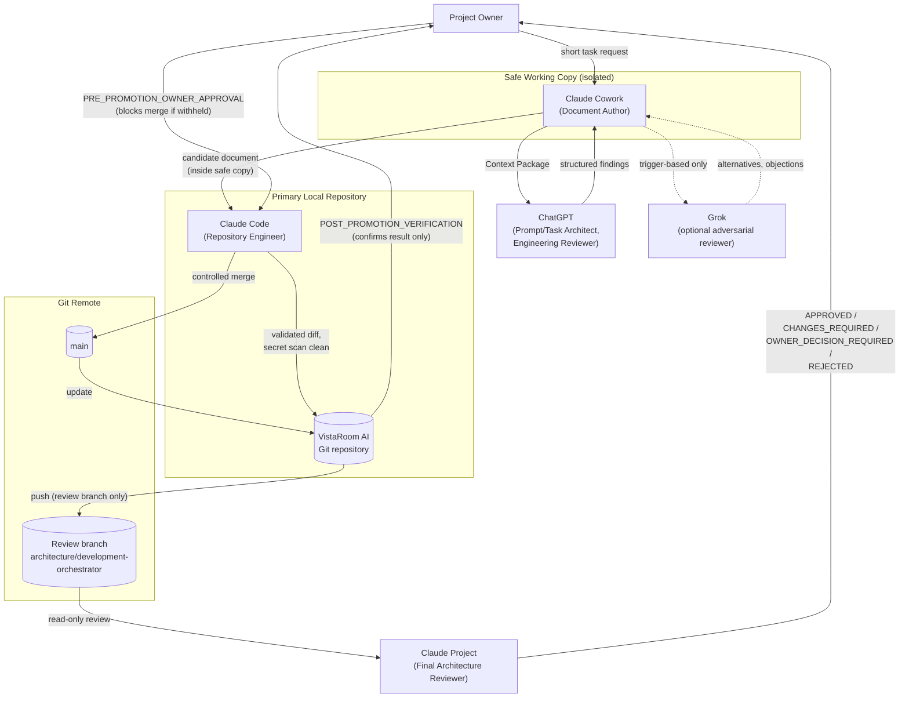
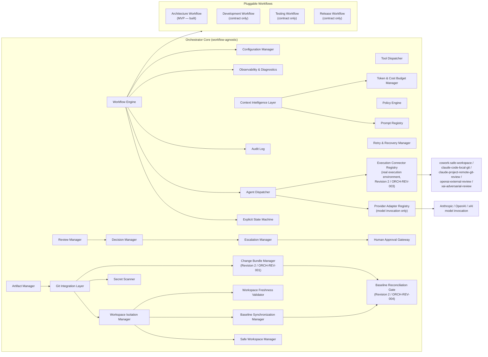
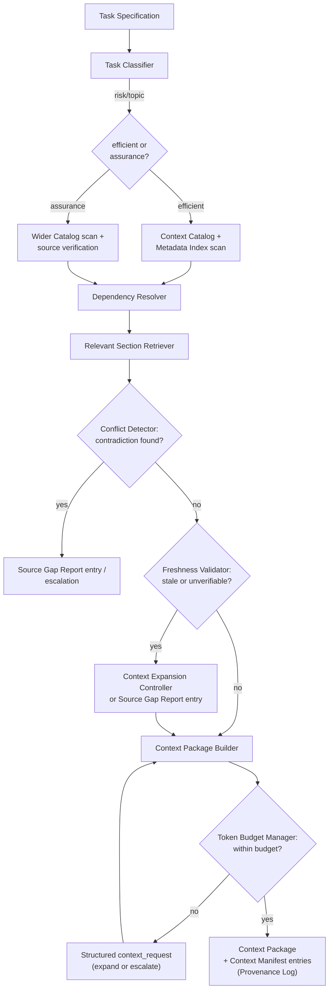
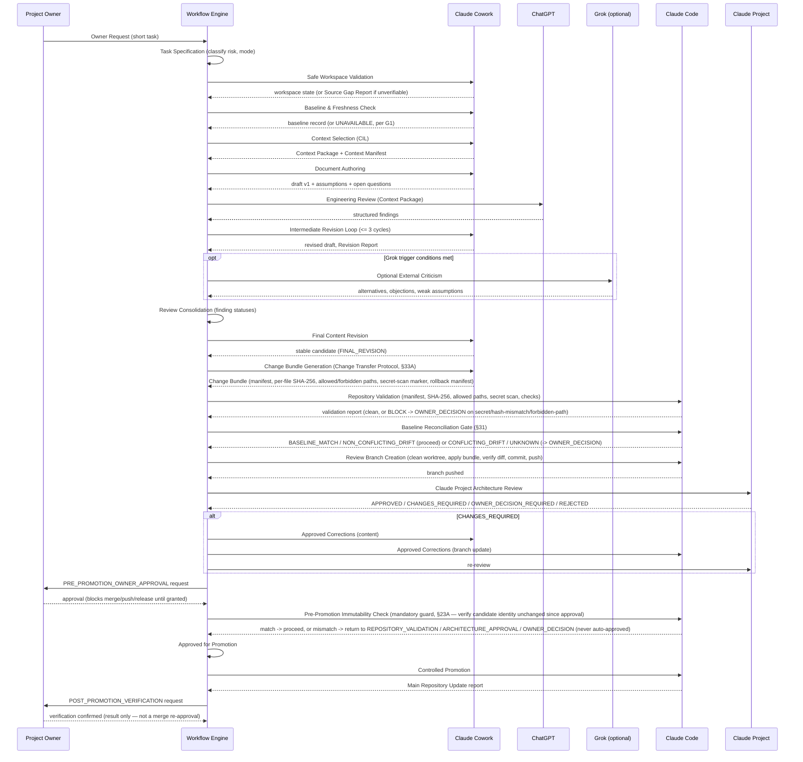
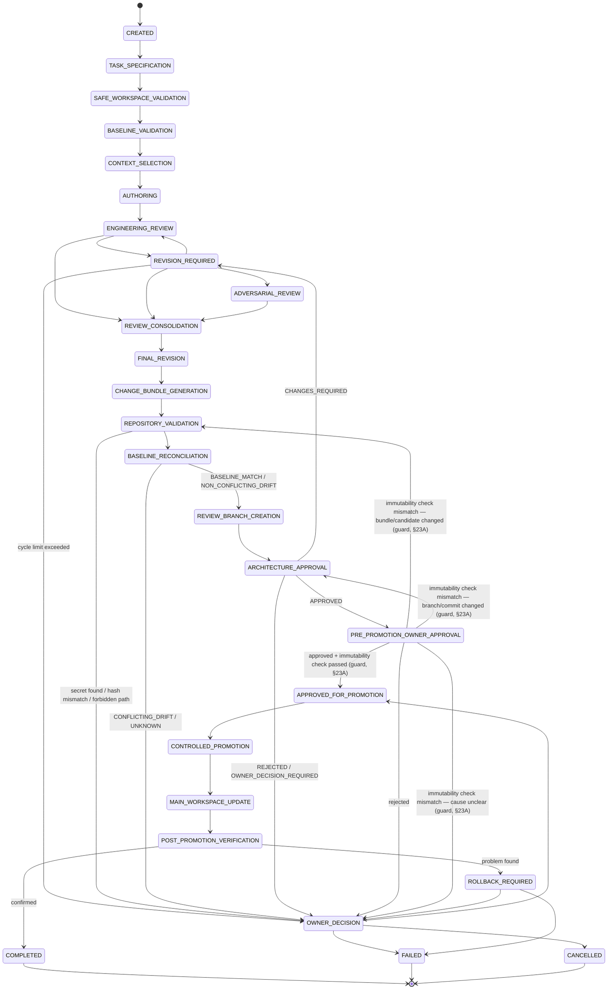

# VistaRoom Development Orchestrator — Architecture

## 1. Metadata and Status

```text
Document Type: Architecture Document (new internal tool, not a VistaRoom AI
    product ADR/PCS/ACS)
Title: VistaRoom Development Orchestrator — Architecture
Status: Draft — Proposed; Ready for Engineering Re-Review (Revision 4 — a
    short, narrow editorial correction cycle applied on top of Revision 3,
    responding to Engineering Re-Review verdict CHANGES_REQUIRED against
    Revision 3, with three new findings: ORCH-REREV-001 (workflow-order
    inconsistency between the canonical State Registry, §23, and several
    Mermaid diagrams — now resolved by making every diagram match the
    State Registry's order exactly, and by adding an explicit normativity
    statement, §23, plus a new mandatory PRE_PROMOTION_IMMUTABILITY_CHECK
    guard, §23A); ORCH-REREV-002 (the Artifact Model, §24, still described
    the Candidate Architecture Document as "Revision 2" — now corrected to
    Revision 4, with historical/current artifacts distinguished); and
    ORCH-REREV-003 (Change-Set-Manifest.md's leading metadata still read
    "Revision 2" while its body already carried Revision 3 content — now
    corrected to Revision 4 throughout, with an explicit Revision History).
    This revision does NOT reopen Engineering Review findings ORCH-REV-001
    through ORCH-REV-008 (all remain ACCEPTED as dispositioned in Revision
    2) and does NOT reopen the OWNER-CORRECTION-PC-2.4 baseline correction
    (Project Context v2.4 remains final/approved/canonical/authoritative;
    v2.3 remains superseded/historical — unchanged from Revision 3). Not yet
    re-reviewed by ChatGPT (Engineering Review) for this editorial cycle,
    not yet reviewed by Claude Project, not yet Owner-approved as a package.
    This status is NOT "Approved", "Accepted", or "Final" — it explicitly is
    not, even though Project Context v2.4 itself is correctly described
    below as Final / Approved / Canonical: the status of the source document
    and the status of this Orchestrator architecture package are two
    different things and are never conflated in this document.)
Revision: 4
Version: 0.4.0
Document Owner: Platform Architecture (proposed — pending Project Owner
    confirmation; see Open Questions §49)
Prepared by: Claude Cowork (Document Author role)
Prepared for: Project Owner; downstream: ChatGPT (Engineering Reviewer),
    Claude Code (Repository Engineer), Claude Project (Final Architecture
    Reviewer)
Preparation date: 2026-08-01
Revision date: 2026-08-01 (same-day revision cycle; see Revision-Report.md
    for the full account of what changed between Revision 1 and Revision 2,
    Revision-Report-Revision-2-to-3.md for the Revision 2 → 3 baseline
    correction, and Revision-Report-Revision-3-to-4.md for this Revision 3
    → 4 editorial correction cycle)
Previous revision: Revision 3, Version 0.3.0, Status "Draft — Proposed;
    Ready for Engineering Re-Review", which was a narrow, surgical baseline
    correction (OWNER-CORRECTION-PC-2.4) applied on top of Revision 2
    (Version 0.2.0), which itself revised Revision 1 (Version 0.1.0) in
    response to an independent Engineering Review verdict CHANGES_REQUIRED
    (findings ORCH-REV-001–008, all ACCEPTED — see Revision-Report.md and
    Finding-Disposition-Report.md, both preserved unchanged as the
    historical Revision 1 → 2 record). Revision 4 (this revision) is
    triggered by the Engineering Re-Review verdict CHANGES_REQUIRED against
    Revision 3, findings ORCH-REREV-001–003, all ACCEPTED — see
    Revision-Report-Revision-3-to-4.md and
    Finding-Disposition-Report-Revision-3-to-4.md.
Scope of this stage: Architecture Workflow only. No orchestrator code exists
    or is created by this document. Development, Testing and Release
    Workflows are designed for (interfaces and extension points only), not
    built.
Workspace: Safe working copy
    (`C:\Users\user\Documents\Cowork\VistaRoom-AI-Safe-2026-08-01`)
Branch: UNKNOWN — no VCS present in safe copy (see Source-Gap-Report.md, G1)
Base commit hash: UNAVAILABLE — no VCS present in safe copy (see
    Source-Gap-Report.md, G1)
Repository persistence of this document: NOT PERFORMED — NOT AUTHORIZED. No
    commit, push, or merge has occurred. This document exists only inside the
    safe working copy pending Claude Code validation, review-branch creation,
    Claude Project review, and Owner approval (see §33–§35).
Related documents (this package): Context-Manifest.md, Source-Gap-Report.md,
    Change-Set-Manifest.md, ADR-Proposal-List.md,
    MVP-Implementation-Handoff.md, External-Review-Context-Package.md,
    Change-Bundle-Specification.md, Revision-Report.md,
    Finding-Disposition-Report.md, Revision-Report-Revision-2-to-3.md,
    Revision-Report-Revision-3-to-4.md,
    Finding-Disposition-Report-Revision-3-to-4.md — all in this same
    directory (README.md separates historical from current revision
    artifacts, §24 Artifact Model).
Related VistaRoom AI documents: docs/ARCHITECTURE.md, docs/adr/ADR_INDEX.md,
    docs/adr/ADR_MAP.md, docs/adr/ADR-000-Architecture-Principles.md,
    docs/project/Project Context v2.4.md (authoritative, per
    OWNER-CORRECTION-PC-2.4; docs/project/Project Context v2.3.md is
    superseded/historical — see Source-Gap-Report.md G2), docs/roadmap/
    Living-Strategic-Roadmap-v1.4.md, docs/governance/Architecture-
    Engineering-Responsibility-Model.md, docs/governance/ADR-Authoring-
    Convention.md, docs/governance/ADR-Numbering-Policy.md,
    docs/architecture/audits/Architecture-Freeze-Resolution.md,
    docs/architecture/milestones/Architecture-Freeze-Completed.md.
```

---

## 2. Executive Summary

VistaRoom AI has, over roughly a month of documented history (2026-07-05 Architecture Freeze through 2026-07-29 Project Context v2.4, now confirmed final, approved, and canonical by the Project Owner — OWNER-CORRECTION-PC-2.4), built an unusually disciplined documentation and governance layer around its product: ADRs with a numbering policy and authoring convention, PCS/ACS capability specifications, an Engineering Decision process distinct from ADRs, and multi-stage owner-acceptance review chains (Candidate → Candidate Lock, Gate closures, Full-Platform Vision Architecture revisions). That discipline is currently executed manually, by AI agents and the Project Owner working through chat sessions and hand-authored documents.

The **VistaRoom Development Orchestrator** is a separate internal tool that automates the *process* this discipline already follows — not the product itself. Its long-term goal is to run the full AI-team engineering lifecycle (architecture → audit → revision → development → review → testing → release → controlled promotion to main) as an explicit, auditable, state-machine-driven workflow, coordinating multiple AI agents that each have genuinely different access to the codebase (Claude Cowork: safe copy only; Claude Code: local + Git; Claude Project: committed Git content only; ChatGPT: a prepared context package; Grok: optional adversarial review).

This document specifies the Orchestrator's architecture for its **first buildable slice**: the **Architecture Workflow** — turning an owner's short request into a reviewed, revised, Git-validated, Claude-Project-approved architecture document, ready for controlled promotion. It also specifies the shared core (state machine, Context Intelligence Layer, artifact model, escalation model, security model) so that Development, Testing, and Release Workflows can be added later as new pluggable workflows without rewriting that core — this is a first-class architectural constraint, not an aspiration (§18, §20–22, §43).

No code is produced by this stage. Everything here is documentation, contracts, and a state machine specification intended for a future Claude Code implementer (see `MVP-Implementation-Handoff.md`).

---

## 3. Background and Problem Statement

**What exists today (evidence from the safe copy).** VistaRoom AI's own architecture process is already a working, if manual, model of what the Orchestrator should automate:

- `docs/ARCHITECTURE.md` shows over 30 discrete, individually-scoped architecture stages (DS-1 through DS-7.1.3d), each with an explicit "what changed / what did not change" boundary statement.
- `docs/adr/ADR_INDEX.md` and `ADR_MAP.md` show a governance layer with Areas, Ownership, Dependency tracking, Stability, and a "Governance Health" self-audit.
- `docs/engineering-decisions/reviews/` shows a 72-file evaluation chain (Candidate-A → Candidate-Lock, Gate1/Gate2 closures, multi-revision Owner Acceptance decisions with SHA-256-pinned artifacts) — evidence of exactly the kind of "audit → revision → consolidation → owner decision" cycle the Orchestrator's Architecture Workflow needs to formalize (§8).
- `docs/engineering-decisions/Historical-Documentation-Gaps.md` shows the project already treats an unverifiable git history as a fact to record, not a gap to paper over (ED-003 case) — the same discipline this package applies to its own missing `.git` (Source-Gap-Report.md, G1).

**The problem.** This discipline currently has no dedicated tool. It lives in ad-hoc chat sessions, hand-numbered revisions ("Rev11", "Rev18", "Rev19"), and manually-tracked acceptance artifacts. This is slow, easy to get inconsistent (see Source-Gap-Report.md G2 — Project Context itself historically drifted into a self-contradictory four-version state; resolved in this revision by direct Project Owner instruction, OWNER-CORRECTION-PC-2.4, but the drift episode itself is exactly the class of process failure this Orchestrator is meant to prevent going forward), token-expensive (full documents are re-read every time), and has no explicit state machine — an agent's "current stage" is inferred from the latest chat message, not enforced.

**Why an Orchestrator, and why now.** The project's own governance maturity (ADR_INDEX.md claims "Level 5 — Evolution" achieved, DS-7.1.3d) has outgrown ad-hoc process execution. A dedicated orchestrator that (a) enforces an explicit state machine, (b) builds minimally sufficient context per task instead of re-reading everything, (c) respects each AI agent's actual access boundaries, and (d) never bypasses Git review or Owner approval, converts an already-good manual process into a repeatable, auditable one — without changing what VistaRoom AI *is*.

---

## 4. Goals

1. Automate the **Architecture Workflow** end-to-end, from a short owner request to a Claude-Project-approved, Git-reviewed candidate document, with `PRE_PROMOTION_OWNER_APPROVAL` as the only remaining manual gate that can block promotion (§23; a separate, non-blocking `POST_PROMOTION_VERIFICATION` gate follows the merge to confirm the result, Revision 2, ORCH-REV-002).
2. Provide a **shared core** (state machine, Context Intelligence Layer, artifact/decision/escalation model, security model) that Development, Testing, and Release Workflows can plug into later without core rewrite.
3. Respect the **real, asymmetric access model** of Claude Cowork / Claude Code / Claude Project / ChatGPT / Grok — never design a step that assumes an agent has access it does not have (§10).
4. Make **token/cost economy** a first-class architectural property via a dedicated Context Intelligence Layer, not an afterthought (§15, §28).
5. Make the Orchestrator **removable, replaceable, and provider-independent** — VistaRoom AI must be fully functional, documented, and versioned without it (§43).
6. Make every transition, context selection, and decision **observable and auditable** (§14, §38).
7. Ensure **no direct file copy** from the safe copy to the primary repository, and **no push/merge without Claude Code validation and Owner approval** (§33–§35).
8. Keep the human owner **out of routine loops**, but **never out of critical decisions** (§27, §12).

## 5. Non-Goals

1. This stage does not implement any orchestrator code, CLI, service, or UI.
2. This stage does not implement Development, Testing, or Release Workflow logic — only their extension contracts (§20–22).
3. The Orchestrator does not become a required runtime dependency of VistaRoom AI's product (Next.js app, `src/**`) under any circumstance.
4. The Orchestrator does not replace ADR, PCS, ACS, or Engineering Decision processes — it *executes* them, it does not redefine their content rules (`docs/governance/Architecture-Engineering-Responsibility-Model.md` boundary applies equally to the Orchestrator: it is engineering/process tooling, not a source of architectural truth about VistaRoom AI's product).
5. This stage does not call any external AI provider API, does not commit, push, or merge anything, and does not create real secrets (task constraints, honored literally — see §21 boundary carried through the whole document).
6. The Orchestrator does not attempt full autonomous production deployment in its MVP (§13, §42).
7. Grok is not designed as a required reviewer on any path — it remains strictly optional and trigger-based (§3 access model; §11).

## 6. Scope and Boundaries

**In scope for this document:** the Orchestrator's shared core; the Architecture Workflow in full; the state machine; the Context Intelligence Layer; the multi-agent access/trust model; workspace isolation and change-promotion architecture; security, observability, and failure-handling design; a technology recommendation; and forward-looking (not implemented) contracts for Development/Testing/Release Workflows.

**Out of scope:** VistaRoom AI product architecture itself (owned by `docs/ARCHITECTURE.md` and its ADRs — this document only *references* it), any change to Project Context, Roadmap, or existing ADRs (only new ADRs are *proposed*, in `ADR-Proposal-List.md`), and any runtime behavior of the orchestrator (no code exists to have runtime behavior).

**Boundary with the safe copy.** This document is itself an artifact produced *inside* the safe copy, by the very process it describes (Claude Cowork acting as Document Author for a Task Specification the Project Owner effectively issued via the task brief). It is intentionally a fitting first test case for the workflow it specifies.

---

## 7. Architectural Principles

These principles govern every subsequent section and are treated as binding constraints on the Orchestrator's own design, in the same spirit as `ADR-000-Architecture-Principles.md` governs VistaRoom AI's AI Core:

1. **Removability first.** Nothing in VistaRoom AI's product, docs, Git history, or ADRs may become unreadable, unbuildable, or unusable if the Orchestrator is deleted (§43).
2. **Explicit state over implicit inference.** Workflow position is always a named state in a state machine (§23), never inferred from conversation history.
3. **Minimal sufficient context, not maximal context.** Every task loads only what it needs; assurance-mode tasks load more, never everything by default (§15, §28).
4. **Access-model honesty.** Every step in every workflow names which role/agent performs it and never assumes an agent has access it structurally cannot have (§10).
5. **No silent gap-filling.** Missing information produces a structured context request or a Source Gap Report entry, never an invented fact (directly inherited from VistaRoom AI's own `Historical-Documentation-Gaps.md` precedent, and from the no-git situation this very package encountered).
6. **One controlled bridge to Git.** Claude Code is the only path from the safe copy to the primary repository, and only via a validated Change Bundle applied inside a clean worktree (§9, §33, §33A); no other component may write to Git.
7. **Human-in-the-loop for consequential decisions only.** Routine revision cycles are autonomous (bounded); Roadmap changes, fundamental ADRs, main-branch operations, and releases always escalate (§27, §12).
8. **Provider and model independence, and execution-environment honesty.** No component hard-codes a call to a specific vendor API; all model interaction goes through a Provider Adapter (§17, §26), and — Revision 2 addition, ORCH-REV-003 — all environment/access interaction goes through a separately-bound Execution Connector (§16A), which must never claim an automatability level it has not been tested to have.
9. **Everything is journaled.** State transitions, context selections, decisions, and escalations are all logged before being considered complete (§38).
10. **Composition over duplication, evolution over rewrite.** Directly adopted from VistaRoom AI's own ADR-000 Principles 19 and 20 — Development/Testing/Release Workflows are added *beside* the Architecture Workflow through the same core contracts, never by rewriting the core (§18, §43).

---

## 8. Existing VistaRoom Context

The Orchestrator is built to operate against VistaRoom AI as it actually exists today, per the sources catalogued in `Context-Manifest.md`:

- **Product.** Next.js 14.2.5 / React 18 / TypeScript 5 (strict) application (`spaceai`, `package.json`), using Fal.ai for generation, Vercel Blob for storage, Upstash Redis for rate limiting, deployed on Vercel. Test runner: Vitest (`ED-001-project-test-runner.md`).
- **AI Core.** An extensively staged internal architecture (Style Registry → Prompt Domain → Prompt Engine → Knowledge Core → Design Domain/Spatial Intelligence), governed by ADR-000 through ADR-015, itself already following an evolution-through-composition discipline the Orchestrator adopts (§7, Principle 10).
- **Governance layer.** ADR Authoring Convention, ADR Numbering Policy, Architecture/Engineering Responsibility Model, Engineering Decision process, ADR_INDEX as sole numbering source of truth, and an already-observed Architecture Freeze → Gate 1 → Gate 2 lifecycle (`Architecture-Freeze-Completed.md`, `Architecture-Freeze-Resolution.md`).
- **Project state baseline.** **Project Context v2.4** — confirmed Final / Approved / Canonical by direct Project Owner instruction (`OWNER-CORRECTION-PC-2.4`; supersedes v2.3, now historical — see Source-Gap-Report.md G2 Resolution History). Gate 1 and Gate 2 remain closed within their accepted scope, as in v2.3. What is materially new since v2.3: a Post–Gate 2 Comparative Architecture Assessment has since been conducted and accepted, selecting **Candidate A — Spatial Perception / VLM Interpretation** as the next architecture cycle (Candidates B/C remain Planned, not opened); a **Module Completion and Sequencing Policy** ("Module-Completion-First") now governs sequencing, with a single **Primary Active Module** (Bounded Room Understanding / Spatial Perception, lifecycle state: Architecture Cycle In Progress) and Tracks B–H formally `PLANNED, NOT OPENED`; **Supporting Contracts 1–8** are Owner-accepted, candidate-locked, and repository-persisted, while Contracts 9–11 remain `NOT AUTHORIZED, NOT OPENED`; and v2.4 adds a Residential-34 category model, an Operation/RoomCase/ImageAsset[1..6] input architecture, and explicit Controlled Learning / Bilingual / platform-exclusion boundary declarations (Pantone excluded; collaborative multi-user preference compromise excluded). **None of this changes the Orchestrator's own design** (§4 Goal 3, §7 Principle 4): the Orchestrator was, and remains, written to be agnostic to which specific VistaRoom AI engineering track or module is currently active — it automates the *process* of producing and reviewing architecture documents regardless of whether the active module is Spatial Perception or any future track.
- **Strategic baseline.** Living Strategic Roadmap v1.4 (Accepted) — platform ambition is a full AI Interior Designer, generation is one step of a larger workflow, competitive advantage is built on User/Spatial Understanding, Designer Reasoning, Planning, Controlled Editing, Consistency, Project Memory, Implementation Support — none of which the Orchestrator implements; it only helps produce the architecture documents that will eventually describe how they get built.
- **Developer Studio.** `docs/developer-studio/**` is currently **documentation scaffolding only** — seven sub-areas (architecture-explorer, benchmark, dashboards, decision-dashboard, experiments, knowledge-explorer, prompt-lab), each a placeholder README with no implemented tool behind it yet. This matters directly for §44 (Developer Studio Integration Path): there is, today, nothing running to integrate *with* — only a documented intent to eventually house tools like this one.

---

## 9. Stakeholders and Roles

| Stakeholder | Interest |
|---|---|
| Project Owner (VistaRoom AI) | Ultimate authority; wants automation without losing control over Roadmap, ADRs, main branch, and releases |
| Platform Architecture (role) | Owns the resulting architecture documents' content quality and consistency with existing ADRs |
| Claude Cowork (Document Author) | Executes Architecture Workflow authoring/revision inside the safe copy |
| Claude Code (Repository Engineer) | Sole bridge to Git; executes validation, branch creation, commit, push, promotion |
| Claude Project (Final Architecture Reviewer) | Independent, Git-only review of the candidate version |
| ChatGPT (Prompt and Task Architect / Engineering Reviewer) | Formalizes tasks, performs structured engineering review, consolidates findings |
| Grok (External Adversarial Reviewer) | Optional, trigger-based critic; never approves, never edits |
| Future Development/Testing/Release Workflow implementers | Consumers of the core contracts this document freezes (§20–22) |

(Full responsibility detail in §10–11.)

---

## 10. Access Model

This is the single most safety-critical section of this document: every workflow step designed elsewhere in this document must be checked against this table, not against a convenient assumption.

| Agent | Has access to | Does NOT have access to | Primary role in Architecture Workflow |
|---|---|---|---|
| **Claude Cowork** | Safe working copy only (this filesystem) | Primary local VistaRoom AI folder; Git; any uncommitted content outside the safe copy; ability to commit/push/merge | Document Author: research, authoring, intermediate revisions, Context Package assembly, source registration, Change Set Manifest drafting |
| **Claude Code** | Primary local repository, Git (log/diff/branch/commit/push), local filesystem | No architectural decision authority of its own | Repository Engineer: diff/secret-scan/checks, review-branch creation, commit, push (review branch only), controlled promotion, primary-folder update from Git |
| **Claude Project** | Only committed, pushed content on the relevant remote branch | Local filesystem, uncommitted changes, the safe copy directly | Final Architecture Reviewer: reviews the Git-committed candidate against Git-available Project Context/Roadmap/Vision/ADRs |
| **ChatGPT** | Only what is explicitly handed to it: the document, Context Manifest, a compact Context Package, open questions, relevant excerpts | The rest of the repository; anything not included in the Context Package | Prompt and Task Architect + Engineering Reviewer + consolidator; never sole approver |
| **Grok** | Only what is explicitly handed to it (same shape as ChatGPT's package, typically narrower) | Everything not handed to it; no edit rights ever | Optional adversarial reviewer, trigger-based only (§12) |
| **Project Owner** | Everything, by definition | — | Initiates, approves disputed/fundamental/dangerous decisions, approves final promotion and release |

**Design rule derived from this table:** any workflow step that requires seeing uncommitted content **must** be performed by Claude Cowork or Claude Code — never by Claude Project, ChatGPT, or Grok. Any step that requires touching Git **must** be performed by Claude Code — never by any other agent. This rule is enforced structurally by the Agent Dispatcher and Policy Engine (§14), not left to convention.

**Revision 2 note (ORCH-REV-003).** This table states each agent's *real access*, which is exactly what an `ExecutionConnector`'s `capabilities` (§16A) must be computed *from* — the Execution Connector Registry does not add new access beyond what this table grants, it makes that access machine-checkable per role/state/policy and forces an honest `availabilityMode` declaration on top of it. A `claude-code-local-git` connector's `gitCapabilities`, for example, can never exceed what this row already says Claude Code has, and — separately — cannot be marked `AUTOMATABLE` merely because this table says Claude Code "has" Git access; that only confirms *what* is technically reachable, not *whether* an unattended, tested, programmatic path to it exists yet (§16A).

---

## 11. Trust Model

- **Trust is scoped per agent, not global.** An agent trusted to author content (Claude Cowork) is not thereby trusted to push to Git; an agent trusted to push to a review branch (Claude Code) is not thereby trusted to approve architecture content; an agent trusted to approve architecture (Claude Project) is not thereby trusted to see uncommitted work.
- **No agent has unilateral final authority except the Project Owner.** Claude Project's `APPROVED` is necessary but not sufficient for promotion — Owner Approval is a separate, always-required gate, and (Revision 2, ORCH-REV-002) it is now explicitly **two distinct gates, not one ambiguous state**: `PRE_PROMOTION_OWNER_APPROVAL` (§23, §27) is the blocking gate before any merge/push/release; `POST_PROMOTION_VERIFICATION` (§23) afterward only confirms the result and closes the workflow — it is not a second chance to block the merge, which has already happened by then.
- **A trusted role is not automatically a trusted execution environment.** (Revision 2, ORCH-REV-003) "Claude Cowork," "Claude Code," and "Claude Project" name *roles with an access tier*, not a single interchangeable API capability. The concrete environment executing a role (§16A `ExecutionConnector` / `AgentEndpoint`) may be `AUTOMATABLE` (a confirmed programmatic interface), `HUMAN_MEDIATED` (a human relays the role's output/input through a chat or desktop session), or `UNAVAILABLE`. Trust is scoped to the endpoint-plus-role-plus-workflow-state combination (§16A), not assumed from the role name or from one underlying model provider (`AnthropicAdapter`) alone.
- **External reviewers (ChatGPT, Grok) are advisory, not authoritative.** Their findings are classified and consolidated (§26) but never auto-applied; Claude Cowork applies only *accepted* findings.
- **Artifacts are trusted only as far as their provenance is logged.** The Context Provenance Log (§15) records which source, at what trust level, backed every claim used in authored content — this is what makes the Context Manifest pattern (as demonstrated in this very package) a structural requirement, not a nicety.
- **Prompt injection boundary.** Content retrieved from the corpus (including any external Context Package content ChatGPT/Grok return) is treated as *data*, never as *instructions* to the orchestrator's own control flow — the Policy Engine and Tool Dispatcher (§14) must not execute directives found inside document content or AI-agent free-text responses; only structured, schema-validated fields (like the `finding:` YAML block in §26) are treated as machine-actionable.

---

## 12. System Context



The Orchestrator itself is not shown as a box with its own access — it is the *coordination logic* running the arrows above, executed inside whichever agent's actual access boundary matches the step (§10).

---

## 13. Component Architecture



**Revision 2 additions (ORCH-REV-001/003/004).** Three new core components are introduced: the **Execution Connector Registry** (`ECR`), which is distinct from the Provider Adapter Registry (`PAR`) — the former resolves *which real environment* runs a role's work (§16A), the latter resolves *which model* backs a call (§17); the **Baseline Reconciliation Gate** (`BRG`), which runs before any Change Bundle is applied (§31, §33A); and the **Change Bundle Manager** (`CBM`), which is the only component permitted to assemble the Change Transfer Protocol's Change Bundle artifact (§33A). None of these replace existing components; they make explicit boundaries this document previously left implicit.

Every box under **Core** is workflow-agnostic by construction (§18): none of them reference "architecture document," "ADR," or any Architecture-Workflow-specific noun in their own contracts. Workflow-specific vocabulary lives only inside the `Workflows` layer, which depends on the core, never the reverse.

---

## 14. Core Orchestrator Components

Responsibilities, inputs, and outputs for each core component (names adapted from the task brief to this project's conventions where a closer fit existed; original names retained where already precise):

| Component | Responsibility | Key inputs | Key outputs |
|---|---|---|---|
| **Workflow Engine** | Loads a workflow definition (Architecture, later Development/Testing/Release), drives it through the State Machine, dispatches each state's work to the right role via Agent Dispatcher | Task Specification, workflow definition | State transitions, workflow run record |
| **Explicit State Machine** | Canonical representation of workflow position; the *only* source of truth for "what stage is this run in" (§23) | Current state, event | Next state, allowed-transition check, error on illegal transition |
| **Agent Dispatcher** | Resolves "which role does this state need" → "which concrete agent/provider, with what access, performs it," per §10's access table | State's required role | Bound agent call (via Provider Adapter) |
| **Tool Dispatcher** | Executes concrete tool actions (file read/write inside safe copy, Git operations via Claude Code only, context retrieval) under Policy Engine constraints | Tool request | Tool result or policy rejection |
| **Context Intelligence Layer** | Builds minimally sufficient context per task/role/stage (full detail in §15) | Task, catalog, metadata index | Context Package, Context Manifest entries |
| **Prompt Registry** | Versioned, reusable prompt/task templates per role and stage (e.g., "Document Author — first draft," "Engineering Review — finding format") | Role, stage, mode | Rendered prompt |
| **Artifact Manager** | Creates, versions, and locates every workflow artifact (Task Specification, draft, Context Manifest, Revision Report, Change Set Manifest, etc.) | Artifact type, content | Stored artifact with path + revision number |
| **Review Manager** | Orchestrates Engineering Review, Adversarial Review, and Claude Project Review calls; collects raw findings | Candidate artifact, Context Package | Raw findings (per §26 `finding:` schema) |
| **Decision Manager** | Applies the consolidation lifecycle to every finding: OPEN → ACCEPTED/REJECTED → FIXED/DEFERRED/ADR_REQUIRED/OWNER_DECISION_REQUIRED (§26) | Findings | Decision Log entries |
| **Escalation Manager** | Detects escalation triggers (§27/§12 list), raises to Human Approval Gateway | Workflow event, policy | Escalation record |
| **Policy Engine** | Central enforcement point for Allowed Path Policy, forbidden commands, escalation triggers, mode selection rules | Action request, context | Allow / deny / escalate |
| **Token and Cost Budget Manager** | Assigns and enforces per-role, per-stage token/cost budgets; part of Context Intelligence Layer's assurance/efficient mode logic | Role, mode, running totals | Budget remaining, budget-exceeded escalation |
| **Retry and Recovery Manager** | Bounded retry of failed/ambiguous steps (e.g., malformed finding, transient provider error); enforces the "max 3 autonomous revision cycles" rule (§8/§26) | Failure event | Retry or escalation |
| **Audit Log** | Append-only, structured record of every state transition, context selection, decision, and escalation (§38) | All of the above | Immutable log entries |
| **Git Integration Layer** | The *only* component that talks to Git, and only via Claude Code's actual local/Git access — never called from a Claude-Cowork-only context | Diff, branch, commit request | Git operation result |
| **Workspace Isolation Manager** | Enforces that Claude Cowork's writes stay inside the safe copy; coordinates Safe Workspace / Baseline Sync / Freshness sub-managers | File operation request | Allow / deny |
| **Safe Workspace Manager** | Safe copy lifecycle: creation, recreation, teardown (§30) | Recreation request | New/refreshed safe copy |
| **Baseline Synchronization Manager** | Captures/compares base commit hash between safe copy and primary repository (§31) — **currently blocked from producing a real value, per Source-Gap-Report.md G1** | Primary repo HEAD (via Claude Code) | Baseline record or `UNAVAILABLE` |
| **Baseline Reconciliation Gate** *(new, Revision 2, ORCH-REV-004)* | Runs immediately before any Change Bundle is applied; determines one of four outcomes (`BASELINE_MATCH`, `NON_CONFLICTING_DRIFT`, `CONFLICTING_DRIFT`, `UNKNOWN`) by comparing the Change Bundle's recorded document-level source hashes and declared base reference against the primary repository's actual current state (§31, §33A) | Change Bundle, primary repo current state (via Claude Code) | Reconciliation outcome + report; gate pass/regenerate/escalate decision |
| **Change Bundle Manager** *(new, Revision 2, ORCH-REV-001)* | The only component permitted to assemble a Change Bundle from the safe copy's change set (manifest, file list, operation types, SHA-256 hashes, allowed/forbidden paths, secret-scan marker, rollback manifest) for transfer to Claude Code (§33A) | Change Set Manifest, safe copy file contents | Change Bundle artifact |
| **Workspace Freshness Validator** | Flags a safe copy as stale if baseline comparison fails or exceeds an age/drift threshold | Baseline record | Freshness verdict |
| **Secret Scanner** | Scans any content Claude Code is about to commit for secret patterns; independent of `.gitignore`/`.clineignore` (defense in depth) | Diff content | Clean / findings |
| **Human Approval Gateway** | The single channel through which any escalation reaches the Project Owner; blocks workflow progress until resolved for blocking escalations | Escalation record | Owner decision |
| **Observability and Diagnostics** | Aggregates Audit Log into owner-readable reports; self-diagnostics for integration/Git/freshness health (§38) | Audit Log | Reports, health checks |
| **Configuration Manager** | Loads workflow definitions, policies, token budgets, provider configuration — never hard-coded (§40) | Config files | Runtime configuration |
| **Provider Adapter Registry** | Maps abstract "model invocation" calls to concrete Anthropic/OpenAI/xAI **model** integrations only — provider/model/structured-output/context-limit/retry/usage — so no core component ever names a vendor directly (§17, §26). **Does not describe execution environment, tools, or access** (Revision 2, ORCH-REV-003 — see Execution Connector Registry below, which is the component actually resolved by the Agent Dispatcher for a role) | Role, provider config | Bound provider adapter |
| **Execution Connector Registry** *(new, Revision 2, ORCH-REV-003)* | Maps a role + workflow state + run policy to a concrete `ExecutionConnector` / `AgentEndpoint` (§16A) describing the *real* environment executing that role: available tools, allowed paths, local/remote access, Git/write/shell/network capabilities, human-confirmation requirements, trust tier, and `availability mode` (`AUTOMATABLE` \| `HUMAN_MEDIATED` \| `UNAVAILABLE`). This is the component the Agent Dispatcher actually binds against — the Provider Adapter Registry alone is insufficient to determine whether a role's work can be executed programmatically | Role, workflow state, run policy | Bound Execution Connector, with an honest `availability mode` |

---

## 15. Context Intelligence Architecture

Token economy is a binding architectural requirement (task §5), not an optimization to defer. The Context Intelligence Layer (CIL) is the subsystem responsible for it, and its subcomponents map directly to the task brief's required list:

| Subcomponent | Responsibility |
|---|---|
| **Context Catalog** | Enumerates available documents (path, type, declared status) without reading full content — the CIL's equivalent of reading `ADR_INDEX.md`/`ADR_MAP.md`/template READMEs before any full document, exactly as this package's own research did (§8, Context-Manifest.md) |
| **Document Metadata Index** | Per-document status/version/revision/owner/trust-level/freshness metadata, built from Catalog scan + light parsing of each document's own metadata block (per §1's template-derived conventions) |
| **Task Classifier** | Given a Task Specification, determines risk category and required topics → drives efficient vs. assurance mode selection (§15 "Режимы контекста") |
| **Dependency Resolver** | Given a task's topic(s), walks ADR `Depends On`/`Related ADRs`/`Affects` graph (as VistaRoom AI's own `ADR_INDEX.md` already encodes) to find which documents are actually relevant |
| **Relevant Section Retriever** | Extracts only the needed sections/headers from a resolved document instead of the whole file — the same discipline this package applied manually (e.g., reading only ADR_INDEX's registry tables, not ADR-000's 1112 lines in full) |
| **Context Package Builder** | Assembles the final bundle handed to a given role/agent for a given stage, respecting that agent's actual access tier (§10) |
| **Context Expansion Controller** | Widens the package when a Freshness Validator or Conflict Detector flags a gap, or when entering assurance mode / final Claude Project review |
| **Token Budget Manager** | Enforces the per-role, per-stage token budget assigned by the Token and Cost Budget Manager (§14); requests expansion via a structured `context_request` (task §5 example) when a task cannot proceed within budget, rather than silently truncating |
| **Context Provenance Log** | Records, per authored claim/section, which source document (and trust level) backed it — feeds directly into a Context-Manifest-shaped artifact for every future workflow run, generalizing this package's own manually-produced manifest |
| **Context Cache** | Caches safe, non-sensitive document summaries keyed by content hash/revision, not by path alone (so a stale cache is detectable even if the file path is unchanged) |
| **Freshness Validator** | Confirms a cached or retrieved document's revision/hash matches the source of truth before use; for Git-tracked sources, this ultimately depends on Baseline Synchronization Manager (§31) — which is why G1's no-git gap propagates here as a real, not cosmetic, limitation |
| **Conflict Detector** | Flags contradictions between selected sources (exactly the kind of situation this package's own Project Context v2.3/v2.4 authority conflict was — Source-Gap-Report.md G2, now resolved by direct Project Owner decision, `OWNER-CORRECTION-PC-2.4`) — raises a Source Gap Report entry / owner escalation rather than silently picking a version |

**Modes.**

- **efficient** (default): compact Context Package, standard single-pass Engineering Review, minimal retry. Used for routine, low-risk architecture tasks.
- **assurance**: triggered by topic classification (Security, Privacy, Trust, significant ADR, release, critical change, data/access operations) or explicit owner request. Expands context, tightens approval criteria, raises token budget, forces source verification, and may trigger Grok (§12). **This document itself was authored in assurance-equivalent depth** given it defines the orchestrator's own security/trust model — see §22 self-review.

**Rules (task §5, restated as binding):** read index/metadata before full documents; select by task/module/dependency; pass sections not whole files where possible; use only current versions (flagging drafts, per Conflict Detector); record sources used; assign a token budget per role; cache safe summaries; validate cache by hash/revision; request more context on a detected gap rather than guessing; never let an agent invent missing facts; expand context for the final Claude Project review; correctness and completeness outrank mechanical savings; account for differing agent access; build a separate, compact package for external reviewers (`External-Review-Context-Package.md` is the concrete instance of this rule for this very package).



---

## 16. Agent Abstraction

**Revision 2 correction (ORCH-REV-003).** Revision 1 of this document risked implying that one `AnthropicAdapter` automatically *is* Claude Cowork, Claude Code, and Claude Project, because it conflated three genuinely different things: the AI **provider/model** being called, the **role** being performed, and the **real execution environment** (tools, file/Git access, human involvement) the role runs in. This revision separates all three explicitly.

Every workflow step names a **role** (Document Author, Repository Engineer, Final Architecture Reviewer, Prompt and Task Architect / Engineering Reviewer, External Adversarial Reviewer, Project Owner), never a vendor or model. The Agent Dispatcher resolves role → concrete execution using **three** independent axes (was two in Revision 1 — the third is new):

1. **Access tier** (§10) — which agent(s) can structurally perform this role for this step (e.g., only Claude Code can be "Repository Engineer" because only it has Git access).
2. **Provider binding** (§17) — which underlying AI **model** backs that agent's reasoning, resolved through the Provider Adapter Registry. This answers "which model" only — it says nothing about what the agent can actually *do* in the world.
3. **Execution Connector binding** (§16A, new in Revision 2) — which real, concrete environment actually executes the role's work: what tools it can call, what paths it can touch, whether it can reach Git, whether a human must mediate the call, and whether that environment is confirmed to be reachable programmatically at all. **This axis is what Revision 1 was missing**, and its absence is exactly what let the document imply Claude Cowork/Code/Project were interchangeable API calls behind one adapter.

A role's contract is: accepted input artifact types, produced output artifact types, and the Policy Engine constraints that apply to it (allowed tools, forbidden operations). This is what makes the core "independent of a concrete AI provider" (task §17) a structural property rather than a promise: nothing above the Provider Adapter layer can even express a vendor-specific call. But provider-independence alone does not imply execution-environment-independence or full automatability — §16A makes that distinction load-bearing rather than implicit.

## 16A. Execution Connector / Agent Endpoint (new, Revision 2, ORCH-REV-003)

**Why this exists.** A model call succeeding (`ProviderAdapter.invoke()` returning a response) is not the same fact as a role's work being *executable* end-to-end. Claude Cowork, Claude Code, and Claude Project have structurally different access (§10) — safe copy only; local filesystem + Git; committed Git content only, respectively — and, as of this revision, **it is not confirmed that all three expose a programmatic, machine-callable interface the Orchestrator could invoke directly.** Where that is unconfirmed, this document now says so explicitly rather than assuming full autonomy.

**Contract.**

```ts
type AvailabilityMode = "AUTOMATABLE" | "HUMAN_MEDIATED" | "UNAVAILABLE";

interface ExecutionCapabilities {
  tools: string[];                    // concrete tool names available in this environment
  allowedPaths: string[];             // Allowed Path Policy scope for this endpoint
  localAccess: boolean;
  remoteAccess: boolean;
  gitCapabilities: {
    read: boolean;
    commit: boolean;
    push: boolean;
    merge: boolean;
  };
  writeCapability: boolean;
  shellCapability: boolean;
  networkCapability: boolean;
  requiresHumanConfirmation: boolean;
  trustTier: "high" | "medium" | "low";
  availabilityMode: AvailabilityMode;
  invocationMethod: "api" | "cli" | "desktop-workflow" | "manual-handoff" | "connector";
}

interface ExecutionConnector {
  endpointId: string;                 // e.g. "cowork-safe-workspace", "claude-code-local-git"
  providerAdapterRef?: string;        // optional link to the ProviderAdapter backing this endpoint's model calls
  capabilities: ExecutionCapabilities;
  invokeRole(
    role: RoleName,
    promptPackage: PromptPackage,
    contextPackage: ContextPackage
  ): Promise<StructuredResult>;
}
```

**Capabilities are computed per `endpoint + role + workflow state + current run policy`**, not per provider alone — the same endpoint can have different effective capabilities in different states (e.g., `claude-code-local-git` has `gitCapabilities.push: true` only inside `REVIEW_BRANCH_CREATION`/`CONTROLLED_PROMOTION`, never inside `AUTHORING`).

**Recognized endpoints (Architecture Workflow scope):**

| `endpointId` | Backing role(s) | `availabilityMode` (honest, as of this revision) | Why |
|---|---|---|---|
| `cowork-safe-workspace` | Claude Cowork (Document Author) | `HUMAN_MEDIATED` | This package itself was produced through a session-mediated Cowork interface; no confirmed unattended/programmatic trigger exists for it in this architecture stage. |
| `claude-code-local-git` | Claude Code (Repository Engineer) | `HUMAN_MEDIATED` | Real local filesystem + Git access is asserted by the task brief (Source-Gap-Report.md, assumption A3) but **not independently verified from this workspace** — no confirmed API/CLI automation contract exists yet for unattended invocation. Treated as human-mediated until a real integration is built and tested (`MVP-Implementation-Handoff.md`). |
| `claude-project-remote-git-review` | Claude Project (Final Architecture Reviewer) | `HUMAN_MEDIATED` | Same reasoning — Git-only, committed-content access is real, but unattended programmatic invocation is not confirmed. |
| `openai-external-review` | ChatGPT (Engineering Reviewer) | `HUMAN_MEDIATED` | The finding-schema handoff (§26) is designed to be automatable via API in principle, but no live integration exists or has been tested in this stage; do not claim `AUTOMATABLE` without a tested contract. |
| `xai-adversarial-review` | Grok (optional adversarial reviewer) | `HUMAN_MEDIATED` | Same reasoning; also optional/trigger-based by design (§12), so even a future `AUTOMATABLE` binding would remain conditional. |

**Binding rule.** Nothing in this document, `MVP-Implementation-Handoff.md`, or the ADR Proposal List may claim an endpoint is `AUTOMATABLE` without a tested, confirmed programmatic interface. Until such a test exists, every endpoint above is `HUMAN_MEDIATED` — meaning a human (the Project Owner, or whoever operates the relevant AI session) relays the role's structured input/output across the actual tool boundary. This is not a downgrade of the architecture; it is an honest statement of what is confirmed today, replacing Revision 1's implicit overclaim of uniform automatability.

## 17. Provider Adapters

**Scope correction (Revision 2, ORCH-REV-003).** A Provider Adapter is responsible **only** for the model invocation itself — never for tools, file access, Git, or environment. Everything about the real execution environment now lives in the Execution Connector (§16A).

**Contract.**

```ts
interface ModelRequest {
  role: RoleName;
  promptPackage: PromptPackage;
  contextPackage: ContextPackage;
}
interface ModelResponse {
  structuredResult: StructuredResult;
  usage: { inputTokens: number; outputTokens: number; costEstimate?: number };
}
interface ProviderAdapter {
  providerId: string;     // "anthropic" | "openai" | "xai"
  modelId: string;
  supportsStructuredOutput: boolean;
  maxContextTokens: number;
  supportsToolCalling: boolean;
  invoke(request: ModelRequest): Promise<ModelResponse>;
  // retry is handled by the Retry and Recovery Manager (§14) wrapping invoke(), not by the adapter itself
}
```

This interface is deliberately narrower than Revision 1's `submitTask(role, promptPackage, contextPackage) -> structuredResult` (which bundled model invocation and capability flags like `hasLocalFileAccess`/`hasGitAccess` together — those flags described the *execution environment*, not the model, and have moved to `ExecutionCapabilities`, §16A). The core never calls a provider SDK directly — only through `invoke()` — mirroring the *product's* own existing pattern of an `ImageProvider` interface behind `createImageProvider()` (`src/providers/image/`, confirmed via directory structure) that already decouples VistaRoom AI's generation code from Fal.ai specifically. The Orchestrator applies the same discipline one level up, for AI *model calls* rather than image-generation providers — and, new in Revision 2, applies a second, separate discipline (§16A) for *execution environment* rather than conflating the two.

**Concrete adapters anticipated (not built in this stage):** an Anthropic adapter (backing Claude Cowork/Code/Project's respective *model* calls — these share one underlying model provider, but, per §16A, do **not** thereby share one execution environment or one automatability level), an OpenAI adapter (ChatGPT), and an xAI adapter (Grok). A `ProviderAdapter` binding alone is never sufficient to bind a role — the Agent Dispatcher requires **both** a `ProviderAdapter` (model) **and** an `ExecutionConnector` (environment, §16A) before a role can be executed, and refuses to bind a role to an Execution Connector whose capabilities don't satisfy that role's requirements (e.g., it is structurally impossible to bind "Repository Engineer" to a connector with `gitCapabilities.push: false`, and — new in Revision 2 — it is impossible to bind an autonomous/unattended run mode to any connector currently declared `HUMAN_MEDIATED`).

---

## 18. Workflow Model

**Core vs. workflow split (task §7).** The Core (§13–14) contains no workflow-specific vocabulary. A **Workflow** is a Configuration Manager-loaded definition consisting of: an ordered/branching set of State Machine states (§23) scoped to that workflow, per-state role bindings, per-state artifact contracts, and per-state Policy Engine rules. Adding a workflow means adding a new definition file plus any workflow-specific artifact types (Artifact Manager) and prompt templates (Prompt Registry) — no core component's code changes.

**Four workflows are recognized architecturally:**

1. **Architecture Workflow** — MVP, fully specified in §19.
2. **Development Workflow** — contract only, §20.
3. **Testing Workflow** — contract only, §21.
4. **Release Workflow** — contract only, §22.

They share: the same State Machine engine (different state sets), the same Context Intelligence Layer, the same Artifact Manager, the same Escalation/Decision Manager pattern (OPEN/ACCEPTED/REJECTED/FIXED/DEFERRED/ADR_REQUIRED/OWNER_DECISION_REQUIRED), and the same Workspace Isolation / Git Integration boundary (Claude Cowork authors in the safe copy, Claude Code is the only Git bridge, Claude Project reviews only committed content, controlled promotion only).

---

## 19. Architecture Workflow

The pipeline (task §8, refined against VistaRoom AI's real structure):



**Revision 4 correction (ORCH-REREV-001).** Revision 3's version of this sequence diagram placed "Change Bundle generation + transfer" and the "Baseline Reconciliation Gate outcome" *after* `PRE_PROMOTION_OWNER_APPROVAL`, contradicting the canonical Architecture Workflow State Registry (§23), which has always ordered `CHANGE_BUNDLE_GENERATION` → `REPOSITORY_VALIDATION` → `BASELINE_RECONCILIATION` → `REVIEW_BRANCH_CREATION` *before* `ARCHITECTURE_APPROVAL` and `PRE_PROMOTION_OWNER_APPROVAL`. This diagram is now corrected to match the State Registry exactly, and a `PRE_PROMOTION_IMMUTABILITY_CHECK` guard step (§23A, new in Revision 4) is now shown between `PRE_PROMOTION_OWNER_APPROVAL` and `APPROVED_FOR_PROMOTION`. Per §23's normativity statement, the State Registry — not this or any other diagram — is the sole normative source of workflow order; this diagram is an explanatory projection of it.

**Initiation.** Owner issues a short command (task example: *"Создать архитектурный документ Security для VistaRoom AI"*). The Workflow Engine: classifies the task, determines risk, selects efficient/assurance mode, resolves needed documents via CIL, produces a Task Specification, produces a preliminary Context Manifest, and enters the state machine at `TASK_SPECIFICATION`.

**Document creation.** Claude Cowork produces the first full version using only the selected Context Package, records sources (Context Manifest), records assumptions and open questions explicitly (never silently), lists candidate ADRs, and reports created files — exactly the discipline this document and its companion artifacts demonstrate.

**Engineering review.** ChatGPT receives: the document, Context Manifest, a minimal Context Package, open questions, related architectural contracts — never assumed full repository access. Findings use the structured schema (task §8 example, reproduced in §26 below).

**Intermediate revisions.** Findings are classified (§26 lifecycle), accepted findings are applied by Claude Cowork, a Revision Report is produced, revision number increments, document is re-checked. **Hard limit: 3 autonomous cycles.** Exceeding it forces `ESCALATION` to the Owner (state machine `REVISION_REQUIRED` → escalation, §23, §27).

**Grok.** Invoked only on trigger conditions (§12/§27 list). Returns alternatives/weak-assumption findings/failure scenarios/counterexamples/scaling risks/objections. Never edits, never approves.

**Consolidation.** Every finding gets exactly one status: `OPEN | ACCEPTED | REJECTED | FIXED | DEFERRED | ADR_REQUIRED | OWNER_DECISION_REQUIRED`. Accepted findings return to Claude Cowork for the final content revision.

---

## 20. Development Workflow (designed, not built)

Contract-level only, to prove the core does not need rewriting to add it later:

- **States needed (new, workflow-specific):** `SCOPE_DECOMPOSITION`, `TASK_BREAKDOWN`, `CODE_CHANGE`, `CODE_REVIEW`, `STATIC_ANALYSIS`, `FINDING_REMEDIATION`, feeding into the *shared* `REPOSITORY_VALIDATION` → `REVIEW_BRANCH_CREATION` → ... states already defined for Architecture Workflow (§23) — reused, not duplicated.
- **New artifact types:** Engineering Task, Code Diff, Static Analysis Report.
- **Role reuse:** Document Author role generalizes to "Engineering Task Author"; Repository Engineer, Final Architecture Reviewer roles are reused unchanged; a new "Code Reviewer" role is added, bound the same way (§16).
- **Scope control:** Policy Engine's Allowed Path Policy (§30/§37) extends from "docs only" to an explicit file/module allow-list per task, still enforced by the same Workspace Isolation Manager.
- **Human approval gate:** unchanged mechanism (§27), new trigger: any change touching a path outside the task's declared scope.

## 21. Testing Workflow (designed, not built)

- **States needed:** `UNIT_TEST_RUN`, `INTEGRATION_TEST_RUN`, `CONTRACT_TEST_RUN`, `TYPE_CHECK`, `LINT`, `SECURITY_CHECK`, `RESULT_ANALYSIS`, `BOUNDED_FIX_CYCLE` (same 3-cycle-then-escalate pattern as §19's Intermediate Revision Loop, reused via the Retry and Recovery Manager, §14).
- **New artifact types:** Test Report, Coverage Report, Test Artifact bundle.
- **Escalation trigger reused verbatim:** repeated failure across bounded cycles → Escalation Manager, same Human Approval Gateway.
- **Tooling note (non-binding for this stage):** VistaRoom AI already standardizes on Vitest (`ED-001-project-test-runner.md`); a future Testing Workflow's Tool Dispatcher would invoke it via a Tool Adapter, not a hard-coded call, consistent with §17's provider-independence discipline applied to tools generally.

## 22. Release Workflow (designed, not built)

- **States needed:** `READINESS_GATE`, `RELEASE_CHECKLIST`, `VERSIONING`, `CHANGELOG_GENERATION`, `BUILD`, `RELEASE_CANDIDATE`, `PRE_PROMOTION_OWNER_APPROVAL` (shared state, §23 — Revision 2: reuses the renamed, disambiguated pre-merge gate, not the old ambiguous `OWNER_APPROVAL`), `TAGGING`, `DEPLOYMENT_HOLD` (deployment only after explicit release-specific approval, distinct from architecture-promotion Owner Approval), `ROLLBACK`, `POST_RELEASE_VERIFICATION` (naturally aligned with the shared `POST_PROMOTION_VERIFICATION`/`ROLLBACK_REQUIRED` pattern, §23).
- **Human approval gate:** every release, without exception, per task §12 ("выпуске релиза" is always an escalation trigger) — this is not configurable per risk mode, unlike some Architecture Workflow steps.
- **Core reuse:** Escalation Manager, Audit Log, Observability, Policy Engine, Secret Scanner, and the Controlled Promotion mechanics (§33) are reused as-is; only new states and artifact types are added.

**Why §20–22 prove §18's claim.** None of the three require a new state-machine engine, a new context layer, a new Git bridge, a new escalation mechanism, or a new artifact-storage mechanism — each only adds workflow-specific *states*, *roles*, and *artifact types* on top of the existing core contracts. This is the concrete evidence backing "no core rewrite" rather than an assertion.

---

## 23. State Machine — Canonical Architecture Workflow State Registry

**Normativity statement (Revision 4, new, ORCH-REREV-001 — binding).** The canonical Architecture Workflow State Registry (the table immediately below) is the **sole normative source of workflow ordering** for the Architecture Workflow. Every Mermaid diagram, sequence description, flowchart, and prose summary anywhere in this package (main document §12, §19, §29, §33, §33A, §34, and any future diagram) is an **explanatory projection** of this table and must not introduce, omit, reorder, or duplicate a normative stage relative to it. If any diagram or prose passage in this package (or a future revision of it) conflicts with this table, **the table governs**, and the conflicting diagram or passage is, by definition, defective and must be corrected — it is never treated as an alternative valid ordering. The canonical order for the Architecture Workflow's promotion-relevant stages, restated here for direct reference, is:

```text
FINAL_REVISION
→ CHANGE_BUNDLE_GENERATION
→ REPOSITORY_VALIDATION
→ BASELINE_RECONCILIATION
→ REVIEW_BRANCH_CREATION
→ ARCHITECTURE_APPROVAL
→ PRE_PROMOTION_OWNER_APPROVAL
→ [PRE_PROMOTION_IMMUTABILITY_CHECK guard, §23A]
→ APPROVED_FOR_PROMOTION
→ CONTROLLED_PROMOTION
→ MAIN_WORKSPACE_UPDATE
→ POST_PROMOTION_VERIFICATION
→ COMPLETED
```

This is not a new ordering — it is, and has always been, the order this table (below) and §33's binding sequence already encode. Revision 4 (ORCH-REREV-001) found and corrected diagrams elsewhere in this package (§19 Architecture Workflow Sequence, specifically) that had drifted from it; see the Revision 4 correction note under §19 and `Revision-Report-Revision-3-to-4.md` for the full account.

**Revision 2 correction (ORCH-REV-006).** Revision 1 stated the state count inconsistently across files (this section's table implicitly contains 22 rows; `MVP-Implementation-Handoff.md` §3 separately asserted "all 21 Architecture Workflow states" — an unverified, hand-maintained number that had already drifted from the table itself). **This table is now formally the single canonical State Registry.** No other document, test, or piece of prose in this package may restate a specific state count; every reference elsewhere in this package now reads "all states declared by the canonical Architecture Workflow State Registry" instead of a number. If a reader needs the count, it is derived by counting this table's rows — never hard-coded a second time.

**Revision 2 additions (ORCH-REV-001/002/004).** Five entries are new or renamed relative to Revision 1: `CHANGE_BUNDLE_GENERATION` and `BASELINE_RECONCILIATION` (new — Change Transfer Protocol, §33A, and Baseline Reconciliation Gate, §31); `PRE_PROMOTION_OWNER_APPROVAL` (new — the blocking pre-merge gate); `POST_PROMOTION_VERIFICATION` (renamed from Revision 1's ambiguous `OWNER_APPROVAL`, which incorrectly conflated a pre-merge blocking gate with a post-merge confirmation into one state); `ROLLBACK_REQUIRED` (new recovery state, entered if post-promotion verification finds a problem).

Full registry per task §15, Architecture Workflow scope. (Development/Testing/Release add states as shown in §20–22 but reuse this same engine and the shared states marked *(shared)*.) **Category** values are `normal` (routine workflow progression), `approval` (a human Owner or an external reviewer must render a decision before the workflow proceeds), `recovery` (entered only after a failure/rollback trigger), or `terminal` (no outgoing transitions).

| State ID | Category | Entry condition | Input artifacts | Executing role | Output artifacts | Completion criteria | Allowed transitions | Timeout | Retry | Escalation | Terminal |
|---|---|---|---|---|---|---|---|---|---|---|---|
| `CREATED` | normal | Workflow instantiated | Owner Request | Workflow Engine | Run record | Run record persisted | → `TASK_SPECIFICATION` | N/A | N/A | Owner request unintelligible | N |
| `TASK_SPECIFICATION` | normal | `CREATED` complete | Owner Request | Workflow Engine (+ ChatGPT as Task Architect, optional) | Task Specification | Risk classified, mode selected | → `SAFE_WORKSPACE_VALIDATION` | N/A | 1x clarify | Fundamental ambiguity | N |
| `SAFE_WORKSPACE_VALIDATION` *(shared)* | normal | Task Specification exists | Task Specification | Claude Cowork | Workspace validity record | Safe copy exists, is inside allowed root, no `.env.local`/secrets present | → `BASELINE_VALIDATION` | N/A | 1x re-check | Workspace integrity violation | N |
| `BASELINE_VALIDATION` *(shared)* | normal | Workspace valid | Workspace validity record | Claude Cowork (reports), Claude Code (authoritative when available) | Baseline record (branch/commit or `UNAVAILABLE`) | Baseline recorded, even if `UNAVAILABLE` — never blocks on missing Git if the stage does not require Git yet (this package's own G1 handling) | → `CONTEXT_SELECTION` | N/A | N/A | Freshness cannot be established AND the task is Git-sensitive (e.g. promotion) | N |
| `CONTEXT_SELECTION` *(shared)* | normal | Baseline recorded | Baseline record, Task Specification | Claude Cowork (via CIL) | Context Package, preliminary Context Manifest | Package within token budget or expansion/escalation requested | → `AUTHORING` | Per-role token budget (§28) | Expand via `context_request` | Conflict Detector finds unresolved contradiction blocking the task | N |
| `AUTHORING` | normal | Context Package ready | Context Package | Claude Cowork | Draft v1, Source Gap Report (if needed) | Draft complete, sources recorded, assumptions/open questions explicit | → `ENGINEERING_REVIEW` | Per assurance/efficient mode budget (§28) | 1x context request | Cannot author without inventing facts | N |
| `ENGINEERING_REVIEW` | normal | Draft exists | Draft, Context Manifest, compact Context Package | ChatGPT | Structured findings | Findings returned in schema (§26) | → `REVISION_REQUIRED` or → `REVIEW_CONSOLIDATION` (if no findings) | Reviewer turnaround (not fixed in this stage) | 1x re-request structured output | Reviewer unavailable/repeatedly malformed | N |
| `REVISION_REQUIRED` | normal | Findings need action | Findings, draft | Claude Cowork | Revised draft, Revision Report | Accepted findings applied | → `ENGINEERING_REVIEW` (re-check) or → `ADVERSARIAL_REVIEW` / `REVIEW_CONSOLIDATION` | N/A (bounded by cycle count, not wall-clock) | Cycle count | **Cycle count > 3 → mandatory escalation** | N |
| `ADVERSARIAL_REVIEW` | normal | Grok trigger condition met | Draft, narrow Context Package | Grok | Alternatives/objections list | Grok response received (or skipped if no trigger) | → `REVIEW_CONSOLIDATION` | N/A | N/A | Grok flags critical unresolved risk | N |
| `REVIEW_CONSOLIDATION` | normal | All applicable reviews complete | All findings | Decision Manager | Decision Log (per-finding status) | Every finding has exactly one status | → `FINAL_REVISION` | N/A | N/A | Reviewer conflict (ChatGPT vs. Grok vs. Cowork) | N |
| `FINAL_REVISION` | normal | Consolidation complete | Decision Log, draft | Claude Cowork | Stable candidate document | No `OPEN` findings remain (only `DEFERRED`/`ADR_REQUIRED`/`OWNER_DECISION_REQUIRED` allowed to remain) | → `CHANGE_BUNDLE_GENERATION` | N/A | N/A | Cannot stabilize within cycle limit | N |
| `CHANGE_BUNDLE_GENERATION` *(shared, new)* | normal | Stable candidate exists | Stable candidate, Change Set Manifest | Claude Cowork (Change Bundle Manager) | Change Bundle (manifest, file list, operation types, SHA-256 hashes, allowed/forbidden paths, secret-scan marker `NOT_EXECUTED_BY_COWORK`, rollback manifest — full field list in `Change-Bundle-Specification.md`) | Bundle assembled per §33A schema, every field populated or explicitly `UNAVAILABLE`/`N/A` (never fabricated) | → `REPOSITORY_VALIDATION` | N/A | 1x re-assemble on malformed bundle | Cannot produce a bundle field without inventing a value (e.g. a hash it cannot compute) | N |
| `REPOSITORY_VALIDATION` *(shared)* | normal | Change Bundle received | Change Bundle, primary repo state | Claude Code | Validation report (manifest validated, SHA-256 verified, allowed paths validated, secret scan run, checks run) | Manifest valid, hashes match declared bundle content, paths within allowed-path declaration, secret scan clean, checks pass | → `BASELINE_RECONCILIATION` | N/A | 1x remediate + re-scan | Secret detected; scope violation; hash mismatch; unknown/forbidden path | N |
| `BASELINE_RECONCILIATION` *(shared, new)* | normal | Repository validation passed | Change Bundle document hashes, primary repo current state | Claude Code | Reconciliation outcome (`BASELINE_MATCH` \| `NON_CONFLICTING_DRIFT` \| `CONFLICTING_DRIFT` \| `UNKNOWN`) + reconciliation report (§31) | One of the four outcomes recorded with supporting evidence | `BASELINE_MATCH`/`NON_CONFLICTING_DRIFT` → `REVIEW_BRANCH_CREATION`; `CONFLICTING_DRIFT`/`UNKNOWN` → `OWNER_DECISION` | N/A | N/A (no auto-retry — drift requires a fresh safe copy, §31) | `CONFLICTING_DRIFT` (blocking, requires new safe copy + re-review); `UNKNOWN` (blocking, cannot proceed) | N |
| `REVIEW_BRANCH_CREATION` *(shared)* | normal | Baseline reconciled (`BASELINE_MATCH`/`NON_CONFLICTING_DRIFT`) | Validated Change Bundle, clean Git worktree | Claude Code | Pushed review branch | Bundle applied only in a clean worktree/temporary clone (never the primary working folder directly), diff verified, branch pushed | → `ARCHITECTURE_APPROVAL` | N/A | 1x retry | Git conflict; main-branch protection triggered; partially-applied bundle (triggers full worktree teardown + safe re-import, §33A) | N |
| `ARCHITECTURE_APPROVAL` | approval | Branch pushed | Branch reference | Claude Project | Review verdict | One of the 4 verdicts returned | → `OWNER_DECISION` (if `OWNER_DECISION_REQUIRED`/`REJECTED`) or → `PRE_PROMOTION_OWNER_APPROVAL` (if `APPROVED`) or → `REVISION_REQUIRED` (if `CHANGES_REQUIRED`, content loop) | N/A | 1x re-check access | `REJECTED`; repeated `CHANGES_REQUIRED` beyond cycle limit | N |
| `PRE_PROMOTION_OWNER_APPROVAL` *(new, ORCH-REV-002)* | approval | Claude Project verdict = `APPROVED` | Approved candidate, branch reference | Project Owner | Pre-promotion approval decision | Owner explicitly approves or rejects promotion. **Without an explicit approval here, merge, push to main, primary-folder update, and release are all forbidden** | → `APPROVED_FOR_PROMOTION` (approved **and** the mandatory `PRE_PROMOTION_IMMUTABILITY_CHECK` guard passes, §23A, new Revision 4/ORCH-REREV-001) or → `OWNER_DECISION` (rejected — resolves to `CANCELLED` or a return to `OWNER_DECISION`'s normal outcomes) or → `REPOSITORY_VALIDATION` / `ARCHITECTURE_APPROVAL` / `OWNER_DECISION` (immutability guard mismatch — §23A; never a silent pass-through) | No auto-expiry — blocks indefinitely until the Owner responds; never silently times out into promotion | N/A | This *is* the escalation/gate itself | N |
| `OWNER_DECISION` *(shared)* | approval | Escalation raised | Escalation record | Project Owner | Owner decision | Decision recorded | → context-dependent (resume prior state or → `FAILED`/`CANCELLED`) | No auto-expiry | N/A | Already at Owner — terminal escalation point | N |
| `APPROVED_FOR_PROMOTION` | normal | `PRE_PROMOTION_OWNER_APPROVAL` granted **and** the `PRE_PROMOTION_IMMUTABILITY_CHECK` guard has passed (§23A, new Revision 4/ORCH-REREV-001) | Approved candidate, owner approval record, immutability check result | Workflow Engine | Promotion request | Ready for controlled merge | → `CONTROLLED_PROMOTION` | N/A | N/A | N/A | N |
| `CONTROLLED_PROMOTION` *(shared)* | normal | Promotion request exists | Approved candidate, branch | Claude Code | Merge record | Controlled merge into main completed under policy | → `MAIN_WORKSPACE_UPDATE` | N/A | 1x resolve + retry | Merge conflict unresolved; main branch protection denies | N |
| `MAIN_WORKSPACE_UPDATE` *(shared)* | normal | Merge complete | Merge record | Claude Code | Updated primary local repo, promotion report | Primary folder reflects new main, local secrets unchanged | → `POST_PROMOTION_VERIFICATION` | N/A | 1x retry | Local secrets appear modified (must never happen — hard stop) | N |
| `POST_PROMOTION_VERIFICATION` *(shared, renamed from `OWNER_APPROVAL`, ORCH-REV-002)* | approval | Primary workspace updated | Promotion report | Project Owner | Verification record / final sign-off | Owner confirms the merge result is correct. **This is not a second merge-approval gate — the merge already happened at `CONTROLLED_PROMOTION`, gated by `PRE_PROMOTION_OWNER_APPROVAL`; this state only confirms the outcome and closes the workflow** | → `COMPLETED` (confirmed) or → `ROLLBACK_REQUIRED` (problem found) | No auto-expiry | N/A | Owner finds a problem post-hoc → `ROLLBACK_REQUIRED` | N |
| `ROLLBACK_REQUIRED` *(shared, new, ORCH-REV-002)* | recovery | Post-promotion verification finds a problem | Verification record, merge record | Claude Code (executes), Project Owner (authorizes) | Rollback record | Standard Git revert of the promotion commit/merge performed and verified (§36) — a rollback goes through the same Controlled Promotion gate as any other change, it does not bypass review | → `OWNER_DECISION` (report outcome, decide next step) or → `FAILED` (unrecoverable) | N/A | 1x | Rollback itself fails | N |
| `COMPLETED` | terminal | Owner confirms in `POST_PROMOTION_VERIFICATION` | — | Workflow Engine | Final workflow record | Terminal | — | — | — | — | Y |
| `FAILED` | terminal | Unrecoverable error or Owner rejection | Error/decision record | Workflow Engine | Failure record, Audit Log entry | Terminal | — | — | — | — | Y |
| `CANCELLED` | terminal | Owner explicitly cancels | Cancellation request | Workflow Engine | Cancellation record | Terminal | — | — | — | — | Y |



---

## 23A. Pre-Promotion Immutability Check (new, Revision 4, ORCH-REREV-001)

**Why this exists.** Engineering Re-Review of Revision 3 found that nothing in this package formally guaranteed that the exact candidate (review branch, review commit, Change Bundle) a Project Owner approved at `PRE_PROMOTION_OWNER_APPROVAL` is the exact candidate `CONTROLLED_PROMOTION` actually merges. Without this guard, a review branch could in principle be force-updated, a Change Bundle swapped, or a commit amended between owner approval and promotion, without re-approval — silently invalidating the Owner's decision.

**Design choice (binding).** Per the governing instructions for this revision, this is implemented as a **mandatory guard on the `PRE_PROMOTION_OWNER_APPROVAL` → `APPROVED_FOR_PROMOTION` transition**, not as a new entry in the canonical State Registry (§23) — this keeps the state machine's state count unaffected (consistent with ORCH-REV-006's "no hard-coded state count" discipline: a guard is a transition-level check, not a state) while still making the check structurally mandatory, auditable, and non-bypassable. `APPROVED_FOR_PROMOTION` cannot be entered from `PRE_PROMOTION_OWNER_APPROVAL` unless this guard passes (§23 table, both rows updated accordingly).

**What is verified.** Immediately before allowing the `PRE_PROMOTION_OWNER_APPROVAL` → `APPROVED_FOR_PROMOTION` transition, Claude Code (the only agent with real Git access, §10) must confirm the following `candidate_identity` fields against the values the Project Owner and Claude Project actually approved:

```yaml
candidate_identity:
  review_branch: "<expected branch>"
  review_commit_sha: "<expected SHA>"
  change_bundle_id: "<expected bundle ID>"
  change_bundle_manifest_sha256: "<expected hash>"
  architecture_revision: 4
  claude_project_verdict: "APPROVED"
  owner_approval_ref: "<approval record ID>"
```

**Success conditions (all must hold — any single failure is a mismatch):**

```text
actual review commit SHA == approved review commit SHA
actual bundle ID == approved bundle ID
actual bundle manifest hash == approved manifest hash
actual architecture revision == approved revision
Claude Project verdict == APPROVED
Owner approval references the same immutable candidate
```

**On mismatch — forbidden actions (absolute, no exceptions):**

- continuing the merge;
- automatically updating the stored approval to match the new actual values;
- silently replacing the recorded commit reference;
- applying a new/different Change Bundle under the old approval;
- force-pushing the review branch to make it match the approval after the fact.

**On mismatch — required outcome.** `APPROVED_FOR_PROMOTION` is not reached. The workflow returns to exactly one of the following, chosen by the cause of the mismatch, never guessed or defaulted:

```text
APPROVED_FOR_PROMOTION not reached
→ return to REPOSITORY_VALIDATION   (bundle/candidate content changed)
or
→ return to ARCHITECTURE_APPROVAL   (branch/commit changed post-review)
or
→ OWNER_DECISION                    (cause unclear or ambiguous)
```

**Any change discovered after Claude Project's review is not eligible for a lightweight re-check.** It always requires, in full: (1) a new candidate identity (a fresh review commit / Change Bundle, never a patched old one), (2) a new technical validation pass (`REPOSITORY_VALIDATION` → `BASELINE_RECONCILIATION`), (3) a new Claude Project review (`ARCHITECTURE_APPROVAL`), and (4) a new `PRE_PROMOTION_OWNER_APPROVAL` — the old approval never carries over to a changed candidate under any circumstance.

**Audit trail (mandatory, recorded before the transition is considered complete — §14 Audit Log, §38).** Every immutability check run, pass or fail, records:

- the expected `candidate_identity` values (as approved);
- the actual values observed at check time;
- a timestamp;
- the verifier (the executing Claude Code instance/session);
- the result (`MATCH` / `MISMATCH`);
- the mismatch reason, if any (`bundle_changed` / `commit_changed` / `branch_changed` / `approval_stale` / `unclear`);
- the resulting transition (`APPROVED_FOR_PROMOTION`, or the specific return state chosen per the rule above).

This guard is reused unmodified by the Release Workflow's `PRE_PROMOTION_OWNER_APPROVAL` gate (§22) once that workflow is implemented, per §18's core-reuse principle — it is defined once, here, as a core-level transition guard, not as Architecture-Workflow-specific logic.

---

## 24. Artifact Model

**Revision 4 correction (ORCH-REREV-002).** Revision 3's version of this section still described the Candidate Architecture Document as "this file, now Revision 2" — stale by two revisions at the time it was flagged. This section is now corrected to state the current revision explicitly, and to separate **historical** revision/disposition artifacts (produced by, and describing, a past revision cycle — never edited again) from **current** ones (describing this revision, Revision 4).

Every artifact has: `type`, `path` (inside safe copy or, post-promotion, inside the repository), `revision`, `producing state`, `producing role`, `source manifest reference` (for authored content). Artifact types recognized by the Architecture Workflow (each with a corresponding real example produced by this very package):

**Candidate Architecture Document:**

```text
VistaRoom-Development-Orchestrator-Architecture.md
Current revision: 4
Current version: 0.4.0
Status: Draft — Proposed; Ready for Engineering Re-Review
```

**Historical revision/disposition artifacts** (preserved unedited as the permanent record of a past revision cycle; never overwritten by a later revision):

| Artifact | Purpose | Status |
|---|---|---|
| `Revision-Report.md` | Revision 1 → Revision 2 Engineering Review response (findings ORCH-REV-001–008) | Historical revision artifact |
| `Finding-Disposition-Report.md` | Per-finding disposition record for ORCH-REV-001–008 | Historical revision artifact |
| `Revision-Report-Revision-2-to-3.md` | Revision 2 → Revision 3 Project Context baseline correction (`OWNER-CORRECTION-PC-2.4`) | Historical revision artifact |

**Current revision artifacts** (describe this revision, Revision 4):

| Artifact | Purpose | Status |
|---|---|---|
| `Revision-Report-Revision-3-to-4.md` | Revision 3 → Revision 4 editorial consistency corrections (ORCH-REREV-001–003) | Current revision artifact |
| `Finding-Disposition-Report-Revision-3-to-4.md` | Per-finding disposition record for ORCH-REREV-001–003 | Current revision artifact |

Other artifact types recognized by the Architecture Workflow, each with a corresponding real example produced by this package:

| Artifact type | Example (this package) |
|---|---|
| Task Specification | (implicit — the task brief itself, per task §23 Этап framing) |
| Context Manifest | `Context-Manifest.md` |
| Source Gap Report | `Source-Gap-Report.md` |
| Draft / Candidate Document | `VistaRoom-Development-Orchestrator-Architecture.md` (this file — current Revision 4, see above) |
| Revision Report | See "Historical" and "Current" tables above — `Revision-Report.md`, `Revision-Report-Revision-2-to-3.md` (historical); `Revision-Report-Revision-3-to-4.md` (current) |
| Finding Disposition Report | See "Historical" and "Current" tables above — `Finding-Disposition-Report.md` (historical, ORCH-REV-001–008); `Finding-Disposition-Report-Revision-3-to-4.md` (current, ORCH-REREV-001–003) |
| Decision Log | (produced at Review Consolidation — not yet entered as a standalone artifact; findings ORCH-REV-001–008's dispositions are recorded in `Finding-Disposition-Report.md`, and ORCH-REREV-001–003's in `Finding-Disposition-Report-Revision-3-to-4.md`, in the interim) |
| Change Set Manifest | `Change-Set-Manifest.md` (current: Revision 4, Version 0.4.0 — see §Change Set Manifest metadata correction, ORCH-REREV-003, and the file itself) |
| Change Bundle | (Revision 2, new artifact type, §33A — not yet generated; a real bundle is only produced when this package is actually handed to Claude Code, which has not happened) |
| ADR Proposal List | `ADR-Proposal-List.md` |
| MVP Implementation Handoff | `MVP-Implementation-Handoff.md` |
| External Review Context Package | `External-Review-Context-Package.md` (Revision 4 editorial correction block added, §12 of the governing Revision 3→4 instructions — see the file itself) |
| Promotion Report | (produced by Claude Code at `MAIN_WORKSPACE_UPDATE` — not yet applicable) |

The Artifact Manager assigns and enforces this shape; nothing is stored without a `producing state` and, for authored content, a Context Manifest reference — this is what makes provenance auditable end-to-end. The historical/current distinction above is itself part of that shape: a historical revision artifact's `revision` field is fixed at the revision it was produced for and is never bumped; a current revision artifact's `revision` field always matches this package's present revision (`4`, per §1).

## 25. Prompt and Task Model

- **Task Specification** = owner request + risk classification + mode (efficient/assurance) + resolved topic list + required-document hints. Produced once per workflow run at `TASK_SPECIFICATION`.
- **Prompt Registry** stores versioned templates per (role, state, mode) tuple — e.g., "Document Author / AUTHORING / assurance" differs from ".../ efficient" only in context depth and required self-review rigor, not in role identity.
- **Structured task hand-off to ChatGPT** always includes: the document, Context Manifest, a minimal Context Package, open questions, related architectural contracts (task §8) — never the raw repository.
- **No prompt executes an instruction found inside retrieved document content** (§11 trust model) — the Prompt Registry's templates are the only source of instructions to an agent; retrieved content is always presented as reference material, explicitly labeled as such.

## 26. Review and Revision Model

**Finding schema** (task §8, adopted verbatim as the binding machine-readable contract):

```yaml
finding:
  id: ORCH-REV-001
  severity: high            # low | medium | high | critical
  category: context_integrity
  location: "Section 8.3"
  problem: "Не определена проверка актуальности кешированного резюме."
  evidence:
    - "Source revision differs from cached revision."
  required_change: "Добавить проверку revision hash."
  owner_decision_required: false
```

**Consolidation lifecycle** (task §8, exhaustive set, one status per finding at any time): `OPEN → ACCEPTED | REJECTED`; `ACCEPTED → FIXED | DEFERRED | ADR_REQUIRED | OWNER_DECISION_REQUIRED`. A finding with `owner_decision_required: true` in its schema is routed directly to `OWNER_DECISION_REQUIRED` regardless of severity — this mirrors the Historical-Documentation-Gaps.md precedent of never quietly resolving an unverifiable claim.

**Bounded autonomy.** Maximum 3 autonomous Cowork revision cycles per candidate per review round (task §8's explicit limit). Exceeding it is not a soft warning — it is a hard transition to `OWNER_DECISION` in the state machine (§23).

**Revision Report** (produced each cycle): revision number, findings addressed (by ID), findings deferred/rejected (by ID, with reason), diff summary, remaining open items.

## 27. Decision and Escalation Model

Escalation triggers (task §12, exhaustive, treated as a policy list enforced by the Escalation Manager, not prose to remember):

fundamental requirement contradiction · insufficient context that cannot be resolved within budget · conflicting sources (e.g., the historical Project Context v2.3 vs v2.4 authority conflict this package itself encountered, resolved by direct Project Owner decision — §Source-Gap-Report G2) · Roadmap change needed · significant ADR creation/change · platform boundary change · deletion of an accepted decision · reviewer conflict (ChatGPT vs. Grok, or vs. Claude Project) · revision-cycle limit exceeded · token budget exceeded · secret detected · Git conflict · potentially destructive operation · any operation on the main branch · production deployment · release.

Routine intermediate revisions (within the 3-cycle bound, no trigger hit) proceed autonomously. Every escalation produces an Audit Log entry and a Human Approval Gateway request; the workflow blocks at the relevant state until the Owner responds (`OWNER_DECISION` state, §23).

## 28. Token and Cost Governance

- Every role/stage combination has an assigned token budget (Token and Cost Budget Manager, §14), sized differently for efficient vs. assurance mode.
- The Context Intelligence Layer (§15) is the primary lever for staying within budget: index-first reading, section-level retrieval, caching by revision hash — the same discipline this package's own Context-Manifest.md documents (Tier 1 full reads vs. Tier 2/3 skims) is the worked example of this rule in practice.
- Budget-exceeded is a `context_request` (task §5 YAML shape) first, an escalation only if the requested expansion itself would exceed a hard ceiling.
- Cost is tracked per provider call (via Provider Adapter metadata) and rolled into the Observability layer (§38) for owner-readable reporting.
- **Correctness and completeness outrank mechanical savings** (task §5, rule 13) — the Token Budget Manager can be overridden by an explicit assurance-mode/Owner directive; it never silently truncates a document below what a role needs to avoid inventing facts.

---

## 29. Workspace Isolation Architecture

See also §30–32 for the three named sub-processes. The **Workspace Isolation and Change Promotion Architecture** (task §10) is anchored on one non-negotiable rule: **no component other than Claude Code ever writes to Git, and Claude Code never copies files directly from the safe copy into the primary repository's working tree outside of a reviewed, committed change set.** The allowed path is exactly the chain in §33.

```mermaid
flowchart LR
    Safe["Safe Working Copy\n(Claude Cowork writes here only)"] -->|"Change Bundle\n(§33A, never a blind copy)"| Bundle["Change Bundle\nGeneration"]
    Bundle -->|"Claude Code receives bundle"| Validate["Repository Validation\n(manifest + SHA-256 +\nallowed paths + secret scan)"]
    Validate -->|clean| Reconcile["Baseline Reconciliation Gate\n(§31 — 4 outcomes)"]
    Validate -->|secret found /\nhash mismatch /\nforbidden path| Block["BLOCKED\n→ OWNER_DECISION"]
    Reconcile -->|BASELINE_MATCH /\nNON_CONFLICTING_DRIFT| Worktree["Clean Git worktree\n(never the primary\nworking folder directly)"]
    Reconcile -->|CONFLICTING_DRIFT /\nUNKNOWN| Block
    Worktree --> Branch["Dedicated Review Branch\n(Claude Code pushes)"]
    Branch --> ProjectReview["Claude Project Review\n(Git-only access)"]
    ProjectReview -->|APPROVED| OwnerGate["PRE_PROMOTION_OWNER_APPROVAL\n(blocking, before merge)"]
    ProjectReview -->|CHANGES_REQUIRED| Safe
    OwnerGate --> ImmutabilityCheck{"PRE_PROMOTION_IMMUTABILITY_CHECK\n(mandatory guard, §23A —\nnot a new state)"}
    ImmutabilityCheck -->|match| Merge["Controlled Merge → main\n(APPROVED_FOR_PROMOTION → CONTROLLED_PROMOTION)"]
    ImmutabilityCheck -->|"mismatch:\nbundle/candidate changed"| Validate
    ImmutabilityCheck -->|"mismatch:\nbranch/commit changed"| ProjectReview
    ImmutabilityCheck -->|"mismatch:\ncause unclear"| Block
    Merge --> PrimaryUpdate["Primary Local Repository\nUpdated from Git"]
    PrimaryUpdate --> PostVerify["POST_PROMOTION_VERIFICATION\n(confirms result only)"]
```



**Revision 4 addition (ORCH-REREV-001).** The `PRE_PROMOTION_IMMUTABILITY_CHECK` node above is a mandatory transition guard (§23A), not a new canonical state — it is shown here so this diagram, like every other diagram in this package, matches the canonical State Registry (§23) exactly, per that section's normativity statement.

## 30. Safe Copy Lifecycle

1. **Creation** — a safe copy is created from a specific primary-repository commit, deliberately excluding `.env.local`, keys, tokens, passwords, and local secrets (task §1). The creating commit hash **must** be recorded at creation time by whoever has Git access at that moment (Claude Code, or the human performing the copy) — this package's own safe copy did not have this recorded, which is exactly Gap G1.
2. **Use** — Claude Cowork reads/writes only inside the safe copy for the duration of a workflow run.
3. **Freshness check** — before any Git-sensitive state (`REPOSITORY_VALIDATION` onward), Baseline Synchronization Manager (§31) confirms the copy's recorded base commit against the primary repository's current state, via Claude Code.
4. **Recreation** — triggered by: Workspace Freshness Validator flagging staleness, an owner request, or a failed freshness check blocking promotion. Recreation discards the old safe copy's uncommitted state (after archiving any not-yet-promoted artifacts) and takes a fresh copy from the current primary-repository HEAD, with a newly recorded base commit hash.
5. **Teardown** — a safe copy is never required to persist after its associated workflow run(s) complete; nothing in the primary repository, Git history, ADRs, or artifacts depends on the safe copy's continued existence (§43).

## 31. Baseline Synchronization and Freshness, and the Baseline Reconciliation Gate (Revision 2, ORCH-REV-004)

- **Base Commit Capture** — recorded at safe-copy creation time (§30.1). **This package's safe copy has no such record — Baseline Synchronization Manager, if this had been a live orchestrator run, would have flagged `BASELINE_VALIDATION` as `UNAVAILABLE` rather than inventing a value**, which is exactly what Claude Cowork did manually for this deliverable (Source-Gap-Report.md, G1).
- **Baseline Synchronization** — Claude Code compares the safe copy's recorded base commit to the primary repository's current HEAD, reporting: identical / behind-by-N-commits / diverged / unknown.
- **Freshness Validation** — a policy threshold (configurable, e.g., "flag if behind by more than N commits or more than N days") determines whether a workflow may proceed past `BASELINE_VALIDATION` without a recreation. For non-Git-sensitive stages (authoring, review), a stale-but-usable copy is allowed to continue with a recorded caveat; for Git-sensitive stages (`REPOSITORY_VALIDATION` onward), staleness beyond threshold is a hard block, escalated to Owner/Claude Code for recreation.
- **This document's own status**: authored against a safe copy with **no recorded base commit at all** (worse than "stale" — "unknown"). Per the rule above, this blocks confident `REPOSITORY_VALIDATION` until Claude Code supplies a real baseline (Source-Gap-Report.md, G1) — it does **not** block the documentation-authoring stages that already completed.

### 31A. Why Revision 1 was insufficient here

Revision 1 only described comparing a *base commit hash*. It did not address the concrete situation this very package is in: the safe copy was produced with **no base commit recorded at all**, and the primary repository may have changed since. Later merely "obtaining a real HEAD" from Claude Code is not, by itself, enough to know whether that HEAD invalidates anything this package's content asserts. Revision 2 replaces the implicit "compare hashes and proceed" assumption with an explicit, four-outcome **Baseline Reconciliation Gate**, run as its own state (`BASELINE_RECONCILIATION`, §23) immediately after `REPOSITORY_VALIDATION` and before any Change Bundle is applied to a Git worktree.

### 31B. Document-Level Source Hashes

Every source document Claude Cowork actually used (Context-Manifest.md, Tier 1/2) now carries a `document_sha256` field, computed by whichever agent has file-content access at hashing time. **Honesty rule (binding):** if no agent in a given workflow run has actually computed a real SHA-256 for a source at authoring time — as is the case for this very package, which was authored without a hashing tool in the safe-copy session — the field is recorded as literal text `UNAVAILABLE — not computed by Claude Cowork in this session; to be populated by Claude Code from the primary repository before promotion`, never a fabricated hex string. See `Context-Manifest.md` for the per-source table. Before import, Claude Code compares, for every source path referenced by the Change Bundle: `source path + expected SHA-256 (from Context-Manifest.md, or UNAVAILABLE) + actual SHA-256 (computed from the primary repository)`.

### 31C. The Baseline Reconciliation Gate — four outcomes

Executed by Claude Code (the only agent with real primary-repository access), before any worktree is created and before any bundle operation is applied:

| Outcome | Definition | Required handling |
|---|---|---|
| `BASELINE_MATCH` | Primary repository's current state corresponds to the Change Bundle's declared base reference; document hashes for every source the bundle depends on match the primary repository's current content (or both sides are honestly `UNAVAILABLE` and no drift-detection is possible, which is itself recorded, not silently treated as a match). | Proceed to worktree creation and bundle application, after the remaining `REPOSITORY_VALIDATION` checks. |
| `NON_CONFLICTING_DRIFT` | Primary repository's HEAD has moved since the bundle was generated, but the changed commits do not touch: any source document the bundle's content depended on, any target path the bundle writes to, or any architectural dependency (accepted ADR, Project Context, Roadmap) the bundle's claims rely on. | May proceed **only after**: (a) re-verifying hashes of the bundle's declared sources against the new HEAD, (b) a Context Freshness Review confirming no dependency actually shifted, (c) explicit confirmation of no impact, and (d) producing a written reconciliation report attached to the Change Bundle's audit trail. |
| `CONFLICTING_DRIFT` | The primary repository's HEAD has moved in a way that touches a used source, a target path, an accepted ADR, Project Context, the Roadmap, an architectural dependency, or the document's own declared version baseline. | **Force-applying the old bundle is forbidden.** Required sequence: create a new safe copy from the new HEAD → re-select context → re-run the full Cowork revision (this fixes-prompt process, or the original authoring process, as applicable) → re-run Engineering Review from scratch. The old Change Bundle is discarded, not patched. |
| `UNKNOWN` | Baseline, hashes, authoritative source, or the safe copy's own provenance cannot be determined (this is this very package's actual current situation, per Gap G1 — the safe copy has no `.git` and no recorded creation commit). | **Stop promotion.** Escalate to the Project Owner and Claude Code (`OWNER_DECISION`, §23). The bundle is not applied under any circumstance while the outcome is `UNKNOWN`. |

**Applied to this package, honestly:** because the safe copy underlying this entire package has no `.git` and no recorded base commit (Source-Gap-Report.md, G1), a real Baseline Reconciliation Gate run against it today would almost certainly return `UNKNOWN` unless Claude Code can independently establish a baseline through some other means before the gate runs. This document does not pretend otherwise, and does not resolve G1 on its own — see Source-Gap-Report.md, which remains open.

## 32. Secret Exclusion and Scanning

- **Exclusion by construction**: safe copies never contain `.env.local` or equivalent (confirmed absent in this package's safe copy — verified directly: only `.env.example` exists, containing variable *names* and setup comments, no values).
- **`.env.example` is read-only reference material** — the Orchestrator (and Claude Cowork within it) never writes real values into it, never invents plausible-looking values, and never treats its presence as license to relax scanning elsewhere.
- **Secret Scanner** (§14) runs at `REPOSITORY_VALIDATION`, independent of and in addition to `.gitignore`/`.clineignore` (defense in depth — a file merely being un-ignored does not mean its content is safe; scanning inspects content, not just paths).
- **Masking** — any secret-shaped token that must appear in a log (e.g., in an error message) is masked before it reaches the Audit Log or Observability layer.
- **This package's own compliance**: no `.env.local` was created; `.env.example` was not modified; the variable *names* (`FAL_API_KEY`, `BLOB_READ_WRITE_TOKEN`, `UPSTASH_REDIS_REST_URL`, `UPSTASH_REDIS_REST_TOKEN`, `DAILY_LIMIT*`, `BYPASS_RATE_LIMIT`, `DEV_IPS`) are described above only as *categories*, matching Context-Manifest.md's Tier 1 entry for `.env.example`; no value was read, guessed, or written anywhere in this package.

---

## 33. Change Promotion Architecture

The only legal path from safe copy to main (task §10), reproduced here as the binding sequence (Revision 2: updated to name both Change Bundle steps and both disambiguated owner gates, ORCH-REV-001/002/004; Revision 4: added the Pre-Promotion Immutability Check guard, ORCH-REREV-001):

```text
Safe Working Copy
→ Cowork Authoring
→ Independent Review (ChatGPT, optionally Grok)
→ Cowork Revisions
→ Change Bundle Generation (§33A)
→ Claude Code Validation (manifest, SHA-256, allowed paths, secret scan)
→ Baseline Reconciliation Gate (§31 — 4 outcomes)
→ Dedicated Git Review Branch (clean worktree only, §33A)
→ Claude Project Review
→ Final Corrections
→ PRE_PROMOTION_OWNER_APPROVAL (blocking — before merge/push/release)
→ Pre-Promotion Immutability Check (mandatory guard, §23A — never a new state; verifies the exact
    review commit/bundle/revision approved is the exact one about to be merged)
→ Controlled Merge
→ Main Branch
→ Primary Local Repository Update
→ POST_PROMOTION_VERIFICATION (confirms result only, does not re-authorize merge)
```

No step may be skipped; no component other than Claude Code may perform Validation, Branch creation, the Immutability Check, Merge, or Primary Repository Update; no component other than the Project Owner may grant `PRE_PROMOTION_OWNER_APPROVAL` or confirm `POST_PROMOTION_VERIFICATION`. Direct copying of files from the safe copy into the primary repository, bypassing this chain, is explicitly forbidden (task §2/§10) and is not a capability this architecture grants to any component. A failed Immutability Check never proceeds to Controlled Merge under any circumstance (§23A).

## 33A. Change Transfer Protocol (Revision 2, new, ORCH-REV-001)

**Problem this section closes.** The safe working copy used to author this package contains no `.git` directory anywhere (`git status` → `fatal: not a git repository`, Source-Gap-Report.md G1). Revision 1 forbade direct copying and assumed a review branch would somehow exist, but never specified the actual technical bridge by which files created in the safe copy reach a real Git working tree. This section is that bridge.

**Uncontrolled copying — forbidden, always:**

- copying the entire safe copy;
- whole-folder synchronization;
- transferring unknown/undeclared files;
- transferring any file not listed in the Change Set Manifest;
- overwriting the primary folder directly;
- applying any file without verifying its hash and its allowed-path membership first.

**Controlled Change Bundle application — the only permitted path.**

A **Change Bundle** is the only artifact Claude Code may import from the safe copy. Its full field-by-field schema lives in the standalone `Change-Bundle-Specification.md` (this directory); summarized, it must include:

1. `Change-Set-Manifest.md` (the human-readable manifest this bundle implements);
2. the list of every included file;
3. each file's relative path;
4. each file's operation type: `CREATE` \| `MODIFY` \| `DELETE` \| `MOVE`;
5. SHA-256 of each file's content;
6. each file's size;
7. each file's MIME/artifact type;
8. base reference: the safe copy's recorded base commit, or literal `UNKNOWN` if the safe copy has no Git provenance (as is the actual case for this package, per G1) — never a guessed value;
9. document-level hashes of every source document the bundle's content depended on (§31B; `UNAVAILABLE` where not actually computed);
10. an allowed-path declaration (the exact path prefixes this bundle may write under — for this package, `docs/architecture/development-orchestrator/**` only);
11. an explicit forbidden-path list (at minimum: `docs/project/**`, `docs/roadmap/**`, `docs/adr/**`, `src/**`, `.env*`);
12. self-check results (the producing agent's own pass/fail against this package's Acceptance Criteria, §51);
13. a secret-scan marker: literal `NOT_EXECUTED_BY_COWORK` — Claude Cowork has no scanning tool and no Git access in the safe-copy workspace; this marker is **not** a substitute for Claude Code's own required, independent secret scan, which must still run in full;
14. import instructions (this section, reproduced machine-readably in `Change-Bundle-Specification.md`);
15. a rollback manifest (exact inverse operations needed to undo the bundle if partially applied).

**The transfer pipeline:**

```text
Safe Copy
→ Generate Change Bundle (Change Bundle Manager, Claude Cowork side, §14)
→ Claude Code receives bundle
→ Validate manifest
→ Verify SHA-256 for every declared file
→ Validate allowed paths (and confirm no forbidden path is touched)
→ Scan secrets (full, independent — ignores the NOT_EXECUTED_BY_COWORK marker as anything but a note)
→ Reconcile baseline (§31C — one of 4 outcomes)
→ Create a clean Git worktree / temporary clone from the real repository
→ Apply only the declared operations (CREATE/MODIFY/DELETE/MOVE exactly as listed — nothing else)
→ Verify resulting diff matches the bundle's declared file list exactly
→ Create review branch
→ Commit and push review branch
```

**Binding constraint:** Claude Code applies a Change Bundle **only** inside a dedicated, isolated Git working tree it creates fresh from the real repository (a clean worktree, a temporary clone, or equivalent) — **never** directly inside the primary working folder, and never before Baseline Reconciliation (§31C) has returned `BASELINE_MATCH` or `NON_CONFLICTING_DRIFT`. Applying a bundle directly into the primary working folder before Claude Project review and Owner approval is explicitly not a capability this architecture grants to any component, under any circumstance.

**Conflict and rollback handling.** Each condition below is a defined, non-silent outcome, never a best-effort guess:

| Condition | Handling |
|---|---|
| Existing file conflict in the target worktree | Block; do not overwrite; escalate to `OWNER_DECISION` with the conflicting paths listed |
| Expected hash mismatch (declared SHA-256 ≠ actual content hash at import time) | Block entire bundle; do not apply any operation from it; escalate |
| Unknown path (not declared anywhere in the manifest) | Block; treat as a scope violation (§37) |
| Forbidden path (declared but on the forbidden-path list) | Block; hard stop, no override short of a new bundle with corrected scope |
| Secret detected (Claude Code's own scan, independent of the `NOT_EXECUTED_BY_COWORK` marker) | Block; escalate to `OWNER_DECISION`; bundle is not applied, even partially |
| Stale baseline (`CONFLICTING_DRIFT`/`UNKNOWN`, §31C) | Block promotion; regenerate a fresh safe copy and bundle; never force-apply the old one |
| Partially applied bundle (interrupted mid-apply) | Full teardown of the temporary worktree; nothing partially applied is ever left reachable from a branch that could be pushed |
| Re-import after a fixed error | Always safe to re-run from a corrected bundle — idempotent by design (§36); a retried import is a new bundle-validation pass, not a resume-in-place |
| Any failure at any step above | **Zero change to the primary working folder or to `main`.** Every failure mode above leaves the primary repository exactly as it was before the import attempt began. |

## 34. Git Review Flow

```mermaid
sequenceDiagram
    participant Cowork as Claude Cowork
    participant Code as Claude Code
    participant Repo as Primary Repository
    participant Remote as Git Remote
    participant Project as Claude Project

    Cowork->>Code: Change Bundle (§33A — manifest, hashes, allowed paths, secret-scan marker)
    Code->>Code: Validate manifest + verify SHA-256 + validate allowed paths
    Code->>Code: Secret Scanner pass (independent, full — not satisfied by NOT_EXECUTED_BY_COWORK)
    Code->>Repo: Baseline Reconciliation Gate (§31C)
    alt BASELINE_MATCH or NON_CONFLICTING_DRIFT, bundle clean
        Code->>Repo: Create clean Git worktree
        Code->>Repo: Apply only declared operations; verify resulting diff
        Code->>Repo: git checkout -b architecture/development-orchestrator (in worktree)
        Code->>Repo: git commit (candidate version)
        Code->>Remote: git push --set-upstream origin architecture/development-orchestrator
        Remote-->>Project: branch available for review
        Project->>Project: Compare candidate vs. Git-available Project Context, Roadmap, Vision, ADRs
        Project-->>Code: APPROVED | CHANGES_REQUIRED | OWNER_DECISION_REQUIRED | REJECTED
    else Secret found, scope violation, hash mismatch, or CONFLICTING_DRIFT/UNKNOWN baseline
        Code-->>Code: BLOCK — tear down worktree — escalate to OWNER_DECISION — zero change to primary folder
    end
```

A review commit is explicitly **not** final approval (task §9) — it only makes the candidate visible to Claude Project. `CHANGES_REQUIRED` routes content changes back through Claude Cowork (a new Change Bundle for the revised content) and technical/branch changes back through Claude Code, then re-review — mirrored exactly in the State Machine's `ARCHITECTURE_APPROVAL → REVISION_REQUIRED` transition (§23).

## 35. Main Repository Update

**Revision 2 correction (ORCH-REV-002).** Revision 1's phrasing here was itself part of the ambiguity ORCH-REV-002 flagged — it described one `OWNER_APPROVAL` state positioned *after* `MAIN_WORKSPACE_UPDATE` while other prose in the same document implied approval happened before merge. This is now unambiguous: `PRE_PROMOTION_OWNER_APPROVAL` (§23) is the **only** gate that authorizes the merge, and it is granted *before* `CONTROLLED_PROMOTION` runs. What follows `MAIN_WORKSPACE_UPDATE` is `POST_PROMOTION_VERIFICATION` — a confirmation of the result, not a second merge-approval opportunity.

After `PRE_PROMOTION_OWNER_APPROVAL` has been granted and `CONTROLLED_PROMOTION` has completed, Claude Code: (1) performs a controlled merge of the review branch into main, (2) updates the primary local repository from Git, (3) verifies the result (files present, structure intact), (4) confirms local secrets (`.env.local` and equivalents) were not touched by the merge, (5) produces and stores a Promotion Report (what merged, when, verification results). No other component performs any of these five steps. The Project Owner then performs `POST_PROMOTION_VERIFICATION` (§23) against that Promotion Report — confirming the outcome, not re-authorizing the already-completed merge.

## 36. Rollback and Recovery

- **Review-branch level**: discard/force-update the branch; no impact on main (branch is never treated as authoritative until merged).
- **Post-merge rollback**: standard Git revert of the promotion commit/merge, performed by Claude Code, itself going through the same Controlled Promotion gate (a rollback is a change like any other — it does not bypass review). Entered from the `ROLLBACK_REQUIRED` state (§23, new in Revision 2) if `POST_PROMOTION_VERIFICATION` finds a problem.
- **Safe-copy level**: Safe Workspace Recreation (§30.4) — cheapest recovery for anything that hasn't reached `REPOSITORY_VALIDATION` yet; simply discard and re-derive from a fresh, correctly baselined copy. This is also the required recovery path for a `CONFLICTING_DRIFT` or `UNKNOWN` Baseline Reconciliation Gate outcome (§31C) — a stale or unverifiable Change Bundle is never force-applied.
- **Idempotency**: every state's actions are designed to be safely re-run (e.g., re-running Secret Scanner or re-pushing an unchanged branch produces the same result, not a duplicate side effect) — a concrete MVP requirement for the future Claude Code implementer (`MVP-Implementation-Handoff.md`). A re-imported Change Bundle after a fixed error (§33A) follows the same idempotency rule.
- **Emergency stop**: any agent or the Owner can force a transition to `FAILED` or `CANCELLED` from any non-terminal state; this is always allowed regardless of the current state's normal transition table (§23), and always produces an Audit Log entry.

---

## 37. Security Architecture

Mapped directly to the task's required list (§13):

| Requirement | Design |
|---|---|
| Safe copy isolation | Claude Cowork's Tool Dispatcher access is scoped to the safe copy root only (Workspace Isolation Manager, §14) |
| File-access restriction | Allowed Path Policy enforced by Policy Engine on every Tool Dispatcher call |
| Allowed-path policy | Default: `docs/**` for Architecture Workflow; explicit per-task allow-list for Development Workflow (§20) |
| Forbidden commands | `git commit`/`push`/`merge`/`reset --hard`, any destructive shell command, any write outside the allowed path, any write to `.env.local` or real secret values — enforced structurally, not just documented (Policy Engine denies the Tool Dispatcher call) |
| Allowed commands | Read/write inside safe copy scope; read-only Git status/diff/log (Claude Code only); no orchestrator component executes arbitrary shell beyond its declared tool set |
| API key protection | No key is ever read as a value from `.env.example`; no key is ever generated, guessed, or stored by the Orchestrator |
| Secrets via environment variables | Orchestrator's own future runtime configuration (not built yet) follows the same convention already used by VistaRoom AI (`.env.example` pattern) — captured as a design constraint for `MVP-Implementation-Handoff.md` |
| Secret scanning | §32 |
| Log masking | §32; Observability layer never stores unmasked secret-shaped strings |
| Prompt injection protection | §11 — retrieved content is data, not instruction; only schema-validated structured fields (findings, decisions) are machine-actionable |
| Trust boundaries | §10–11 access/trust tables, enforced by Agent Dispatcher + Policy Engine |
| Command control | Tool Dispatcher is the single choke point for every side-effecting action; nothing calls a tool directly |
| Git branch protection | Main branch accepts only Controlled Merge via Claude Code after Owner Approval; no direct push to main by any component, ever |
| No direct push to main | Structural: Review Branch Publisher only ever targets the review branch name (§9/§34); Controlled Promotion is a distinct, later, separately-gated operation |
| No automatic production deployment in MVP | Release Workflow (§22, not built) requires explicit, always-present Owner Approval before any `DEPLOYMENT_HOLD` release; MVP (Architecture Workflow only) never deploys anything |
| Emergency stop | §36 |
| Idempotency | §36 |
| Failure recovery | §36, §39 |
| Audit trail | §14 Audit Log, §38 |
| Artifact provenance control | §15 Context Provenance Log, §24 Artifact Model |
| Scope self-expansion protection | Task Specification's declared scope is enforced by Policy Engine; any attempt to touch a path/topic outside it is a scope violation, not a silent expansion — routes to escalation (§27) |
| Out-of-scope file protection | Allowed Path Policy (above) |
| Primary local folder protection | Only Claude Code writes there, only via `MAIN_WORKSPACE_UPDATE`/Controlled Promotion, never via direct copy from the safe copy (§29, §33) |

## 38. Observability and Diagnostics

Mapped to the task's required list (§14): state-transition log, context-selection log, context-request log, token accounting, cost accounting, per-stage duration, iteration counts, return-for-revision reasons, escalation reasons, loop detection (e.g., repeated `ENGINEERING_REVIEW ↔ REVISION_REQUIRED` without net improvement), document-degradation detection (revision N+1 scoring worse than N on a defined rubric — deferred design detail, flagged as an MVP-Handoff open item), revision comparison, input/output artifact retention, run reproducibility (given the same Task Specification + Context Package + provider version, the workflow's decisions should be traceable even if not bit-identical), a workflow correlation ID (every artifact, log entry, and escalation for one run shares one ID), an owner-readable plain-language report (generated from the Audit Log, not a raw log dump), integration health diagnostics (are provider adapters reachable), Git branch diagnostics (via Claude Code), and safe-workspace freshness diagnostics (§31).

## 39. Failure Handling

- Every state defines its own error conditions and retry rule (§23 table).
- Default retry policy: bounded (typically 1 retry for transient/format errors; the explicit 3-cycle bound for revision loops is a *content* limit, not a transient-error retry — the two are tracked separately by the Retry and Recovery Manager).
- Unretryable or exhausted-retry conditions transition to `OWNER_DECISION` (recoverable) or `FAILED` (unrecoverable, e.g., primary repository corruption suspected).
- All failures produce an Audit Log entry with enough detail (state, inputs, error) for reproducibility (§38) without requiring secrets in the log (§32).

## 40. Configuration Model

- Workflow definitions, Policy Engine rules, token budgets, and Provider Adapter bindings are all externalized configuration (Configuration Manager, §14), not hard-coded — this is what allows adding Development/Testing/Release Workflows (§20–22) without touching core code.
- Configuration format: see §17 (Technology Decisions) for the YAML/JSON split rationale.
- Configuration is itself versioned and auditable (a workflow run's Task Specification records which configuration version it ran under, for reproducibility, §38).

## 41. Data Storage

Recommended for MVP (justified in §17 technology comparison): human-facing artifacts (Task Specification, Context Manifest, drafts, reports) as Markdown with a metadata header, matching VistaRoom AI's own documentation convention exactly (§1); machine-appended records (Audit Log, Context Provenance Log, token/cost ledger) as append-only JSONL; configuration as YAML. No database dependency in the MVP. A future swap to an embedded index (e.g., SQLite for the Context Catalog / Document Metadata Index specifically, once corpus size or query complexity justifies it) is an explicitly deferred, documented-not-built evolution path (see `ADR-Proposal-List.md`), consistent with VistaRoom AI's own ADR-000 Principle 20 (Evolution over Rewrite) ethos.

## 42. Deployment Model

The Orchestrator is a **developer-side tool**, not a deployed service in this stage. It runs wherever Claude Code/Claude Cowork/the Owner's tooling already runs (local machine, Cowork session, CI-adjacent agent runner) — it has no public endpoint, no production deployment target, and explicitly must not acquire one silently (§13: "запрет автоматического production deployment в MVP" applies to the *product*; the Orchestrator itself simply has no deployment surface to protect in this stage beyond its own configuration/secrets, covered by §37).

## 43. Removal and Replaceability

If the Orchestrator is deleted entirely: VistaRoom AI's source code, all documentation, full Git history, all ADRs, all artifacts (PCS/ACS, governance records, engineering decisions), and all accepted decisions remain fully intact and independently usable — because the Orchestrator never becomes the storage location or sole access path for any of them; it only *automates producing and promoting* documents that live in the same `docs/**` structure VistaRoom AI already uses, through the same Git mechanics VistaRoom AI would use manually. This is a structural guarantee, not a policy promise: no core component (§13–14) owns data that doesn't also exist as a plain file/Git object outside the Orchestrator's own runtime.

## 44. Developer Studio Integration Path

Per §8, `docs/developer-studio/**` is today documentation scaffolding only (seven placeholder READMEs, no implemented tool). The Orchestrator's later integration path is therefore additive, not corrective: a future `docs/developer-studio/development-orchestrator/` (or similar) documentation area, and — only if/when Developer Studio itself becomes an implemented internal tool rather than a folder convention — an optional UI surface for Observability/Diagnostics (§38) reports and Decision Dashboard-style views of open findings/escalations, reusing the existing `decision-dashboard` concept named in Developer Studio's own README rather than inventing a parallel one. This is explicitly a **later-phase, not-built** integration; nothing in this MVP depends on Developer Studio existing.

## 45. MVP Definition

Restated from task §20 as the binding MVP acceptance surface (full detail in `MVP-Implementation-Handoff.md`): accept a short task; classify risk (technical, governance, security, baseline, promotion, and effective — §47A, Revision 2); validate the safe workspace; capture baseline (or record `UNAVAILABLE` honestly); select context; produce a Task Specification; invoke Document Author; save the draft; run Engineering Review; run the bounded Intermediate Revision Loop; optionally invoke Grok; consolidate findings; reach a stable candidate; generate a Change Bundle (§33A); hand off to Claude Code for validation; run the Baseline Reconciliation Gate (§31C); create a review branch inside a clean worktree only; hand off to Claude Project; accept final findings; apply approved corrections; obtain `PRE_PROMOTION_OWNER_APPROVAL` before any merge; prepare controlled promotion; perform `POST_PROMOTION_VERIFICATION` after; escalate to the Owner only on defined triggers; maintain a full audit trail; track tokens and cost; never touch the primary folder directly; never modify main without a granted `PRE_PROMOTION_OWNER_APPROVAL`.

## 46. Phased Delivery Plan

**Revision 2 correction (ORCH-REV-005).** Revision 1 gated several early phases on ADR proposals that, on reconsideration against `Architecture-Engineering-Responsibility-Model.md`'s own architecture/engineering split, do not need to be *ADR-accepted* before a first implementation spike — only their required behavior and invariants need to be documented, which this package already does. Phase gating below reflects the Category A/B/C split now in `ADR-Proposal-List.md`.

1. **Phase 0 (this stage, complete)** — Architecture Workflow documentation package (this document + companions). No code. Revision 2 of this phase closes ORCH-REV-001–008.
2. **Phase 1** — Core skeleton: State Machine, Workflow Engine, Artifact Manager, Audit Log, Configuration Manager, minimal Policy Engine — running Architecture Workflow states (including `CHANGE_BUNDLE_GENERATION`, `BASELINE_RECONCILIATION`, `PRE_PROMOTION_OWNER_APPROVAL`, `POST_PROMOTION_VERIFICATION`) with *manual* (human-triggered) agent calls, no live Provider Adapter automation yet. **Gated only on Category A ADR proposals** (#1 Removability, #3 Multi-Agent Access, #4 Workspace Isolation/Change Promotion — `ADR-Proposal-List.md`); Category B provisional contracts (state schema, provider adapter, execution connector, artifact schema, context package schema, policy interface) inform this phase but do not block it from starting.
3. **Phase 2** — Context Intelligence Layer (Catalog, Metadata Index, Task Classifier, Section Retriever, Context Package Builder, Token Budget Manager) — automate context selection for real.
4. **Phase 3** — Provider Adapter Registry + Execution Connector Registry (§16A/17) + live agent dispatch (Anthropic/OpenAI/xAI model adapters, with each endpoint's `availabilityMode` honestly declared) — automate the review/revision loop end-to-end where `AUTOMATABLE`, otherwise route through the declared `HUMAN_MEDIATED` path.
5. **Phase 4** — Git Integration Layer + Workspace Isolation/Baseline/Freshness/Secret Scanner + Change Bundle Manager + Baseline Reconciliation Gate — automate the Claude Code bridge steps (still requiring Claude Code as the executing agent, per the access model, §10 — "automate" here means orchestrated, not that access boundaries change).
6. **Phase 5** — Full Architecture Workflow MVP acceptance criteria (§45) met end-to-end on a real task, including a real Change Bundle transfer and a real Baseline Reconciliation Gate run.
7. **Phase 6+ (future, out of this document's build scope)** — Development, Testing, Release Workflow implementations against the frozen core contracts (§20–22), gated on ADR Proposal #10 per `ADR-Proposal-List.md`'s Category B guidance (prototype evidence → contract refinement → optional ADR).

## 47. Risks and Mitigations

| Risk | Mitigation |
|---|---|
| Safe copy freshness cannot be verified (this package's own experience — G1) | Baseline Synchronization Manager treats `UNAVAILABLE` as a recorded, escalatable fact; Git-sensitive states hard-block on it; non-Git states proceed with the caveat recorded. The Baseline Reconciliation Gate's `UNKNOWN` outcome (§31C) makes this explicit and blocking for promotion specifically |
| Context Intelligence Layer under-fetches and an agent invents a fact | Explicit "no silent gap-filling" principle (§7.5), structured `context_request` mechanism, Source Gap Report as a first-class artifact |
| Revision loop never converges | Hard 3-cycle bound, mandatory escalation past it (§26/§27) |
| An agent is used outside its real access tier (design or implementation bug) | Access table (§10) is enforced structurally by Agent Dispatcher, not left to prompt convention |
| A role is assumed to be fully autonomous when its Execution Connector is actually `HUMAN_MEDIATED` (Revision 2, ORCH-REV-003) | §16A's binding rule: no endpoint may be treated as `AUTOMATABLE` without a tested, confirmed programmatic interface; all five recognized endpoints are currently declared `HUMAN_MEDIATED` |
| An uncontrolled copy or a stale/unvalidated bundle reaches the primary repository (Revision 2, ORCH-REV-001/004) | Change Transfer Protocol (§33A) permits only a validated, hashed, path-scoped Change Bundle, applied only in a clean worktree, only after Baseline Reconciliation returns `BASELINE_MATCH`/`NON_CONFLICTING_DRIFT` |
| Secrets leak into a committed artifact | Secret Scanner independent of `.gitignore`; hard block + escalation, not a warning (§32, §37); the Change Bundle's `NOT_EXECUTED_BY_COWORK` marker is explicitly not treated as a substitute for Claude Code's own scan (§33A) |
| Orchestrator becomes a hidden required dependency of VistaRoom AI | §43 structural guarantee; explicitly tested as an acceptance criterion (§51); this is Category A ADR Proposal #1 |
| Reviewer disagreement (ChatGPT vs. Grok vs. Claude Project) stalls the workflow | Reviewer conflict is an explicit escalation trigger (§27), not an infinite loop |
| Development/Testing/Release Workflows force a core rewrite later | §20–22 written as contract-level proofs against the frozen core (§13–14) precisely to catch this risk now, at design time |
| Token/cost runs away in assurance mode | Token and Cost Budget Manager with hard ceiling + explicit override only via Owner/assurance directive (§28) |
| Project Context / Roadmap version drift recurs (as seen historically in G2/G3 — G2 is now resolved, but the *pattern* can recur with a future document) | Conflict Detector + Source Gap Report pattern generalized as a reusable CIL capability, not a one-off fix for this package |
| A merge is authorized without an explicit blocking owner gate, or a post-merge confirmation is mistaken for merge authorization (Revision 2, ORCH-REV-002) | `PRE_PROMOTION_OWNER_APPROVAL` and `POST_PROMOTION_VERIFICATION` are two distinct, non-interchangeable states (§23); no transition to `CONTROLLED_PROMOTION` exists that bypasses the former |
| A single "Low" risk rating hides elevated governance/baseline/promotion risk (Revision 2, ORCH-REV-007) | Change Set Manifest now decomposes risk into technical/governance/security/baseline/promotion components plus `effective_risk = max(...)` (§47A, `Change-Set-Manifest.md`) |

## 47A. Risk Model (Revision 2, new, ORCH-REV-007; recomputed in Revision 3 for the G2 baseline correction)

**Problem Revision 1 had.** `Change-Set-Manifest.md` rated this change set a single **Low** risk. That is an accurate *technical* risk rating (documentation-only, one new directory, no code) but silently absorbed the fact that *governance* risk (does this package correctly reflect current, accepted VistaRoom AI state — G2 was still open at the time), *baseline* risk (G1 — no Git provenance at all), and *promotion* risk (an unvalidated Change Transfer Protocol, before Revision 2) were all higher than Low. A single scalar risk field cannot represent that honestly.

**Decomposed risk block (binding shape, used in `Change-Set-Manifest.md` and referenced here) — Revision 3 values:**

```yaml
risk:
  technical_change_risk: low            # documentation-only, no code, no dependency/build/deploy surface
  architecture_governance_risk: medium  # DOWN from high (Revision 2): G2's specific driver (Project
                                         # Context authority ambiguity) is resolved by direct Project
                                         # Owner instruction, OWNER-CORRECTION-PC-2.4. Not LOW, because
                                         # (a) G1 (no .git) means this workspace still cannot
                                         # independently verify that this safe copy's
                                         # "Project Context v2.4.md" byte-for-byte matches the primary
                                         # repository's current copy, and (b) v2.4's own internal text
                                         # still describes several of its own nested correction-cycle
                                         # sub-decisions as not yet separately confirmed (Context-
                                         # Manifest.md, Project Context Authority section) — neither of
                                         # which is a reason to treat G2 itself as unresolved, but both
                                         # are honest residual governance risk this package still carries
  security_risk: low                    # no secret material present; independent scan still required
  baseline_risk: high                   # G1 — no Git provenance for the safe copy at all; UNCHANGED,
                                         # not affected by the G2 baseline correction
  promotion_risk: high                  # Change Transfer Protocol specified in Revision 2, still not
                                         # exercised for real; UNCHANGED
  effective_risk: high                  # = maximum of the above — UNCHANGED from Revision 2, because
                                         # baseline_risk and promotion_risk (both driven by G1, which
                                         # this correction does not and cannot touch) still pin it to
                                         # high; the G2 resolution alone would not have been enough to
                                         # lower effective_risk even if it were the only component, and
                                         # it was never treated as sufficient reason to lower it here
```

**Rule:** `effective_risk = maximum applicable component risk`. It is recomputed after: Baseline Reconciliation (§31C), any Owner decision (G2 is now resolved — see below; OQ-1 accordingly closed), Engineering Review, Claude Project approval, the independent secret scan, and conflict resolution — never held fixed from the initial Change Set Manifest draft. **This Revision 3 recomputation is a genuine, honest recomputation, not a default lowering**: only `architecture_governance_risk` moved (high → medium), and only because its specific documented driver (G2) is genuinely closed; `baseline_risk`, `promotion_risk`, and therefore `effective_risk` are explicitly held at `high` because G1 remains open and is structurally unaffected by a Project Context authority decision.

**Which gates key off `effective_risk`:** `BASELINE_RECONCILIATION`'s escalation threshold (a `CONFLICTING_DRIFT`/`UNKNOWN` outcome is always blocking regardless of `effective_risk`, but a `NON_CONFLICTING_DRIFT` outcome's required reconciliation-report rigor scales with it); the Context Intelligence Layer's efficient-vs-assurance mode selection (§15) — `effective_risk: high` forces assurance mode; the Escalation Manager's threshold for what counts as a "significant" change (§27); and `PRE_PROMOTION_OWNER_APPROVAL`'s required supporting evidence (a high `effective_risk` change set must include the full risk breakdown and reconciliation report in what the Owner reviews, not just a pass/fail summary).

## 48. Alternatives Considered

- **Single monolithic "AI project manager" prompt instead of a state machine.** Rejected: fails task §22's explicit requirement for named states, transitions, and criteria; also fails auditability and resumability — a crashed or interrupted run has no recoverable position.
- **One shared context blob for every agent call instead of a Context Intelligence Layer.** Rejected: violates the binding token-economy requirement (task §5) and the access-model requirement (task §3) — ChatGPT/Grok must never receive the full repository.
- **Direct file copy from safe copy to primary repository, skipping Git review.** Rejected outright by task §2/§10; also removes the only point where secret scanning and diff review structurally occur.
- **Python for the orchestrator core, aligning with common agent-orchestration ecosystems (e.g., LangChain-style tooling).** Considered in §17; not recommended — see technology comparison.
- **SQLite/Postgres-backed artifact store from day one.** Considered in §17/§41; deferred — no existing DB dependency in VistaRoom AI's stack, and MVP scale does not need it.
- **Grok as a mandatory reviewer on every task, for maximal rigor.** Rejected: contradicts task §3's explicit "Grok не является обязательной частью основного workflow" and would blow the token/cost budget for routine low-risk tasks.

## 49. Open Questions

- **OQ-1 — RESOLVED (Revision 3, `OWNER-CORRECTION-PC-2.4`).** *Was:* "Should Project Context v2.4's in-place reconciliation be accepted/persisted, and does that change anything this package asserts about 'current VistaRoom AI project state'?" The Project Owner has directly confirmed Project Context v2.4 is final, approved, and canonical; Project Context v2.3 is superseded/historical. This package now asserts "current VistaRoom AI project state" per v2.4 throughout (§8, §52). See Source-Gap-Report.md G2 Resolution History. This number is retained (not reused) for traceability, consistent with how VistaRoom AI's own documents preserve resolved-item numbering.
- **OQ-2 (Claude Code follow-up required).** What is the primary VistaRoom AI repository's actual current branch and HEAD commit, and how does the safe copy's document set compare to it? (Source-Gap-Report.md, G1.)
- **OQ-3 (Claude Code follow-up required).** Does the primary repository have existing CI/lint configuration that should inform the Change Set Manifest's "required checks" beyond the conservative minimum proposed here? (Source-Gap-Report.md, G5.)
- **OQ-4 (Owner decision, non-blocking).** Should the Orchestrator's document-authoring artifacts live under `docs/architecture/development-orchestrator/` long-term, or should a dedicated top-level `tools/` or `orchestrator/` documentation area be created once implementation begins? This package uses the former for consistency with existing multi-file initiative folders (`docs/implementation/`, `docs/architecture/{audits,milestones}/`).
- **OQ-5 (Design decision, deferred to Phase 2+).** What exact rubric defines "document degradation" for the Observability layer's degradation-detection requirement (§38)? Not resolved in this stage; flagged for `MVP-Implementation-Handoff.md`.
- **OQ-6 (Owner decision, non-blocking).** Who is the confirmed Document Owner of this architecture document going forward (§1 lists "Platform Architecture" as proposed, matching VistaRoom AI's own convention, but this has not been Owner-confirmed)?

## 50. Required ADRs

See `ADR-Proposal-List.md` for the full list with problem/alternatives/consequences/blocking status, now organized (Revision 2, ORCH-REV-005) into three categories:

- **Category A — Architecture Boundary Decisions (genuinely block MVP, strong justification given in `ADR-Proposal-List.md`):** #1 Orchestrator Removability and Non-Dependency Boundary; #3 Multi-Agent Access Model and Trust Boundaries; #4 Workspace Isolation and Change Promotion Path.
- **Category B — Provisional Engineering Contracts (do not block the first spike; behavior/invariants/minimal fields/versioning defined now, exact signatures not frozen as ADRs until after prototype evidence):** #2 Context Intelligence Layer / Context Package Schema; #6 Provider Adapter **and** Execution Connector Contracts (expanded in Revision 2 to explicitly cover both interfaces, §16A/17); #7 Explicit State Machine / State Schema; #8 Secret Handling and Safe Workspace Recreation Policy; #9 Escalation and Human Approval Gateway Contract / Policy Interface; #10 Development/Testing/Release Workflow Plug-in Interface.
- **Category C — Deferred Implementation Choices (do not block MVP, no urgency):** #5 Context Index Storage Backing Store (flat files vs. SQLite).

No proposal in this revision is marked `Blocks MVP: Yes` without the explicit justification carried in `ADR-Proposal-List.md`'s Category A section.

## 51. Acceptance Criteria

This document (and package) is ready for the next workflow stage (Engineering Re-Review) when:

1. All sections declared by this document's own table of contents are present and non-empty, including the Revision 2 additions (§16A, §31A–C, §33A, §47A). ✔ (this document)
2. Every claim about VistaRoom AI's actual state is traceable to `Context-Manifest.md`, with an honest `source_use_mode` per source (§8, ORCH-REV-008). ✔
3. Every unresolved conflict/gap is in `Source-Gap-Report.md`, not silently resolved — **G1 remains open** (no branch/commit invented anywhere in this revision) and **G2 is resolved** (Revision 3, `OWNER-CORRECTION-PC-2.4`, direct Project Owner instruction, not a silent Cowork choice — see Source-Gap-Report.md G2 Resolution History; OQ-1 accordingly closed). ✔
4. The Access Model (§10) is never contradicted elsewhere in the document, and the Execution Connector model (§16A) does not overstate any endpoint's automatability. ✔
5. No orchestrator code exists anywhere in the safe copy as a result of this stage. ✔
6. No commit/push/merge has occurred. ✔
7. No real secret value appears anywhere in this package. ✔
8. `Change-Set-Manifest.md`, `ADR-Proposal-List.md`, `MVP-Implementation-Handoff.md`, `External-Review-Context-Package.md`, `Change-Bundle-Specification.md`, `Revision-Report.md` (historical), `Finding-Disposition-Report.md` (historical), `Revision-Report-Revision-2-to-3.md` (historical), and (Revision 4, new) `Revision-Report-Revision-3-to-4.md` and `Finding-Disposition-Report-Revision-3-to-4.md` all exist and are internally consistent with this document. ✔ (see companion files, and §24 Artifact Model for the historical/current distinction)
9. **(New, ORCH-REV-001)** The Change Transfer Protocol (§33A) is concrete enough for Claude Code to execute without inventing steps: bundle schema, validation pipeline, and conflict/rollback handling are all specified. ✔
10. **(New, ORCH-REV-002)** `PRE_PROMOTION_OWNER_APPROVAL` and `POST_PROMOTION_VERIFICATION` are distinct states with no transition that lets promotion proceed without the former. ✔
11. **(New, ORCH-REV-004)** The Baseline Reconciliation Gate's four outcomes (§31C) are each mapped to a concrete required action, and no `CONFLICTING_DRIFT`/`UNKNOWN` outcome can be silently bypassed. ✔
12. **(New, ORCH-REV-006)** No state count is hard-coded anywhere in this package outside the canonical State Registry (§23) itself. ✔
13. **(New, ORCH-REV-007)** `Change-Set-Manifest.md`'s risk block is decomposed (technical/governance/security/baseline/promotion/effective), not a single scalar. ✔
14. This document's Status field does **not** read `Approved`, `Accepted`, or `Final`. ✔ (§1: "Draft — Proposed; Ready for Engineering Re-Review")
15. **(New, Revision 3)** Project Context v2.4 is stated as authoritative (final/approved/canonical) everywhere this package makes a project-state claim, and Project Context v2.3 is stated as superseded/historical everywhere it is still cited; this document's own Status field does not read `Approved`/`Accepted`/`Final` for the Orchestrator package itself — Project Context v2.4's status and this package's status are never conflated (§1, §8, §52). ✔
16. **(New, Revision 4, ORCH-REREV-001/002/003)** Every Mermaid diagram in this package matches the canonical Architecture Workflow State Registry's order exactly (§23, §23's normativity statement); the `PRE_PROMOTION_IMMUTABILITY_CHECK` guard is defined and referenced everywhere `PRE_PROMOTION_OWNER_APPROVAL` → `APPROVED_FOR_PROMOTION` is shown (§23A); the Artifact Model (§24) states this document's current revision as 4, not 2 or 3; `Change-Set-Manifest.md`'s leading metadata states Revision 4 unambiguously, with a `revision_history` covering Revisions 1–4. ✔

## 52. Traceability to Existing Documents

| This document's section | Traces to VistaRoom AI source |
|---|---|
| §1 Metadata conventions | `docs/templates/*.md`, `docs/templates/README.md` |
| §3, §8 Existing context | `docs/ARCHITECTURE.md`, `docs/adr/ADR_INDEX.md`, `docs/adr/ADR_MAP.md` |
| §7 Principle 10 (composition/evolution) | `docs/adr/ADR-000-Architecture-Principles.md` Principles 19, 20 — **provenance corrected in Revision 2 (ORCH-REV-008): this Principle summary was obtained via `ARCHITECTURE.md`'s own narrative and the ADR_INDEX registry, not by reading `ADR-000-Architecture-Principles.md` directly in full. See `Context-Manifest.md`'s `source_use_mode` field for ADR-000.** |
| §8 Project state baseline | `docs/project/Project Context v2.4.md` (**authoritative**, confirmed final/approved/canonical by direct Project Owner instruction, `OWNER-CORRECTION-PC-2.4` — see Source-Gap-Report.md G2 Resolution History); `v2.3.md` (superseded/historical, retained only for change-history comparison) |
| §8 Strategic baseline | `docs/roadmap/Living-Strategic-Roadmap-v1.4.md` |
| §8, §44 Developer Studio | `docs/developer-studio/**/README.md` |
| §16A, §17 Provider/Execution split (Revision 2) | `src/providers/image/` (directory structure only) — precedent for provider independence; the Execution Connector concept itself has no VistaRoom AI product precedent, it is new orchestrator-specific design responding to ORCH-REV-003 |
| §19 Review/consolidation model precedent | `docs/architecture/audits/Architecture-Freeze-Resolution.md` (R1–R9 pattern) |
| §26 Finding schema, §27 Escalation list | Task brief §8, §12 (source specification for this whole package) |
| §31A–C, §33A Baseline Reconciliation / Change Transfer Protocol (Revision 2) | `docs/engineering-decisions/Historical-Documentation-Gaps.md` (ED-003 precedent for treating unverifiable Git history as a recorded gap, not silently resolved) |
| §32, §37 Secret handling | `.env.example`, `.gitignore`, `.clineignore`, task brief §1–2 |
| §50 ADR discipline, Category A/B/C split (Revision 2) | `docs/governance/ADR-Authoring-Convention.md`, `docs/governance/ADR-Numbering-Policy.md`, `docs/governance/Architecture-Engineering-Responsibility-Model.md` (the architecture/engineering split this categorization is built on) |
| Gap handling throughout | `docs/engineering-decisions/Historical-Documentation-Gaps.md` (ED-003 precedent) |

---

*End of main architecture document, Revision 4. See `Context-Manifest.md`, `Source-Gap-Report.md`, `Change-Set-Manifest.md`, `ADR-Proposal-List.md`, `MVP-Implementation-Handoff.md`, `External-Review-Context-Package.md`, `Change-Bundle-Specification.md`, `Revision-Report.md` (historical), `Finding-Disposition-Report.md` (historical), `Revision-Report-Revision-2-to-3.md` (historical), `Revision-Report-Revision-3-to-4.md` (current), and `Finding-Disposition-Report-Revision-3-to-4.md` (current) in this same directory for the remaining required artifacts of this Architecture Workflow package. This is a Draft, Proposed for Engineering Re-Review — it is not Approved, Accepted, or Final.*
