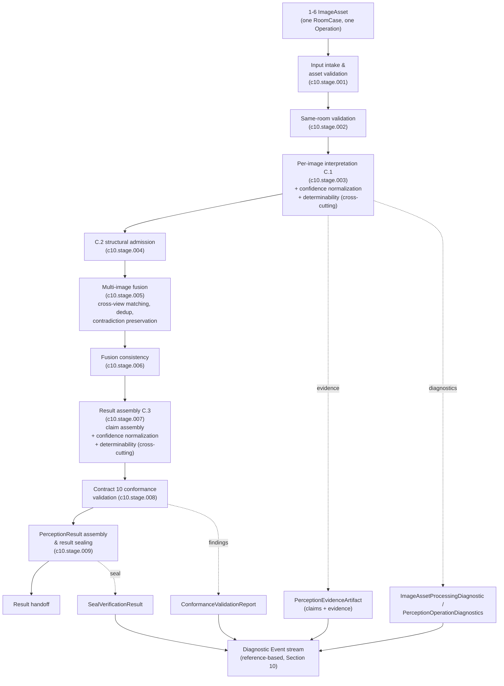
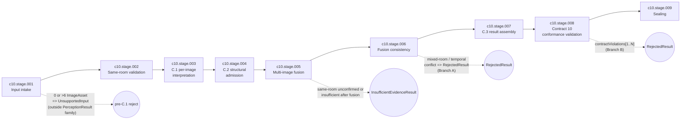
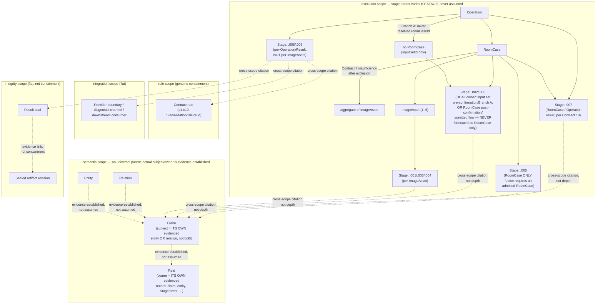

# VistaRoom AI — AI Brain Diagnosability Architecture — Revision 1

## 0. Document Control

```text
Document title:            VistaRoom AI — AI Brain Diagnosability Architecture
Document type:             Normative Architecture Specification
Revision:                  1
Status:                    DRAFT — READY FOR ONE FULL INDEPENDENT CONSOLIDATED REVIEW
Project:                   VistaRoom AI
Project Owner:              Nurlan
Primary Active Module:      Bounded Room Understanding / Spatial Perception
Strategic Track:            Track A — Spatial Perception
Prepared by:                Chief Software Architect / AI Systems Diagnosability Architect /
                             Specification Author / Strict Technical Reviewer /
                             System Integration Architect (acting under direct Project Owner
                             authorization — Section 3)
Preparation date:           2026-08-03
Source baseline:            Project Context v2.4; Living Strategic Roadmap v1.4;
                             Module Completion and Sequencing Policy Rev4;
                             VistaRoom AI Full-Platform Vision Architecture Rev5;
                             VistaRoom AI Consolidated Feature Vision Rev5;
                             Candidate A Bounded Scope Decision Rev5;
                             Candidate A Evaluation Threshold and Acceptance Plan Rev16;
                             Candidate A Test Data Handling Decision Rev10;
                             Candidate A Module Applicability Profile Rev19;
                             Candidate A Contracts 1-10 Preparation and Dependency Plan Rev11;
                             ADR-013 StructuredScene / Scene Graph Schema v0;
                             ADR-014 Perception Boundary;
                             ADR-015 Multi-Image Perception Boundary;
                             Supporting Contracts 1-10 (Rev19/Rev10/Rev1/Rev1/CC3/CC1/CC1/Rev1/Rev1/Rev1);
                             Candidate Locks C1-REV19-CL-001 through C10-REV1-CL-001;
                             Supporting Contracts 1-10 Final Consolidated Package Review;
                             Supporting Contracts 1-10 Closed Findings Matrix;
                             Project Owner Decision — Contracts 1-10 Atomic Package Acceptance
Prerequisite verification result:
                             Combined Diagnosability & Security Compatibility Assessment (as a
                             separate pre-artifact): NOT PERFORMED AS A SEPARATE DOCUMENT —
                             REMOVED FROM THE CRITICAL PATH BY DIRECT PROJECT OWNER SEQUENCING
                             DECISION (Section 3). Supporting Contracts 1-10: COMPLETE
                             (OWNER-ACCEPTED, TECHNICALLY REVIEW-CLOSED, CANDIDATE-LOCKED,
                             REPOSITORY-PERSISTED; atomic package acceptance COMPLETE; open
                             package findings: 0). Additional Supporting Contracts: NOT DEFINED.
Repository/safe-copy boundary:
                             C:\Users\user\Documents\Cowork\VistaRoom-AI-Safe-2026-08-01
                             (safe copy; not a Git repository; read-only for all files except
                             this one; no git/commit/push operations performed or authorized)
Canonical filename:         AI-Brain-Diagnosability-Architecture-Rev1.md
```

---

## 1. Purpose

This document defines the diagnosability architecture of the VistaRoom AI "brain" — the perception
subsystem that turns 1–6 photographs of one room into one consolidated `PerceptionResult` — for the
current Primary Active Module, Bounded Room Understanding / Spatial Perception (Track A).

Diagnosability, as used here, is the architectural property that lets an engineer, reviewer, or
future automated process answer, for any given Operation: what happened; where it happened; at
which processing stage it happened; which inputs, versions, rules and evidence were involved;
whether the result is reproducible; and whether an anomaly is a data problem, a model problem, a
rule problem, a contract violation, an orchestration problem, or an integration problem. It also
defines what diagnostic information is safe to retain, and where the architecture hands off to a
future Security Architecture.

This is a normative specification, not a survey. It defines identities, stages, event structure,
failure taxonomy, localization rules, evidence/provenance traceability, reproducibility, sealing,
and the boundaries with observability, user-facing explanation, security and Controlled Learning.
It does not redefine any accepted Contract, ADR, or governance decision; it consumes and organizes
what Contracts 1–10 and ADR-013/014/015 already established, and adds only the diagnostic layer
that those documents anticipated but deliberately left to a later, separate architecture cycle
(Bounded Scope Decision Rev5 §8G; Full-Platform Vision Architecture Rev5 §15.2; Contract 1 Annex AI
`hook.crossCutting.diagnosability`).

---

## 2. Authority and Source Hierarchy

Precedence, highest first:

```text
1. This direct Project Owner sequencing decision (Section 3) and any other explicit
   Project Owner decision recorded in this document's source baseline
2. Project Context v2.4
3. Living Strategic Roadmap v1.4 and Owner-approved amendments
4. Module Completion and Sequencing Policy Rev4
5. Accepted ADR, Bounded Scope, Evaluation and Data Handling decisions
6. Supporting Contracts 1-10 and Candidate Locks
7. Final Consolidated Package Review and Closed Findings Matrix
8. Full-Platform Vision Architecture Rev5
9. Consolidated Full Feature Vision Rev5
```

A higher source controls over a lower one. No accepted source is edited, reopened, or reinterpreted
by this document. Where this drafting pass located a real textual discrepancy between two
currently-accepted sources, it is resolved by hierarchy where the hierarchy is sufficient (Section
27), and flagged as an open Owner Decision where it is not (Section 28). No discrepancy is masked.

---

## 3. Direct Project Owner Sequencing Decision

The Project Owner has directly authorized this drafting cycle and changed the order of the
currently authorized work, as follows (verbatim intent, restated for the repository record):

```text
- A separate, standalone "Combined Diagnosability & Security Compatibility Assessment"
  document is NOT created.
- A separate "Assessment Criteria checkpoint" stage is NOT created.
- A separate "Retrospective compatibility pass" document is NOT created.
- A separate preliminary "Compatibility Matrix" is NOT created before this architecture.
- A separate preliminary "Consolidated Compatibility Result" is NOT created before this
  architecture.
- These questions are instead addressed directly inside two architecture documents:
  1. AI Brain Diagnosability Architecture (this document, drafted first)
  2. Security Architecture Baseline (drafted next, as a separate governance cycle)
- After both documents exist, one Diagnosability <-> Security Compatibility Cross-Check is
  performed.
```

This decision changes only the *sequencing and packaging* of the mandatory post-Contracts
governance steps recorded in Living Strategic Roadmap v1.4 (2026-07-16 Amendment, lines 416-427,
858-869): the compatibility-assessment content is folded into this document (see Section 27,
"Compatibility with Existing Architecture") instead of being drafted as a separate artifact first.
It does not remove any step, does not weaken the Hard Security Stop, does not alter the
Diagnosability/Security Integration Boundary, and does not reopen Supporting Contracts 1–10.

This direct authorization is **not**, and must not be read as:

```text
- Project Owner acceptance of this document
- technical review closure of this document
- a Candidate Lock on this document
- repository persistence authorization
- implementation authorization
- provider authorization
- deployment authorization
```

---

## 4. Scope

This architecture is normative for, and only for, the current bounded runtime model:

```text
Operation
  -> RoomCase[exactly 1]
     -> ImageAsset[1..6]
     -> one consolidated PerceptionResult
```

In scope:

```text
- Residential-34 (34 active_candidate residential categories)
- licensed, synthetic and deliberately staged images only
- same-room validation
- per-image interpretation (C.1)
- cross-view matching (CrossViewEntityCorrespondence, within Multi-Image Fusion)
- deduplication (duplicate/near-duplicate suppression, within Multi-Image Fusion)
- contradiction preservation (Contradiction Analysis, within Multi-Image Fusion)
- evidence fusion (MultiImageFusion / FusionConsistencyStage)
- confidence normalization (Contract 5)
- determinability (Contract 6, evidence-basis grounding from Contract 4)
- claim assembly and Contract 10 conformance validation
- PerceptionResult assembly and result sealing
- the minimal integration boundary with a future Security Architecture and with
  Controlled Learning compatibility hooks
```

---

## 5. Non-Scope

This document does not design, and does not create any obligation to design:

```text
- Tracks B-H internal architecture (Designer Intelligence, Project & Asset Foundation,
  Editing and Continuity, Professional Workflow, Implementation and Commerce, Platform
  Operations as a Major Module, or any other track)
- persistent Project Memory, whole-home graph, cross-room reasoning, floor plans, video,
  panoramas, 2.5D/3D reconstruction
- multiple RoomCase per Operation, multiple Operations in one diagnostic scope
- a full Security Architecture Baseline (only the integration boundary, Section 22)
- a full Controlled Learning system (only compatibility hooks, Section 23)
- real user photographs or any production personal data
- provider selection, provider invocation, or production credentials
- TypeScript code, JSON Schema, or any implementation artifact
- new or additional Supporting Contracts beyond the accepted Contracts 1-10
- reopening or amending Contracts 1-10, ADR-013/014/015, or any accepted governance document
```

---

## 6. Architectural Principles

**DIAG-CTX-001.** The architecture MUST be evidence-first: every diagnostic conclusion MUST be
traceable to actual input references, an actual execution stage, an actual contract rule, actual
evidence, and actual version identities. The architecture MUST NOT synthesize an unconfirmed cause
for a failure.

**DIAG-CTX-002.** Failure MUST be localized to the most specific level the available evidence
supports (Section 12), and MUST NOT be localized more broadly than the evidence justifies. An
Operation-level anomaly MUST NOT be automatically attributed to every ImageAsset; a single
ImageAsset failure MUST NOT automatically become a RoomCase-level or Operation-level failure unless
Contracts 1-10 require that outcome (e.g., insufficient remaining evidence after excluding the
failed ImageAsset).

**DIAG-CTX-003.** The architecture MUST keep failure classes separate (Section 11) and MUST NOT
conflate a permitted epistemic state (`unknown_not_inferable`, `not-determinable`, `inconclusive`,
low confidence, a valid partial result) with a system defect. In particular, a valid, sealed
`not-determinable` outcome (`c6.outcome.002`) MUST NOT be recorded as DIAG-FAIL-004; DIAG-FAIL-004
is reserved exclusively for a failure of the determinability mechanism itself (DIAG-FAIL-RULE-003,
Section 11).

**DIAG-CTX-004.** The architecture MUST define a minimal reproducible execution record (Section 18)
without storing data prohibited by Test Data Handling Decision Rev10 or any other accepted
data-governance decision.

**DIAG-CTX-005.** Diagnostics MUST NOT be the basis for storing or disclosing secrets, raw
credentials, held-out ground truth, unauthorized sensitive payloads, or full user-facing content of
governed inputs (Section 25).

**DIAG-CTX-006.** Stable diagnostic identities and diagnostic codes MUST be language-neutral. The
canonical internal language is English; Russian is a derived locale; English is the fallback
(Section 24).

**DIAG-CTX-007.** Where an existing Contract, ADR, or Candidate Lock already defines an identity,
enum, code registry, or stage, this architecture MUST reuse it by reference and MUST NOT define a
parallel or duplicate identity for the same concept (Section 8).

---

## 7. Diagnosability Context Model

```text
1-6 ImageAsset (one RoomCase, one Operation)
  -> Input intake and asset validation (c10.stage.001)
  -> Same-room validation (c10.stage.002)
  -> Per-image interpretation (C.1) -> semantic claims + evidence (c10.stage.003;
     confidence normalization and determinability evaluation are cross-cutting
     annotation activities attached to this stage — Section 9 — not a separate step)
  -> C.2 structural admission (c10.stage.004)
  -> Multi-image fusion (cross-view matching, deduplication, contradiction
     preservation) (c10.stage.005)
  -> Fusion consistency check (c10.stage.006)
  -> Result assembly (C.3) -> claim assembly (c10.stage.007; confidence
     normalization and determinability evaluation are also cross-cutting here,
     not a separate step)
  -> Contract 10 conformance validation (c10.stage.008)
  -> PerceptionResult assembly and result sealing (c10.stage.009)
  -> result handoff
  -> diagnostic records (evidence-linked, reference-based, non-duplicative)
```



This context model does not introduce new artifact types beyond those already named by Bounded
Scope Decision Rev5 §8D (`PerceptionEvidenceArtifact`, `PerceptionOperationDiagnostics`,
`ImageAssetProcessingDiagnostic`) and Contract 10 §3 (`ConformanceValidationReport`,
`SealVerificationResult`). The Diagnostic Event stream (Section 10) is the one new artifact this
document defines, and it is strictly reference-based over the artifacts above.

---

## 8. Diagnostic Identity Model

Per DIAG-CTX-007, each identity below is classified as **REUSED** (already defined by an accepted
source; this document only references it) or **NEW** (not defined anywhere in the source baseline;
this document defines it as a diagnostic-layer identity, aligned to existing naming conventions).

| Identity | Status | Definition / source |
|---|---|---|
| `operationId` | REUSED | Bounded Scope Decision Rev5 §8A; Test Data Handling Rev10 §3.3.0. Top-level Operation identity. |
| `roomCaseId` | REUSED | Same sources; identifies the single RoomCase of an Operation. |
| `imageAssetId` | REUSED | Same sources; 1:1:1 with `sourceAssetId`, never set-valued. |
| `sourceAssetId` | REUSED | Test Data Handling Rev10 §3.3.0; upstream source-image identity bound to exactly one `imageAssetId`. |
| `inputSetId` | REUSED | Contract 10 §5.3 Branch A; identifies a pre-admission capture set that never obtained a `roomCaseId` (e.g. mixed-room rejection). |
| `perceptionResultId` | REUSED (aliased) | Contract 10 §15A `PerceptionOperation.resultReference` -> sealed `PerceptionResult.resultId` / `resultRevisionId`. This document uses `perceptionResultId` only as a diagnostic-facing alias for `PerceptionResult.resultId`; it is not a second identity. |
| `executionAttemptId` | **NEW** | Not defined by any source in the baseline. DIAG-ID-001: every execution of an Operation (including retries of the same `operationId`) MUST carry a distinct `executionAttemptId`, scoped under `operationId`. Required to distinguish repeated attempts for reproducibility (Section 18) without overloading `operationId`. |
| `traceId` / `correlationId` | **NEW** | Contract 1 Annex AI `hook.crossCutting.diagnosability` reserves a "semantic trace identity" and "diagnostic-to-operation linkage" without fixing field names (Contract 1, line 5782). DIAG-ID-002: this document fixes `traceId` (one per `executionAttemptId`) and `correlationId` (links diagnostic events across `executionAttemptId` boundaries, e.g. retries of the same `operationId`) as the concrete fields anticipated by that hook. This is additive to Annex I, not a replacement of it. |
| `stageExecutionId` | **NEW** | DIAG-ID-003: one per execution of a named stage (Section 9) within one `executionAttemptId`; required for stage-level localization (Section 12) and reproducibility (Section 18). |
| `claimId` | **NEW (reference wrapper)** | No source in the baseline fixes a `claimId` field name; claim identity is currently carried implicitly via `bestEffortValueIdentity` (Contract 4 §7.1) and per-claim source-image references inside `PerceptionEvidenceArtifact` (ADR-015 line 126). DIAG-ID-004: `claimId` is defined as a diagnostic-layer reference that MUST resolve to the owning `bestEffortValueIdentity` or `RelationRecordId`; it MUST NOT be treated as an independent semantic identity. |
| `entityId` | **NEW (alias)** | ADR-013 defines a node "Identity attribute" without fixing a field name (ADR-013 §4.4). DIAG-ID-005: `entityId` is the diagnostic-facing name for that Identity attribute. It MUST NOT redefine StructuredScene v0 node identity semantics. |
| `relationId` | REUSED | Contract 2, wire field `id (RelationId)` on `StructuredSceneRelationBase`; also `relationRecordId` (Contract 2 §16.2) and `relationDefinitionId` (Annex A). This document reuses these exactly. |
| `evidenceId` | **NEW (alias)** | No single `evidenceId` field exists. DIAG-ID-006: `evidenceId` is a diagnostic-facing alias that MUST resolve to `attributeEvidenceArtifactIdentity` (Contract 4 §8.2) or `evidenceSetIdentity` (Contract 4 §9.4), never a new evidence record. |
| `diagnosticEventId` | **NEW** | DIAG-ID-007: core identity of this document's own artifact, the Diagnostic Event (Section 10). Scoped under `traceId`. |
| `validationResultId` | **NEW (alias)** | DIAG-ID-008: diagnostic-facing alias resolving to Contract 10's `ConformanceValidationReport.findingId` (`c10.field.910`) or `reportId` (`c10.field.900`); not a new validation record type. |
| `contractRuleId` | **NEW (pointer type)** | DIAG-ID-009: a typed pointer (`{contractNumber, ruleNamespace, ruleToken}`) used by Diagnostic Events to cite an existing rule/validation/failure code owned by Contracts 1-10 (e.g. `c9.failure.*`, `c10.validation.S031`, `c1.rule.*`). It is a citation mechanism, not a new rule registry. |
| `modelVersionId`, `ruleSetVersionId`, `providerConfigurationVersionId` | **NEW** | Full-Platform Vision Architecture Rev5 §16.2 mandates these as compatibility *categories* without fixing concrete fields ("does not decide exact schemas, field names"). DIAG-ID-010: this document fixes them as concrete diagnostic-layer version references. No existing Contract claims ownership of these three. |
| `contractVersionId` | **NEW (structured, non-duplicating)** | DIAG-ID-011: a structured reference `{contractNumber, revision, candidateLockId, sha256}`, built entirely from fields Contracts 1-10 and their Candidate Locks already publish (Revision number, SHA-256, Candidate Lock ID such as `C4-REV1-CL-001`). It mints no new version number of its own. |
| `vocabularyVersionId` | REUSED (aliased) | Contract 1 already defines `RegistryVersionSet`, a per-registry version map (Contract 1 §4.6, lines 351-377). DIAG-ID-012: `vocabularyVersionId` is a diagnostic-facing alias for the relevant entries of `RegistryVersionSet`; it MUST NOT be a second, independently incremented vocabulary version. |
| `resultSealId` | REUSED (aliased) | Contract 10 `sealIntegrityReference` (`c10.field.908` and equivalents) and `SealVerificationResult.verificationId` (`c10.field.921`). This document uses `resultSealId` only as a diagnostic-facing alias for `sealIntegrityReference`. |
| `securityIncidentReferenceId` | **NEW (hook only)** | DIAG-ID-013: forward-compatibility hook only (Section 22). No population logic, taxonomy, or triggering rule is authorized by this document; final ownership belongs to the future Security Architecture Baseline. |

DIAG-ID-014. This document MUST NOT introduce a duplicate identity for any concept already owned by
Contracts 1-10, ADR-013/014/015, or Test Data Handling Decision Rev10. Where a diagnostic-facing
alias is defined above, it is a reference, not a second source of truth.

---

## 9. Processing Stage Model

Contract 10 §6 already defines a closed, nine-member Operational Stage Registry
(`c10.stage.001`-`c10.stage.009`). This document adopts it verbatim as the canonical diagnostic
stage registry and does not add a tenth top-level stage.

```text
c10.stage.001  Input intake
c10.stage.002  Same-room validation
c10.stage.003  C.1 provider candidate production (per-image interpretation)
c10.stage.004  C.2 structural admission
c10.stage.005  Multi-image fusion (cross-view matching, deduplication, contradiction
               preservation — ADR-015 MultiImageFusion sub-responsibilities:
               SameRoomAssessment, CrossViewEntityCorrespondence, Contradiction Analysis,
               duplicate/near-duplicate suppression)
c10.stage.006  Fusion consistency (mixed-room / temporal-state-conflict detection)
c10.stage.007  C.3 result assembly (claim assembly; confidence normalization and
               determinability evaluation are cross-cutting annotation activities attached
               to this stage and to c10.stage.003, not separate top-level stages)
c10.stage.008  Contract 10 conformance validation
c10.stage.009  Sealing
```

**DIAG-STAGE-001.** A diagnostic record MUST cite exactly one `c10.stage.*` value per
`stageExecutionId`; it MUST NOT invent a stage name outside this registry.

**DIAG-STAGE-002.** This document resolves one gap left open by the source baseline: Contract 9's
fixture stage token `preprocessing` (used for `F-INPUT-UNREADABLE` / `F-INPUT-UNSUPPORTED`) has no
verbatim mapping to a `c10.stage.*` value in Contract 9 or Contract 10 text. For diagnostic
purposes only, this document maps Contract 9's `preprocessing` token to `c10.stage.001` (Input
intake). This is an architectural clarification for diagnostic citation, not a modification of
Contract 9 or Contract 10; the two contracts remain unchanged, and a formal correction (if any) is
left to a downstream artifact (Section 29).



### 9A. Execution Attempt and Stage Execution Lifecycle

This subsection is the minimal normative state model for `executionAttemptId` and `stageExecutionId`
required to answer, for any Operation: is it still running, did it finish, did it hang, was a step
skipped, did it crash, or is a diagnostic record simply missing. It owns no retry scheduling,
backoff, or orchestration policy; that remains Track H's (Section 20).

The ExecutionAttempt states below are a diagnostic-layer classification of attempt OUTCOME (did the
attempt reach a sealed result, and was that a recoverable or unrecoverable condition); they are
additive to, and distinct from, Contract 10's own operation-level PROGRESS field,
`PerceptionOperation.operationState` (c10.field.030) = `admitted | processing | completed`, which
this document does not redefine, narrow, or duplicate. `operationState = completed` is set once any
`PerceptionResult` variant is sealed (success or otherwise); the ExecutionAttempt states below
additionally classify which kind of outcome that was, for diagnostic purposes only.

**ExecutionAttempt states** (one `executionAttemptId` per attempt to execute one `operationId`):

```text
non-terminal:  attempt-started -> attempt-running (optional intermediate signal)
terminal:      attempt-completed    (a PerceptionResult was sealed for this attempt)
               attempt-failed       (an unrecoverable DIAG-FAIL-* at Operation scope;
                                     no PerceptionResult was sealed)
               attempt-timed-out    (no terminal signal observed within an externally
                                     owned time bound — the bound itself is Track H's;
                                     this document defines only the diagnostic state)
               attempt-cancelled    (explicit external cancellation/abort)
               attempt-abandoned    (inferred abrupt termination; detected from the
                                     absence of any terminal signal combined with an
                                     externally owned liveness signal — the liveness
                                     mechanism is Track H's, not this document's)
```

**DIAG-LC-001.** A retry of a failed, timed-out, cancelled, or abandoned attempt MUST allocate a new
`executionAttemptId` under the same `operationId`; it MUST NOT reuse the prior `executionAttemptId`.
The new attempt's `correlationId` MUST equal the prior attempt's `correlationId`, so that all retries
of the same logical execution remain linked (Section 8).

**StageExecution identity and status** (one `stageExecutionId` per execution of one `c10.stage.*`
within one `executionAttemptId`, uniquely keyed by `{executionAttemptId, c10.stage.*,
stageAttemptOrdinal}`, DIAG-LC-002 below).

**DIAG-LC-004 (single source of truth for stage status).** Contract 10 already owns the closed,
single source of truth for stage-level lifecycle status: `StageEvent.status` (c10.field.265,
validated by `c10.validation.265`) = exactly `started | completed | failed | skipped`, recorded per
`PerceptionOperationDiagnostics.stageEvents[]` (c10.field.263) and keyed by `StageEvent.stageIdentity`
(c10.field.264). This document MUST NOT define a second, competing, or extended status enum for the
same concept. A `stageExecutionId`'s status, once a corresponding `StageEvent` exists, IS exactly
that `StageEvent.status` value:

```text
non-terminal:  started    (StageEvent recorded; no completedAt yet, c10.field.266/267)
terminal:      completed  (success; the stage's obligations under Contracts 1-10 were met)
               failed     (StageEvent.failureCode populated, c10.field.268; the
                          corresponding Diagnostic Event cites exactly one DIAG-FAIL-*
                          class, Section 11, consistent with that failureCode)
               skipped    (non-failure; the stage was legitimately not required on the
                          executed path, e.g. c10.stage.005-.009 after a Branch A
                          pre-admission RejectedResult, Section 9)
```

A Diagnostic Event's `stageState` field (Section 10), when populated, is a reference/projection of
this `StageEvent.status` value — never an independent assertion. Before any `StageEvent` is recorded
for a `stageExecutionId`, the diagnostic layer MUST represent this as "no StageEvent yet," not as a
fabricated status.

**DIAG-LC-005 (timeout and cancellation are diagnostic-channel observations, not status values).**
Timeout and cancellation MUST NOT be represented as additional `StageEvent.status` values; Contract
10's enum is closed and this document does not extend it (per DIAG-LC-004). They are represented
instead as diagnostic-channel observations (Section 10, event type = `observation` or `escalation`)
that reference the affected `stageExecutionId` without asserting or implying a `StageEvent.status`:

```text
stage-timeout-suspected:      no terminal StageEvent (completed/failed/skipped) has been
                              observed within an externally owned time bound (the bound
                              itself belongs to Track H, Section 20). This observation
                              does not set StageEvent.status. If a StageEvent is later
                              recorded, it resolves the actual outcome through the closed
                              enum (most commonly `failed`, citing DIAG-FAIL-014). If no
                              StageEvent is ever recorded, the condition is diagnosed
                              through trace completeness (DIAG-LC-003 below), never
                              through a fabricated status.
stage-cancellation-observed:  an external cancellation signal (owned by Track H) was
                              received for this stageExecutionId before a terminal
                              StageEvent was recorded. This observation likewise does not
                              set StageEvent.status; the stage's eventual StageEvent, if
                              any is ultimately recorded, still resolves to exactly one of
                              started/completed/failed/skipped.
```

**DIAG-LC-002.** Repeated execution of the same `c10.stage.*` inside one `executionAttemptId` MUST be
identified by an attempt-local, monotonically increasing `stageAttemptOrdinal` (starting at 1), so
that a `stageExecutionId` is uniquely determined by the triple `{executionAttemptId, c10.stage.*,
stageAttemptOrdinal}`. A `stageAttemptOrdinal` greater than 1 MUST carry a `stageReentryReason`
citing the `contractRuleId` or DIAG-FAIL-* class that caused re-entry; re-entry MUST NOT occur
silently. This does not add a tenth top-level stage (Section 9) and does not authorize a general
retry-within-attempt policy, which remains Track H's.

**Trace completeness.** A trace (all Diagnostic Events sharing one `traceId`) carries a derived
`traceCompletenessStatus`, which is independent of execution outcome (DIAG-LC-006 below): a
timed-out or cancelled execution can still yield a COMPLETE trace if every expected terminal event
was recorded; conversely, an execution that otherwise concluded normally can still leave an
INCOMPLETE trace if a diagnostic event was lost. `traceCompletenessStatus` is a LIFECYCLE
completeness signal only (terminal ExecutionAttempt/StageEvent states); it is distinct from, and
MUST NOT be substituted for, the per-event `causalChainStatus` that Section 10 (DIAG-EVT-010)
defines for causal cross-reference completeness — a trace can be lifecycle-complete while a specific
event's causal neighborhood remains `causalChainStatus = incomplete` or `unknown`.

```text
complete                  a terminal ExecutionAttempt state was observed, and every
                          StageExecution on the executed path reached a terminal
                          StageEvent.status (completed/failed/skipped, DIAG-LC-004).
                          This holds regardless of which terminal outcome was reached —
                          including an attempt-failed outcome whose cause was a timeout
                          (a stage-timeout-suspected observation followed by a recorded
                          StageEvent.status=failed is a COMPLETE trace, not incomplete).
incomplete-in-progress     no terminal ExecutionAttempt state has yet been observed
                          (equivalent to "still running").
incomplete-gap-detected     an expected next stage-started StageEvent never arrived
                          within the trace (a sequence gap). This is the state that
                          corresponds to "hung with no recorded evidence," distinct from
                          a timeout that WAS observed and recorded end-to-end (which
                          yields `complete`, not this state).
incomplete-lost            a terminal ExecutionAttempt state was recorded, but one or
                          more expected StageExecution terminal events are missing from
                          the trace. This state MUST be recorded whenever this condition
                          is observed, whether the cause is an abrupt process
                          crash/termination (frequently co-occurring with
                          `attempt-abandoned`) or a lost/undelivered diagnostic event
                          (Section 10, DIAG-EVT-006); the diagnostic layer records the
                          gap and does not guess which cause applies without further
                          evidence.
```

**DIAG-LC-006 (execution outcome and trace completeness are independent).**
`traceCompletenessStatus` answers "is the diagnostic record of this execution complete," never "did
the execution succeed." An `attempt-timed-out`/`attempt-cancelled` ExecutionAttempt outcome, or a
`stage-timeout-suspected`/`stage-cancellation-observed` observation (DIAG-LC-005), MUST NOT by
itself force `traceCompletenessStatus` to an incomplete value: if the timeout or cancellation and
its consequences were fully recorded through terminal `StageEvent`/ExecutionAttempt states, the
trace is `complete`. Conversely, `traceCompletenessStatus` MUST be downgraded to
`incomplete-gap-detected` or `incomplete-lost` only on the specific evidence defined above (a
missing expected event), never merely because the execution's outcome was unsuccessful.

**DIAG-LC-003.** A consumer MUST be able to distinguish, using `traceCompletenessStatus` together
with the ExecutionAttempt/StageExecution states and the timeout/cancellation observations above:
still running (`incomplete-in-progress`); hung with no recorded evidence
(`incomplete-gap-detected`); an execution that timed out but was fully recorded
(`attempt-timed-out` or `stage-timeout-suspected`, with `traceCompletenessStatus = complete`);
explicitly skipped (`StageEvent.status = skipped`); abrupt termination/crash or a missing diagnostic
event (`incomplete-lost`, disambiguated further only if an external liveness signal is available);
and completed execution (`attempt-completed` with `traceCompletenessStatus = complete`).

**DIAG-LC-007 (tail-loss / last-event-loss detection, and the pre-registration crash window).**
Without the mechanism below, a lost *terminal* event is indistinguishable from an execution that is
genuinely still running, because `incomplete-in-progress` is defined only by the ABSENCE of a
terminal state — there is no later event whose sequence gap could reveal the loss (DIAG-EVT-006's
sequence-gap detection only detects loss of a NON-terminal event, because it depends on a
subsequent ordinal arriving). This document therefore defines one implementation-neutral marker and
two bounds, without choosing a transport or storage product (Section 5) and without inventing an
atomicity or blocking-synchronization guarantee this document does not otherwise define.

A prior revision of this rule stated that the absence of a durably-accepted `attempt-registered`
marker "means the attempt never started." That claim is corrected here: an attempt can genuinely
begin, and its owning process can crash, in the window BETWEEN allocating `executionAttemptId` and
the `attempt-registered` marker reaching durable acceptance (DIAG-EVT-009 state 2). In that window
the marker will never arrive, yet the attempt did start. Absence of the marker therefore proves
only "no durable confirmation exists," never "no attempt existed." This document does not make
durable registration a blocking prerequisite of stage execution (that would require a
synchronization/atomicity guarantee this document does not define); instead it replaces the single
binary claim with a three-state, purely evidentiary classification of attempt EXISTENCE, which is
answered before — and independently of — `traceCompletenessStatus` (which presupposes existence is
already confirmed):

```text
- attempt-registered marker: entering an ExecutionAttempt's initial state (Section 9A) MUST
  cause an emission attempt of a minimal `attempt-registered` diagnostic marker carrying
  executionAttemptId and traceId (DIAG-EVT-009 state 1). Its durable acceptance (state 2) is
  POSITIVE evidence of existence; it is not the only such evidence (below).

- attempt-existence-confirmed: the `attempt-registered` marker has reached durably-accepted
  (DIAG-EVT-009 state 2), OR any StageEvent (Contract 10, c10.field.263) already exists for
  this executionAttemptId (a StageEvent is itself durable Contract-10 evidence that the
  attempt reached stage execution, and transitively confirms existence even if the
  attempt-registered marker itself was never durably accepted). Once confirmed,
  `traceCompletenessStatus` (below) governs, using the existing expected-completion window
  and tail-loss rule.

- attempt-existence-unknown: a consumer holds or has learned of an `executionAttemptId` (by
  any channel; this document does not define how that knowledge is obtained — that remains a
  downstream/Track H concern, Section 29) but has observed neither a durably-accepted
  `attempt-registered` marker nor any StageEvent for it, and the registration-confirmation
  window (below) has not yet elapsed since that `executionAttemptId` first became known to the
  consumer. This state is the honest representation of the crash window: the attempt may have
  started and its emitter may have crashed before durable acceptance, or registration may
  simply not have completed yet: both are indistinguishable from here, and this document does
  not claim otherwise.

- registration-confirmation window: a downstream artifact (Section 29) supplies a bound
  (distinct from, and normally much shorter than, the expected-completion window below)
  within which `attempt-registered` is expected to reach durable acceptance once an
  `executionAttemptId` is known. This document fixes the mechanism and the two-window
  structure, not either numeric bound.

- attempt-not-registered: the registration-confirmation window has elapsed while the
  executionAttemptId remains in `attempt-existence-unknown`. This is the CURRENT existence
  state AS OF THE MOMENT OF OBSERVATION, meaning only "this diagnostic layer has not yet
  obtained durable confirmation of this attempt's existence." It is NOT a terminal or
  irreversible classification: DIAG-EVT-009 explicitly permits late delivery, so a durably-
  accepted `attempt-registered` marker or a Contract-10 `StageEvent` for this
  executionAttemptId MAY still arrive after `attempt-not-registered` is first observed — see
  the late-confirmation transition below. Independently of any later transition,
  `attempt-not-registered` MUST NOT be reported, interpreted, or logged as equivalent to "the
  attempt never started" or "the executionAttemptId was never allocated" — whether the attempt
  genuinely began and its emitter crashed before registering, or never began at all, remains
  indeterminate from this diagnostic layer alone at the time this state is observed.
  Reconciling that residual ambiguity (e.g., via an Operation-level dispatch record or a Track H
  liveness signal) is explicitly out of scope for this document.

- late-confirmation transition (attempt-not-registered -> attempt-existence-confirmed): if,
  after `attempt-not-registered` was first observed for an executionAttemptId, a durably-
  accepted `attempt-registered` marker or a Contract-10 `StageEvent` for that same
  executionAttemptId is subsequently observed, the CURRENT existence state MUST be updated to
  `attempt-existence-confirmed`. This update does NOT retroactively erase, invalidate, or
  reclassify as an error the earlier `attempt-not-registered` observation: current existence
  state and the historical fact that registration was observed missing at a given point in time
  (a `registrationDelayObserved` record: executionAttemptId, the timestamp the
  registration-confirmation window was found elapsed, Section 8 identities) are two distinct,
  separately retained things. The historical record MUST be preserved even after the state
  transitions to confirmed; it is evidence of a registration delay, not a fact that gets
  overwritten by the delayed confirmation. Updating the current state on new evidence is
  expected, ordinary behavior — consistent with DIAG-LOC-003 step 7's reclassification-on-new-
  evidence principle — not a correction of a prior error.

- expected-completion window: a downstream artifact (Section 29) supplies the bound (a
  duration or a liveness-signal policy) within which a terminal ExecutionAttempt state is
  expected once `attempt-existence-confirmed` holds. This document fixes the mechanism, not
  the numeric bound.

- tail-loss rule (applies only once attempt-existence-confirmed holds): if no terminal
  ExecutionAttempt state has been observed once the expected-completion window elapses,
  `traceCompletenessStatus` MUST transition from `incomplete-in-progress` to
  `incomplete-lost`. This is how a lost terminal event (including one lost because the
  emitting process crashed and never resumes, after existence was already confirmed) is
  detected WITHOUT requiring the crashed emitter to record its own failure — the consumer-side
  window rule performs the detection, not the emitter (DIAG-BOUND-002).

- before attempt-existence-confirmed holds, or before either window elapses, no downgrade
  MUST occur: the executionAttemptId remains in its current state (attempt-existence-unknown,
  or incomplete-in-progress once confirmed) and MUST NOT be prematurely reported as lost,
  not-registered, or never-started.
```

---

## 10. Diagnostic Event Model

A **Diagnostic Event** is a single, immutable, reference-based observation scoped to one
`executionAttemptId` and, where applicable, to one `stageExecutionId` within it. Not every
Diagnostic Event is stage-scoped: an event MAY instead be attempt-scoped (e.g. an ExecutionAttempt
lifecycle transition, Section 9A), diagnostic-channel-scoped (e.g. `diagnostic-emission-failed`,
DIAG-EVT-006), or orchestration-scoped (e.g. DIAG-FAIL-014, a stage-sequencing anomaly not tied to
one stage's semantic output). Exact `stageExecutionId` cardinality per scope is fixed by
DIAG-EVT-008. It is this document's own artifact; it is not a runtime result and MUST NOT appear
inside `PerceptionResult`, `ComparisonOutcome`, or `ConformanceValidationReport` (those remain
exactly as Contracts 1-10 define them).

Required field groups (architectural model, not a wire schema):

```text
identity:            diagnosticEventId, traceId, correlationId
schema identity:      diagnosticEventSchemaVersion, emitterIdentity (Section 9A/DIAG-EVT-006)
timestamp/order:      eventTimestamp (UTC), recordedAtTimestamp (UTC, ingestion time, only
                       when it differs from eventTimestamp), monotonic sequence number
                       within traceId (Section 9A/DIAG-EVT-007)
execution scope:      operationId (exactly 1); inputSetId (present only for pre-admission
                       Branch A events, absent otherwise) XOR roomCaseId (present from
                       admission onward, absent for Branch A); imageAssetId references
                       (Section 9A/DIAG-EVT-005 fixes exact cardinality per event kind);
                       executionAttemptId (exactly 1)
lifecycle state:       attemptState (Section 9A, doc-owned outcome classification), and/or
                       stageState, where applicable — stageState is never an independent
                       assertion; it is a reference/projection of the corresponding
                       Contract-10 `StageEvent.status` (DIAG-LC-004), present only once
                       that StageEvent exists
stage:                 stageExecutionId -> {c10.stage.*, stageAttemptOrdinal} (Section 9A),
                       conditionally present per event scope (DIAG-EVT-008); MUST NOT be
                       fabricated for an attempt-scoped, channel-scoped, or
                       unlocalized orchestration-scoped event
event type:            observation | outcome | escalation
causal reference:      parentDiagnosticEventId (0..1), causedByDiagnosticEventId (0..N)
                       (Section 12, DIAG-EVT-004)
severity:              diagnosticSeverity = inherited | not-applicable | unassigned
                       (Section 11); when inherited, the event MUST also record which
                       contract's own scale is in effect (e.g. "Contract 9 retryability",
                       "Contract 10 disposition precedence"); this document does not
                       define a parallel severity scale
outcome:                reference to the runtime outcome it explains, if any
                       (e.g. PerceptionResult.resultId, or none for a pure trace event)
failure class:         one DIAG-FAIL-* class (Section 11), or "none" for a non-failure event
reason code:           contractRuleId pointer (Section 8) to the owning Contract 1-10 code
contract reference:    contractVersionId of the cited contract
evidence/provenance
  reference:            claimId / evidenceId / entityId / relationId references (never a copy)
version references:    modelVersionId, ruleSetVersionId, contractVersionId, vocabularyVersionId,
                       providerConfigurationVersionId (as applicable)
localization target:   Operation | RoomCase | ImageAsset | stage | entity | relation | claim |
                       field | contract rule | provider boundary | result seal (Section 12)
reproducibility
  reference:            executionAttemptId + the reproduction record (Section 18)
security classification: safe-diagnostic | security-restricted (Section 22)
visibility
  classification:        internal-engineering | operator | review-evaluation | user-facing
                       (Section 21); a Diagnostic Event's default classification is
                       internal-engineering unless explicitly reclassified
```

**DIAG-EVT-001.** A Diagnostic Event MUST reference evidence and version identities; it MUST NOT
embed a copy of `AttributeEvidenceArtifact`, `PerceptionEvidenceArtifact`, or any raw provider
payload.

**DIAG-EVT-002.** A Diagnostic Event MUST NOT assert a failure class or reason code that is not
grounded in an actual `contractRuleId` citation or an actual stage-execution observation.

**DIAG-EVT-003.** A Diagnostic Event's visibility classification MUST default to
internal-engineering; promotion to a wider audience is governed by Section 21.

**DIAG-EVT-004 (causal chain).** A Diagnostic Event MAY carry `parentDiagnosticEventId` (the single
event whose scope directly contains this one, e.g. a stage-level event's parent is the
attempt-level event that started it) and/or `causedByDiagnosticEventId` (0..N events identified as
the root cause or an intermediate cause of this one). Causality MUST be asserted only from an
actual mechanism-level dependency (e.g. a stage-failed event caused-by the specific upstream
`contractRuleId` violation that produced it, or a downstream symptom caused-by an upstream
DIAG-FAIL class); it MUST NOT be inferred from timestamp order or sequence position alone.

The ABSENCE of a `causedByDiagnosticEventId` reference on an event is NOT, by itself, proof that no
predecessor cause exists: the reference can be missing because there genuinely is no predecessor,
OR because a predecessor event existed but was never captured, never delivered, or was lost. A
consumer MUST NOT treat "no further `causedByDiagnosticEventId` reference on the executed path" as,
by itself, sufficient to conclude that event is the root cause; the exact classification rule
(proven-root-cause / candidate-root-cause / causal-predecessor-unknown / impact) is defined in
Section 12, DIAG-LOC-003, and depends jointly on this causal-chain evidence and on
`causalChainStatus` (DIAG-EVT-010 below) — NOT on `traceCompletenessStatus` alone (DIAG-EVT-010
explains why lifecycle completeness is insufficient evidence here). Events sharing no causal edge,
where the relevant `causalChainStatus` IS `complete`, are independent concurrent events and MUST
NOT be merged into one path.

**DIAG-EVT-010 (causal-chain completeness, distinct from lifecycle trace completeness).**
`traceCompletenessStatus` (Section 9A) answers whether the LIFECYCLE record of an execution attempt
is complete — a terminal ExecutionAttempt state was observed, and every StageExecution on the
executed path reached a terminal `StageEvent.status`. That is necessary evidence for many
diagnostic purposes, but it does NOT, by itself, prove that every individual Diagnostic Event's
`causedByDiagnosticEventId` references are complete: a stage can reach a terminal `StageEvent.status`
while some OTHER Diagnostic Event that would have supplied a causal-chain link for one of that
stage's events was itself lost, malformed, or never emitted — a narrower, event-level or
sub-chain-level gap that lifecycle completeness does not, and cannot, detect (a terminal-state
signal says nothing about which INDIVIDUAL causal cross-references existed). This document
therefore defines a second, distinct, implementation-neutral status specifically for the causal-
chain evidence around one Diagnostic Event or one causal sub-chain — never a substitute for, and
never inferred from, `traceCompletenessStatus` alone:

```text
causalChainStatus =
  complete    positive evidence establishes that every Diagnostic Event that COULD have
              supplied a causedByDiagnosticEventId reference for this specific event's
              causal neighborhood was itself either observed (and cited, if a causal edge
              exists) or affirmatively ruled out as not applicable. This is a claim about
              THIS event's own causal neighborhood, not a claim about the whole trace.
  incomplete  affirmative evidence exists that one or more Diagnostic Events in this
              specific event's causal neighborhood were lost, malformed, or otherwise
              failed to arrive (e.g. a sequence-gap, DIAG-EVT-006, positioned before this
              event in the same sub-chain, or a `traceCompletenessStatus` value other than
              `complete` covering the relevant portion of the trace).
  unknown     neither `complete` nor `incomplete` can be affirmatively established for this
              specific event/sub-chain (e.g. the trace is still in progress, or gap
              detection has not yet had the opportunity to run). This is the default,
              provisional value.
```

This document does not define a specific tracing/storage implementation for computing
`causalChainStatus`; it fixes only the three-valued state and its evidentiary meaning, leaving the
mechanism (e.g. a per-sub-chain manifest or a per-stage causal-completeness marker) to a downstream
artifact (Section 29).

Lifecycle completeness (`traceCompletenessStatus`) and causal-chain completeness
(`causalChainStatus`) MUST NOT substitute for each other: a `traceCompletenessStatus = complete`
trace MAY still have `causalChainStatus = incomplete` or `unknown` for a specific event (every
lifecycle terminal state was recorded, but a causal link between two of those events was lost); and
symmetrically, one event's `causalChainStatus = complete` sub-chain determination does not by
itself establish `traceCompletenessStatus = complete` for the whole trace. Section 12, DIAG-LOC-003
uses `causalChainStatus`, never `traceCompletenessStatus` alone, to gate the PROVEN-ROOT-CAUSE
classification (DIAG-LOC-003 step 3b).

**DIAG-EVT-005 (execution-scope cardinalities).** Exact cardinality and conditional presence, by
event kind:

```text
pre-admission / Branch A events (before c10.stage.002 resolves, or a Branch A rejection):
  operationId: exactly 1.  inputSetId: exactly 1.  roomCaseId: absent (never fabricated,
  Contract 10 §15 identity rule .006).  imageAssetId: an unordered reference set, 0..6
  (0 only for the "0 ImageAsset" UnsupportedInput case).
per-image events (c10.stage.001-.004 executed per ImageAsset):
  operationId: exactly 1.  roomCaseId: exactly 1.  imageAssetId: exactly 1 (never a set).
fusion events, RoomCase-only (c10.stage.005):
  operationId: exactly 1.  roomCaseId: exactly 1 (multi-image fusion only executes once a
  RoomCase is admitted).  imageAssetId: an unordered reference set, 1..6 (every ImageAsset
  actually contributing evidence to the fusion decision; order carries no semantic meaning,
  per DIAG-LOC-001's entity/relation/claim targets).
fusion-consistency events, dual owner (c10.stage.006):
  operationId: exactly 1.  roomCaseId: exactly 1 (admitted flow: the consistency check
  confirms an already-admitted RoomCase) OR absent with inputSetId present instead (Branch
  A: the consistency check itself is what detects the mixed-room/temporal-state conflict
  that produces the Branch A rejection (Section 30, AS-02) — no roomCaseId is fabricated
  for that outcome, Contract 10 §15 identity rule .006).  imageAssetId: an unordered
  reference set, 1..6, same semantics as c10.stage.005.
result-level events (c10.stage.007, PerceptionResult assembly):
  operationId: exactly 1.  roomCaseId: exactly 1.  imageAssetId: an unordered reference
  set, 0..6 (0 only where the result derives from RoomCase-level facts with no specific
  ImageAsset attribution, e.g. a cardinality check).
validation events (c10.stage.008):
  operationId: exactly 1.  roomCaseId: exactly 1 (Branch B) or absent (Branch A carries
  inputSetId instead, per Contract 10 §5.3).  imageAssetId: 0..N, present only when the
  cited c10.field.*/c10.validation.* target is image-scoped.
sealing events (c10.stage.009):
  operationId: exactly 1.  roomCaseId: exactly 1 (or inputSetId for a sealed
  RejectedResult Branch A).  imageAssetId: absent (sealing operates on the assembled
  result, not on individual images).
pure orchestration events (DIAG-FAIL-014, stage-sequence anomalies not tied to a
  specific stage's semantic output):
  operationId: exactly 1.  roomCaseId / inputSetId / imageAssetId: absent unless the
  anomaly is actually localized to one of them, in which case the applicable field above
  governs.
```

A field marked "absent" above MUST NOT be populated with a fabricated or placeholder value; a
Diagnostic Event MUST NOT describe a conditionally absent field as universally required.

**DIAG-EVT-008 (stageExecutionId cardinality by event scope).** A Diagnostic Event's
`stageExecutionId` cardinality is fixed by its scope, and MUST NOT be fabricated to force a stage
association that the evidence does not support:

```text
stage-scoped event:          stageExecutionId = exactly 1 (the specific
                             {executionAttemptId, c10.stage.*, stageAttemptOrdinal}
                             this observation concerns).
attempt-scoped event:         stageExecutionId = absent (e.g. an ExecutionAttempt
                             lifecycle transition, Section 9A, which concerns the whole
                             attempt, not one stage).
diagnostic-channel event:      stageExecutionId = absent, unless the channel failure is
                             actually localized to a specific emitter/stage with direct
                             evidence, in which case it MAY be exactly 1 (e.g. a
                             diagnostic-emission-failed observation traced to one
                             stage's emitter).
orchestration event:          stageExecutionId = 0..1, present only when a specific
                             stage association is directly evidenced (e.g. a
                             sequencing anomaly between two named stages cites the
                             stage it interrupted); absent when the anomaly is
                             attempt-wide or its stage association is not established.
```

**DIAG-EVT-006 (event-stream integrity).** The Diagnostic Event stream is itself diagnosable:

```text
- diagnosticEventSchemaVersion and emitterIdentity (stage or component that produced the
  event) MUST be present on every event, so a consumer can tell which schema/emitter
  produced it.
- idempotency/deduplication: diagnosticEventId MUST be sufficient, by itself, to detect
  and discard a duplicate delivery of the same event; a consumer MUST treat re-delivery
  of an already-seen diagnosticEventId as a no-op, not a new observation.
- sequence-gap detection: the monotonic sequence number within traceId (DIAG-EVT-007)
  MUST allow a consumer to detect a missing ordinal; a detected gap MUST be recorded as
  traceCompletenessStatus = incomplete-gap-detected (Section 9A) rather than silently
  ignored.
- late/out-of-order delivery: an event MAY arrive after a later-sequenced event; a
  consumer MUST reorder by the monotonic sequence number, not by arrival order or by
  eventTimestamp/recordedAtTimestamp alone (DIAG-EVT-007).
- defined outcomes for the channel itself, as language-neutral reason codes, distinct
  from any DIAG-FAIL-* runtime class: diagnostic-emission-failed (the emitter could not
  produce or transmit the event), sequence-gap (an expected ordinal never arrived),
  trace-incomplete (Section 9A traceCompletenessStatus other than complete), and
  event-rejected (a consumer rejected a malformed or unauthorized event). These are
  channel-health outcomes, not PerceptionResult outcomes.
- safe degradation: if diagnostic storage or transport is unavailable, emission MUST
  fail safely — the runtime result (PerceptionResult, ConformanceValidationReport,
  SealVerificationResult) MUST NOT be silently mutated, delayed, or reclassified because
  its diagnostics could not be recorded (consistent with DIAG-CTX-013). The unavailability
  itself MUST be recorded as diagnostic-emission-failed once the channel recovers, or
  remains an explicit, visible trace-completeness gap if it never recovers. No specific
  storage product or transport implementation is chosen by this document (Section 5).
```

**DIAG-EVT-009 (event delivery lifecycle states).** A Diagnostic Event's lifecycle, from the
emitter to a consumer, has four distinct states; conflating them is a common source of an
overstated delivery guarantee. This document defines the states and which guarantees hold at each,
without choosing a transport/storage product (Section 5):

```text
1. created / emission-attempted — the emitter constructed the event and attempted to
   transmit or persist it. NO guarantee holds yet at this state: the event MAY be lost
   between here and durable acceptance (state 2), and if the emitter itself crashes before
   state 2 is reached, no retry by the emitter is possible.
2. durably-accepted — a diagnostic sink has acknowledged persistent storage of the event.
   This is the FIRST state at which the event is guaranteed not to be lost by a subsequent
   emitter crash. This document does not require durable acceptance to be synchronous with
   emission, and does not make it a blocking prerequisite of any runtime or stage-execution
   step, for any Diagnostic Event including `attempt-registered` (async/sync independence,
   DIAG-BOUND-002, with no exception carved out — see DIAG-LC-007 for how the resulting
   window before an `attempt-registered` marker reaches this state is classified, not
   eliminated).
3. delivered — a consumer's transport has received the event (whether by push or pull).
   Delivery MAY repeat (re-delivery of an already-durably-accepted event); a consumer MUST
   treat re-delivery of an already-seen diagnosticEventId as a no-op (idempotent
   consumption, above).
4. ingested — the consumer has processed the event and incorporated it into its own record
   (e.g. into the derived `traceCompletenessStatus` of Section 9A). Only at this state is
   the event actually usable for diagnosis; a merely-delivered event that a consumer has not
   yet ingested MUST NOT be treated as equivalent to an ingested one.

Guarantee boundary: at-least-once delivery (state 3 occurring one or more times for every
event that reached state 2) MAY legitimately be claimed only FROM state 2 (durably-accepted)
onward. This document does NOT claim at-least-once delivery holds between state 1 and state 2
— that segment is exactly where an unrecovered emitter crash or sink unavailability can lose
an event, which is why DIAG-LC-007 (Section 9A) defines a consumer-side classification for
that window (attempt-existence-confirmed / attempt-existence-unknown / attempt-not-registered,
plus the tail-loss rule once existence is confirmed) that does not depend on the emitter
surviving to self-report, and does NOT claim the absence of a state-2 marker proves the event
(or the attempt it describes) never existed. Whether a given transport implements
at-least-once as a native guarantee, or a design that reaches it via retry-until-durably-
accepted, is the downstream transport decision (Section 29); this document fixes the four
states and the guarantee boundary, not the transport mechanics.

Ownership of an unresolved emission failure (the event never reaches state 2): while the
emitter/process is alive, it owns retrying and eventually recording
`diagnostic-emission-failed` once the sink recovers (safe degradation, above). If the emitter
does not survive to do so (crash, kill, or permanent unavailability), ownership of surfacing
the resulting gap passes to the consumer-side mechanism of DIAG-LC-007. Which visible state
results depends on WHICH event never reached state 2: if it was the `attempt-registered`
marker itself and no StageEvent exists either, the executionAttemptId surfaces as
attempt-existence-unknown and then attempt-not-registered (DIAG-LC-007) — NOT as
`traceCompletenessStatus = incomplete-lost`, because trace completeness presupposes existence
is already confirmed. If existence was already confirmed (marker durably-accepted, or a
StageEvent already exists) and a LATER event is the one that never reaches state 2, the gap
surfaces as `traceCompletenessStatus = incomplete-lost`, not as a `diagnostic-emission-failed`
event that nobody was left alive to emit.

Runtime independence (restated, no exceptions): none of the four states above, nor any
transition between them, for ANY Diagnostic Event including `attempt-registered`, may block,
delay, or alter PerceptionResult, ConformanceValidationReport, SealVerificationResult, or the
start of stage execution itself (DIAG-CTX-013, DIAG-BOUND-002) — the runtime artifact's
completion, and the attempt's own progress, are never conditioned on any Diagnostic Event
reaching state 2, 3, or 4. This is precisely why the pre-registration crash window (DIAG-LC-007)
cannot be eliminated by a blocking barrier and is instead handled by classification.
```

**DIAG-EVT-007 (timestamp semantics).** `eventTimestamp` MUST be UTC and MUST represent when the
observation actually occurred at its source; `recordedAtTimestamp` is UTC and MAY differ from
`eventTimestamp` when emission is delayed (e.g. after a transport retry). The monotonic sequence
number within `traceId`, not either timestamp, is what establishes within-trace logical order;
clock skew between components MUST NOT be used to reorder events, and timestamps alone MUST NOT be
used to infer causality (Section 10, DIAG-EVT-004).

---

## 11. Failure Taxonomy

Contracts 1, 2, 4, 5, 6, 7, 8, 9 and 10 already own closed failure/violation/outcome registries
(Contract 1 Annex I.1, ~30 `failureCode`s; Contract 2 Annex H, 7 `SemanticViolationKind`s; Contract
4, 125 `c4.failure.*`; Contract 5, 55 `c5.failure.*`; Contract 6, 3 `c6.outcome.*` plus its own
failure/escalation registry; Contract 7, 44 `c7.failure.*`; Contract 8, 18 `c8.comparisonresult.*`;
Contract 9, 18 fixture subtypes and 52 `c9.failure.*`; Contract 10, 622 `c10.failure.*` and 6
`c10.disposition.*`). This document does not create a parallel code registry. It defines a
**classification layer** — the minimum set of failure classes the task requires — and maps each
class to the existing owning registry. Diagnostic Events cite the underlying `contractRuleId`; the
class below is a grouping label for localization and reporting, not a new code space.

**Retry eligibility** (independent of remediation, per MAJOR finding 6) uses a closed, document-owned
vocabulary that never overrides Track H's actual retry policy, scheduling, or backoff: `eligible`
(the same input/configuration MAY be retried as-is), `ineligible` (retrying without a change cannot
succeed), `conditional` (retry is eligible only after the cited remediation is applied), or
`governed-externally` (retry eligibility is owned by Track H orchestration or by a future Security
Architecture, not by this document).

**Remediation class** is a separate, non-duplicative field describing what kind of correction is
needed, reusing Contract 9's own `c9.retryability.*` tokens where a fixture subtype is cited, and
otherwise one of: `input-replacement-required`, `mechanism-change-required`,
`artifact-correction-required`, `governed-externally`, or `none` (pending classification).

**Severity source** (per MAJOR finding 5) is never a new, parallel severity scale. It is one of:
`inherited` (the event's severity is exactly the value already assigned by the cited
`contractRuleId`'s own scale — e.g. Contract 9 `c9.retryability.*`, Contract 10
`c10.disposition.*` precedence, or a Contract 4/5/6/7 BLOCKER/MAJOR/MINOR validation severity —
and the event MUST record which contract's scale is in effect), `not-applicable` (no owning
`contractRuleId` exists for this class by definition, e.g. a pure stage-sequencing observation),
or `unassigned` (an owning `contractRuleId` exists in principle but was not resolved at emission
time — an explicit, visible gap, never a silent default).

| Class (DIAG-FAIL-*) | Definition | Minimum evidence | Localization | Retry eligibility | Remediation class | Severity source | Owning registry |
|---|---|---|---|---|---|---|---|
| DIAG-FAIL-001 input/data failure | Unreadable or unsupported input asset | `contractRuleId` to `F-INPUT-UNREADABLE`/`F-INPUT-UNSUPPORTED` | ImageAsset | conditional | input-replacement-required | inherited (Contract 9) | Contract 9 |
| DIAG-FAIL-002 same-room validation failure | `SameRoomAssessment` cannot confirm one physical room, or confirms multiple | fusion-stage basis + `c9` `mixed-room` reason | RoomCase / capture set | conditional | input-replacement-required | inherited (Contract 10 disposition) | ADR-015; Contract 10 §5.3 Branch A |
| DIAG-FAIL-003 insufficient evidence | Aggregate evidence after fusion does not meet Contract 7 sufficiency criteria | `c7.sufficiencyoutcome.002` | claim / entity / RoomCase | conditional | input-replacement-required or mechanism-change-required (per cited Contract 7 finding) | inherited (Contract 7) | Contract 7 |
| DIAG-FAIL-004 determinability mechanism/process failure | The Contract 6 adjudication PROCESS or AUTHORITY itself fails to reach a sealed outcome over an otherwise valid, complete pairing (`c6.adjudicationdisposition.004` unable-to-complete: "records a process or authority failure; the unit remains unsealed and no Contract-6 outcome is assigned"). This is explicitly NOT the valid `not-determinable` result (`c6.outcome.002`, DIAG-FAIL-RULE-003), and NOT a pairing-record defect (DIAG-FAIL-019). A cited defect in the Contract-6 rule/validation logic itself (e.g. `c6.validation.013`/`c6.failure.013`) is classified under DIAG-FAIL-006 (rule-engine failure), not here. Sealing consequence: the annotation unit remains unsealed. | `c6.adjudicationdisposition.004` (unable-to-complete) | field / claim (adjudication record) | conditional | mechanism-change-required or governed-externally (when the cause is a missing authority/governance decision rather than a software defect) | inherited (Contract 6) | Contract 6 |
| DIAG-FAIL-005 model inference failure | Provider/mechanism could not produce a usable candidate | `contractRuleId` to `provider.*` or `c9.suite.failure` | stage (c10.stage.003) | per cited `c9.retryability.*` | per cited `c9.retryability.*` | inherited (Contract 9) | Contract 9 |
| DIAG-FAIL-006 rule-engine failure | A Contract 1-10 rule evaluation itself errors (not the semantic outcome it evaluates) | `contractRuleId` to the specific `c*.rule.*` | contract rule | ineligible | mechanism-change-required | inherited (owning contract) | owning contract |
| DIAG-FAIL-007 contract violation | `RejectedResult.contractViolations[]` populated (Branch B) | one of the 14 fixed Contract 9 CV reason tokens | field / entity / relation | per cited `c9.retryability.*` | per cited `c9.retryability.*` | inherited (Contract 9) | Contract 9; Contract 10 §5.3 Branch B |
| DIAG-FAIL-008 schema/validation failure | Contract 10 conformance validation finds a non-conformant field | `c10.failure.*` + `c10.disposition.004` (sidecar-only) | field | ineligible | artifact-correction-required | inherited (Contract 10 disposition) | Contract 10 |
| DIAG-FAIL-009 cross-view matching failure | `CrossViewEntityCorrespondence` cannot link observations across views | fusion-stage diagnostic + Contract 4 basis `cross-view-inconsistency` | entity / relation | conditional | mechanism-change-required | inherited (Contract 4) | ADR-015; Contract 4 |
| DIAG-FAIL-010 evidence-fusion failure | Fusion cannot combine valid evidence without violating a Contract 4/5 rule (e.g. duplicate-only support) | Contract 4 basis `duplicate-only-support` or `derivation-chain-break` | claim | conditional | mechanism-change-required | inherited (Contract 4) | Contract 4 |
| DIAG-FAIL-011 contradiction-preservation failure | The contradiction-preservation MECHANISM fails to retain a genuine contradiction (silently drops, overwrites, or falsely resolves it). A genuine contradiction that IS correctly retained is never this class — it is an observation with `failure class = none` (DIAG-FAIL-RULE-002). | Contract 4 evidence-relationship `contradictory` expected but absent, overwritten, or collapsed at output | claim / entity | ineligible | mechanism-change-required | inherited (Contract 4) | Contract 4; ADR-015 constraint 8 |
| DIAG-FAIL-012 integration failure | A downstream consumer of `PerceptionResult`, `PerceptionEvidenceArtifact`, or diagnostics cannot consume a conformant artifact | integration-boundary reference (Section 26) | provider boundary | conditional | mechanism-change-required | not-applicable (document-owned; no Contract 1-10 rule governs a downstream consumer) | this document, Section 26 |
| DIAG-FAIL-013 provider-boundary failure | External-provider request/response boundary error not covered by class 005 | `contractRuleId` to provider boundary reason, where one is cited | provider boundary | governed-externally | mechanism-change-required or governed-externally | inherited where a Contract 9 token is cited; otherwise not-applicable | Contract 9; future Security Architecture |
| DIAG-FAIL-014 orchestration failure | Stage sequencing or invocation defect not attributable to any semantic contract | `stageExecutionId` sequence anomaly (Section 9A) | stage | governed-externally | mechanism-change-required | not-applicable (document-owned; retry policy belongs to Track H) | this document (Section 9) |
| DIAG-FAIL-015 configuration/version mismatch | `modelVersionId`/`ruleSetVersionId`/`contractVersionId`/`vocabularyVersionId`/`providerConfigurationVersionId` inconsistent with the executing contract set | version-reference comparison | stage / contract rule | ineligible | mechanism-change-required | not-applicable (document-owned) | this document (Section 8) |
| DIAG-FAIL-016 integrity/sealing failure | `SealVerificationResult.valid = false`, or post-seal mutation detected | `SealVerificationResult` + `c9.escalation.security-stop` / `c10.disposition.001` | result seal | ineligible | governed-externally (Hard Security Stop; future Security Architecture) | inherited (Contract 9 escalation / Contract 10 disposition precedence 0) | Contract 10 §14; Contract 9 §38 |
| DIAG-FAIL-017 security-significant condition | Any predicate under `c10.disposition.001` (security-stop) or `c9.escalation.security-stop` | disposition/escalation citation | provider boundary / result seal | ineligible | governed-externally | inherited (Contract 9 / Contract 10) | Contract 9; Contract 10; Section 22 |
| DIAG-FAIL-018 unknown/unclassified failure | An observation that cannot be mapped to classes 001-017 or 019 | raw stage-execution anomaly, explicitly flagged as unclassified | as narrow as evidence allows | ineligible until classified | none (pending classification) | unassigned | this document |
| DIAG-FAIL-019 pairing/annotation record defect | An upstream Contract 6 pairing record is incomplete, duplicate, or invalid — a defect in the record itself, not a failure of the adjudication mechanism (DIAG-FAIL-004) and not a valid `not-determinable` outcome (DIAG-FAIL-RULE-003). Sealing consequence: blocks sealing until the record is corrected. | `c6.pairingstate.002` (incomplete: "at least one required participant is absent or unresolved"), `c6.pairingstate.003` (duplicate: "more than one active participant occupies a cardinality-one pairing position"), or `c6.pairingstate.005` (invalid: "violates Operation, RoomCase, material-state, revision, scope, applicability or ownership boundaries"); disposition `c6.compatdisposition.003` | field / claim (the specific pairing record) | conditional | artifact-correction-required (correct or re-normalize the upstream annotation-unit record) | inherited (Contract 6) | Contract 6 |

**DIAG-FAIL-RULE-001.** `unknown_not_inferable` (Contract 5 `c5.state.003`), `not-determinable`
(Contract 6 `c6.outcome.002`), `inconclusive` (Contract 6 `c6.outcome.003`), low confidence
(`known_with_uncertainty`, `c5.state.002`), and a valid partial `SceneResult` MUST NOT be recorded
as class 018 (unknown/unclassified failure) or as any other DIAG-FAIL-* class. They are permitted
epistemic outcomes, not failures, and MUST be recorded as observation-type Diagnostic Events with
`failure class = none`.

**DIAG-FAIL-RULE-002.** Class DIAG-FAIL-011 (contradiction-preservation failure) MUST NOT be raised
merely because a contradiction exists; contradiction preservation is the contractually correct
behavior (ADR-015 constraint 8). It is raised only if the preservation mechanism itself fails (e.g.,
a contradiction is silently dropped, overwritten, or falsely resolved).

**DIAG-FAIL-RULE-003.** Class DIAG-FAIL-004 (determinability mechanism/process failure) MUST NOT be
raised for a valid, sealed `c6.outcome.002` (`not-determinable`) observation; that observation is
recorded under DIAG-FAIL-RULE-001 with `failure class = none`, citing `c6.outcome.002` directly as
the observed token. DIAG-FAIL-004 is raised only for `c6.adjudicationdisposition.004`
(unable-to-complete: a process or authority failure over an otherwise valid, complete pairing). A
Diagnostic Event MUST NOT collapse the valid outcome, the process/authority failure, and a
pairing-record defect into one class.

**DIAG-FAIL-RULE-004.** A `c6.pairingstate.002` (incomplete), `c6.pairingstate.003` (duplicate), or
`c6.pairingstate.005` (invalid) observation MUST be classified as DIAG-FAIL-019 (pairing/annotation
record defect), never automatically as DIAG-FAIL-004. These pairing states describe a defect in the
upstream annotation-unit record itself (missing participant, duplicate participant, or a boundary
violation) and are not, by themselves, evidence that the adjudication mechanism has failed. A cited
defect in the Contract-6 rule/validation logic that evaluates pairing or adjudication (e.g. a
specific `c6.validation.*`/`c6.failure.*` token such as `c6.validation.013`/`c6.failure.013`,
cross-operation pairing) is classified under DIAG-FAIL-006 (rule-engine failure), citing that exact
token, and is likewise distinct from both DIAG-FAIL-004 and DIAG-FAIL-019. Remediation follows the
actual cause: a pairing-record defect (DIAG-FAIL-019) requires correcting the upstream record
(artifact-correction-required); a process/authority failure (DIAG-FAIL-004) requires
mechanism-change-required or governed-externally remediation; a rule/validation-logic defect
(DIAG-FAIL-006) requires mechanism-change-required remediation of the evaluator itself.

---

## 12. Failure Localization Model

**DIAG-LOC-001.** Localization targets are grouped into five typed scopes: execution, semantic,
rule, integration, integrity (unchanged from the prior revision). A prior revision of this rule
additionally asserted fixed, scope-wide containment CHAINS — `RoomCase > ImageAsset > processing
stage`, `entity / relation > claim > field`, `result seal > sealed artifact revision` — as if every
target of a given type shares one universal parent type. That assumption is corrected here: it is
false for all three. A processing stage's actual execution-scope owner is NOT always ImageAsset —
it varies BY WHICH `c10.stage.*` it is, per the stage definitions Contracts 10 §6/Section 9 already
fix (table below); a claim's actual subject may be a single entity OR a relation (Contract 2/4),
never assumed from the word "claim" alone; and a field's actual owner is whichever record instance
actually carries it (a claim, an entity, a StageEvent, a Diagnostic Event, or any other typed
record), not a fixed "claim" parent. Only rule scope keeps a genuine universal containment order,
because a `c*.validation.*`/`c*.rule.*` token belongs to exactly one owning contract by construction
of Contracts 1-10's own namespacing — a real structural fact, not an assumed generalization:

```text
execution scope    NO single universal ordering. Each stage instance's actual execution-scope
                   parent is FIXED BY WHICH c10.stage.* it is (Contract 10 §6 / Section 9), not
                   assumed from "stage" as a type:
                     c10.stage.001 Input intake                     -> ImageAsset (or input
                                                                        set, pre-RoomCase)
                     c10.stage.002 Same-room validation              -> input/capture set
                                                                        (pre-confirmation) OR
                                                                        RoomCase
                                                                        (post-confirmation)
                     c10.stage.003 C.1 provider candidate production -> ImageAsset
                     c10.stage.004 C.2 structural admission          -> ImageAsset
                     c10.stage.005 Multi-image fusion                -> RoomCase (only; fusion
                                                                        requires an admitted
                                                                        RoomCase)
                     c10.stage.006 Fusion consistency                -> input set (Branch A:
                                                                        the mixed-room/
                                                                        temporal-conflict
                                                                        rejection itself, no
                                                                        roomCaseId) OR RoomCase
                                                                        (admitted flow)
                     c10.stage.007 C.3 result assembly               -> RoomCase / Operation
                     c10.stage.008 Contract 10 conformance validation -> Operation / Result
                     c10.stage.009 Sealing                           -> Operation / Result
                   Operation remains the outermost execution-scope target; input set / RoomCase
                   (Branch A vs. admitted, mutually exclusive per DIAG-EVT-005) sits beneath it;
                   ImageAsset sits beneath RoomCase when one is resolved. Comparing a stage
                   instance's specificity against another target uses ITS OWN fixed parent
                   above, never a generic "stage is inside ImageAsset" assumption.
semantic scope     NO single universal ordering. A claim's actual subject (one entity, or one
                   relation between entities) and a field's actual owning record MUST be
                   established by the specific reference the claim/field instance itself
                   carries (e.g. the claim's own `subjectEntityId`/`subjectRelationId`, or the
                   field's own owning-record reference) — never assumed from the target's type
                   name alone.
rule scope         (genuine containment order, widest to narrowest, structural by
                   Contracts 1-10 namespacing):
                     contract > validation (a specific c*.validation.* instance) >
                     contract rule (the specific c*.rule.*/c*.failure.* token cited)
integration scope  (flat; siblings, no containment order):
                     provider boundary | diagnostic channel | downstream consumer
integrity scope    (flat; siblings, no containment order): a `resultSealId` and a
                   `sealedArtifactRevisionId` are two distinct, evidence-linked identities — a
                   seal is verification evidence ABOUT one revision (Section 19) — not a
                   containment hierarchy; treating one as automatically narrower than the other
                   is unsupported.
```

Specificity comparison rule (replaces any notion of a fixed cross-instance containment order for
execution and semantic scopes): a target A MAY be treated as more specific than, and preferred
over, a candidate target B ONLY if direct evidence establishes an ACTUAL parent/child edge from B
to A for these specific instances (e.g., "this ImageAsset failure's evidencing event cites RoomCase
R as its execution context, and R is exactly candidate B's RoomCase" — never "ImageAsset is
generally inside RoomCase"). Absent a proven edge between two evidenced candidates, BOTH remain
independently in the candidate set (DIAG-LOC-003); neither is discarded or assumed subordinate to
the other. Failure MUST be localized to the narrowest evidence-supported target this rule actually
establishes; it MUST NOT be localized more broadly than the evidence justifies, and MUST NOT be
localized more narrowly than a proven parent/child edge supports.

**DIAG-LOC-002.** Operation-level failure MUST NOT be automatically propagated to every
`imageAssetId` in the capture set. ImageAsset-level failure MUST NOT automatically become
RoomCase-level failure unless Contracts 1-10 require that outcome (e.g., ADR-015 constraint 11: a
single technically failed ImageAsset is recorded as `ImageAssetProcessingDiagnostic`, not
automatically a `FailureResult`, provided the remaining ImageAsset objects still satisfy Contract 7
sufficiency).

The table below lists ALLOWED evidence-citation edges between typed-scope targets — i.e., when a
Diagnostic Event whose own localization is the row target may additionally cite the column target
as a further, independently evidenced location (same-scope containment step, or a cross-scope
citation such as "this execution-scope failure was caused by this rule-scope contract-rule
violation"). It is a citation-permission matrix, not a specificity ranking: a row/column pair being
"allowed" never implies the column target is narrower or wider than the row target when the two
belong to different scopes.

| From \ To (scope) | Operation (exec) | RoomCase (exec) | ImageAsset (exec) | Stage (exec) | Entity/Relation/Claim (sem) | Field (sem) | Contract rule (rule) | Provider boundary (integ) | Result seal (integrity) |
|---|---|---|---|---|---|---|---|---|---|
| Operation (exec) | — | allowed if `inputSetId` never resolved a `roomCaseId` (Branch A) | not automatic | allowed (per-stage trace) | not automatic | not automatic | allowed (citation) | allowed | allowed (class 016/017) |
| RoomCase (exec) | allowed only if Contract 7 sufficiency fails after excluding failed assets | — | not automatic (fan-out requires evidence) | allowed | allowed | allowed | allowed | n/a | allowed |
| ImageAsset (exec) | not automatic | allowed only if remaining assets are insufficient | — | allowed | allowed | allowed | allowed | n/a | n/a |
| Stage (exec) | n/a | n/a | n/a | — | allowed | allowed | allowed | allowed | allowed (sealing stage only) |
| Entity/Relation/Claim (sem) | n/a | n/a | n/a | n/a | — | allowed | allowed | n/a | n/a |



**DIAG-LOC-003 (deterministic localization algorithm).** Primary localization MUST be selected as
follows, and MUST NOT depend on the order in which candidate targets happen to be evaluated or on
any cross-scope depth comparison:

```text
1. Collect every localization target directly supported by evidence for the observation
   (the candidate set), tagged with its typed scope (DIAG-LOC-001). A target with no direct
   evidence reference MUST NOT enter the candidate set.
2. Within each scope that has one or more candidates, reduce to the scope's most specific
   evidence-supported target using ONLY proven parent/child edges between actual candidate
   instances (DIAG-LOC-001's specificity comparison rule) — for execution and semantic
   scope this is instance-level and data-driven (e.g. a stage's fixed c10.stage.* parent,
   or a claim's own evidenced subject/owner reference), for rule scope it is the genuine
   structural containment order, and for integration/integrity scope (both flat) no
   reduction occurs. This step MUST NOT compare candidates belonging to different scopes,
   and MUST NOT reduce two candidates together without a PROVEN edge between them; if no
   such edge is evidenced, both remain as separate candidates.
3. Determine the causal role of each reduced candidate using the executed causal chain
   (Section 10, DIAG-EVT-004) and the current `causalChainStatus` (Section 10, DIAG-EVT-010)
   for that specific event's causal neighborhood — never treating the mere ABSENCE of
   `causedByDiagnosticEventId` as, by itself, sufficient proof of root-cause status, and
   never treating `traceCompletenessStatus` (lifecycle completeness, Section 9A) alone as
   sufficient either, because a lifecycle-complete trace can still have an incomplete causal
   sub-chain (DIAG-EVT-010):
   a. IMPACT — the evidencing event cites, directly or transitively, another candidate's
      evidencing event via `causedByDiagnosticEventId`.
   b. PROVEN-ROOT-CAUSE — the evidencing event carries no `causedByDiagnosticEventId`, AND
      `causalChainStatus = complete` for this event's specific causal sub-chain
      (DIAG-EVT-010) — i.e. there is POSITIVE evidence no predecessor link is missing for
      THIS event, not merely an absence of one, and not merely a lifecycle-level
      `traceCompletenessStatus = complete` for the trace as a whole.
   c. CAUSAL-PREDECESSOR-UNKNOWN — the evidencing event carries no
      `causedByDiagnosticEventId`, AND `causalChainStatus = incomplete` for this event's
      specific causal sub-chain (DIAG-EVT-010). A predecessor MAY exist but was never
      captured or delivered; this candidate MUST NOT be treated as a proven root cause.
   d. CANDIDATE-ROOT-CAUSE — the evidencing event carries no `causedByDiagnosticEventId`,
      AND `causalChainStatus = unknown` for this event's specific causal sub-chain
      (DIAG-EVT-010) — neither (b) nor (c) can yet be affirmatively established. This is
      the default, provisional classification for a plausible but not-yet-proven root
      cause.
4. If one or more PROVEN-ROOT-CAUSE candidates exist, each is a member of `primaryCauseSet`
   (DIAG-LOC-004); if none exist, `primaryCauseSet` is empty — an empty `primaryCauseSet`
   is a valid, conformant outcome, never papered over with an unproven candidate. Every
   IMPACT candidate is recorded in `impactLocationSet`. Every CANDIDATE-ROOT-CAUSE or
   CAUSAL-PREDECESSOR-UNKNOWN candidate is recorded in `candidateCauseSet`, tagged with its
   status; none of the three sets MUST be discarded, promoted into `primaryCauseSet` without
   meeting (b), or silently merged into another set.
5. If two or more PROVEN-ROOT-CAUSE candidates exist and each is evidenced by a distinct
   event with no causal edge connecting the two events to each other (neither cites the
   other via `causedByDiagnosticEventId`), they are independent proven root causes, and all
   are members of `primaryCauseSet`; DIAG-LOC-004 governs any tie-breaking display order
   within it.
6. Fan-out is prohibited: a target MUST NOT be added to `primaryCauseSet`,
   `candidateCauseSet`, or `impactLocationSet` without its own direct evidence reference
   (DIAG-LOC-002).
7. If the candidate set is empty (e.g. a raw stage-execution anomaly), `localizationStatus`
   MUST be recorded as `indeterminate` and the event's failure class MUST be DIAG-FAIL-018
   until a later Diagnostic Event supplies direct evidence for reclassification;
   `indeterminate` is the only case in which BOTH `primaryCauseSet` and `candidateCauseSet`
   MAY be empty simultaneously (DIAG-LOC-004). A candidate already classified
   CAUSAL-PREDECESSOR-UNKNOWN or CANDIDATE-ROOT-CAUSE MUST be re-evaluated (and MAY be
   promoted to PROVEN-ROOT-CAUSE, or resolved to IMPACT) once a later Diagnostic Event or a
   `causalChainStatus` change for its sub-chain supplies the missing completeness evidence;
   this re-evaluation is expected, ordinary behavior, consistent with DIAG-EVT-002's
   prohibition on unsupported permanent assertions.
```

**DIAG-LOC-004 (`primaryCauseSet[0..N]`, `candidateCauseSet[0..N]`, `impactLocationSet[0..N]`,
the non-fabrication invariant, and deterministic tie-breaking).** A localized failure report
carries exactly three sets, all derived only from evidenced, causally-analyzed candidates
(DIAG-LOC-003), plus one status field:

```text
primaryCauseSet[0..N]    — every candidate classified PROVEN-ROOT-CAUSE by DIAG-LOC-003
                            step 3b/step 5. N MUST equal the number of causally independent
                            PROVEN root-cause events actually established; a genuine
                            multi-cause failure MUST be reported as multiple members, never
                            collapsed to one. A candidate that is only CANDIDATE-ROOT-CAUSE
                            or CAUSAL-PREDECESSOR-UNKNOWN MUST NOT enter this set. This set
                            MAY legitimately be empty — DIAG-LOC-003 step 3 permits a
                            candidate set containing only CANDIDATE-ROOT-CAUSE and/or
                            CAUSAL-PREDECESSOR-UNKNOWN members with no PROVEN-ROOT-CAUSE
                            member at all; an empty `primaryCauseSet` MUST NOT be filled by
                            promoting an unproven candidate.
candidateCauseSet[0..N]  — every candidate classified CANDIDATE-ROOT-CAUSE or
                            CAUSAL-PREDECESSOR-UNKNOWN by DIAG-LOC-003 step 3c/3d, each
                            tagged with its specific status. This set exists so that a
                            plausible but unproven cause, or one whose predecessor link may
                            simply be missing, is preserved and visible — never silently
                            dropped, and never silently promoted into `primaryCauseSet`
                            without meeting step 3b.
impactLocationSet[0..N]  — every candidate determined to be an impact (downstream of a
                            root cause) by DIAG-LOC-003 step 3a.
localizationStatus        — `resolved` when at least one of `primaryCauseSet` or
                            `candidateCauseSet` is non-empty; `indeterminate` only in the
                            DIAG-LOC-003 step 7 case (the candidate set itself is empty).
```

Non-fabrication invariant: for any failure localization report, AT LEAST ONE of `primaryCauseSet`
or `candidateCauseSet` MUST contain at least one element, EXCEPT when `localizationStatus =
indeterminate` per DIAG-LOC-003 step 7. This invariant is satisfied by a report where
`primaryCauseSet = []` and `candidateCauseSet` holds one or more CANDIDATE-ROOT-CAUSE/
CAUSAL-PREDECESSOR-UNKNOWN members — that is a fully conformant outcome, not a defect, and MUST NOT
be "resolved" by fabricating a proven root cause that DIAG-LOC-003 step 3b does not actually
establish.

Two implementations given the same evidenced candidate set, the same causal-chain data, and the
same `causalChainStatus`/`traceCompletenessStatus`/DIAG-LC-007 state at query time MUST compute the
same `primaryCauseSet`, `candidateCauseSet`, and `impactLocationSet`, because all three are derived
solely from (a) proven parent/child edges between actual candidate instances (DIAG-LOC-001), (b)
the executed `causedByDiagnosticEventId` chain (DIAG-EVT-004), and (c) the current
`causalChainStatus` for each candidate's sub-chain (Section 10, DIAG-EVT-010) — none of the three
inputs is implementation-discretionary. Because `causalChainStatus` and `traceCompletenessStatus`
can change over time as more events arrive, the sets themselves are time-varying, derived values,
not fixed facts (consistent with DIAG-LOC-003 step 7).

Tie-breaking applies only WITHIN `primaryCauseSet`, among PROVEN-ROOT-CAUSE candidates at the same
specificity level established by a proven parent/child edge (DIAG-LOC-001), when two or more
directly and independently evidenced targets are proven root-cause candidates with no causal edge
distinguishing them (e.g., two `provider boundary` targets in the flat integration scope, both
proven root-caused). Such a tie MUST NOT be resolved by discarding members: all tied candidates
remain in `primaryCauseSet`. A fixed, testable ordering key — lexical order of the target's own
stable identity string (e.g. `stageExecutionId`, `contractRuleId`,
`providerConfigurationVersionId`) — MAY be used only to choose a first-listed/display-order member;
it MUST NOT remove any other tied member from `primaryCauseSet`. Tie-breaking MUST NOT be applied
within `candidateCauseSet`, whose members are already non-proven and MUST all be retained.

If evidence is insufficient to evaluate steps 2-3 of DIAG-LOC-003 for any candidate (e.g. its
specific `causalChainStatus`, Section 10 DIAG-EVT-010, is `incomplete` or `unknown`), that candidate
MUST NOT be placed in `primaryCauseSet`; it is placed in `candidateCauseSet` (tagged
CAUSAL-PREDECESSOR-UNKNOWN or CANDIDATE-ROOT-CAUSE as applicable) and remains indeterminate as a
proven cause per DIAG-LOC-003 step 7 until further evidence resolves it.

---

## 13. Evidence and Provenance Traceability

**DIAG-EVID-001.** Every diagnostic conclusion about a claim or result MUST be traceable through:
`diagnostic event -> claim/result -> evidence -> source ImageAsset -> sourceAssetId -> processing
stage -> contract rule -> version identities`, using the identities of Section 8.

**DIAG-EVID-002.** Diagnostics MUST reference `AttributeEvidenceArtifact` /
`AtomicEvidenceContribution` (Contract 4 §8) and `PerceptionEvidenceArtifact` (Bounded Scope Rev5
§8D) rather than copy their payloads. Reference-over-copy is the same principle Contract 4 itself
already applies to evidence sets (Contract 4 §9.4).

**DIAG-EVID-003.** Provenance categories remain exactly as Contract 4 §6.1 defines them
(`visually-observed`, `deterministic-derived`, `heuristic-inferred`, `provider-inferred`); this
document does not add a fifth. Per Contract 4 §6.4, provenance never implies confidence, and per
Contract 5 §18.2, confidence never substitutes for evidence or provenance — a Diagnostic Event MUST
NOT infer one from the other.

**DIAG-EVID-004.** Contradictory valid evidence (Contract 4 relationship `contradictory`) MUST
remain visible in diagnostics, not averaged away or silently resolved (ADR-015 constraint 8;
Contract 4 rule c4.rule.027).

---

## 14. Confidence, Determinability and Uncertainty

Per Contract 5 and Contract 6 (already accepted, candidate-locked), the following are distinct and
MUST NOT be conflated:

```text
- low confidence           = c5.state.002 known_with_uncertainty (a value IS asserted)
- unknown                  = c5.state.003 unknown_not_inferable  (NO value is asserted;
                              an epistemic no-value state, not a low-confidence value and
                              not an assertion that the subject is false)
- not determinable         = c6.outcome.002 (valid basis shows no admissible result,
                              without contradiction)
- inconclusive              = c6.outcome.003 (valid evidence remains irreducibly
                              contradictory or ambiguous; a completed adjudication affirms
                              this as the terminal result)
- insufficient evidence      = c7.sufficiencyoutcome.002 (Contract 7 sufficiency criteria
                              not met)
- partial result            = a valid SceneResult with c7 completeness =
                              resolved-partial (not a failure)
- contract failure           = a Contract 10 conformance finding, a structural defect,
                              distinct from any of the above epistemic states (Contract 5
                              §7: "a missing required field... is a conformance failure,
                              not the valid unknown_not_inferable state")
- pairing/annotation record
  defect                      = c6.pairingstate.002/.003/.005 (incomplete, duplicate, or
                              invalid pairing record; DIAG-FAIL-019, Section 11) — a
                              defect in the upstream record, not an epistemic state and
                              not a mechanism/process failure
- determinability mechanism/
  process failure             = c6.adjudicationdisposition.004 unable-to-complete
                              (DIAG-FAIL-004, Section 11) — the adjudication process or
                              authority itself failed over an otherwise valid pairing
```

**DIAG-CTX-008.** A Diagnostic Event MUST cite the exact source state/outcome token
(`c5.state.*`, `c6.outcome.*`, `c6.pairingstate.*`, `c6.adjudicationdisposition.*`,
`c7.sufficiencyoutcome.*`) rather than a paraphrase, so that "unknown" is never silently promoted to
a system error, "low confidence" is never conflated with "not determinable," and a pairing-record
defect is never conflated with an adjudication-mechanism failure (DIAG-FAIL-RULE-004).

**DIAG-CTX-009.** `unable-to-complete` (Contract 6 `c6.adjudicationdisposition.004`) MUST be recorded
as DIAG-FAIL-004 (Section 11); `fail-to-adjudicate` (Contract 7 `c7.adjudicationdisposition.*`) MUST
be recorded as an escalation citing that exact Contract 7 token. Neither leaves the unit silently
mapped to `inconclusive`; both leave the unit unsealed and visibly unresolved.

---

## 15. Multi-Image Diagnostic Behavior

Built directly on ADR-015's already-accepted rules; this document adds no new multi-image semantics.

```text
- mixed-room rejection:        Fusion consistency (c10.stage.006) detects mixed-room or
                                temporal/material-state conflicts -> RejectedResult, Branch A
                                (inputSetId present, roomCaseId absent). Never silently fused.
- capture-set cardinality:      0 or >6 ImageAsset -> UnsupportedInput, classified BEFORE C.1,
                                outside the PerceptionResult family entirely (not Rejected,
                                Failed, or InsufficientEvidence).
- duplicate / near-duplicate:   suppressed or down-weighted at Multi-Image Fusion; MUST NOT
                                increase confidence beyond what one instance of the evidence
                                would justify (ADR-015 constraint 9; Contract 4 basis
                                duplicate-only-support).
- unusable / failed ImageAsset:  recorded as ImageAssetProcessingDiagnostic; not automatically
                                an Operation-level FailureResult if remaining assets satisfy
                                Contract 7 sufficiency (ADR-015 constraint 11; Section 12).
- cross-view mismatch:          CrossViewEntityCorrespondence failure -> DIAG-FAIL-009,
                                localized to entity/relation, not automatically to RoomCase.
- entity pairing conflict:      Contract 6 pairing state c6.pairingstate.003 (duplicate) or
                                .005 (invalid) -> localized to entity, cites the specific
                                pairing rule.
- relation conflict:            Contract 2 Annex H violation kinds (e.g.
                                ENDPOINT_ROLE_MISMATCH) -> localized to relation.
- contradictory evidence:       preserved via Contract 4 EvidenceRelationshipRecord
                                (contradictory), never resolved by picking a side
                                (ADR-015 constraint 8).
- fusion degradation:           recorded as an observation-type Diagnostic Event citing the
                                relevant Contract 4 basis identity; not itself a failure
                                unless it triggers DIAG-FAIL-003 or -010.
- single-view fallback:          same-room identity unconfirmed, or aggregate evidence
                                insufficient after fusion -> InsufficientEvidenceResult at
                                the fusion stage (ADR-015; Contract 10 §5.3), not a silent
                                single-image substitution.
- impact on consolidated
  PerceptionResult:              exactly one PerceptionResult per RoomCase regardless of how
                                many ImageAsset objects contributed (ADR-015 line 76); a
                                partial contributing set is reflected in evidence/provenance
                                references, never in a second result object.
```

**DIAG-CTX-010.** This document does not design persistent multi-view memory or cross-session
evidence accumulation; multi-image diagnostics are bounded to one Operation's `executionAttemptId`.

---

## 16. Contracts 1-10 Diagnostic Integration

| Contract | Owns (unchanged by this document) | Diagnostic role |
|---|---|---|
| 1 — Master Vocabulary | Vocabulary identities, `RegistryVersionSet`, Annex I FailureCode Registry, `hook.crossCutting.diagnosability` | Source of `vocabularyVersionId` (Section 8); Annex I codes cited via `contractRuleId` |
| 2 — Relation Annotation | Relation identity/truth model, Annex H violation kinds | Source of `relationId`; violation kinds cited for DIAG-FAIL-009 |
| 3 — Relation Type Matrix | Category-level relation applicability | Static gate; failures cited under DIAG-FAIL-008 |
| 4 — Evidence/Provenance/Determinability | `AttributeEvidenceArtifact`, provenance registry, determinability evidence-basis registry | Backbone of Section 13 and DIAG-FAIL-003/010 |
| 5 — Confidence Normalization | Ordinal confidence states, source/transformation dimensions | Backbone of Section 14 |
| 6 — Determinability Pairing | Pairing model, `determinable`/`not-determinable`/`inconclusive`, `c6.pairingstate.*`, `c6.adjudicationdisposition.*` | Four distinct citations, never collapsed (Section 11, DIAG-FAIL-RULE-003/-004): `c6.outcome.002` (not-determinable) is a permitted epistemic outcome, failure class none; `c6.adjudicationdisposition.004` (unable-to-complete) is DIAG-FAIL-004; `c6.pairingstate.002/.003/.005` (incomplete/duplicate/invalid pairing record) is DIAG-FAIL-019; a specific `c6.validation.*`/`c6.failure.*` rule-logic defect is DIAG-FAIL-006 |
| 7 — Sufficiency/Completeness | Sufficiency/completeness outcomes, scenario families | Backbone of DIAG-FAIL-003 |
| 8 — Unseen Claim Evaluation | Unseen-claim vocabulary, comparison results | Cited for evaluation-context diagnostics only; not runtime `PerceptionResult` |
| 9 — Violation Fixture Registry | 18 fixture subtypes, `c9.failure.*`, `c9.escalation.*`, retryability | Backbone of DIAG-FAIL-001/005/007 and retry eligibility |
| 10 — Conformance/Validation | 531 fields, `c10.validation.*`, `c10.failure.*`, `c10.disposition.*`, stage registry, sealing algorithm, `StageEvent.status` (closed enum, c10.field.265) | Backbone of Sections 9, 17, 19; `StageEvent.status` is the sole source of truth for stage lifecycle status (Section 9A, DIAG-LC-004) — this document's `stageState` only references it, never redefines it |

**DIAG-CTX-011.** This document MUST NOT alter the content of any Supporting Contract 1-10, any
Candidate Lock, or any ADR. All citations above are read-only references.

---

## 17. Validation Diagnostics

Contract 10 §12's seven-step conformance validation lifecycle is the normative validation procedure
and is reused verbatim:

```text
1. Validate the target artifact with every field-bound rule and every applicable
   standalone rule.
2. Create one immutable ConformanceValidationReport for the target revision.
3. Preserve every failed predicate as one immutable ConformanceFinding.
4. Select one primary finding by lowest disposition precedence, then lexical validation ID.
5. Apply exactly one c10.disposition.* handling identity.
6. Preserve all non-primary findings as secondary evidence.
7. Seal the report independently from the target artifact.
```

**DIAG-CTX-012.** A Diagnostic Event for a Contract 10 finding MUST cite `validationId` (->
`c10.validation.*`) and `failureIdentity` (-> `c10.failure.*`) exactly as recorded in the
`ConformanceFinding`; it MUST NOT re-derive or restate the validation outcome independently.

**DIAG-CTX-013.** Per Contract 10 §12: "a conformance validation never mutates or reclassifies an
existing runtime result." Diagnostic tooling built on this architecture MUST preserve that
invariant — a `ConformanceValidationReport` is a sidecar, never a rewrite of `SceneResult`,
`InsufficientEvidenceResult`, `FailureResult`, or `RejectedResult`.

**DIAG-CTX-014.** Which rule was violated, on which object, with which input facts, by which
validator, and whether it is recoverable, MUST be answerable directly from the `ConformanceFinding`
fields (`targetPath`, `dispositionIdentity`, `upstreamFailureIdentities[]`) plus the
`contractRuleId` pointer; this document adds no parallel violation-description mechanism.

---

## 18. Reproducibility Architecture

**DIAG-REP-001.** The minimal reproduction record for one `executionAttemptId` MUST include:

```text
- operationId, roomCaseId (or inputSetId for Branch A), imageAssetId set, sourceAssetId
  set (input identities)
- approved hashes of the input set (not the raw content)
- executionAttemptId
- modelVersionId, ruleSetVersionId, contractVersionId (per contract consulted),
  vocabularyVersionId, providerConfigurationVersionId
- prompt/template/tool-definition version references, where the executing mechanism
  uses them (a diagnostic-layer version reference, Section 8 — never the raw prompt
  or tool-definition content)
- inference-parameter identity actually used by the executing mechanism (e.g. a
  sampling/temperature configuration reference), cited by version/configuration
  identity rather than raw provider-sensitive values
- seed state, declared as exactly one of: seed-used (with a seed-identity reference,
  not the raw seed if the raw seed is itself provider-sensitive), no-seed, or
  seed-not-exposed-by-provider
- provider endpoint identity and an immutable provider/model revision reference
  (never raw credentials or raw request/response bodies)
- runtime/dependency/execution-image identity, at the level Test Data Handling Rev10
  and Contract 10 already permit
- a determinism declaration (DIAG-REP-002) for each executing mechanism/stage
- ordered stageExecutionId sequence, including stageAttemptOrdinal for any repeated
  stage execution (Section 9A)
- validation outcomes (ConformanceValidationReport reference)
- perceptionResultId / resultRevisionId
- resultSealId (sealIntegrityReference)
- environment/configuration identity at the level Test Data Handling Rev10 and Contract 10
  already permit (e.g. developmentExecutionConfigurationId, configurationLockId) — no
  broader environment disclosure is authorized by this document
```

**DIAG-REP-002.** Determinism declaration and reproducibility classes. A reproduction record MUST
declare, per executing mechanism/stage, exactly one determinism state:

```text
deterministic:   the mechanism is contractually or structurally guaranteed to produce
                 the same output for the same input and configuration (e.g. Contracts
                 1-10 rule/validation evaluation, which is deterministic code, not a
                 hosted model call).
stochastic:      the mechanism may vary its output for the same input and
                 configuration (e.g. an externally hosted provider inference call).
                 Determinism is never assumed by default for a provider-hosted
                 mechanism, even when a seed is supplied, unless the provider
                 contractually guarantees it.
undeclared:      the determinism property of the mechanism has not yet been
                 established. This is a residual risk (Section 28), not a default
                 assumption of determinism.
```

Reproducibility classes, read together with the determinism declaration above:

```text
- exact-input/configuration replay: the input hash set and every version/
  configuration reference in DIAG-REP-001 are unchanged and available. A new
  replay execution MUST carry its own new executionAttemptId (DIAG-LC-001) and
  therefore its own new resultId / resultRevisionId (Contract 10 c10.field.213/
  .214); it is a second, independently sealed artifact, never a mutation of the
  original. What "reproduced" means for this class is defined exhaustively by
  DIAG-REP-005 (semantic deterministic replay, per-artifact integrity
  verification, and byte-identical canonical-payload verification) — it is
  never a blanket promise of identical seal bytes between the two attempts,
  regardless of determinism declaration.
- equivalent-configuration replay: version references differ in a way declared
  non-semantic (e.g., a re-normalization pass with an unchanged rule set) ->
  re-execution is expected to reproduce the semantic content (DIAG-REP-005 case
  1), never identical seal bytes, and remains subject to the same determinism
  caveat above.
- partially reproducible:        some but not all version references or inputs
  remain resolvable (Section 25, reference-resolution states).
- not reproducible:              required version references or inputs are no
  longer resolvable.
- reproduction prohibited:       the input set includes data whose reproduction
  would require re-disclosure of held-out ground truth, secrets, or other data
  excluded by Test Data Handling Decision Rev10 Section 16.4 / 9.4.
```

**DIAG-REP-003.** A reproduction record MUST NOT embed raw input content, raw provider request/
response bodies, raw seed values where provider-sensitive, or held-out ground truth; it references
approved hashes and identities only (Section 25).

**DIAG-REP-004 (replay comparison outcome).** Any exact-input/configuration or equivalent-
configuration replay, regardless of determinism declaration, MUST report exactly one semantic
comparison outcome (DIAG-REP-005 case 1): `content-equivalent` (the replay's semantic claims,
relations, confidence, and determinability outcomes match the original within the Contract 5/6
states actually asserted, irrespective of any difference in execution-specific identities or seal
bytes), `content-divergent` (a semantic claim, relation, confidence state, or determinability
outcome differs from the original), or `not-compared` (the replay was not evaluated against the
original). A seal-byte or execution-identity difference alone, between two independently sealed
attempts, MUST NOT be reported as DIAG-FAIL-016 (integrity/sealing failure) and MUST NOT be reported
as `content-divergent`; DIAG-FAIL-016 is reserved exclusively for DIAG-REP-005 case 2 (an artifact
failing verification against its own presented seal), never for a difference between two separately
sealed artifacts (DIAG-REP-005 case 3).

**DIAG-REP-005 (three distinct verification concepts).** Reproduction and integrity checking MUST
keep the following three concepts distinct; a Diagnostic Event or reproduction record MUST state
which one it is reporting and MUST NOT substitute one for another:

```text
1. Semantic deterministic replay: comparison of the NORMATIVELY COMPARABLE
   semantic content between an original artifact and a replay artifact — every
   claim, relation, confidence state (Contract 5), and determinability outcome
   (Contract 6) — while deliberately excluding execution-specific identity
   fields that are expected to differ by construction across independently
   sealed artifacts: executionAttemptId, resultId (c10.field.213),
   resultRevisionId (c10.field.214), sealIntegrityReference (c10.field.211),
   diagnosticEventId, traceId, and any StageEvent timestamp. For a mechanism/
   stage declared deterministic, with identical inputs and configuration, this
   comparison MUST yield `content-equivalent` (DIAG-REP-004). For a mechanism/
   stage declared stochastic or undeclared, this comparison MAY yield
   `content-equivalent` or `content-divergent`.
2. Per-artifact integrity verification: each of the original and the replay
   artifact is independently verified against ITS OWN presented
   sealIntegrityReference via its own SealVerificationResult (Section 19,
   DIAG-SEAL-001). This verification is never performed by comparing one
   artifact's seal to another artifact's seal; each artifact answers only "was
   I tampered with," not "do I match some other artifact."
3. Byte-identical canonical-payload verification: comparing raw seal bytes or
   raw canonical-payload bytes between two artifacts. This is meaningful ONLY
   when (a) both are re-verifications of the exact same sealed payload revision
   (i.e., Section 19 integrity re-checking, not a replay), or (b) every single
   field that participates in the canonicalized payload — including resultId,
   resultRevisionId, and every other PerceptionResultCommon field — has been
   independently proven identical between the two artifacts. Case (b) is not
   the general case for two independently executed attempts, because resultId
   and resultRevisionId are freshly minted, opaque, per-artifact identities
   (Contract 10 c10.field.213/.214) and are themselves part of the canonical
   sealed payload (c10.field.211). This document therefore does NOT promise
   byte-identical seals across independently executed attempts, deterministic
   or not; determinism (DIAG-REP-002) governs case 1 only.
```

The unconditional promise previously stated for a deterministic mechanism/stage — that
exact-input/configuration replay reproduces "the identical sealed PerceptionResult, including
identical seal bytes" — is withdrawn. A deterministic mechanism/stage guarantees case 1
(`content-equivalent`) only; it does not and cannot guarantee case 3 across two independently
executed attempts, because a new `executionAttemptId` necessarily produces new execution-specific
identities.

---

## 19. Result Integrity and Sealing

Contract 10 §14's canonical sealing algorithm is reused verbatim as the sealing mechanism this
document's diagnostics report against:

```text
Canonicalization: RFC 8785 JSON Canonicalization Scheme (JCS), UTF-8.
Hash: SHA-256 over canonical UTF-8 bytes.
Wire form: sha256:<64 lowercase hexadecimal characters>.
Verification: remove only sealIntegrityReference, canonicalize, hash, and compare
              decoded digest bytes in constant time.
```

Applies to `PerceptionResult`, `ComparisonOutcome`, `ConformanceValidationReport`,
`SealVerificationResult`, and every other Contract-10-sealed artifact.

**DIAG-SEAL-001.** Seal mismatch is diagnosed exclusively via `SealVerificationResult.valid =
false`, with `failureIdentity` populated (Contract 10, required iff `valid = false`). This document
does not define a second seal-check mechanism. Per DIAG-REP-005 case 2, this verification is always
per-artifact (an artifact against its own presented seal); it is never used to compare two
independently sealed artifacts against each other.

**DIAG-SEAL-002.** Any post-seal mutation, self-referential hash input, or digest mismatch MUST be
recorded as DIAG-FAIL-016 (integrity/sealing failure) and triggers the applicable security chain
(`c9.escalation.security-stop`, `c10.disposition.001`) per Contract 9 §38 and Contract 10 §14. This
is a Hard Security Stop condition (Living Strategic Roadmap v1.4, lines 428-432); diagnostics MUST
NOT attempt to "explain around" a failed seal verification.

**DIAG-SEAL-003.** A Diagnostic Event MUST link to the sealed `PerceptionResult` by
`perceptionResultId`/`resultRevisionId` and `resultSealId`; it MUST NOT contain a second copy of
sealed content.

**DIAG-SEAL-004.** All fields under `ConformanceValidationReport`, `SealVerificationResult`, and the
sealed `PerceptionResult` revision are immutable once sealed. Diagnostic records referencing them
are likewise append-only with respect to that revision.

---

## 20. Observability Boundary

Per Full-Platform Vision Architecture Rev5 §14.1/§15.2: "Diagnosability and Security integrate with
Track H but do not replace it." Track H (Platform Operations) remains PLANNED, NOT OPENED, and owns
runtime orchestration, provider routing, retry behavior, rate limits, general operational
telemetry, availability/resilience, deployment/rollback, cost controls, backups, incident
operations and production supportability at the platform level.

**DIAG-BOUND-001 (five-concern responsibility matrix).** The following five concerns are distinct
and MUST NOT be collapsed into one another. Track H and the future Security Architecture remain
unopened; this matrix defines only the boundary, not their internal design.

| Concern | Purpose | Inputs | Outputs | Owner | Explicitly excluded |
|---|---|---|---|---|---|
| Diagnosability | Evidence-linked explanation and localization of what happened, where, and why (this document) | Stage execution, evidence, contract-rule citations, seals | Diagnostic Events (Section 10), evidence/provenance traceability (Section 13) | This document, Track A | Runtime telemetry infrastructure; alerting; investigative tooling; threat detection |
| Observability | Exposing runtime state through telemetry mechanisms (metrics, logs, traces as infrastructure) | Diagnostic Events (consumed by reference, Section 20 DIAG-CTX-016), operational signals | Dashboards, metrics streams, trace visualizations | Track H (not opened) | Defining failure taxonomy or localization semantics; evidence/provenance ownership |
| Monitoring | Detecting and alerting on conditions using observability signals | Observability outputs, thresholds | Alerts, incidents (operational, not security) | Track H (not opened) | Defining what a failure class means; storing evidence; security incident taxonomy |
| Debugging | Investigative use of diagnostic and observable evidence, including inspection/replay, by a human or tool | Diagnostic Events, reproduction records (Section 18), observability outputs | Investigation findings (not a new runtime artifact system) | Engineering, using this document's artifacts | Becoming a new persistent artifact type; mutating sealed results (Section 19) |
| Security | Threat detection, access control, security monitoring, incident taxonomy, and response | Security-restricted Diagnostic Events (Section 22), provider-boundary events, seal-verification failures | Security incidents, access decisions | Future Security Architecture Baseline (not drafted) | Defining diagnostic failure classes; owning evidence/provenance; owning Track H telemetry |

Diagnosability MUST provide evidence-linked explanation and localization as defined by this
document; it MUST NOT itself become an observability/monitoring/debugging/security implementation.
A future Track H or Security Architecture MAY consume this document's Diagnostic Events by
reference (Section 20, DIAG-CTX-016; Section 22) without this document designing their internals.

**DIAG-CTX-015.** This document defines diagnostic architecture (Diagnostic Events,
evidence/provenance traceability, failure taxonomy, localization, reproducibility) for Track A only.
It MUST NOT be read as defining, or as a substitute for: operational logging, metrics, distributed
tracing infrastructure, audit systems, security monitoring, or user-facing explanation systems.
Those remain separate mechanisms whose full architecture belongs to Track H and to the future
Security Architecture Baseline.

**DIAG-CTX-016.** Minimal integration contract with those future mechanisms: any operational
logging/metrics/tracing/audit system MAY consume Diagnostic Events by `traceId`/`correlationId`
without this document dictating its storage, retention, or transport; any such consumption MUST
respect the visibility and security classifications of Sections 21 and 22 unchanged.

---

## 21. Internal and User-Facing Diagnostics

Per Contract 1's `hook.crossCutting.diagnosability` and Bounded Scope Rev5 §8D, this document
maintains a strict, non-collapsible separation of diagnostic audiences:

```text
- internal engineering diagnostics:  full Diagnostic Event detail, including
                                     contractRuleId citations and stageExecutionId
                                     sequencing; internal-engineering visibility only.
- operator diagnostics:              a filtered view (failure class, localization,
                                     retryability) without evidence payload detail.
- review/evaluation diagnostics:      Contract 8/9 comparison-context diagnostics used in
                                     evaluation, never mixed into production runtime
                                     diagnostics.
- user-facing explanation:            derived, redacted, safe-language summary only
                                     (e.g. "insufficient evidence for this room" rather
                                     than a contractRuleId or stage trace); MUST NOT
                                     disclose internal attack surface, contractRuleId
                                     values, stage names, secrets, or sensitive detail.
- security-restricted diagnostics:    any Diagnostic Event classified security-restricted
                                     (Section 22) is deny-by-default: it MUST NOT be
                                     assumed accessible to internal engineering
                                     diagnostics generally. Access is limited to
                                     explicitly authorized security and engineering
                                     roles under a future access-control policy owned
                                     by the Security Architecture Baseline; this
                                     document defines the deny-by-default hook only and
                                     does not define that access-control policy itself.
```

**DIAG-CTX-017.** "Diagnostics must not substitute for evidence, and evidence must not be used as a
technical log" (Bounded Scope Rev5 §8D) — this document preserves that separation: a Diagnostic
Event references evidence, it never becomes the evidence record, and `PerceptionEvidenceArtifact`
never carries operational trace fields.

**DIAG-CTX-018.** A user-facing message MUST be derived, not a passthrough, and MUST NOT expose
`contractRuleId`, `stageExecutionId`, raw failure codes, or any internal identity beyond what a
safe, redacted, localized (Section 24) explanation requires.

---

## 22. Security Architecture Integration Boundary

Full Security Architecture is out of scope (Section 5). This document defines only the boundary the
future Security Architecture Baseline will cross-check against, per the Roadmap's Diagnosability/
Security Integration Boundary and Bounded Scope Rev5 §8F/§8G/§8H:

```text
- shared identity references:   operationId, roomCaseId, imageAssetId, executionAttemptId,
                                traceId, correlationId (Section 8) are the identities a
                                future Security Architecture MUST be able to correlate
                                against, without this document defining security semantics
                                for them.
- event references:             diagnosticEventId (Section 10) is citable by a future
                                security event, not merged into it.
- incident references:           securityIncidentReferenceId (Section 8) is a hook only.
- provider-boundary references:  DIAG-FAIL-013 (provider-boundary failure) is the
                                diagnostic-side citation point; final provider-boundary
                                security controls belong to the future document.
- data classification:           Section 25 (data minimization) sets the diagnostic-side
                                floor; final classification/retention policy belongs to
                                the future document and to Section 22 data-governance
                                artifacts.
- payload classification:        reference-over-copy (Sections 13, 18) is the diagnostic-
                                side floor.
- configuration identity:        modelVersionId / ruleSetVersionId / contractVersionId /
                                vocabularyVersionId / providerConfigurationVersionId
                                (Section 8) are the configuration identities a future
                                Security Architecture MUST be able to cite.
- integrity identity:            resultSealId / SealVerificationResult (Section 19).
- redaction boundary:            Section 21's internal/user-facing separation, including
                                the deny-by-default rule for security-restricted
                                diagnostics (Section 21) pending the future Security
                                Architecture's access-control policy.
- retention-policy attachment
  point:                          Section 25 defines the attachment point; no retention
                                period is set by this document.
```

**DIAG-SEC-001.** A Diagnosability finding is not a Security incident. A security-significant
Diagnostic Event (DIAG-FAIL-017, or DIAG-FAIL-016 under Hard Security Stop) MAY create a
`securityIncidentReferenceId` for later processing, but the final incident taxonomy, threat model,
access-control model, encryption architecture, secret-management architecture, security monitoring
and incident response belong exclusively to the future Security Architecture Baseline.

**DIAG-SEC-002.** Diagnostics MUST NOT be the basis for storing or disclosing secrets, raw
credentials, authentication tokens, prohibited personal data, raw sensitive payloads, held-out
ground truth, unauthorized provider request/response bodies, full user-content payloads, or
security-sensitive internal detail in a user-facing message (Section 21).

---

## 23. Controlled Learning Compatibility Boundary

Current state: LEARNING-READY, NOT LEARNING-ACTIVE (Full-Platform Vision Architecture Rev5 §16.2;
Bounded Scope Rev5 §8H).

Diagnostic hooks defined by this document, compatibility-only:

```text
- modelVersionId, ruleSetVersionId, contractVersionId, vocabularyVersionId,
  providerConfigurationVersionId (Section 8): support future version comparison.
- evidence, provenance, traceability, reproducibility (Sections 13, 18): support future
  no-regression evidence.
- resultSealId and the immutable ConformanceValidationReport/SealVerificationResult chain
  (Section 19): support future rollback verification and immutable before/after result
  references.
- correlationId (Section 8): supports future correction linkage across executionAttemptId
  boundaries.
```

**DIAG-CTX-019.** This document does not authorize, and no artifact it defines implements: feedback
collection for training, learning analytics, model/rule/prompt training, automatic rule changes,
automatic prompt mutation, automatic model or provider mutation, automatic production-behavior
changes, or rollout. These remain excluded exactly as Bounded Scope Rev5 §8H and Full-Platform
Vision Architecture Rev5 §16.2 already state.

---

## 24. Bilingual Diagnostic Localization

```text
canonical internal language:  English
derived locale:                Russian
fallback:                       English
```

**DIAG-I18N-001.** Every stable diagnostic identity and machine-readable code (Section 8, Section
11 DIAG-FAIL-* classes, `contractRuleId` citations) MUST be language-neutral and MUST NOT vary by
interface locale.

**DIAG-I18N-002.** The canonical English label, canonical English explanation, Russian label,
Russian explanation, and fallback-status behavior belong to a stable, catalog-level message
template keyed by the language-neutral code (Section 8, Section 11); they MUST NOT be duplicated in
full on every Diagnostic Event occurrence. A Diagnostic Event itself MUST carry only: the
language-neutral code, and any safe parameters or references (e.g. an `imageAssetId`, a
`contractRuleId` citation) needed to instantiate that catalog entry at presentation time. Machine
processing MUST key off the code, never off the label text in either language.

**DIAG-I18N-003.** This mirrors the pattern Contract 1 already uses for its Master Vocabulary
(stable identity plus EN/RU labels) and Contract 10's field inventory (EN/RU label columns per
field): one catalog entry per stable code, not a repeated payload per occurrence. This document
does not introduce a second localization mechanism; it reuses the same code-keyed catalog pattern
for Diagnostic Events.

---

## 25. Data Minimization and Retention Boundary

Final retention periods are not set by this document; they belong to the future Section 22
data-governance artifacts and the Security Architecture Baseline. This document defines only the
diagnostic-side floor, consistent with Test Data Handling Decision Rev10:

**DIAG-DATA-001.** Diagnostic records MUST reference evidence, inputs, and results by identity and
approved hash, not by payload copy (reference-over-copy; Sections 13, 18).

**DIAG-DATA-002.** Diagnostic records MUST NOT include held-out ground truth, expected outcomes,
annotations, or scoring records (Test Data Handling Decision Rev10 §16.4, absolute rule, no
technical-necessity exception).

**DIAG-DATA-003.** Diagnostic records MUST NOT include storage credentials, provider keys, or
encryption secrets (Test Data Handling Decision Rev10 §9.4).

**DIAG-DATA-004.** Diagnostic records MUST carry a classification hook (Section 22, "data
classification") sufficient for a future retention policy to attach without re-architecting the
diagnostic record.

**DIAG-DATA-005.** Payload redaction is the default for any field a future classification marks
sensitive; a Diagnostic Event MUST degrade to a reference-only form rather than omit the field
silently, so the redaction itself remains diagnosable.

**DIAG-DATA-006.** Deletion compatibility: because Diagnostic Events are reference-based
(DIAG-DATA-001), a reference to an underlying evidence or input record MUST resolve to exactly one
of the following stable, language-neutral reference-resolution states, never to an orphaned,
unexplained gap:

```text
resolvable:              the reference resolves to an available record.
unavailable-deleted:     the record was removed under a retention/deletion policy —
                        an expected, non-failure condition.
unavailable-expired:     the record's retention period has elapsed — an expected,
                        non-failure condition.
unavailable-unknown:     the reference does not resolve and the cause is not
                        established. This state alone is not a system failure, but it
                        MAY warrant further investigation, distinctly from the two
                        expected states above.
```

**DIAG-DATA-007.** A reference-resolution state other than `resolvable` MUST propagate to the
reproducibility classification of any reproduction record depending on it (Section 18,
DIAG-REP-002): a required reference in `unavailable-deleted`, `unavailable-expired`, or
`unavailable-unknown` state degrades the record to `not reproducible`; an optional or supplementary
reference in one of those states degrades it to `partially reproducible`. None of these states MUST
be recorded as DIAG-FAIL-018 or any other failure class solely because of an expected deletion or
expiry; `unavailable-unknown` alone MAY be recorded as an observation warranting investigation, but
MUST NOT be auto-classified as a failure without further evidence (DIAG-EVT-002).

---

## 26. Architecture Interfaces

**DIAG-BOUND-002 (Diagnostic Event delivery invariants).** Without selecting a storage engine or
transport product (Section 5), every interface below MUST satisfy:

```text
- emission obligation:      the emitting stage/component MUST attempt to emit a
                            Diagnostic Event for every state transition defined in
                            Section 9A; it MUST NOT silently skip emission.
- async/sync independence:   emission MUST NOT block or alter the runtime result
                            (PerceptionResult, ConformanceValidationReport,
                            SealVerificationResult) or the start of stage execution,
                            whether the transport is synchronous or asynchronous
                            (DIAG-EVT-006). This applies WITHOUT exception to every
                            Diagnostic Event, including `attempt-registered`; no interface
                            below may treat durable acceptance of `attempt-registered` as
                            a blocking prerequisite of anything (DIAG-EVT-009, DIAG-LC-007).
- delivery assumption:       this document does NOT claim at-least-once delivery is already
                            architecturally guaranteed end-to-end; the four-state model of
                            DIAG-EVT-009 (Section 10) shows the guarantee can only start from
                            durably-accepted (state 2) onward, and durable acceptance itself
                            depends on the transport decision. This document instead states a
                            REQUIREMENT binding on that future decision (Section 29): the
                            chosen transport MUST provide at-least-once delivery from
                            durably-accepted onward, and consumers MUST be built for
                            at-least-once, not at-most-once, from that point (idempotent
                            consumption, below). Before durable acceptance, no delivery
                            guarantee holds, and loss in that window is surfaced by DIAG-LC-007
                            (Section 9A), not assumed away.
- idempotent consumption:    a consumer MUST treat re-delivery of an already-seen
                            diagnosticEventId as a no-op (DIAG-EVT-006, DIAG-EVT-009).
- failure isolation:         a failure to emit, transmit, or store a Diagnostic
                            Event MUST NOT propagate into, delay, or mutate the
                            runtime artifact it describes (DIAG-CTX-013,
                            DIAG-EVT-006, DIAG-EVT-009).
- sink-unavailable ownership: while the emitting stage/component remains alive, it owns
                            recording the diagnostic-emission-failed outcome (DIAG-EVT-006)
                            once the sink recovers; no interface below is authorized to
                            substitute a different recovery behavior. If the emitter does
                            NOT survive to do so (crash, kill, permanent unavailability), the
                            resulting gap is owned by the consumer-side mechanism of
                            DIAG-LC-007 (Section 9A) instead — no interface is authorized to
                            require a dead emitter to record its own failure. Which state
                            results is not a free choice: if the lost event was
                            `attempt-registered` and no StageEvent exists either, the
                            executionAttemptId surfaces as attempt-existence-unknown / then
                            attempt-not-registered; if existence was already confirmed and a
                            later event was lost, it surfaces as
                            `traceCompletenessStatus = incomplete-lost` (DIAG-LC-007,
                            DIAG-EVT-009).
```

| Interface | Upstream owner | Downstream owner | Inputs | Outputs | Stable identities | Failure behavior | Security classification | Current authorization status |
|---|---|---|---|---|---|---|---|---|
| Per-image interpretation -> Diagnostics | C.1 mechanism (Contract 4/5 owned) | This document | ImageAsset, evidence, confidence, provenance | Diagnostic Events (observation) | imageAssetId, evidenceId, claimId | DIAG-FAIL-005/009 | safe-diagnostic | Track A, active drafting |
| Multi-image fusion -> Diagnostics | ADR-015 mechanism | This document | fusion outcome, contradictions | Diagnostic Events | entityId, relationId, claimId | DIAG-FAIL-002/009/010/011 | safe-diagnostic | Track A, active drafting |
| Contract 10 conformance validation -> Diagnostics | Contract 10 | This document | ConformanceValidationReport | Diagnostic Events (outcome) | validationResultId, contractRuleId | DIAG-FAIL-008 | safe-diagnostic | Track A, active drafting |
| Sealing -> Diagnostics | Contract 10 §14 | This document | SealVerificationResult | Diagnostic Events (outcome/escalation) | resultSealId | DIAG-FAIL-016/017, Hard Security Stop | security-restricted on failure | Track A, active drafting |
| Diagnostics -> future Track H observability | This document | Track H (not opened) | Diagnostic Events by traceId/correlationId | consumed, not redefined here | traceId, correlationId | n/a (Section 20) | safe-diagnostic | NOT AUTHORIZED (Track H not opened) |
| Diagnostics -> future Security Architecture | This document | Security Architecture Baseline (not drafted) | securityIncidentReferenceId, security-restricted events | consumed, not redefined here | securityIncidentReferenceId | n/a (Section 22) | security-restricted | NOT AUTHORIZED (document not drafted) |
| Diagnostics -> future Controlled Learning | This document | Controlled Learning system (LEARNING-READY, NOT ACTIVE) | version references, reproducibility record | consumed, not redefined here | modelVersionId, ruleSetVersionId, contractVersionId, resultSealId | n/a (Section 23) | safe-diagnostic | NOT AUTHORIZED (learning not active) |

---

## 27. Existing Architecture Compatibility

Compatibility analysis is included directly in this document per the Project Owner's sequencing
decision (Section 3), in place of a separate preliminary compatibility assessment.

| Source | Disposition | Notes |
|---|---|---|
| StructuredScene v0 (ADR-013) | COMPATIBLE | This document adds no field to the schema; `entityId` (Section 8) is a diagnostic-facing alias for the existing node Identity attribute, not a schema change. |
| ADR-014 Perception Boundary | COMPATIBLE | Boundary validation and the four-way provenance distinction are reused unchanged (Section 13). |
| ADR-015 Multi-Image Perception Boundary | COMPATIBLE | Sections 9 and 15 are a direct restatement of ADR-015's stages and hard constraints for diagnostic purposes; no constraint is altered. |
| Supporting Contracts 1-10 | COMPATIBLE WITH ADDITIVE REQUIREMENTS | This document adds `executionAttemptId`, `traceId`, `correlationId`, `diagnosticEventId`, `contractRuleId`, `modelVersionId`, `ruleSetVersionId`, `providerConfigurationVersionId` (Section 8) as new, additive diagnostic-layer identities; it does not alter any Contract 1-10 field, code, or registry. Corrected in this revision: `stageState` (Section 10) is explicitly defined as a reference/projection of Contract 10's own `StageEvent.status` (c10.field.265, closed enum `started\|completed\|failed\|skipped`), not a second, parallel status enum; timeout and cancellation are represented as separate diagnostic-channel observations (Section 9A, DIAG-LC-005) that never extend or duplicate that closed enum. |
| Bounded Scope Decision Rev5 §8D/§8F/§8G/§8H | COMPATIBLE | This document is the direct fulfillment of the §8G Diagnosability Compatibility hooks; the three-way artifact separation (PerceptionEvidenceArtifact / PerceptionOperationDiagnostics / ImageAssetProcessingDiagnostic) is reused unchanged (Section 21). |
| Candidate A Evaluation Threshold and Acceptance Plan Rev16 | COMPATIBLE | The ordinal, non-probabilistic confidence model is reused unchanged (Section 14); this document introduces no new metric or threshold. |
| Candidate A Test Data Handling Decision Rev10 | COMPATIBLE | Sections 18 and 25 are built directly on Rev10 §16.4 and §9.4 and add no exception to them. |
| Candidate A Module Applicability Profile Rev19 | COMPATIBLE | This document is the XSEC-04 item that Rev19 §8 already anticipates as the next applicable, not-yet-started step; its completion here does not change Rev19's matrix. |
| Module Completion and Sequencing Policy Rev4, §A.2 ("Initial Bounded Scope") | COMPATIBLE, RESOLVED BY SOURCE HIERARCHY | §A.2 still describes the historical single-photo, four-room scope. Project Context v2.4 (line 496-498) explicitly labels that wording superseded by the Residential-34 / ImageAsset[1..6] model. Per the source hierarchy (Section 2), Project Context v2.4 (rank 2) controls over Policy Rev4 (rank 4); this document is built on the current Residential-34 / multi-image model. No Owner Decision is required for this document's own content; the stale wording in Policy Rev4 itself remains a residual editorial item (Section 28). |
| Contract 9 fixture stage `preprocessing` vs. Contract 10 `c10.stage.*` | COMPATIBLE WITH ADDITIVE CLARIFICATION | Resolved diagnostically in Section 9 (DIAG-STAGE-002) as a citation mapping; no source text is changed. |
| Contract 6 / Contract 7 adjudication-disposition namespaces | COMPATIBLE WITH ADDITIVE REQUIREMENT | The two four-way disposition sets (`c6.adjudicationdisposition.*`, `c7.adjudicationdisposition.*`) remain separately namespaced; this document cites each by its own contract's token via `contractRuleId` and does not unify them. A future downstream artifact MAY propose unification (Section 29); this document does not require it. |
| Contract 4 / Contract 5 cross-document acceptance-status inconsistency (Contract 5 §3 describes Contract 4 CC7 as already locked; Contract 4's own header says draft) | DOWNSTREAM ARTIFACT REQUIRED | This is a version-provenance inconsistency between two Contract documents, not a defect in this architecture. This document treats both contracts as CANDIDATE-LOCKED per the Atomic Package Acceptance record (Section 0) and does not attempt to adjudicate which draft state is authoritative; flagged in Section 28 as a residual risk for the Contracts 1-10 custodian, not an Owner Decision blocking this document. |

No conflict was found that blocks this document's continued independent review. Three residual,
non-blocking items remain explicitly open and are carried forward rather than silently resolved:
the additive Contract 9/10 `preprocessing` -> `c10.stage.001` mapping (Section 9, DIAG-STAGE-002),
the additive diagnostic-layer identities and requirements this document introduces on top of
Contracts 1-10 (Section 27 row "Supporting Contracts 1-10"), and the Contract 4/Contract 5
cross-document acceptance-status inconsistency. None of these require this document's own content
to be withheld, and none is converted into an Owner Decision here, because the corrected
architecture is able to proceed without first resolving them (Section 28).

---

## 28. Risks and Residual Dependencies

**Architecture risk.**
```text
- The DIAG-STAGE-002 preprocessing->c10.stage.001 mapping is this document's own
  clarification, not a Contract 9/10 amendment; a future correction to either contract
  could change this mapping. (Risk owner: this document's successor revision.)
- The evidence-fusion confidence-tier calibration question ADR-015 leaves open ("no
  calibration basis is established by this ADR") remains open; DIAG-FAIL-010 diagnostics
  can observe fusion degradation but cannot assert a calibrated confidence delta.
```

**Security dependency.**
```text
- Sections 22 and Section 26's two "NOT AUTHORIZED" interface rows depend entirely on the
  future Security Architecture Baseline and the mandatory Diagnosability <-> Security
  cross-check (Section 3). Until both exist, securityIncidentReferenceId remains an unused
  hook.
```

**Data-governance dependency.**
```text
- Final retention periods, deletion schedules, and payload classification detail (Section
  25) depend on the future Section 22 data-governance artifacts 1-7 and 9-10 (Roadmap
  v1.4 Mandatory Next Sequence, step 6).
```

**Implementation uncertainty.**
```text
- No wire schema, storage engine, or transport is chosen by this document (by design,
  Section 5). An Implementation Package will need to fix concrete field names for the
  NEW identities in Section 8 without renaming the REUSED ones.
- The transport decision (Section 29) must satisfy, not merely assume, the at-least-once-
  from-durably-accepted requirement of DIAG-BOUND-002/DIAG-EVT-009 (Section 26/10); until
  that decision is made, at-least-once is a requirement on future work, not an established
  guarantee. The numeric expected-completion-window and registration-confirmation-window
  bounds used by DIAG-LC-007 (Section 9A) are likewise undetermined until that decision is
  made; until then, the pre-registration crash window is classified
  (attempt-existence-unknown / attempt-not-registered, with a late-confirmation transition
  back to attempt-existence-confirmed if a delayed marker or StageEvent arrives), not
  resolved to a numeric SLA.
- The concrete mechanism for computing `causalChainStatus` (Section 10, DIAG-EVT-010) — e.g.
  a per-sub-chain manifest or a per-stage causal-completeness marker — is not chosen by this
  document; until a downstream artifact (Section 29) fixes it, PROVEN-ROOT-CAUSE (Section 12,
  DIAG-LOC-003) can only be asserted where an implementation actually tracks this evidence.
```

**Owner Decision Required.**
```text
NONE for this document's own content. One monitoring item is forwarded, not blocking:
the Contract 4 / Contract 5 cross-document acceptance-status inconsistency noted in
Section 27 should be reconciled by the Contracts 1-10 custodian at the Project Owner's
convenience; it does not block this architecture, which treats both contracts as
candidate-locked per the Atomic Package Acceptance record.
```

---

## 29. Required Downstream Artifacts

```text
Required before implementation:
  - Concrete wire schema / field names for the NEW identities in Section 8
    (executionAttemptId, traceId, correlationId, stageExecutionId, diagnosticEventId,
    contractRuleId, modelVersionId, ruleSetVersionId, providerConfigurationVersionId,
    contractVersionId)
  - Diagnostic Event storage/transport decision (explicitly out of scope here). This
    decision MUST satisfy the requirement stated by Section 26 (DIAG-BOUND-002): provide
    at-least-once delivery from durably-accepted onward (DIAG-EVT-009, Section 10) — this
    is a REQUIREMENT the decision must meet, not a guarantee this document has already
    established. The remaining implementation-dependent choice is whether the transport
    implements plain at-least-once or an additional deduplication layer approximating
    effectively-once — the invariants themselves (emission obligation, idempotent
    consumption, failure isolation, sink-unavailable ownership) are fixed by this document
    and are not a downstream choice.
  - The expected-completion-window bound used by the tail-loss detection mechanism
    (DIAG-LC-007, Section 9A): a duration or liveness-signal policy per ExecutionAttempt,
    applied once attempt-existence-confirmed holds. This document fixes the detection
    mechanism and the marker; it does not fix the numeric bound.
  - The registration-confirmation window bound (DIAG-LC-007, Section 9A): a second,
    normally shorter duration governing the attempt-existence-unknown ->
    attempt-not-registered transition (and its late-confirmation reversal to
    attempt-existence-confirmed if a delayed marker or StageEvent arrives), and the
    mechanism (if any) by which a consumer learns an `executionAttemptId` exists before
    durable confirmation. This document fixes the two-window structure and the three
    existence states; it does not fix the numeric bound or the notification mechanism.
  - The causal-chain completeness tracking mechanism for `causalChainStatus` (DIAG-EVT-010,
    Section 10): e.g. a per-sub-chain manifest or a per-stage causal-completeness marker.
    This document fixes the three-valued state and its evidentiary meaning (gating
    PROVEN-ROOT-CAUSE, Section 12 DIAG-LOC-003); it does not fix how an implementation
    computes it.

Required before provider activity:
  - Security Architecture Baseline (Section 22 boundary must be crossed-checked)
  - Provider-boundary security controls beyond DIAG-FAIL-013's diagnostic citation point

Required before governed-data use:
  - Section 22 data-governance artifacts 1-7 and 9-10 (Roadmap v1.4)

Required for Security Architecture cross-check:
  - Security Architecture Baseline — Revision 1
  - The mandatory Diagnosability <-> Security Compatibility Cross-Check (Section 3)

Required for formal evaluation:
  - None beyond the already-accepted Evaluation Threshold and Acceptance Plan Rev16;
    this document introduces no new metric.

Optional, non-blocking:
  - A formal Contract 9/10 correction reconciling the `preprocessing` stage token with
    `c10.stage.*` (Section 9, DIAG-STAGE-002), if the Contracts 1-10 custodian elects to
    pursue it.
```

None of the above are created by this document.

---

## 30. Acceptance Criteria / Definition of Done

This document is ready for one full independent consolidated review because:

```text
- source hierarchy is respected (Section 2)
- prerequisites are satisfied by direct Project Owner sequencing decision (Section 3)
- scope is not expanded beyond Section 4 / Section 5
- Contracts 1-10 are not reopened (Section 16; Section 27)
- failure taxonomy is defined without duplicating existing code registries (Section 11)
- localization model is defined (Section 12)
- identity model is defined without duplicate identities (Section 8)
- event model is defined (Section 10)
- reproducibility model is defined (Section 18)
- security boundary is defined without designing a full Security Architecture (Section 22)
- EN/RU foundation is respected (Section 24)
- Controlled Learning boundary is respected; nothing is activated (Section 23)
- no secret/raw-sensitive logging rule is fixed (Section 25)
- every MUST has traceability (Section 31)
- no Owner Decision is left implicit (Section 28)
- no implementation authorization is claimed (Section 32)
```

**Acceptance scenarios.** The Definition of Done above is verified concretely against the following
minimum scenario set. Each scenario states the expected events/states, the expected localization
path, and the verification method; this is architecture-level acceptance evidence, not a test suite.

| # | Scenario | Expected events / states | Expected localization | Verification method |
|---|---|---|---|---|
| AS-01 | Unreadable single ImageAsset; remaining ImageAsset objects sufficient | `stage-failed` at `c10.stage.001` only (DIAG-STAGE-002: `F-INPUT-UNREADABLE`/`F-INPUT-UNSUPPORTED` are Input-intake failures, never `c10.stage.003`, which is reserved for provider/model/mechanism candidate-production failures — DIAG-FAIL-001 vs. DIAG-FAIL-005); `ImageAssetProcessingDiagnostic` recorded; attempt continues; `attempt-completed` with a valid `SceneResult` | ImageAsset (the failed one); Operation NOT marked failed | Review against DIAG-LOC-002, DIAG-STAGE-002, and ADR-015 constraint 11 |
| AS-02 | Mixed-room pre-admission rejection | `stage-failed` at `c10.stage.006` (DIAG-FAIL-002); `RejectedResult` Branch A (`inputSetId`, no `roomCaseId`); `attempt-completed` (a sealed `RejectedResult` is a completed outcome, not `attempt-failed`) | input set (`inputSetId`) — NOT RoomCase; a Branch A rejection never assigns a `roomCaseId` (Contract 10 §15 identity rule .006), so no RoomCase target exists to localize to | Review against Contract 10 §5.3 Branch A and DIAG-EVT-005 |
| AS-03 | Valid `not-determinable` | observation-type event citing `c6.outcome.002`, `failure class = none` (DIAG-FAIL-RULE-001/-003); `attempt-completed` with a valid result | field / claim (the specific unresolved field) | Review confirming neither DIAG-FAIL-004 nor DIAG-FAIL-019 is raised |
| AS-04 | Correctly preserved contradiction | observation-type event citing a retained Contract 4 `contradictory` relationship, `failure class = none` (DIAG-FAIL-RULE-002) | claim / entity | Review confirming DIAG-FAIL-011 is NOT raised |
| AS-05 | Contradiction-preservation mechanism failure | `stage-failed` citing DIAG-FAIL-011; evidence = expected `contradictory` relationship missing, overwritten, or collapsed at output | claim / entity | Review confirming this is distinct from AS-04 |
| AS-06a | Stage timeout, fully recorded | `stage-timeout-suspected` observation followed by a recorded `StageEvent.status = failed` (DIAG-FAIL-014) and `attempt-failed`; `traceCompletenessStatus = complete` (DIAG-LC-006 — a recorded timeout is NOT an incomplete trace) | stage (the timed-out stage) | Review against DIAG-LC-005, DIAG-LC-006 |
| AS-06b | Stage hang / abrupt termination, not recorded | no terminal `StageEvent` ever arrives for the last-observed stage; `traceCompletenessStatus = incomplete-gap-detected` (still awaiting a terminal event) or `incomplete-lost` (an `attempt-abandoned` terminal was recorded but the stage-level terminal event is missing) | stage (the hung / last-observed stage) | Review against DIAG-LC-003, DIAG-LC-006 |
| AS-07 | Missing sequence event / incomplete trace | `sequence-gap` outcome (DIAG-EVT-006); `traceCompletenessStatus = incomplete-gap-detected` | stage (the gap's position in sequence) | Review against DIAG-EVT-007 |
| AS-08 | Version mismatch | `stage-failed` citing DIAG-FAIL-015; evidence = version-reference comparison | stage / contract rule | Review confirming Section 8 version identities are cited |
| AS-09 | Diagnostic emission failure | `diagnostic-emission-failed` outcome (DIAG-EVT-006); the failed event is shown never to have reached durably-accepted (DIAG-EVT-009 state 2), distinct from a created/emission-attempted (state 1) event that DID later reach durably-accepted after retry; runtime result unaffected throughout, including during the failure and any retry (DIAG-BOUND-002 async/sync independence, no exception) | provider boundary / channel (not the runtime result) | Review against DIAG-CTX-013, DIAG-EVT-006 safe degradation, DIAG-EVT-009 (state 1 vs. state 2 distinction, guarantee boundary), and DIAG-BOUND-002 (emission obligation, delivery assumption, idempotent consumption, failure isolation, sink-unavailable ownership, runtime independence) |
| AS-10 | Deleted evidence reference | reference-resolution state = `unavailable-deleted` (Section 25, DIAG-DATA-006); reproducibility class degraded per DIAG-DATA-007 to `partially reproducible` or `not reproducible` (DIAG-REP-002) | claim / evidence reference | Review confirming expected deletion is not reported as an unexplained failure |
| AS-11 | Nondeterministic replay | exact-input/configuration replay with determinism = `stochastic`; comparison outcome = `content-equivalent` or `content-divergent` (DIAG-REP-004); no DIAG-FAIL-016 from a seal-byte difference alone | claim / entity (if `content-divergent`) | Review against DIAG-REP-004 |
| AS-12 | Redaction of restricted data | Diagnostic Event field degraded to reference-only (DIAG-DATA-005); visibility classification = security-restricted, or a redacted derived message for user-facing audiences (Sections 21-22) | field | Review confirming no silent omission and no secret disclosure |
| AS-13 | Seal verification failure / Hard Security Stop | `SealVerificationResult.valid = false`; `stage-failed` citing DIAG-FAIL-016; `c9.escalation.security-stop` / `c10.disposition.001`; `attempt-failed`; Hard Security Stop applies, not retryable | result seal | Review against DIAG-SEAL-002 |
| AS-14a | Pairing-record defect (incomplete/duplicate/invalid) | `stage-failed` citing DIAG-FAIL-019, evidence = `c6.pairingstate.002`/`.003`/`.005`; remediation = artifact-correction-required | field / claim (the pairing record) | Review against DIAG-FAIL-RULE-004 |
| AS-14b | Adjudication process/authority failure | `stage-failed` citing DIAG-FAIL-004, evidence = `c6.adjudicationdisposition.004` (unable-to-complete); unit remains unsealed; remediation = mechanism-change-required or governed-externally | field / claim (adjudication record) | Review confirming this is distinct from AS-14a and AS-03 |
| AS-15a | Emitting process crashes after existence is confirmed; terminal event never arrives | `attempt-registered` marker durably-accepted (DIAG-EVT-009 state 2), or a StageEvent already exists, for the `executionAttemptId` (attempt-existence-confirmed); no terminal ExecutionAttempt state observed once the expected-completion window elapses; `traceCompletenessStatus` transitions `incomplete-in-progress` -> `incomplete-lost` without any event emitted by the crashed process itself | ExecutionAttempt (the trace as a whole) | Review against DIAG-LC-007 and DIAG-EVT-009 ownership rule |
| AS-15b | Registration is delayed, not lost: process is slow (not crashed) BEFORE `attempt-registered` reaches durable acceptance, then later confirms | `executionAttemptId` known to a consumer but neither a durably-accepted `attempt-registered` marker nor any StageEvent exists; state = attempt-existence-unknown while the registration-confirmation window has not elapsed; state = attempt-not-registered once it elapses, recorded WITHOUT asserting the attempt never started, and a `registrationDelayObserved` historical record is created; a durably-accepted `attempt-registered` marker or a StageEvent then arrives late, and the CURRENT existence state transitions attempt-not-registered -> attempt-existence-confirmed, while the `registrationDelayObserved` record from the earlier observation remains retained unchanged | ExecutionAttempt (existence itself, then the trace once confirmed) | Review confirming attempt-not-registered is never reported as, or conflated with, "attempt never started"; review confirming the late-confirmation transition updates current state without erasing the historical delay record; review against DIAG-LC-007 |

---

## 31. Traceability Matrix

| Requirement ID | Requirement (summary) | Authoritative source | Section | Status | Verification method | Security cross-check required | Owner decision required |
|---|---|---|---|---|---|---|---|
| DIAG-CTX-001 | Evidence-first diagnostics | Bounded Scope Rev5 §8D/§8G | 6 | Defined | Review | No | No |
| DIAG-CTX-002 | No automatic failure over-propagation | ADR-015 constraint 11 | 6, 12 | Defined | Review | No | No |
| DIAG-CTX-003 | Separate epistemic states from defects | Contract 5 §7; Contract 6 §9 | 6, 14 | Defined | Review | No | No |
| DIAG-CTX-004 | Minimal reproducible record | Bounded Scope Rev5 §8G/§8H | 6, 18 | Defined | Review | No | No |
| DIAG-CTX-005 | No prohibited data via diagnostics | Test Data Handling Rev10 §9.4/§16.4 | 6, 25 | Defined | Review | Yes | No |
| DIAG-CTX-006 | Language-neutral stable IDs | Contract 1 (EN/RU convention) | 6, 24 | Defined | Review | No | No |
| DIAG-CTX-007 | No duplicate identities | This document (governance instruction) | 6, 8 | Defined | Review | No | No |
| DIAG-CTX-008 | Cite exact source state token | Contract 5/6/7 | 14 | Defined | Review | No | No |
| DIAG-CTX-009 | unable-to-complete escalates, not silently inconclusive | Contract 6 §9.2 | 14 | Defined | Review | No | No |
| DIAG-CTX-010 | No persistent multi-view memory | Bounded Scope Rev5 §5A | 15 | Defined | Review | No | No |
| DIAG-CTX-011 | No Contract 1-10 content change | Section 2 authority rule | 16 | Defined | Review | No | No |
| DIAG-CTX-012 | Cite Contract 10 finding ids exactly | Contract 10 §12 | 17 | Defined | Review | No | No |
| DIAG-CTX-013 | Conformance validation never mutates runtime result | Contract 10 §12 | 17 | Defined | Review | No | No |
| DIAG-CTX-014 | No parallel violation-description mechanism | Contract 10 | 17 | Defined | Review | No | No |
| DIAG-CTX-015 | Diagnostics != Track H observability | Vision Rev5 §14.1/§15.2 | 20 | Defined | Review | No | No |
| DIAG-CTX-016 | Minimal Track H integration contract | Vision Rev5 §14.1 | 20 | Defined | Review | No | No |
| DIAG-CTX-017 | Diagnostics != evidence; evidence != log | Bounded Scope Rev5 §8D | 21 | Defined | Review | No | No |
| DIAG-CTX-018 | User-facing messages are derived and redacted | Bounded Scope Rev5 §8G | 21 | Defined | Review | Yes | No |
| DIAG-CTX-019 | Controlled Learning not activated | Vision Rev5 §16.2; Bounded Scope §8H | 23 | Defined | Review | No | No |
| DIAG-ID-001 | executionAttemptId defined | This document (gap fill) | 8 | Defined | Review | No | No |
| DIAG-ID-002 | traceId/correlationId defined | Contract 1 Annex AI hook | 8 | Defined | Review | No | No |
| DIAG-ID-003 | stageExecutionId defined | This document | 8, 9 | Defined | Review | No | No |
| DIAG-ID-004 | claimId as reference wrapper | Contract 4 §7.1; ADR-015 | 8 | Defined | Review | No | No |
| DIAG-ID-005 | entityId as alias | ADR-013 §4.4 | 8 | Defined | Review | No | No |
| DIAG-ID-006 | evidenceId as alias | Contract 4 §8.2/§9.4 | 8 | Defined | Review | No | No |
| DIAG-ID-007 | diagnosticEventId defined | This document | 8, 10 | Defined | Review | No | No |
| DIAG-ID-008 | validationResultId as alias | Contract 10 §7 | 8 | Defined | Review | No | No |
| DIAG-ID-009 | contractRuleId as pointer type | This document | 8 | Defined | Review | No | No |
| DIAG-ID-010 | model/ruleSet/providerConfiguration VersionId defined | Vision Rev5 §16.2 | 8 | Defined | Review | No | No |
| DIAG-ID-011 | contractVersionId as structured non-duplicating reference | Candidate Lock convention | 8 | Defined | Review | No | No |
| DIAG-ID-012 | vocabularyVersionId as alias of RegistryVersionSet | Contract 1 §4.6 | 8 | Defined | Review | No | No |
| DIAG-ID-013 | securityIncidentReferenceId as hook only | Roadmap v1.4 boundary | 8, 22 | Defined | Review | Yes | No |
| DIAG-ID-014 | No duplicate identity for any owned concept | Section 2 authority rule | 8 | Defined | Review | No | No |
| DIAG-STAGE-001 | Cite exactly one c10.stage.* | Contract 10 §6 | 9 | Defined | Review | No | No |
| DIAG-STAGE-002 | preprocessing -> c10.stage.001 mapping | Contract 9 §14; Contract 10 §6 (gap) | 9 | Defined, flagged as clarification | Review | No | No (informational, Section 29) |
| DIAG-LC-001 | Retry allocates new executionAttemptId; correlationId links retries | This document | 9A | Defined | Review; AS-06a | No | No |
| DIAG-LC-002 | stageAttemptOrdinal for repeated stage execution; no silent re-entry | This document | 9A | Defined | Review | No | No |
| DIAG-LC-003 | Trace-completeness states distinguish running/hung/skipped/crashed/completed | This document | 9A | Defined | Review; AS-06b, AS-07 | No | No |
| DIAG-LC-004 | StageEvent.status (Contract 10) is sole source of truth for stage lifecycle; stageState is a reference/projection | Contract 10 §7, c10.field.263-268 | 9A, 10 | Defined | Review; AS-01, AS-06a | No | No |
| DIAG-LC-005 | Timeout/cancellation are diagnostic-channel observations, never new StageEvent.status values | Contract 10 §7 (closed enum) | 9A | Defined | Review; AS-06a | No | No |
| DIAG-LC-006 | Execution outcome and trace completeness are computed independently | This document | 9A | Defined | Review; AS-06a, AS-06b | No | No |
| DIAG-LC-007 | Attempt-existence classification (confirmed/unknown/not-registered, with late-confirmation transition back to confirmed) + tail-loss detection: two-window model, no false "never started" claim, no false terminal-ness | This document | 9A | Defined | Review; AS-15a, AS-15b | No | No |
| DIAG-EVT-001 | Reference, not copy, in Diagnostic Events | Contract 4 §9.4 pattern | 10 | Defined | Review | No | No |
| DIAG-EVT-002 | No ungrounded failure class assertion | This document | 10 | Defined | Review | No | No |
| DIAG-EVT-003 | Default visibility = internal-engineering | This document | 10, 21 | Defined | Review | Yes | No |
| DIAG-EVT-004 | Causal chain (parent/causedBy), never inferred from timestamp; absence of causedBy is not by itself proof of root cause | This document | 10, 12 | Defined | Review | No | No |
| DIAG-EVT-005 | Exact execution-scope cardinalities per event kind | Contract 10 §5.3/§15 | 10 | Defined | Review; AS-02 | No | No |
| DIAG-EVT-006 | Event-stream integrity: schema/emitter identity, idempotency, gap detection, safe degradation | This document | 10 | Defined | Review; AS-07, AS-09 | No | No |
| DIAG-EVT-007 | Timestamp semantics: UTC, event vs. recorded time, sequence over timestamp | This document | 10 | Defined | Review; AS-07 | No | No |
| DIAG-EVT-008 | stageExecutionId cardinality by event scope (stage/attempt/channel/orchestration) | This document | 10 | Defined | Review | No | No |
| DIAG-EVT-009 | Event delivery lifecycle: created/emission-attempted, durably-accepted, delivered, ingested; guarantee boundary; unresolved-failure ownership; runtime independence with no exception for attempt-registered | This document | 10 | Defined | Review; AS-09, AS-15a, AS-15b | No | No |
| DIAG-EVT-010 | causalChainStatus (complete/incomplete/unknown): per-event causal-chain completeness, distinct from and not substitutable by lifecycle traceCompletenessStatus | This document | 9A, 10, 12 | Defined | Review | No | No |
| DIAG-FAIL-RULE-001 | Epistemic states never class 018 or any DIAG-FAIL-* | Contract 5/6/7 | 11 | Defined | Review; AS-03 | No | No |
| DIAG-FAIL-RULE-002 | Contradiction preservation is not itself a failure | ADR-015 constraint 8 | 11 | Defined | Review; AS-04 | No | No |
| DIAG-FAIL-RULE-003 | not-determinable outcome vs. adjudication process/authority failure (DIAG-FAIL-004) are distinct classes | Contract 6 §9/§9.2 | 6, 11, 14 | Defined | Review; AS-03, AS-14b | No | No |
| DIAG-FAIL-RULE-004 | Pairing-record defect (DIAG-FAIL-019) vs. mechanism/process failure (DIAG-FAIL-004) vs. rule-logic defect (DIAG-FAIL-006) are distinct classes | Contract 6 §5.4/§16.2 (pairingstate), §9.2 (adjudicationdisposition) | 11, 14, 16 | Defined | Review; AS-14a, AS-14b | No | No |
| DIAG-LOC-001 | Five typed localization scopes; no fixed universal containment chains — stage parent varies by c10.stage.*, claim/field owner is evidence-established; proven parent/child edge required to compare specificity | This document | 12 | Defined | Review | No | No |
| DIAG-LOC-002 | No automatic over-propagation | ADR-015 constraint 11 | 12 | Defined | Review | No | No |
| DIAG-LOC-003 | Deterministic localization algorithm using proven parent/child edges; four-way causal classification (proven-root-cause / candidate-root-cause / causal-predecessor-unknown / impact) gated by per-event causalChainStatus (DIAG-EVT-010), not lifecycle traceCompletenessStatus alone | This document | 12 | Defined | Review | No | No |
| DIAG-LOC-004 | `primaryCauseSet[0..N]` (proven only, MAY be empty), `candidateCauseSet[0..N]` (unproven/unresolved), `impactLocationSet[0..N]`; non-fabrication invariant (>=1 element in primary or candidate set unless indeterminate); deterministic tie-breaker within primaryCauseSet that preserves all tied members | This document | 12 | Defined | Review | No | No |
| DIAG-BOUND-001 | Five-concern responsibility matrix (diagnosability/observability/monitoring/debugging/security) | Vision Rev5 §14.1/§15.2/§15.3 | 20 | Defined | Review | No | No |
| DIAG-BOUND-002 | Diagnostic Event delivery invariants | This document | 26, 29 | Defined | Review; AS-09, AS-15a, AS-15b | No | No |
| DIAG-EVID-001 | Full evidence traceability chain | This document | 13 | Defined | Review | No | No |
| DIAG-EVID-002 | Reference evidence artifacts, not copies | Contract 4 §9.4 | 13 | Defined | Review | No | No |
| DIAG-EVID-003 | Provenance categories unchanged; no cross-inference | Contract 4 §6.1/§6.4; Contract 5 §18.2 | 13 | Defined | Review | No | No |
| DIAG-EVID-004 | Contradictions stay visible | Contract 4 c4.rule.027; ADR-015 | 13 | Defined | Review | No | No |
| DIAG-REP-001 | Minimal reproduction record fields, incl. determinism fingerprint | This document | 18 | Defined | Review | No | No |
| DIAG-REP-002 | Determinism declaration and reproducibility classes | This document | 18 | Defined | Review; AS-11 | No | No |
| DIAG-REP-003 | No raw/held-out content in reproduction record | Test Data Handling Rev10 §16.4/§9.4 | 18 | Defined | Review | Yes | No |
| DIAG-REP-004 | Nondeterministic replay comparison outcome; no false DIAG-FAIL-016 from seal-byte diff alone | This document | 18, 19 | Defined | Review; AS-11 | No | No |
| DIAG-SEAL-001 | Single seal-check mechanism (SealVerificationResult) | Contract 10 §14 | 19 | Defined | Review | No | No |
| DIAG-SEAL-002 | Post-seal mutation => Hard Security Stop | Contract 9 §38; Contract 10 §14; Roadmap v1.4 | 19 | Defined | Review | Yes | No |
| DIAG-SEAL-003 | No duplicate sealed content in Diagnostic Events | This document | 19 | Defined | Review | No | No |
| DIAG-SEAL-004 | Immutability of sealed artifacts and their diagnostics | Contract 10 §14 | 19 | Defined | Review | No | No |
| DIAG-SEC-001 | Diagnostic finding != security incident | Roadmap v1.4 boundary | 22 | Defined | Review | Yes | No |
| DIAG-SEC-002 | No secret/credential/sensitive disclosure via diagnostics | Roadmap v1.4; Test Data Handling Rev10 §9.4 | 22, 25 | Defined | Review | Yes | No |
| DIAG-I18N-001 | Language-neutral codes | Contract 1 EN/RU convention | 24 | Defined | Review | No | No |
| DIAG-I18N-002 | EN canonical / RU derived / EN fallback message structure | This document | 24 | Defined | Review | No | No |
| DIAG-I18N-003 | Reuse existing EN/RU pattern, no second mechanism | Contract 1; Contract 10 field inventory | 24 | Defined | Review | No | No |
| DIAG-DATA-001 | Reference-over-copy | This document; Contract 4 pattern | 25 | Defined | Review | No | No |
| DIAG-DATA-002 | No held-out ground truth in diagnostics | Test Data Handling Rev10 §16.4 | 25 | Defined | Review | Yes | No |
| DIAG-DATA-003 | No credentials/secrets in diagnostics | Test Data Handling Rev10 §9.4 | 25 | Defined | Review | Yes | No |
| DIAG-DATA-004 | Classification hook present | This document | 25 | Defined | Review | Yes | No |
| DIAG-DATA-005 | Redaction, not silent omission | This document | 25 | Defined | Review | Yes | No |
| DIAG-DATA-006 | Concrete reference-resolution states (resolvable/deleted/expired/unknown) | This document | 25 | Defined | Review; AS-10 | Yes | No |
| DIAG-DATA-007 | Reference-resolution state propagates to reproducibility class; expected deletion != failure | This document | 18, 25 | Defined | Review; AS-10 | No | No |

---

## 32. Non-Authorization

This document does not authorize:

```text
- Security Architecture Baseline acceptance
- Diagnosability <-> Security cross-check acceptance
- Phase-1 Scope Decision
- data-governance artifacts (Section 22 of the Roadmap's downstream list)
- corpus creation
- provider evaluation
- provider selection
- provider invocation
- production credentials
- real-user-data use
- Implementation Package
- implementation
- deployment
- repository persistence
- Controlled Learning implementation
```

---

## 33. Final Architecture Status

```text
AI Brain Diagnosability Architecture — Revision 1

Document status:
ACCEPTED BY PROJECT OWNER

Project Owner acceptance:
PERFORMED — 2026-08-04

Security Architecture cross-check:
NOT YET PERFORMED

Implementation authorization:
NOT GRANTED

Repository persistence:
PERFORMED — SEE CONTAINING COMMIT
```
