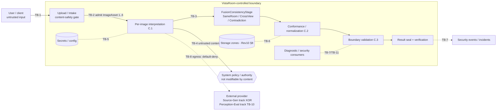

# VistaRoom AI — Security Architecture Baseline — Revision 1

## 1. Document Control

```text
Document title:            VistaRoom AI — Security Architecture Baseline
Document type:             Normative Architecture Specification
Revision:                  1
Status:                    ACCEPTED — PROJECT OWNER NURLAN — 2026-08-04
Project:                   VistaRoom AI
Project Owner:             Nurlan
Primary Active Module:     Bounded Room Understanding / Spatial Perception
Strategic Track:           Track A — Spatial Perception
Canonical filename:        Security-Architecture-Baseline-Rev1.md
Preparation date:          2026-08-04
Repository/safe-copy boundary:
    C:\Users\user\Documents\Cowork\VistaRoom-AI-Safe-2026-08-01
    (safe copy; not a Git repository; read-only for all files except this one)
```

Document identity note. This document is a first full architectural draft prepared under a direct Project Owner authorization for a separate governance cycle (Section 4). It is implementation-neutral: it selects no vendor, provider, product, library, storage technology, or deployment mechanism. It authorizes no implementation, no provider contact, no governed-data exposure, and no repository action. It is a normative security architecture specification, not a code security audit, not a penetration-test report, and not an implementation plan.

Companion boundary and independence. Security and Diagnosability are **two distinct architectural concerns that operate independently at runtime** (Section 23). This document is the security-side companion to the **AI Brain Diagnosability Architecture — Revision 1** (`AI-Brain-Diagnosability-Architecture-Rev1.md`, DRAFT, preparation date 2026-08-03), which delegates the security semantics of the shared *platform* identities, the security-event/incident taxonomy, the access-control policy, provider-boundary security controls, and the final data classification/retention/encryption policy to this Security Architecture Baseline (its Sections 21, 22, 25, 26; DIAG-SEC-001, DIAG-SEC-002, DIAG-ID-013). Per the Project Owner decision governing this cycle (Section 4), the two concerns are **fully independent at runtime with no direct event-to-event or event-to-incident references between them**. A Security Event and a Security Incident carry **no** `diagnosticEventId` and never require, create, or cite a Diagnostic Event; correlation between the concerns is permitted **only** through neutral platform-owned or source-contract identities. The `securityIncidentReferenceId` hook that the Diagnosability Rev1 document holds forward (DIAG-SEC-001, DIAG-ID-013) is **not** activated or used by Security as a runtime contract in this baseline; it is recorded as unused-by-Security and left for verification in the future governance cross-check (Section 23). The Diagnosability document is referenced here only for responsibility boundaries, independence proof, source traceability, governance compatibility, and to describe the prohibited dependency — never as a runtime reference. A separate, still-unperformed **Diagnosability ↔ Security governance cross-check** (Roadmap Amendment 2026-07-16; XSEC-06) is the authorized place where compatibility of the two documents is verified; this document neither performs nor pre-empts it, and the cross-check is a governance compatibility check, not a runtime dependency.

Correction-cycle note. This exact byte identity of Revision 1 is an in-place correction of the prior draft, applying independent-review findings SAB-R1-01 (BLOCKER — independent Security Event/Incident contract), SAB-R1-02 (BLOCKER — encryption/transport/backup baseline), SAB-R1-03 (MAJOR — access-control matrix), SAB-R1-04 (MAJOR — security-event sink-failure behavior), the stricter separation findings SAB-R1-05 (Owner decision — full removal of direct Security↔Diagnosability runtime references), SAB-R1-06 (MAJOR — undefined access role), SAB-R1-07 (MAJOR — sink durability/acknowledgement/recovery contract), SAB-R1-08 (MAJOR — deterministic incident merge/split), and the latest findings SAB-R1-09 (BLOCKER — provable event-obligation completeness + single `emission-failed` delivery-state semantics), SAB-R1-10 (MAJOR — one-meaning-per-key incident model, order-independent multi-target canonicalization, active/closed occurrence boundary), SAB-R1-11 (MAJOR — undefined access role removed and SEC-LOG-04/AS-16/AS-23 aligned), and the final narrow findings SAB-R1-12 (MAJOR — residual Security↔Diagnosability wording and `security/eng` role removed), SAB-R1-13 (BLOCKER — obligation-set finalization lifecycle and completeness proof), SAB-R1-14 (MAJOR — active-incident uniqueness and a single no-reopen model), under a direct Project Owner instruction (Section 4). The revision number is unchanged (Revision 1, in place); no new revision, copy, or backup is created.

---

## 2. Purpose

This Security Architecture Baseline establishes the normative security specification for the current Primary Active Module — Bounded Room Understanding / Spatial Perception — and a minimally sufficient, forward-compatible security foundation for the wider platform.

Its purpose is to:

1. establish the protected assets, security invariants, and trust boundaries of the current bounded runtime;
2. define a provable threat model for that bounded runtime;
3. establish mandatory, implementation-neutral security controls and safe-failure behavior;
4. define independent security identity, event, incident, access-control, encryption, and provider-boundary contracts;
5. establish that Security and Diagnosability are independent runtime concerns that correlate only through neutral platform identities, never through a runtime dependency;
6. preserve the Hard Security Stop as a controlling boundary;
7. remain consistent with the Test Data Handling Decision Rev10 (including its §10 encryption requirements) and the accepted Supporting Contracts 1–10;
8. complement, without creating a runtime dependency on, the boundary that the AI Brain Diagnosability Architecture Rev1 leaves for the Security Architecture, and provide a sufficient basis for the separate, later Diagnosability ↔ Security governance cross-check;
9. select no technology, vendor, provider, storage product, or deployment mechanism;
10. authorize no implementation, provider invocation, credential use, governed-data exposure, or external execution.

The document is written so that every normative `MUST` statement is verifiable: each carries a stable requirement identity, a source, a verification method, and either an acceptance scenario or a review criterion, or an explicit Open Owner Decision flag where source authority is insufficient.

---

## 3. Authority and Source Hierarchy

### 3.1 Source hierarchy

This document resolves any conflict between sources using the following precedence (highest first):

1. the latest explicit Project Owner decision — here, the direct Project Owner authorization for this Security Architecture Baseline governance cycle (Section 4);
2. Project Context v2.4 (sole active canonical Project Context, in-place-updates-only);
3. Living Strategic Roadmap v1.4, including the Owner-Approved Roadmap Amendment (2026-07-16, the sole normative source of the Hard Security Stop and of the mandatory Diagnosability/Security sequence) and the Module-Completion-First Amendment Revision 5;
4. Module Completion and Sequencing Policy Revision 4;
5. accepted Bounded Scope, Evaluation, Test Data Handling, and Module Applicability decisions (Candidate A Bounded Scope Decision Rev5; Evaluation Threshold and Acceptance Plan Rev16; Test Data Handling Decision Rev10; Module Applicability Profile Rev19);
6. accepted ADRs (ADR-013, ADR-014, ADR-015 and the frozen ADR-000–ADR-006 baseline), Supporting Contracts 1–10 and their Candidate Locks C1–C10, and the Contracts 1–10 Atomic Package Acceptance;
7. Full-Platform Vision Architecture Rev5 and Consolidated Feature Vision Rev5.

Where a synchronization copy inside a lower-tier document diverges from its normative source, the normative source controls, and a Documentation Synchronization Stop applies to the divergence (Roadmap Amendment Rev5 §A.10–A.11); the stricter applicable boundary is preserved until the divergence is resolved.

### 3.2 Status discipline

This document distinguishes Accepted, Proposed, Deferred, Superseded, Historical, and Missing source states. It does not use a Proposed or Historical statement as an accepted decision, and does not treat a Missing document as an existing prerequisite. Where a required decision is not established by an accepted source, the document records `Insufficient source authority — Project Owner decision required` rather than inventing it, and raises the matter in Section 28 (Open Owner Decisions).

### 3.3 Recorded source-state observations (provenance, non-blocking for this drafting cycle)

- **SEC-CTX-OBS-1.** Project Context v2.4 (2026-07-29) §1/§16 records the Security Architecture Baseline as `NOT AUTHORIZED, NOT OPENED`, blocked pending Contracts 9–10 acceptance. The direct Project Owner authorization in Section 4 postdates that state and, per §3.1 tier 1, supersedes that specific non-authorization for the preparation, self-review, and correction of this document only. All other non-authorization boundaries in Project Context v2.4 §16 remain in force.
- **SEC-CTX-OBS-2.** The Contracts 1–10 Atomic Package Acceptance is dated 2026-07-31 and the AI Brain Diagnosability Architecture Rev1 is dated 2026-08-03 — both later than Project Context v2.4's last in-place reconciliation (2026-07-29), which still shows Contracts 9–11 as `NOT OPENED`. This document treats Supporting Contracts 1–10 as Owner-accepted (atomic package, 2026-07-31) and the Diagnosability Architecture Rev1 as an existing DRAFT, consistent with the latest Owner decisions (§3.1 tier 1) and with the Diagnosability Rev1 source baseline, which itself cites Candidate Locks C1…C10. Project Context v2.4's in-place synchronization of this fact is a documentation matter outside this document's scope; it is recorded here for provenance only and does not change any requirement.

---

## 4. Direct Project Owner Authorization

Project Owner Nurlan has directly authorized a separate governance cycle:
**VistaRoom AI — Security Architecture Baseline — Revision 1.**

The authorization permits:

- creation of the first full architectural draft of this document;
- deep author self-review of the created document;
- correction of all proven defects in the same document;
- repeated internal review/correction cycles within this single file;
- a final readiness check of the document for a later independent consolidated review.

The authorization explicitly does **not** mean, and this document does not perform or imply, any of the following:

- Project Owner acceptance of this document;
- an independent consolidated review by another reviewer;
- completion of the mandatory Diagnosability ↔ Security cross-check;
- modification of any previously accepted document;
- creation of any additional assessment, compatibility, governance, review, or implementation artifact;
- preparation of the Phase-1 Scope Decision / Execution Profile;
- preparation of Rev10 §22 data-governance artifacts;
- work with real user data;
- contact with, or invocation of, external AI providers;
- use of working credentials;
- disclosure of governed data to any external provider;
- creation of any corpus or fixtures;
- implementation, deployment, or production activation;
- transfer of this file to the main Git repository;
- any commit or push.

Where an older source states that the Security Architecture Baseline is not yet authorized, this direct Project Owner instruction supersedes that restriction **solely** for the preparation, self-review, and correction of this document. Every other non-authorization boundary remains in force (Section 6, Section 32).

---

## 5. Scope

### 5.1 In scope

This document specifies security architecture for the current bounded runtime model:

```text
Operation
  └── RoomCase [exactly 1]
        ├── ImageAsset [1..6]   (captureSetId binds the set; imageAssetId ↔ sourceAssetId, 1:1:1)
        └── one consolidated PerceptionResult
```

In scope are the security invariants, protected assets, trust boundaries, threat model, and controls for:

- admission and content-safety handling of `ImageAsset[1..6]` into a single `RoomCase`;
- the per-image interpretation (C.1), fusion-consistency stage, candidate conformance/normalization (C.2), and boundary validation (C.3) boundaries, treated as security trust boundaries, not as internal module design;
- the untrusted-content and prompt-injection boundary around any AI/VLM interpretation;
- security identity, authentication and authorization boundaries reusing existing identities;
- secrets and configuration security;
- the external-provider security boundary for the two governance tracks (Source-Generation Provider; Perception Evaluation Provider), preserving default-deny and the Hard Security Stop;
- integrity, provenance, and sealing of results and evidence;
- the Security Event model, Security Incident model, and safe-failure/recovery behavior;
- logging, diagnostics privacy, and redaction on the security side;
- the security-side of the Security ↔ Diagnosability runtime-independence boundary and the preserved governance cross-check.

Permitted source classes for any data referenced by this architecture are exactly the three accepted classes: **licensed, synthetic, and deliberately staged** data (Test Data Handling Decision Rev10, §2 item 3, §4). Real-user photographs and production personal data are prohibited (Section 6, Section 17).

### 5.2 Current-requirements / compatibility-hook / future-decision separation

This document separates three layers and never presents one as another:

- **Current requirements** — normative `MUST` statements binding on the current bounded runtime.
- **Compatibility hooks** — minimally sufficient forward-compatible boundaries required so that future platform capabilities do not force security rework (Bounded Scope Rev5 §8F; Full-Platform Vision Rev5 §15.3). A compatibility hook is not a built control and is not represented as one.
- **Future decisions** — explicitly deferred to a named future governance cycle (e.g. Selected-Provider Privacy/Retention Decision; Phase-1 Scope Decision / Execution Profile; Rev10 §22 data-governance artifacts; full Controlled Learning Architecture; Track H Platform Operations).

The document does not represent any future capability or control as already implemented, verified, or authorized.

---

## 6. Non-Scope and Non-Authorization

### 6.1 Non-scope (owned elsewhere)

This document does not design, and must not be read as designing:

- the internal architecture of any module or track outside the current bounded scope (Tracks B–H internal architecture);
- the full Platform Operations Architecture — runtime orchestration, model/provider routing, queues, retry scheduling/backoff, rate limits, observability/operational telemetry transport, alert routing, deployment/rollback mechanisms, cost controls, backups/disaster recovery, and production supportability are **owned by Track H — Platform Operations** (Full-Platform Vision Rev5 §14). Security integrates with Track H but does not replace or design it (§14.1);
- the diagnostic failure-class registry, the Diagnostic Event schema, or evidence/provenance ownership — these are owned by the AI Brain Diagnosability Architecture and by Supporting Contracts 1–10;
- the semantic contracts themselves (Supporting Contracts 1–10) — this document references their locked identities and must not redefine them;
- the exact field names, JSON serialization, or envelope structure of any artifact — these are Contract 10's downstream responsibility (Test Data Handling Rev10 §3.3.0);
- the full Controlled Learning Architecture;
- the Selected-Provider Privacy/Retention Decision (post-selection, runtime) and any real-user-data runtime handling.

### 6.2 Non-authorization

Consistent with Project Context v2.4 §16 and every cited source, this document authorizes none of the following, and its acceptance (when and if granted) would not authorize them:

- provider/model contact, invocation, evaluation, or selection (either governance track);
- governed-data exposure to any external provider;
- use of any real, working, or production credential, key, token, or secret;
- corpus creation, fixture creation, synthetic corpus generation, or staged capture;
- Tier 1 Corpus Preparation, Rev10 §22 data-governance artifacts, held-out sealing;
- the Combined Diagnosability & Security Compatibility Assessment, the retrospective compatibility pass, the Phase-1 Scope Decision / Execution Profile, or the Diagnosability ↔ Security cross-check;
- real-user-data use;
- Layer 2 effective activation; `active_locked` transition for any category;
- Implementation Package, implementation, deployment, or production activation;
- repository persistence, commit, push, or transfer of this file to the main repository.

---

## 7. Security Context and Architectural Principles

### 7.1 Security context

The current runtime accepts untrusted image and text content, admits 1–6 `ImageAsset` objects into exactly one `RoomCase`, interprets them (potentially via an external VLM/AI provider whose invocation is not yet authorized), fuses them into one consolidated `PerceptionResult`, and validates that result against locked conformance contracts. The dominant security concerns are therefore: untrusted input admission and content safety; prompt-injection and instruction/data confusion across image, text, metadata, and provider output; isolation between distinct `RoomCase`/`Operation` executions; provenance and evidence integrity; secrets confinement; and the external-provider boundary under a controlling Hard Security Stop.

The absence of probabilistic components in any part of the runtime does not make security requirements inapplicable (Policy Rev4 §12.3). Non-applicability of any security, privacy, or data-governance requirement requires a documented rationale, a risk assessment, and Project Owner acceptance (Policy Rev4 §12.4); this document claims no such non-applicability.

### 7.2 Architectural principles

The architecture is governed by: deny-by-default; least privilege; data minimization; reference-over-copy; safe failure (fail-safe, never fail-open); provider neutrality (no vendor is the architecture owner); trusted/untrusted input separation; provenance-and-integrity preservation; **concern independence** (Security and Diagnosability are separate concerns with no runtime dependency on each other — Section 23); and the `LEARNING-READY / NOT LEARNING-ACTIVE` boundary (a security event or diagnostic is never a training signal or an automatic production change).

### 7.3 Security invariants

Each invariant states its area of application, its prohibited state, its mandatory behavior, and a verifiable criterion. Invariants are normative and are traced in Section 31.

**SEC-CTX-INV-01 — Confidentiality.**
Area: all protected assets (Section 8). Prohibited state: a protected asset is readable by an actor or boundary not granted access to it. Mandatory: access to a protected asset MUST require an explicit grant matched to its classification; unclassified access is denied. Verifiable: for each asset class, an access attempt without a matching grant is denied and recorded (Acceptance Scenario AS-16).

**SEC-CTX-INV-02 — Integrity.**
Area: images, derivatives, evidence, structured results, seals, configuration and audit records. Prohibited state: an accepted artifact is mutated after it is fixed, or a mutation is undetectable. Mandatory: integrity-relevant artifacts MUST be referenced by identity and approved hash; post-fixation mutation MUST be detectable and MUST invalidate the affected artifact. Verifiable: a post-seal mutation is detected and produces a Hard Security Stop (AS-14, AS-15).

**SEC-CTX-INV-03 — Security-relevant availability.**
Area: security controls, audit/security-event recording, and safe-failure paths. Prohibited state: a security control or its safe-failure path is silently bypassed because a dependency is unavailable. Mandatory: if a security-relevant recording or control dependency is unavailable, processing MUST fail safe (deny/quarantine/stop), never fail open. Verifiable: an unavailable security-event sink does not convert an unsafe result into an accepted one, and Security continues when Diagnosability is unavailable (AS-24, AS-25).

**SEC-CTX-INV-04 — Authenticity and authority.**
Area: inputs, provider responses, configuration identities, and access decisions. Prohibited state: an artifact or action is accepted without an established, authorized identity, or authority is assumed from unauthenticated content. Mandatory: every security-relevant action MUST resolve to an authorized identity and configuration; identity/authority claims carried inside untrusted content MUST NOT grant authority. Verifiable: an action lacking a resolvable authority is denied (AS-07, AS-10).

**SEC-CTX-INV-05 — RoomCase / Operation / track isolation.**
Area: all per-execution artifacts and provider-governance tracks. Prohibited state: evidence, identity, authorization, clearance, or configuration of one `RoomCase`/`Operation`/provider-track is used by another. Mandatory: every per-execution artifact MUST bind to its `operationId`/`roomCaseId` and, where applicable, its `imageAssetId`/`contributingImageAssetIds[]`; cross-binding MUST be rejected; one provider track's authorization/clearance/configuration/exposure record MUST NOT be used by the other. Verifiable: cross-`RoomCase` evidence is rejected (AS-05) and wrong-track use raises an incident (AS-08).

**SEC-CTX-INV-06 — Provenance and evidence integrity.**
Area: `PerceptionEvidenceArtifact`, provenance categories, claim-to-image lineage. Prohibited state: a claim exists without traceable evidence, or a source/evidence/fixture identity is fabricated, or a contradiction is silently discarded. Mandatory: every claim MUST trace to the specific `imageAssetId`(s) that produced it; source/evidence/fixture identity MUST never be fabricated; unresolved contradictions MUST be preserved. Verifiable: an evidence artifact referencing a non-existent source identity is rejected (AS-05, AS-13).

**SEC-CTX-INV-07 — Least privilege.**
Area: all access roles and credentials. Prohibited state: an actor or credential holds authority beyond what its function requires. Mandatory: access grants and credential scopes MUST be the minimum required for the function. Verifiable: each role's grant set is bounded to its function in the access-boundary matrix (Section 9, Section 26).

**SEC-CTX-INV-08 — Deny-by-default.**
Area: all access, egress, provider invocation, and classification decisions. Prohibited state: absence of an explicit decision is treated as permission. Mandatory: any access, egress, invocation, or unknown-classification decision MUST default to deny/quarantine. Verifiable: an unclassified artifact is quarantined, not used (AS-06 pattern; Section 8 SEC-DATA-UNK).

**SEC-CTX-INV-09 — Data minimization.**
Area: provider payloads, diagnostics, security events, error messages. Prohibited state: more data than necessary is transmitted, stored, or disclosed. Mandatory: only the minimum required payload MUST be sent to a provider; security records and errors MUST carry the minimum necessary content by reference. Verifiable: a provider payload and a security event contain no field not required for their purpose (Section 16, Section 19, Section 21).

**SEC-CTX-INV-10 — Reference-over-copy.**
Area: all security, audit, and diagnostic records. Prohibited state: a record embeds a raw governed payload, secret, or held-out ground truth. Mandatory: records MUST reference assets by identity and approved hash rather than copying payloads. Verifiable: no security/audit record contains a raw image payload, secret, or held-out answer (Section 17, Section 21).

**SEC-CTX-INV-11 — Safe failure.**
Area: every failure, timeout, cancellation, and unknown-outcome path. Prohibited state: a failure produces a fabricated result, weakens validation, or hides a violation behind a fallback. Mandatory: on any security-relevant failure the system MUST reach a defined safe state (reject/quarantine/insufficient-evidence/stop) without fabricated certainty and without weakening validation. Verifiable: a provider failure does not weaken validation or produce a fabricated fallback (AS-11, AS-13; Section 24).

**SEC-CTX-INV-12 — No secret or sensitive-payload disclosure.**
Area: prompts, logs, diagnostics, evidence, user-facing errors, provider payloads. Prohibited state: a secret, credential, token, prohibited personal data, held-out ground truth, or raw sensitive payload appears in any of these. Mandatory: these MUST never be placed in prompts, logs, diagnostics, evidence, user-facing errors, or unnecessary provider payloads. Verifiable: redaction checks and payload minimization prevent disclosure (AS-17; Section 15, Section 21).

**SEC-CTX-INV-13 — No unauthorized external egress.**
Area: all outbound transfer to external providers or services. Prohibited state: governed data leaves the VistaRoom-controlled boundary without the applicable authorization and clearance. Mandatory: external egress MUST be denied unless the applicable provider-track authorization and clearance exist and the Hard Security Stop is satisfied. Verifiable: an egress attempt without authorization/clearance is prevented (AS-07; Section 16, Section 22).

**SEC-CTX-INV-14 — Immutable audit/security trace where required.**
Area: security events, incidents, access decisions, integrity and deletion records. Prohibited state: a required security trace is missing, mutable in place, or silently suppressed. Mandatory: required security traces MUST be append-only and tamper-evident; corrections create linked corrective entries rather than overwriting history; a suppressed or failed emission MUST NOT convert an unsafe result into an accepted one. Verifiable: an attempt to overwrite or suppress a required trace is itself a recordable incident (Section 19, Section 20; AS-18).

**SEC-CTX-INV-15 — Learning-ready, not learning-active.**
Area: all security events, incidents, and diagnostics. Prohibited state: a security signal is used as a training signal or triggers an automatic production-behavior change. Mandatory: security events/incidents MUST NOT feed model/rule/prompt mutation, provider selection, or automatic production change; they MUST preserve versioned, reproducible, immutable history only. Verifiable: no security-event path connects to an automatic production-mutation path (Section 25; Project Context v2.4 §10.6).

---

## 8. Protected Assets and Classification

### 8.1 Classification model (referenced, not redefined)

This section reuses the classification model of Test Data Handling Decision Rev10 and does not create parallel definitions of existing categories. The controlling normative definitions are:

- the four identity classes (Rev10 §3.3): operation-scoped, evaluation-run-scoped, corpus-scoped, governance/audit-scoped;
- the six independent classification dimensions (Rev10 §17.1B): artifact type; population kind; data subset (`development | held-out | none`); protection classification (`ordinary | restricted | held-out-sensitive`); retention class (Rev10 §17.1, eight classes); handling status (`active | quarantined | incident-under-review | invalidated | retired | deleted`);
- the strictest-inheritance rule (Rev10 §17.1B): every derivative inherits the strictest protection classification present in its lineage, and this inheritance is never weakened by a change in handling status (an incident never downgrades `held-out-sensitive` to `restricted` or `ordinary`);
- the default-deny/quarantine rule for unknown or unclassified artifacts (Rev10 §3.3.6).

The security requirements below attach security semantics (access boundary, egress boundary, integrity, safe-failure) to these categories; they do not restate or alter the categories themselves.

### 8.2 Cross-cutting asset requirements

**SEC-DATA-01 (protection binding).** Every protected asset MUST carry, or resolve by identity to, its Rev10 §17.1B classification dimensions before it is accessed, transmitted, or retained. Source: Rev10 §17.1B. Verification: review + AS-16.

**SEC-DATA-02 (reference-over-copy).** Every security, audit, and diagnostic record referencing a protected asset MUST reference it by identity and approved hash, never by embedded payload copy. Source: Rev10 §18; Diagnosability Rev1 DIAG-DATA-001. Verification: AS-17, AS-19.

**SEC-DATA-03 (strictest inheritance).** A derived or output artifact MUST inherit the strictest protection classification in its lineage; an incident or other handling-status change MUST NOT weaken it. Source: Rev10 §17.1B. Verification: review + AS-06 pattern.

**SEC-DATA-UNK (unknown/misclassification behavior).** Any new, unknown, or unclassified artifact produced from governed data MUST be treated as automatically governed and immediately quarantined under the strictest protection classification inherited from any governed input, and MUST NOT be used, disclosed, further processed, or deleted outside the incident-and-classification procedure until it is formally classified. Treating an unclassified artifact as out of scope is prohibited. Source: Rev10 §3.3.6, §17.1B. Verification: AS-06 pattern; Section 20.

**SEC-DATA-EGRESS (external-disclosure default).** For every asset class, external disclosure is deny-by-default and is permitted only under the applicable provider-track authorization and clearance, subject to the Hard Security Stop, with held-out ground truth absolutely non-disclosable to an evaluated provider (Section 16, Section 17, Section 22). Source: Rev10 §16.1, §16.4; Roadmap Amendment 2026-07-16. Verification: AS-07, AS-09.

**SEC-DATA-SECRET (secret exclusion).** Storage credentials, provider keys, and encryption secrets MUST never be placed in corpus manifests, annotations, prompts, evidence, diagnostics, security records, user-facing errors, or repository documents. Source: Rev10 §9.4, §21; Diagnosability Rev1 DIAG-DATA-003. Verification: AS-17; Section 15.

### 8.3 Protected asset register

For each applicable asset class: owner/source authority; protection default; permitted reference and prohibited copy; access boundary; retention/deletion attachment point; external-disclosure boundary. Retention **durations are not set by this document** (Rev10 §17.1A, §17.2: durations are delegated to Layers 1/2A/2B/3 and are not invented here). The attachment point named below is where a future Rev10 §22 Retention and Deletion Schedule attaches; it is not itself a duration.

| Asset class | Owner / source authority | Protection default | Reference / copy rule | Access boundary | Retention/deletion attachment point | External-disclosure boundary |
|---|---|---|---|---|---|---|
| Source & derived images (`ImageAsset`, preprocessed image, canonical geometry, masks/crops/polygons, thumbnails) | Data eligibility authority; Rev10 §3.1, §3.3.1 | restricted (held-out-sensitive if lineage touches held-out) | reference by `imageAssetId`/`sourceAssetId` + hash; no copy into security/diagnostic records | CorpusPreparer/EvaluationExecutor per zone; deny-by-default | Rev10 §17.1 `source-original`/`development-working`; Layer 1 | deny-by-default; provider payload minimized (Section 16) |
| Metadata, EXIF, geolocation | Rev10 §7.1 (prohibited personal data), §3.3.1 | restricted; geolocation/personal identifiers prohibited-personal-data | inspect then remove; never copied onward | intake/preprocess boundary only | quarantine/deletion on detection (Section 12) | never disclosed |
| Diagnostic crops / diagnostic input crop | Rev10 §3.3.1 | inherits source classification | reference by identity; minimal | restricted diagnostic access | with source | not disclosed beyond boundary |
| Request payloads (assembled provider request) | Rev10 §3.3.1 | restricted | reference + hash; minimized content | EvaluationExecutor; provider boundary | operation-scoped | only under authorization+clearance |
| Raw provider outputs | Rev10 §3.3.1 | restricted; untrusted until validated | reference + hash; not trusted as fact | EvaluationExecutor | operation-scoped | inbound only; not re-egressed |
| `VlmSceneCandidate` / `FusedRoomCandidate` | ADR-014; Rev10 §3.3.1 | restricted | reference by identity | pipeline C.1→C.2 boundary | operation-scoped | not disclosed |
| `StructuredSceneV0` | ADR-013; Rev10 §3.3.1 | restricted | reference by identity; schema-conformant | C.2→C.3 boundary | operation-scoped | not disclosed |
| `PerceptionEvidenceArtifact` | Perception Mechanism Rev3 Part M.2; Contract 4 | restricted; provenance-bearing | reference by identity; never becomes a log; never fabricated | evidence consumers; deny-by-default | operation-scoped | not disclosed |
| Prompt / configuration traces | Rev10 §3.3.1 | restricted; no secrets | reference; no secret content | restricted diagnostic access | operation-scoped | not disclosed |
| Evaluation reports / expected-outcome records | Rev10 §3.3.2, §3.3.3 | restricted; held-out-sensitive where held-out in scope | reference by identity | Auditor/EvaluationExecutor | evaluation-run/corpus-scoped | not disclosed to evaluated provider |
| Held-out ground truth (answers, annotations, expected outcomes, scoring records, answer-bearing manifests) | Rev10 §14.4, §15, §16.4 | **held-out-sensitive (absolute non-disclosure)** | reference; sealed; never in any provider payload | HeldOutCustodian; deny-by-default | `held-out-sealed`; Held-Out Data Seal | **absolutely non-disclosable to evaluated provider — no exception** |
| Credentials, secrets, tokens | Rev10 §9.4, §21 | secret — never persisted in governed artifacts | never referenced by content; identity only | controlled server boundary only | out of corpus/diagnostic scope | never disclosed |
| Security-restricted Diagnostic data (Diagnosability-owned; listed only for the classification boundary) | Diagnosability Rev1 §21/§22; this document specifies only the deny-by-default protection classification (SEC-LOG-04b) | restricted; deny-by-default | Diagnosability-owned; Security does NOT read, write, or cite it | runtime access owned and enforced by Diagnosability/Track H; Security confers no investigation authority over it | Diagnosability/Track H (owned there) | not disclosed to lower-privilege consumers |
| Provider exposure records (per track) | Rev10 §16.0.2, §16.5 | governance/audit-scoped; restricted | reference identities; no fabricated identity | Auditor; ProjectOwner | Rev10 §22 artifact 11 | internal governance only |
| Audit, deletion, incident records | Rev10 §18, §19; §17.4 | audit-log / incident-record; append-only | reference; tamper-evident | Auditor; ProjectOwner | Rev10 §17.1 `audit-log`/`incident-record` | internal governance only |
| Security Event records (identity `securityEventId`) | This document (Section 19) | restricted; security-restricted where sensitive; append-only | reference by identity; no diagnostic/payload copy | Auditor/IncidentCoordinator; deny-by-default | audit-log attachment point | internal governance only |
| Security Incident records (identity `securityIncidentId`) | This document (Section 20) | restricted; append-only; tamper-evident | reference by identity; links Security Events; no diagnostic reference | IncidentCoordinator/ProjectOwner | incident-record attachment point | internal governance only |
| Configuration / version identities (`sourceGenerationConfigurationId`, `developmentExecutionConfigurationId`, `configurationLockId`, `modelVersionId`, `ruleSetVersionId`, `contractVersionId`, `vocabularyVersionId`, `providerConfigurationVersionId`) | Rev10 §3.3.1, §16.0.1; Diagnosability Rev1 DIAG-ID-010/011/012 | restricted; immutable/versioned | reference by identity; no cross-track substitution | configuration custodian; deny-by-default | governance-scoped | cited, not exported |
| Result seals & verification (`sealId`/`sealRecordId`/`sealHash`; `resultSealId`; `SealVerificationResult`) | Contract 10 (`sealIntegrityReference`, `SealVerificationResult`); Rev10 §14.4.4 | restricted; integrity-critical | reference by identity/hash; non-circular ordering | integrity consumers | integrity records | internal governance only |

Identity-field naming note. The seal identity fields fixed by the accepted contracts are `sealId`, `sealRecordId`, and `sealHash` (Test Data Handling Rev10 §14.4). `resultSealId` and `SealVerificationResult` are the Diagnosability Rev1 aliases for Contract 10's `sealIntegrityReference` and `SealVerificationResult.verificationId` (Diagnosability Rev1 DIAG-ID, Section 19). This document uses these as references and mints no new seal identity.

Security-owned identities. This document owns exactly two security identities: `securityEventId` (identity of a Security Event, Section 19) and `securityIncidentId` (canonical identity of a Security Incident, Section 20). The `securityIncidentReferenceId` hook that Diagnosability Rev1 holds forward (DIAG-ID-013) is **not** a Security-owned runtime identity or contract in this baseline and is not used by Security; it is recorded as unused-by-Security and left for the future governance cross-check (Section 23). All other identities used by this document are neutral platform-owned or source-contract identities that Security only references and never redefines (Section 14, Section 23).

---

## 9. Actors, Authorities and Access Boundary

### 9.1 Actors and authorities (reused)

This document reuses the access roles defined by Test Data Handling Rev10 §9.1 and does not create parallel roles. The roles and their mapped governance functions are: `DataEligibilityReviewer`; `CorpusPreparer`; `Annotator`; `Adjudicator`; `HeldOutCustodian`; `EvaluationExecutor`; `Auditor`; `ProjectOwner`; with mapped functions ClearanceApprover → ProjectOwner/delegate, ConfigurationLockCustodian → HeldOutCustodian, IncidentCoordinator → Auditor, DeletionExecutor → CorpusPreparer (development) / HeldOutCustodian (held-out).

**SEC-AUTH-01 (role reuse).** Security access decisions MUST use the existing Rev10 §9.1 roles and mapped functions; this document MUST NOT introduce a duplicate or parallel role model. Source: Rev10 §9.1. Verification: review.

**SEC-AUTH-02 (least-privilege role scope).** Each role's grant set MUST be the minimum required for its function, and a role MUST NOT hold cross-role authority by default. Source: Rev10 §9.1; SEC-CTX-INV-07. Verification: Section 26 access-boundary matrix; review.

**SEC-AUTH-03 (unresolved-role safety).** Where the exact, complete runtime role-to-permission model is not yet an accepted decision, security access hooks MUST default to deny and MUST NOT assume any permission; the unresolved binding is recorded as an Open Owner Decision (Section 28) rather than resolved by assumption. Source: §3.2; SEC-CTX-INV-08. Verification: Section 28; review.

### 9.2 Access-decision requirements

**SEC-AUTH-04 (deny-by-default access).** Every access to a protected asset or restricted diagnostic MUST require an explicit grant matched to the asset's classification; absence of a grant is denial. Source: SEC-CTX-INV-01, INV-08; Diagnosability Rev1 §21. Verification: AS-16.

**SEC-AUTH-05 (recorded access decision).** Every security-relevant access decision MUST produce a decision outcome and a language-neutral reason (grant/deny + reason code), recorded to the append-only security trace where the asset is restricted or held-out-sensitive. Source: SEC-CTX-INV-14; Rev10 §18. Verification: AS-16; Section 19.

**SEC-AUTH-06 (cross-RoomCase/Operation rejection).** An access or binding request that would associate an artifact of one `RoomCase`/`Operation` with another MUST be rejected as an isolation violation. Source: SEC-CTX-INV-05; Bounded Scope Rev5 §8B. Verification: AS-05.

### 9.3 Access-control matrix

This matrix reuses the existing Rev10 §9.1 roles and mapped functions; it introduces no new authentication provider and no new human role. `IncidentCoordinator` is a function mapped to the `Auditor` role (Rev10 §9.1), not a new role. The matrix is expressed as `role/function × asset-action × grant/deny` with the governing attributes. It is implementation-neutral (no enforcement mechanism is selected); the exact runtime enforcement mechanism is the residual Open Owner Decision OOD-1/OOD-4, but the grant/deny policy below is fully determinable now and is deny-by-default for anything not listed as permitted.

| Asset / action | Permitted roles/functions | Prohibited (default-deny) | Approval authority | Purpose limitation | Classification boundary | Separation of duties | Audit obligation |
|---|---|---|---|---|---|---|---|
| Read ordinary source/derived images | CorpusPreparer, EvaluationExecutor, Auditor | any role without a zone grant; evaluated-provider operator function | CorpusPreparer grant per zone | corpus preparation / evaluation only | `restricted` | preparer ≠ auditor | access decision recorded if restricted |
| Read held-out-sensitive data (answers, annotations, expected outcomes, sealed subsets) | HeldOutCustodian; Auditor (audit-only, no export) | CorpusPreparer, EvaluationExecutor, Annotator, any provider-facing function | ProjectOwner / HeldOutCustodian | sealing, custody, audit only | `held-out-sensitive` — separate authority required | custodian ≠ evaluator; never the evaluated-provider operator | mandatory recorded decision |
| Read/write provider exposure records | Auditor, IncidentCoordinator(=Auditor), ProjectOwner | CorpusPreparer, Annotator | Auditor | governance/audit | governance/audit-scoped `restricted` | recorder ≠ approver | append-only audit |
| Read security-restricted Security Events (security investigation) | IncidentCoordinator(=Auditor); ProjectOwner within governance authority | ordinary engineering consumer; any unlisted role; evaluated-provider operator function | IncidentCoordinator authority | security investigation only | `security-restricted` — deny-by-default | investigator ≠ subject of investigation | mandatory recorded decision |
| Open / update / close a Security Incident | IncidentCoordinator(=Auditor) open+contain; ProjectOwner closure of held-out/real-data incidents | any unlisted role | IncidentCoordinator (open/contain); ProjectOwner (high-severity closure) | incident response | `restricted` | opener may contain; closure authority separated for high severity | append-only lifecycle trace |
| Grant/revoke access, rotate credentials | ProjectOwner / delegate | all other roles | ProjectOwner | credential lifecycle | secret boundary | approver ≠ credential user | mandatory recorded decision |
| Authorize provider invocation / clearance (either track) | ProjectOwner (ClearanceApprover=ProjectOwner/delegate) | all other roles; cross-track use | ProjectOwner | per-track authorization | per-track | approver ≠ executor | mandatory recorded decision |
| Execute deletion | DeletionExecutor = CorpusPreparer (development) / HeldOutCustodian (held-out) | any other role | per Rev10 §17.3 authority | authorized deletion only | per asset class | executor ≠ sole approver | deletion record (SEC-DATA-07) |

**SEC-ACCESS-01 (matrix authority).** Every access to a protected asset or action MUST be decided by the matrix above (or its accepted future refinement); anything not explicitly permitted is denied. Source: Rev10 §9.1; SEC-CTX-INV-08. Verification: AS-16, AS-21b, AS-26.

**SEC-ACCESS-02 (least privilege and purpose limitation).** A grant MUST be the minimum required for the stated purpose; access granted for one purpose MUST NOT be reused for another. Source: SEC-CTX-INV-07; Rev10 §9.1. Verification: AS-26; review.

**SEC-ACCESS-03 (held-out-sensitive separate authority).** Access to `held-out-sensitive` data MUST require a separate authority (HeldOutCustodian/ProjectOwner) and MUST NOT be inferred from any other grant. Source: Rev10 §9.3, §11.3, §16.4. Verification: AS-26.

**SEC-ACCESS-04 (separation of duties).** A single actor MUST NOT simultaneously hold conflicting authorities (e.g. HeldOutCustodian and evaluated-provider operator; incident investigator and subject of the investigation) by default. Source: Rev10 §9.1; SEC-CTX-INV-07. Verification: review; AS-26.

**SEC-ACCESS-05 (authorized investigation is enabled, not only denial).** An authorized `IncidentCoordinator`(=`Auditor`) MUST be able to obtain the minimum access needed to investigate a Security Incident, namely read access to the security-restricted **Security Events** linked to that incident and to the neutral platform identities it references; this positive grant is part of the policy, not only the denial of unauthorized access. Security investigation works from its own Security Events/Incidents and neutral platform identities and does NOT require access to Diagnostic Events. Source: Rev10 §9.1; SEC-INCIDENT requirements; Section 4. Verification: AS-26.

**SEC-ACCESS-06 (no break-glass unless sourced).** No emergency/break-glass override of the held-out non-disclosure rule or of the Hard Security Stop is authorized; none is defined by any accepted source, so none exists in this baseline. Any future break-glass mechanism is an Open Owner Decision. Source: Rev10 §16.4; Roadmap Amendment 2026-07-16; §3.2. Verification: AS-09; Section 28.

**SEC-ACCESS-07 (safe default on unresolved grant).** Where the exact runtime enforcement of a grant is not yet an accepted decision, the effective decision MUST be deny (for access/egress) or the stricter boundary; no permission is assumed. Source: §3.2; SEC-AUTH-13. Verification: Section 28.

Residual: the exact runtime enforcement mechanism (authentication provider, grant storage, token model) remains OOD-1/OOD-4. The grant/deny *policy* above does not require a new Owner Decision — it reuses accepted roles and deny-by-default; only the enforcement mechanism is deferred, and it is deferred safely (deny-by-default).

---

## 10. Trust Boundaries and Data Flows

### 10.1 Trust boundaries

The following trust boundaries are normative. Each is a point where data or control crosses from a less-trusted to a more-trusted domain (or vice versa) and where a control decision MUST occur.

- **TB-1** user/client input ↔ VistaRoom-controlled boundary;
- **TB-2** upload/intake ↔ admitted `ImageAsset`;
- **TB-3** preprocessing ↔ semantic interpretation (C.1);
- **TB-4** untrusted image/text/metadata/provider-output content ↔ system instructions and policy;
- **TB-5** runtime ↔ secrets and configuration;
- **TB-6** runtime ↔ data stores (the five Rev10 §8 storage zones: Intake Quarantine; Eligible Source Vault; Development Workspace; Held-Out Sealing Vault; Evaluation Output Vault);
- **TB-7** runtime ↔ diagnostic and security consumers (including the security-restricted deny-by-default boundary);
- **TB-8** VistaRoom ↔ external provider boundary (egress);
- **TB-9** development ↔ evaluation ↔ held-out zones;
- **TB-10** Source-Generation Provider track ↔ Perception Evaluation Provider track (track separation);
- **TB-11** engineering diagnostics ↔ security-restricted diagnostics;
- **TB-12** current module boundary ↔ future Track H / future Security runtime (compatibility boundary, not activated).

**SEC-TRUST-01 (decision at every boundary).** Every crossing of a trust boundary above MUST be a point of explicit control decision (admit/deny/quarantine/validate/redact/stop); no boundary may be crossed by default. Source: SEC-CTX-INV-08; Bounded Scope Rev5 §8F. Verification: threat-model controls (Section 11); acceptance scenarios.

**SEC-TRUST-02 (untrusted-content confinement).** Content crossing TB-4 (image bytes, embedded text, metadata, OCR/vision-derived text, provider output) MUST be treated as untrusted data on the less-trusted side and MUST NOT acquire instruction or authority status by crossing the boundary. Source: ADR-014 §4.5; Section 13. Verification: AS-04.

**SEC-TRUST-03 (track separation at TB-10).** The two provider-governance tracks MUST remain separate across TB-10: authorization, clearance, configuration identity, and exposure record of one track MUST NOT be used for the other. Source: Rev10 §16.0; Module Applicability Rev19 §11. Verification: AS-08.

**SEC-TRUST-04 (zone monotonicity at TB-6/TB-9).** Asset movement across storage zones MUST respect the accepted zone model; in particular no asset may move directly from Intake Quarantine to the Held-Out Sealing Vault. Source: Rev10 §8. Verification: review; Section 18.

### 10.2 Data-flow model (boundary view)

The diagram shows only trust boundaries and control points, not internal module computation. It is a boundary aid; the normative content is the boundary list (§10.1) and the requirements.



**SEC-TRUST-05 (egress is default-deny).** The TB-8 egress path MUST be default-deny and MUST NOT transmit governed data to any external provider without the applicable track authorization and clearance and satisfaction of the Hard Security Stop. Source: Rev10 §16.1; Roadmap Amendment 2026-07-16. Verification: AS-07.

---

## 11. Threat Model

The threat model is tied to the protected assets (Section 8) and trust boundaries (Section 10). STRIDE is used only as a completeness check (spoofing, tampering, repudiation, information disclosure, denial of service, elevation of privilege); it does not replace the asset/boundary analysis. Only realistic, applicable threats with a concrete attack path are included; theoretical threats without an applicable path are excluded, and severity is not inflated. Each threat gives: attacker/initiating condition; target asset/boundary; concrete attack path; preventive/detective control; safe-failure outcome; residual risk; verification scenario.

**THR-01 — Malicious or malformed upload.**
Condition: attacker submits a crafted or malformed file as an `ImageAsset`. Target: TB-2 intake; decoding boundary. Path: file that fails format/decoding or carries a hostile structure enters intake. Control: allowlisted types; extension/MIME/magic-byte consistency; size/dimension/decode limits; safe decoding isolation (Section 12); reject/quarantine with reason code. Safe failure: `UnsupportedInput` (pre-C.1, outside PerceptionResult family) or quarantine; no partial unauthorized use. Residual: novel decoder vulnerability in a not-yet-selected library (deferred to implementation). Verify: AS-02.

**THR-02 — MIME / content-type mismatch.**
Condition: declared type differs from actual content. Target: TB-2. Path: an executable or unexpected format is presented as an allowed image type. Control: magic-byte vs extension vs MIME consistency check; deny on mismatch. Safe failure: reject with structured reason; no interpretation. Residual: low. Verify: AS-02.

**THR-03 — Oversized / decompression-bomb payload.**
Condition: input designed to exhaust decode/memory. Target: TB-2 decoding; SEC-CTX-INV-03. Path: highly compressible or huge-dimension image. Control: file-count (≤6), byte-size, pixel-dimension, and decode-resource limits enforced before semantic interpretation. Safe failure: reject/`UnsupportedInput`; availability of security path preserved (fail-safe, not fail-open). Residual: resource-limit tuning deferred to implementation/Track H. Verify: AS-02 pattern.

**THR-04 — EXIF / geolocation / personal-metadata leakage.**
Condition: image carries geolocation or identifying metadata. Target: metadata asset class; TB-2→TB-8. Path: metadata retained and later copied into a derivative, diagnostic, or provider payload. Control: metadata inspection and removal at intake; prohibited-personal-data detection (Rev10 §7.1); reference-over-copy. Safe failure: metadata removed or asset quarantined; not egressed. Residual: low after removal. Verify: AS-03.

**THR-05 — Active-content / parser exploitation.**
Condition: embedded active content or parser-targeting payload. Target: decoding boundary TB-2. Path: crafted segment triggers parser misbehavior. Control: safe decoding/isolation boundary; treat all embedded content as inert data; no execution. Safe failure: reject/quarantine. Residual: implementation-dependent (sandbox/library choice deferred). Verify: AS-02 pattern; Section 12.

**THR-06 — Prompt injection via image, text, metadata, or provider output.**
Condition: untrusted content contains instructions ("ignore previous instructions", tool/authority directives). Target: TB-4; system policy and authority. Path: instruction text embedded in an image, caption, metadata field, OCR/vision-derived text, or a provider response is interpreted as a system/tool instruction. Control: all such content is untrusted data (SEC-TRUST-02); input content MUST NOT change system policy, authority, tool permissions, data-use eligibility, or egress policy (Section 13); instructions inside images/provider responses are never executed as system/tool instructions. Safe failure: instruction ignored; content processed only as data; observation event recorded. Residual: prompt-robustness of a not-yet-selected provider (deferred; validation boundary compensates). Verify: AS-04.

**THR-07 — Instruction / data confusion.**
Condition: ambiguity between content-as-data and content-as-instruction. Target: TB-4. Path: provider output or user text is treated as authoritative fact or command. Control: provider output is not trusted fact without validation/conformance (Section 13, Section 16); structured output passes Contracts and validation. Safe failure: unvalidated output rejected; no fabricated certainty. Residual: low with conformance validation. Verify: AS-04, AS-13.

**THR-08 — Cross-RoomCase / cross-Operation / cross-track binding.**
Condition: artifact of one execution is bound to another. Target: SEC-CTX-INV-05; TB-9/TB-10. Path: evidence, identity, clearance, or configuration reused across `RoomCase`/`Operation`/track. Control: identity binding to `operationId`/`roomCaseId`/`imageAssetId`; cross-binding rejection; provider-track separation. Safe failure: rejection or incident. Residual: low. Verify: AS-05, AS-08.

**THR-09 — Fabricated source / evidence identity.**
Condition: an artifact carries a source/evidence/fixture identity that was never issued. Target: provenance/evidence integrity. Path: `sourceAssetId`/`fixtureId`/evidence identity fabricated or set-valued. Control: identity never fabricated, never set-valued (Rev10 §3.3.0); claim-to-image lineage completeness at C.3 (ADR-015 §4.7). Safe failure: reject; incident (broken lineage / fabricated identity is a Rev10 §19 incident). Verify: AS-05, AS-13.

**THR-10 — Provenance tampering.**
Condition: provenance category or lineage altered. Target: `PerceptionEvidenceArtifact`; provenance categories. Path: a value's provenance (`visually-observed | user-provided | inferred | unknown/not-inferable`) is misrepresented, or lineage is edited. Control: provenance distinct from confidence and preserved (ADR-014 §4.6); immutable history; integrity references. Safe failure: invalidate affected artifact. Residual: low. Verify: AS-13; Section 18.

**THR-11 — Result substitution or post-seal mutation.**
Condition: a sealed result or evidence is replaced or mutated after sealing. Target: result seal; integrity. Path: post-seal mutation, evidence substitution, or self-referential hash mismatch. Control: seal by identity/hash with non-circular ordering (Rev10 §14.4.4); seal verification; post-seal mutation is a Hard Security Stop (Section 22). Safe failure: fail seal verification → Hard Security Stop; no "explain-around". Residual: very low. Verify: AS-14, AS-15.

**THR-12 — Unauthorized access to restricted diagnostics.**
Condition: a consumer without authorization reads `security-restricted` data (a security-restricted Security Event, or security-restricted Diagnostic data). Target: TB-7/TB-11. Path: restricted data is assumed accessible to ordinary engineering consumers. Control: for Security Events, deny-by-default enforced by Security per the Section 9.3 matrix; for Diagnostic data, the deny-by-default **classification** is specified here as a governance policy but enforced by Diagnosability/Track H (Security does not read Diagnostic Events — SEC-DIAG-02/06). Safe failure: access denied and recorded. Residual: runtime enforcement mechanism (OOD-1/OOD-4). Verify: AS-16, AS-26.

**THR-13 — Secret / credential leakage.**
Condition: a secret appears where it must not. Target: credentials asset class. Path: credential placed in prompt, log, diagnostic, evidence, error, or provider payload. Control: SEC-DATA-SECRET; redaction; payload minimization (Section 15, Section 21). Safe failure: emission blocked/redacted to reference-only; if detected in a stored record, incident + Hard Security Stop (Section 22). Verify: AS-17.

**THR-14 — Unauthorized provider invocation or egress.**
Condition: any attempt to contact/upload to an external provider. Target: TB-8 egress; Hard Security Stop. Path: governed data sent without the applicable track authorization and clearance. Control: default-deny (Rev10 §16.1); Hard Security Stop; egress recipient/authorization verifiable. Safe failure: invocation not sent; Hard Security Stop; incident. Residual: none within this bounded scope (invocation is unauthorized entirely). Verify: AS-07.

**THR-15 — Wrong provider-governance track.**
Condition: one track's authorization/clearance/configuration/exposure schema is used for the other. Target: TB-10. Path: e.g. a Perception-Evaluation authorization used to cover synthetic-source generation, or an Evaluation-Time Provider Exposure Clearance used where a Source-Generation clearance is required. Control: track separation (SEC-TRUST-03); wrong-track use is a data-governance incident, not a paperwork error (Rev10 §16.0). Safe failure: suspend workflow; quarantine artifacts; incident; Owner notification; no silent reclassification. Verify: AS-08.

**THR-16 — Held-out ground-truth disclosure.**
Condition: held-out answers/annotations/expected-outcomes are exposed to the evaluated provider. Target: held-out ground truth (absolute). Path: labels included in a provider payload, or answer-bearing manifest sent. Control: absolute non-disclosure (Rev10 §16.4, no exception); minimum-payload rule; seal excludes provider config. Safe failure: prevented; attempted disclosure is a recorded incident + Hard Security Stop. Verify: AS-09.

**THR-17 — Unauthorized provider retention / training.**
Condition: a provider may retain or train on submitted governed data. Target: governed data at TB-8. Path: provider with undefined/unacceptable retention or training-without-opt-out receives data. Control: provider ineligible for any governed-data exposure absent accepted opt-out/retention/deletion terms (Rev10 §16.3); due diligence covers retention, deletion, training/use, subprocessors, region, access, incident notification, auditability (Section 16). Safe failure: exposure not permitted. Residual: due diligence is a future, unauthorized step. Verify: AS-07 pattern; Section 16.

**THR-18 — Replay / duplicate submission / stale configuration.**
Condition: a request is replayed, duplicated, or uses stale configuration. Target: idempotency; consumption ledger; configuration identity. Path: duplicate provider submission risks a hidden second governed-data exposure; stale/mismatched configuration bound to a run. Control: retry does not create hidden re-exposure (Section 16, Section 24); consume-on-first-inference and permanent non-reuse (Rev10 §14.4.3, §15.2A); configuration binding from the moment of submission (Rev10 §3.3.1). Safe failure: duplicate/replay detected; run invalidated if bound incorrectly. Verify: AS-12.

**THR-19 — Audit / security-event suppression or tampering.**
Condition: a required security trace is suppressed or overwritten. Target: audit/security trace; SEC-CTX-INV-14. Path: emission failure hidden, or record overwritten in place. Control: append-only tamper-evident trace; corrections are linked corrective entries; suppressed/failed emission does not convert an unsafe result to accepted. Safe failure: the suppression/failure is itself recordable and does not weaken outcomes. Verify: AS-18.

**THR-20 — Dependency / configuration integrity (bounded).**
Condition: a configuration or dependency integrity risk within the current module boundary. Target: configuration identities; integrity. Path: unknown/revoked/expired configuration or credential state used. Control: revoked/expired/unknown state → safe failure (Section 15); immutable/versioned configuration identity; configuration change creates a new identity. Safe failure: safe denial; no use of unknown-state configuration. Residual: broader supply-chain integrity is Track H / implementation territory (deferred). Verify: AS-10.

STRIDE completeness note. Spoofing → THR-06/07/09/14/15; Tampering → THR-10/11/19/20; Repudiation → THR-19 (append-only trace); Information disclosure → THR-04/12/13/16/17; Denial of service (security-relevant) → THR-03 and SEC-CTX-INV-03 (broader availability is Track H); Elevation of privilege → THR-06/08/12/15. No STRIDE category is left without an applicable mapped threat within the bounded scope.

Malware / active-content coverage. Malware and active content arriving through the only external input the current runtime accepts — an uploaded image file — are covered by THR-01 (malicious/malformed upload), THR-02 (type spoofing), THR-03 (decompression bomb), and THR-05 (active-content/parser exploitation), with controls in Section 12 and safe decoding isolation. The current module has no other file-ingest, executable-download, or code-execution surface.

Phishing / social-engineering scope boundary (future compatibility, correct owner). Within the current bounded runtime the only "social-engineering"-style vector with a real technical entry is adversarial instruction content embedded in untrusted input aimed at the model — this is prompt injection and is fully covered by THR-06/07 and Section 13. Human-directed phishing, email security, endpoint protection, credential-phishing of operators, and organization-wide malware response have **no direct technical entry into this image-perception module**; they belong to future platform-wide operational security and organizational security, owned by **Track H — Platform Operations** and organizational security governance, not by this module. This baseline records them as a future compatibility boundary and does **not** design an enterprise phishing/endpoint/email-defense architecture here (that would be scope expansion and security theater). This assignment adds no new Track and no new document.

---

## 12. Input and Upload Security

Requirements are implementation-neutral: no antivirus product, sandbox technology, cloud service, or decoding library is selected.

**SEC-INPUT-01 (allowlisted input types).** Admission MUST accept only allowlisted input types; any type not on the allowlist is denied. Source: THR-01/02; ADR-014 §4.2. Verification: AS-02.

**SEC-INPUT-02 (extension/MIME/magic-byte consistency).** Admission MUST verify consistency between declared extension, declared MIME type, and actual magic-byte content, and MUST deny on mismatch. Source: THR-02. Verification: AS-02.

**SEC-INPUT-03 (count/size/dimension/decode limits).** Admission MUST enforce file count (1–6 per `RoomCase`), byte size, pixel dimensions, and decode-resource limits before any semantic interpretation. Zero or more than six `ImageAsset` objects MUST produce `UnsupportedInput` (pre-C.1, outside the PerceptionResult family). Source: Bounded Scope Rev5 §5B, §8A; THR-03. Verification: AS-02.

**SEC-INPUT-04 (safe decoding / isolation).** Image decoding MUST occur within a safe decoding/isolation boundary, treating all embedded content as inert data with no execution. Source: THR-01/05. Verification: Section 11; review.

**SEC-INPUT-05 (metadata inspection and removal).** Admission MUST inspect metadata and remove EXIF, geolocation, and identifying personal metadata (Rev10 §7.1) before an image is used downstream or referenced in any derivative. Source: THR-04; Rev10 §7.1. Verification: AS-03.

**SEC-INPUT-06 (quarantine / reject outcomes).** A non-admissible input MUST result in a defined quarantine or reject outcome, distinct from a valid processing outcome, and MUST NOT be partially used. Source: SEC-CTX-INV-11; Rev10 §8 Intake Quarantine. Verification: AS-02.

**SEC-INPUT-07 (no partial unauthorized use on rejection).** On rejection, no part of the rejected payload may be forwarded to interpretation, fusion, provider egress, or persistent storage beyond the minimal quarantine/audit reference. Source: SEC-CTX-INV-09/10. Verification: AS-02.

**SEC-INPUT-08 (structured reason codes).** Every admission decision MUST carry a structured, language-neutral reason code; user-facing messages are derived and redacted (Section 21). Source: Diagnosability Rev1 DIAG-CTX-006; Section 21. Verification: AS-17.

**SEC-INPUT-09 (minimal admission audit without prohibited payload copy).** Admission MUST record a minimal audit trace by identity/hash and reason, without copying a prohibited or unnecessary payload. Source: SEC-CTX-INV-10; Rev10 §18. Verification: AS-19; review.

---

## 13. AI and Prompt-Injection Security Boundary

This section fixes the untrusted-content boundary around any AI/VLM interpretation. It does not design an agent runtime or the Controlled Learning Architecture.

**SEC-AI-01 (untrusted content).** User text, images, metadata, OCR/vision-derived text, and provider output MUST be treated as untrusted data. Source: SEC-TRUST-02; ADR-014 §4.5. Verification: AS-04.

**SEC-AI-02 (no policy mutation by content).** Untrusted input content MUST NOT change system policy, authority, tool permissions, data-use eligibility, or egress policy. Source: THR-06; Project Context v2.4 §10.6. Verification: AS-04.

**SEC-AI-03 (secrets never in prompt/diagnostic).** Secrets and credentials MUST NOT be placed in any prompt or diagnostic payload. Source: Rev10 §9.4; Diagnosability Rev1 DIAG-DATA-003. Verification: AS-17.

**SEC-AI-04 (provider output not trusted fact).** Provider output MUST NOT be treated as trusted fact without passing the validation/conformance boundary; structured output MUST pass the accepted Contracts and validation (Contract 10 zero-tolerance conformance). Source: ADR-014 §4.5; Contract 10. Verification: AS-13.

**SEC-AI-05 (embedded instructions not executed).** Instructions contained within an image, metadata, user text, or a provider response MUST NOT be executed as system or tool instructions. Source: THR-06/07. Verification: AS-04.

**SEC-AI-06 (no hallucinated certainty).** The mechanism MUST NOT fabricate unknown or non-inferable values; insufficient evidence MUST yield a permitted epistemic outcome (`InsufficientEvidenceResult`, `unknown_not_inferable`, `not-determinable`), not fabricated certainty. Source: ADR-014 §4.5; Bounded Scope Rev5 §8C. Verification: AS-20; Section 24.

**SEC-AI-07 (versioned prompt/tool/config identities).** Prompt, tool, and configuration identities MUST be versioned and traceable (`modelVersionId`, `ruleSetVersionId`, `providerConfigurationVersionId`, `contractVersionId`, `vocabularyVersionId`). Source: Diagnosability Rev1 DIAG-ID-010/011/012. Verification: review; Section 18.

**SEC-AI-08 (security signal is not a learning signal).** A security event, incident, or diagnostic MUST NOT become a training signal or an automatic production change. Source: SEC-CTX-INV-15; Project Context v2.4 §10.6. Verification: Section 25; review.

---

## 14. Identity, Authentication and Authorization

**SEC-AUTH-07 (reference neutral identities; do not duplicate).** Security MUST reference, and MUST NOT duplicate, the neutral platform / source-contract identities it correlates on: `operationId`, `roomCaseId`, `imageAssetId`, `sourceAssetId`, `inputSetId`, `captureSetId`/`contributingImageAssetIds[]`, `executionAttemptId`, `traceId`, `correlationId`, configuration identities, and `resultSealId`/`SealVerificationResult`, owned by their source documents (Bounded Scope Rev5; Test Data Handling Rev10 §3.3; Contract 10). Security does NOT use `diagnosticEventId` at all (it is Diagnosability-owned and outside Security's runtime correlation set). Source: Diagnosability Rev1 DIAG-ID-014; Section 4. Verification: Section 31 cross-check; review.

**SEC-AUTH-08 (only necessary security-owned identities).** This document introduces exactly two security-owned identities — `securityEventId` (Section 19) and `securityIncidentId` (Section 20) — and no others. `securityIncidentReferenceId` is a Diagnosability-side forward hook (DIAG-ID-013) that Security does NOT activate or use as a runtime identity or contract here. All other identities are neutral platform-owned or source-contract identities that Security only references. Source: SAB-R1-01/05; Diagnosability Rev1 DIAG-ID-013/014; Section 4. Verification: Section 19, Section 20; review.

**SEC-AUTH-09 (deny-by-default authorization).** Authorization for any protected action (access, egress, provider invocation, restricted-diagnostic read) MUST be deny-by-default and granted only by an explicit matching authority. Source: SEC-CTX-INV-08; Rev10 §16.1. Verification: AS-07, AS-16.

**SEC-AUTH-10 (least privilege and role separation).** Authority MUST be separated by role (Section 9) and scoped to least privilege; a single actor MUST NOT hold conflicting authorities (e.g. HeldOutCustodian and evaluated-provider operator) by default. Source: Rev10 §9.1; SEC-CTX-INV-07. Verification: Section 26; review.

**SEC-AUTH-11 (access decision outcome and reason).** Every authorization decision MUST produce an explicit outcome and language-neutral reason, recorded where the target is restricted or held-out-sensitive. Source: SEC-AUTH-05. Verification: AS-16.

**SEC-AUTH-12 (cross-RoomCase/Operation rejection).** An authorization request that would cross `RoomCase`/`Operation` isolation MUST be rejected. Source: SEC-CTX-INV-05. Verification: AS-05.

**SEC-AUTH-13 (unresolved policy hooks safe).** Where the exact runtime authentication provider and complete role-to-permission matrix are not yet accepted decisions, the architecture MUST expose deny-by-default authorization hooks and MUST NOT assume a permission; the gap is an Open Owner Decision (Section 28). This document selects no authentication provider. Source: §3.2; SEC-AUTH-03. Verification: Section 28.

---

## 15. Secrets and Configuration Security

No secrets manager, key store, or rotation product is selected.

**SEC-SECRET-01 (server-boundary confinement).** Credentials MUST never leave the controlled server boundary and MUST NOT reach the client. Source: Rev10 §9.4. Verification: AS-17; review.

**SEC-SECRET-02 (no secret in artifacts).** Credentials, keys, and secrets MUST NOT appear in logs, diagnostics, prompts, evidence, corpus manifests, annotations, repository documents, or user-facing errors. Source: Rev10 §9.4, §21; Diagnosability Rev1 DIAG-DATA-003; SEC-DATA-SECRET. Verification: AS-17.

**SEC-SECRET-03 (immutable/versioned configuration identity).** Provider-bound configurations MUST carry an immutable, versioned identity (`sourceGenerationConfigurationId` | `developmentExecutionConfigurationId` | `configurationLockId`), and any configuration change MUST create a new identity, never mutate an existing one. Source: Rev10 §3.3.1, §16.0.1. Verification: AS-10; review.

**SEC-SECRET-04 (least-privilege credential scope).** Every credential MUST hold the minimum scope required for its function. Source: SEC-CTX-INV-07. Verification: review.

**SEC-SECRET-05 (configuration separation across purposes).** Source-generation, development-assessment, and formal-evaluation configurations MUST be separate identities and MUST NOT be substituted for one another. Source: Rev10 §3.3.1, §16.6. Verification: AS-08, AS-10.

**SEC-SECRET-06 (safe failure on bad credential state).** A revoked, expired, or unknown credential or configuration state MUST cause a safe failure (deny/stop), never a fail-open or fabricated fallback. Source: SEC-CTX-INV-03/11; THR-20. Verification: AS-10.

**SEC-SECRET-07 (rotation/revocation/review as capabilities).** Rotation, revocation, and access review MUST be supported capabilities of the design, without selecting a secrets-management product. Source: Full-Platform Vision Rev5 §15.3; Module Applicability Rev19 PROV-08. Verification: review; Section 26 (downstream ownership).

---

## 16. External Provider Security Boundary

This section preserves default-deny and the Hard Security Stop. It selects no provider and performs no due diligence in this cycle.

**SEC-PROVIDER-01 (two separate governance tracks).** The Source-Generation Provider track and the Perception Evaluation Provider track are distinct governance tracks; one track's authorization, clearance, configuration identity, or exposure record MUST NOT be used by the other. Source: Rev10 §16.0; Module Applicability Rev19 §11. Verification: AS-08.

**SEC-PROVIDER-02 (invocation forbidden without authorization + clearance).** No provider invocation is permitted without the applicable per-track Owner authorization and applicable clearance; within this document all provider invocation remains unauthorized (Section 6). Source: Rev10 §16.1; Roadmap Amendment 2026-07-16. Verification: AS-07.

**SEC-PROVIDER-03 (governed data confined until gates).** Governed data MUST NOT leave the VistaRoom boundary before the mandatory gates (authorization, clearance, Hard Security Stop, and Rev10 §22 provider-exposure logging schema) are satisfied. Source: Rev10 §16.0.1, §20; Module Applicability Rev19 XSEC-11. Verification: AS-07.

**SEC-PROVIDER-04 (held-out non-disclosure).** Held-out ground truth, expected outcomes, annotations, and scoring records MUST never be disclosed to an evaluated provider/model; no authorization, technical-necessity claim, or exception may override this within the bounded Candidate A evaluation. Source: Rev10 §16.4. Verification: AS-09.

**SEC-PROVIDER-05 (due-diligence coverage — future step).** Any future provider due diligence MUST cover retention, deletion, training/use prohibition, subprocessors, region, access, incident notification, and auditability; a provider with undefined/unacceptable retention or training-without-opt-out is ineligible for any governed-data exposure. This document authorizes no due diligence. Source: Rev10 §16.3; Module Applicability Rev19 PROV-06. Verification: Section 16; Section 28.

**SEC-PROVIDER-06 (request/response minimization).** Only the minimum required image and operation payload may be sent to a provider; request/response data MUST be minimized. Source: Rev10 §16.4; SEC-CTX-INV-09. Verification: AS-09; review.

**SEC-PROVIDER-07 (egress and recipient verifiability).** Egress and recipient identity MUST be verifiable and recorded in the applicable per-track exposure record (Source-Generation Provider Exposure Record / Perception Provider Exposure Record), with no fabricated identity. Source: Rev10 §16.0.2, §16.5. Verification: AS-07; Section 19.

**SEC-PROVIDER-08 (outcome states distinguished).** Timeout, cancellation, uncertain delivery, retry, and duplicate submission MUST be distinguishable states; a retry MUST NOT create a hidden repeat governed-data exposure. Source: Rev10 §14.4.3; Section 24. Verification: AS-11, AS-12.

**SEC-PROVIDER-09 (response authenticity before acceptance).** Response authenticity/integrity and configuration binding MUST be verified before a result is accepted; provider output is not trusted fact (SEC-AI-04). Source: ADR-014 §4.5; Contract 10. Verification: AS-13.

**SEC-PROVIDER-10 (provider failure does not weaken validation).** A provider failure MUST NOT weaken validation or permit a fabricated fallback; it produces `FailureResult` or a permitted epistemic outcome, never a fabricated `SceneResult`. Source: Bounded Scope Rev5 §8C; SEC-CTX-INV-11. Verification: AS-11, AS-13.

**SEC-PROVIDER-11 (wrong-track use is an incident).** Using one track's authorization, clearance, exposure schema, or configuration identity for the other is a Security/data-governance incident requiring workflow suspension, artifact quarantine, impact assessment, and Owner notification — not a silent reclassification. Source: Rev10 §16.0, §19. Verification: AS-08.

---

## 17. Data Protection, Privacy, Retention, Deletion and Encryption

**SEC-DATA-04 (permitted source classes only).** Only licensed, synthetic, and deliberately staged data may be referenced; real-user photographs and production personal data are prohibited until a separate, not-yet-authorized enablement decision. Source: Rev10 §2, §3.2, §4; Bounded Scope Rev5 §5A. Verification: AS-06.

**SEC-DATA-05 (prohibited personal data).** Prohibited personal data (faces/identifiable persons, names/addresses/contacts, license plates, readable documents/screens, access codes/credentials, precise geolocation, biometric/health data, occupant-identifying content) MUST be prevented or, if detected, quarantined and remediated; redaction cannot convert a real-user photo into an eligible image. Source: Rev10 §7.1, §7.4. Verification: AS-03, AS-06.

**SEC-DATA-06 (retention durations not set here).** This document MUST NOT set numeric retention durations; durations are delegated to the future Layer 1 / Layer 2A / Layer 2B / Layer 3 schedules and to the Rev10 §22 Retention and Deletion Schedule. No indefinite retention by default is permitted. Source: Rev10 §17.1A, §17.2. Verification: review; Section 28.

**SEC-DATA-07 (deletion attachment point and record).** The architecture MUST provide a deletion attachment point per asset class (Section 8.3) such that a future retention/deletion policy can attach without re-architecting the record; a deletion, when performed under future authorization, MUST record object IDs, scope, authority, method, timestamp, backup treatment, provider deletion status, and any lawful retention exception. Source: Rev10 §17.3, §17.4; Diagnosability Rev1 DIAG-DATA-004. Verification: review; AS-19.

**SEC-DATA-08 (deletion/expiry is not a fabricated failure).** A reference to a deleted or expired record MUST resolve to a defined state (`resolvable | unavailable-deleted | unavailable-expired | unavailable-unknown`); an expected deletion/expiry MUST NOT be recorded as a system failure or given a fabricated cause, and MUST propagate to reproducibility classification instead. Source: Diagnosability Rev1 DIAG-DATA-006/007. Verification: AS-19.

**SEC-DATA-09 (provider retention/training prohibition).** Governed data MUST NOT be exposed to a provider that may retain it beyond accepted terms or train on it without an accepted opt-out; held-out data is subject to stricter controls. Source: Rev10 §16.3, §21. Verification: Section 16; AS-07 pattern.

**SEC-DATA-10 (cryptographic erasure conditional).** Cryptographic erasure may be relied upon as a deletion method only if the future storage/security design confirms it effective; it is not asserted effective by this document. Source: Rev10 §17.5. Verification: Section 28; review.

### 17.11 Encryption, Transport, Backup and Temporary-Copy Security

This subsection is the Security-owned baseline for the encryption, transport, backup, and temporary-copy properties that Test Data Handling Rev10 §10 requires and that the AI Brain Diagnosability Architecture Rev1 delegates to the Security Architecture (Diagnosability Rev1 §5, §22 "final classification/retention policy belongs to the future document"). It is implementation-neutral: it selects no KMS, vault, cipher suite, cloud provider, or backup product. Track H — Platform Operations may own the backup/transport *mechanisms*; the Security Architecture owns the mandatory *security properties* below.

**SEC-CRYPTO-01 (applicability).** These requirements apply to all governed data asset classes (Section 8), with `held-out-sensitive` treated as the strictest tier. Source: Rev10 §10, §17.1B. Verification: review.

**SEC-CRYPTO-02 (encryption in transit).** All governed data MUST be encrypted in transit whenever it crosses a process, host, storage, or network boundary. Source: Rev10 §10. Verification: AS-27; review.

**SEC-CRYPTO-03 (encryption at rest).** Storage containing original images, annotations, rights records, or held-out material MUST be encrypted at rest. Source: Rev10 §10. Verification: AS-27; review.

**SEC-CRYPTO-04 (key/credential separation).** Encryption keys and storage/provider credentials MUST be confined to the controlled server boundary and MUST be separated from the data they protect and from configuration/diagnostic records (no key material in manifests, prompts, diagnostics, evidence, or logs). Source: Rev10 §9.4; SEC-SECRET-01/02. Verification: AS-17; review.

**SEC-CRYPTO-05 (backup classification inheritance).** Backups MUST preserve the source zone classification and access restrictions of the data they contain; a backup MUST NOT be a lower-protection copy. Source: Rev10 §10. Verification: AS-27; review.

**SEC-CRYPTO-06 (held-out backup seal/audit consistency).** Held-out backups MUST be covered by the same sealing identity and audit rules as primary held-out storage. Source: Rev10 §10, §14–§15. Verification: AS-27; review.

**SEC-CRYPTO-07 (no unmanaged unencrypted transfer).** Unencrypted transfer of governed data through personal messaging, public links, or unmanaged removable media is prohibited. Source: Rev10 §10, §21. Verification: AS-28.

**SEC-CRYPTO-08 (temporary-copy minimization and removal).** Temporary local copies of governed data MUST be minimized, registered where practical, and securely removed after use. Source: Rev10 §10. Verification: AS-28; review.

**SEC-CRYPTO-09 (safe failure on unknown encryption state).** If the encryption state of a transfer or store cannot be established (unknown/unconfirmed), the operation MUST fail safe (deny/quarantine/stop) rather than proceed unencrypted; this is fail-safe, not fail-open. Source: SEC-CTX-INV-03/11; Rev10 §10. Verification: AS-27.

**SEC-CRYPTO-10 (verification).** Encryption-in-transit, encryption-at-rest, backup classification inheritance, and held-out backup seal/audit consistency MUST each be independently verifiable (e.g. by configuration attestation and audit of backup metadata), without selecting a specific product. Source: Rev10 §10; SEC-CTX-INV-14. Verification: review; AS-27.

These requirements define security properties only; the backup/transport mechanisms, key-management product, and storage technology remain downstream (Track H / implementation) and are Open Owner Decisions where a mechanism choice is needed (Section 28). No numeric key-rotation interval or retention duration is set here (SEC-DATA-06).

---

## 18. Integrity, Provenance and Sealing

**SEC-INTEGRITY-01 (source/evidence identity integrity).** Every source, evidence, and fixture identity MUST be real, issued, 1:1:1 where required (`imageAssetId` ↔ `sourceAssetId`), and never fabricated or set-valued. Source: Rev10 §3.3.0; ADR-015 §4.7. Verification: AS-05, AS-13.

**SEC-INTEGRITY-02 (hash/version references).** Integrity-relevant artifacts MUST be referenced by identity and approved hash, with immutable version references for model/rule/contract/vocabulary/provider configuration. Source: Diagnosability Rev1 DIAG-DATA-001, DIAG-ID-010/011. Verification: review; Section 31.

**SEC-INTEGRITY-03 (result seal).** A consolidated result MUST be sealable by a non-circular identity/hash ordering: a preassigned non-content-derived seal identity, independently hashed component manifests, and a final content-derived seal hash recorded in an external seal envelope, not embedded back into components. Source: Rev10 §14.4.4; Contract 10 (canonicalization + hashing). Verification: AS-14.

**SEC-INTEGRITY-04 (seal verification).** Seal verification (`SealVerificationResult`) MUST be checked before a sealed result is accepted or reused; a failed verification MUST trigger the Hard Security Stop (Section 22). Source: Contract 10; Diagnosability Rev1 DIAG-SEAL-002. Verification: AS-15.

**SEC-INTEGRITY-05 (post-seal mutation prohibited).** Post-seal mutation, evidence substitution, or a self-referential hash/digest mismatch MUST be treated as an integrity violation and a Hard Security Stop; the system MUST NOT attempt to "explain around" a failed seal. Source: Diagnosability Rev1 DIAG-SEAL-002; Rev10 §14.4.4. Verification: AS-14, AS-15.

**SEC-INTEGRITY-06 (stale/mismatched configuration).** A result bound to a stale or mismatched configuration identity MUST be rejected/invalidated, not accepted. Source: Rev10 §19; THR-18. Verification: AS-12.

**SEC-INTEGRITY-07 (immutable history + quarantine/invalidation).** Integrity and provenance history MUST be immutable and append-only; on an integrity violation the affected result/evidence MUST be quarantined or invalidated, with the audit trace preserved and processing not continued. Source: SEC-CTX-INV-14; Rev10 §18, §19. Verification: AS-14; Section 20.

**SEC-INTEGRITY-08 (contradiction preservation).** Genuine contradictions across images MUST be preserved (as `ContradictionRecord`s and in diagnostics), never silently resolved or flattened; claim-to-image lineage MUST be complete at C.3. Source: ADR-015 §4.3, §4.5, §4.7; Bounded Scope Rev5 §8B.1. Verification: AS-13; review.

This section references, and does not redefine, the Supporting Contracts and ADRs. The seal construction and canonicalization are owned by Contract 10; the perception boundary and multi-image rules are owned by ADR-014/ADR-015; the held-out seal model is owned by Test Data Handling Rev10 §14–§15.

---

## 19. Security Event Model

### 19.1 Separation of concepts

The following are distinct and MUST NOT be conflated or merged:

- **Diagnostic Event** — the Diagnosability Architecture's own immutable, reference-based observation (Diagnosability Rev1 §10). Owned by Diagnosability.
- **Observability signal** and **operational alert** — Track H — Platform Operations territory. Owned by Track H.
- **Security Event** — a security-significant observation owned by this Security Architecture, with its own identity `securityEventId`.
- **Security Incident** — a confirmed or suspected security violation requiring response (Section 20), with its own identity `securityIncidentId`.
- **Access decision** — a grant/deny outcome with reason (Section 9, Section 14).
- **Audit record** — an append-only, tamper-evident governance record (Rev10 §18).

**SEC-EVENT-01 (Security Event owns security detection).** The Security Architecture owns threat-detection requirements, the access-control policy boundary, security-monitoring requirements, the Security Event and Security Incident taxonomy, and containment/response requirements. Track H owns future telemetry, transport, alert routing, and platform-operations mechanisms; this document does not design Track H. Source: Diagnosability Rev1 DIAG-BOUND-001, DIAG-SEC-001; Full-Platform Vision Rev5 §14. Verification: Section 26; review.

### 19.2 Independence of the Security Event from Diagnosability

**SEC-EVENT-02 (Security Event does not require a Diagnostic Event).** Creation of a Security Event MUST NOT require the existence of a Diagnostic Event, a `diagnosticEventId`, a diagnostic store, or a diagnostic transport. A Security Event MUST be fully constructible for a security-only condition that occurs before, without, or independently of any diagnostic pipeline (e.g. an access denial, a blocked egress, or a malware detection at intake). The Security Architecture MUST NOT fabricate an artificial Diagnostic Event in order to emit a Security Event. Source: direct Project Owner instruction (Section 4). Verification: AS-21a, AS-21b, AS-23, AS-25.

**SEC-EVENT-03 (no diagnostic reference in a Security Event).** A Security Event MUST NOT contain a `diagnosticEventId` or any other direct reference to a Diagnostic Event, a diagnostic record, or a diagnostic identity, in any field, forensic or otherwise. A Security Event MUST NOT cite, embed, or point to a Diagnostic Event. Correlation with diagnostic activity, when needed, is performed **only** through the neutral platform identities in §19.3 (e.g. `operationId`, `traceId`, `correlationId`), which are owned by the platform/source contracts, not by Diagnosability. Source: direct Project Owner instruction (Section 4). Verification: AS-21a; Section 23.

### 19.3 Minimal Security Event contract

A Security Event MUST carry the following fields with the stated cardinality. Neutral platform identities are referenced by identity only (reference-over-copy) and retain their original owner.

| Field | Cardinality | Notes |
|---|---|---|
| `securityEventId` | 1 (identity) | security-owned; sole basis for deduplication |
| `securityEventSchemaVersion` | 1 | schema/version identity |
| `securityEventType` | 1 | stable, language-neutral event type code (e.g. `access-denied`, `egress-blocked`, `malware-detected`, `integrity-violation`, `wrong-provider-track`, `held-out-disclosure-attempt`); this type is fixed at creation and is NEVER changed by a delivery/durability problem (a delivery failure is a state, not a type — §24.3) |
| `eventTime` | 1 | UTC source time |
| `recordedTime` | 0..1 | UTC ingestion time, only when it differs |
| `sequenceNumber` | 1 | monotonic within an emitter/stream; establishes order (not wall-clock) |
| `emitterIdentity` / `actor` | 1 | emitting component or acting authority |
| `subjectTarget` | 0..N | the asset/boundary/action the event is about |
| neutral platform identities | 0..N each | `operationId`, `roomCaseId`, `imageAssetId`/`contributingImageAssetIds[]`, `executionAttemptId`, `traceId`, `correlationId`, provider/configuration identities, `resultSealId`, `SealVerificationResult` — referenced, not owned |
| `decisionOutcome` | 1 | e.g. grant/deny, blocked, quarantined, stop |
| `securityClassification` | 1 | `safe` or `security-restricted` (default `security-restricted` where sensitive) |
| `causalReference` (to prior **Security** Events) | 0..N | `causedBySecurityEventId`; never to a Diagnostic Event |
| `securityIncidentId` | 0..1 | present only when linked to an incident; no diagnostic reference |
| idempotency/dedup key | 1 | equals `securityEventId` |
| `deliveryState` | 1 for a mandatory event | durability/delivery state of THIS event: `pending-durability | durably-acknowledged | emission-failed` (§24.3); it is a state of `securityEventId`, never a `securityEventType` and never a new event |

**SEC-EVENT-04 (own identity and dedup).** Every Security Event MUST carry a security-owned `securityEventId` that is the sole basis for deduplication; a re-delivered event with the same `securityEventId` is a no-op. Causal references MUST point only to other Security Events. Source: SEC-EVENT-02; Section 4. Verification: AS-21a, AS-24.

**SEC-EVENT-05 (language-neutral codes; integrity and causality).** Security Events MUST use structured, language-neutral event and reason codes and MUST support integrity, causality, idempotency, and sequence references sufficient for investigation; ordering MUST NOT depend on wall-clock timestamps alone. Any user-facing rendering is derived and redacted (Section 21). Source: Diagnosability Rev1 DIAG-CTX-006, DIAG-EVT-006/007 (pattern reused, not a dependency). Verification: AS-17, AS-24; review.

**SEC-EVENT-06 (reference-over-copy; no diagnostic content).** A Security Event MUST reference neutral platform identities by identity only, MUST NOT contain any diagnostic reference or Diagnostic Event payload, and MUST NOT copy any raw governed payload/secret/held-out ground truth. Source: SEC-CTX-INV-10; SEC-EVENT-03; Section 4. Verification: AS-17.

**SEC-EVENT-07 (security-restricted default).** A Security Event carrying security-sensitive detail MUST be classified `security-restricted` and is deny-by-default to lower-privilege consumers (Section 9.3, Section 21). Source: Diagnosability Rev1 §21, §22. Verification: AS-16.

**SEC-EVENT-08 (emission failure is a delivery state, not a new event or type).** A failure to emit, transmit, or store a Security Event MUST be represented as the `deliveryState = emission-failed` value of the **original** `securityEventId` (a durability/reason state, §24.3), and MUST NOT: change the original `securityEventType`; create a new Security Event; or be represented as `diagnostic-emission-failed` or any Diagnosability-owned outcome. The original event keeps its identity, type, and content; only its `deliveryState` moves `pending-durability → emission-failed → durably-acknowledged`. Such a failure MUST NOT mutate, delay, or reclassify the semantic runtime result, and MUST NOT convert an unsafe result into an accepted one; release/egress/reuse eligibility is governed by §24.2/§24.3. The token `security-event-emission-failed`, where retained in this document, denotes this state/reason code — never an event identity or a `securityEventType`. Source: SAB-R1-04/09; SEC-CTX-INV-03/14. Verification: AS-24, AS-33.

---

## 20. Incident Model and Response Requirements

### 20.1 Incident taxonomy (security-owned)

A Security Incident includes, at minimum, the conditions that trigger a Hard Security Stop (Section 22) and the data-governance incident conditions of Test Data Handling Rev10 §19, referenced here and not redefined, including: privacy/licensing/access/leakage/provider/deletion/sealing failures; modification of an immutable Held-Out Subset Definition Manifest; ledger/consumption failures; wrong provider-track use; held-out ground-truth disclosure or attempt; fabricated source/fixture identity; provider retention breach or unconfirmed deletion; secret/credential exposure; failed seal verification; and post-seal mutation.

**SEC-INCIDENT-01 (taxonomy ownership).** The final security incident taxonomy is owned by this document and MUST cite, not duplicate, the Rev10 §19 data-incident conditions and the Diagnosability security-significant events (DIAG-FAIL-016 under Hard Security Stop, DIAG-FAIL-017). Citation is by reference; a Diagnostic Event is not required for an incident to exist. Source: Rev10 §19; Diagnosability Rev1 DIAG-SEC-001. Verification: Section 23; review.

### 20.2 Security Incident contract

A Security Incident MUST carry the following, with the stated cardinality:

| Field | Cardinality | Notes |
|---|---|---|
| `securityIncidentId` | 1 (canonical identity) | security-owned; the incident's own identity — NOT an event-merge key |
| `incidentTypeCode` | 1 | stable, language-neutral (maps to the §20.1 taxonomy) |
| `incidentCorrelationKey` | 1 | the ONLY key used to *correlate/group* Security Events into an incident (§20.2A); deterministic; order-independent; contains no diagnostic reference |
| `status` | 1 | one of `open → contained → recovered → closed`, or `open → invalidated` |
| severity/priority | 1 | security-owned ordinal (`critical | high | medium | low`); MUST NOT duplicate or borrow Diagnosability failure severity or any other subsystem's scale |
| linked `securityEventId`s | 1..N | the Security Events that constitute the incident |
| neutral platform identities | 0..N each | `operationId`, `roomCaseId`, `imageAssetId`/`contributingImageAssetIds[]`, `executionAttemptId`, provider/configuration identities, `resultSealId` — referenced |
| `relatedIncidentId` | 0..N | optional append-only security-owned link to a prior terminal incident of the same key (§20.2B); does not change either incident's status; never a diagnostic reference |
| opening authority | 1 | IncidentCoordinator(=Auditor) |
| containment authority | 1 | IncidentCoordinator |
| closure authority | 1 | IncidentCoordinator for ordinary; ProjectOwner for held-out/real-data/high-severity |

Key-role disambiguation (single meaning each): `securityEventId` is the identity and deduplication key of a **Security Event** (§19.3); `securityIncidentId` is the canonical identity of a **Security Incident** (and the deduplication key of the incident record itself); `incidentCorrelationKey` is the sole key used to **correlate/group events into an incident** (§20.2A). No key is used under two incompatible meanings.

**SEC-INCIDENT-02 (incident identity and lifecycle; no diagnostic reference).** When an incident is opened, a `securityIncidentId` MUST be created; a Security Incident MUST be able to exist and progress through its lifecycle **without** any Diagnostic Event and MUST NOT contain a `diagnosticEventId` or any diagnostic reference. Status transitions MUST follow the defined lifecycle (`open → contained → recovered → closed`, or `open → invalidated`), and each transition MUST be recorded to the append-only incident trace. Source: SAB-R1-01/05; Rev10 §19; Section 4. Verification: AS-22, AS-23, AS-25.

### 20.2A Deterministic incident correlation, merge and split

**SEC-INCIDENT-02A (canonical correlation key with order-independent target set).** Automatic correlation of Security Events into a Security Incident MUST use a single `incidentCorrelationKey` composed only of Security-owned and neutral platform identities — never a Diagnostic Event, `diagnosticEventId`, or any diagnostic field. The key is:

```text
incidentCorrelationKey =
  ( incidentTypeCode,        -- mandatory
    scopeIdentity,           -- mandatory isolation scope: operationId; else roomCaseId;
                             --   else the governance scope. Enforces RoomCase/Operation isolation.
    canonicalTargetSet )     -- mandatory canonical representation of the affected target(s)
```

`canonicalTargetSet` is a deterministic, **order-independent** representation of the event's affected target identities within the scope: take the set of the event's neutral target identities at the most specific present level (`imageAssetId`/`contributingImageAssetIds[]`, else `roomCaseId`, else `operationId`, else provider/configuration identity, else `resultSealId`, else governance scope), deduplicate it, and sort it by a fixed canonical ordering of the identity values. Because it is a sorted deduplicated set, the same target identities in any array order produce the same `canonicalTargetSet`. No new parallel identity is minted; it is a canonicalization of existing neutral identities. Optional fields (`traceId`, `correlationId`) MAY be recorded for investigation but are NOT part of the key and never change grouping. Source: SAB-R1-10; SEC-CTX-INV-05. Verification: AS-29, AS-30, AS-35, AS-36.

**SEC-INCIDENT-02B (deterministic, order-independent grouping into the single active incident).** A Security Event MUST be grouped into an existing Security Incident if and only if that incident is **active** (§20.2B) and has an identical `incidentCorrelationKey`; by the uniqueness invariant (SEC-INCIDENT-02F) at most one such active incident exists, so the target is unambiguous. If none exists, a new `securityIncidentId` MUST be created; if more than one exists, SEC-INCIDENT-02F applies (block + conflict). Grouping MUST be a pure function of `(incidentCorrelationKey, active-incident set)` — equality, not overlap — so the same Security Events and incident states always yield the same grouping regardless of arrival order; non-transitive "overlapping identities" grouping is prohibited. Duplicate delivery of the same `securityEventId` MUST deduplicate and MUST NOT create a new incident or membership. Source: SAB-R1-08/10/14; Section 4. Verification: AS-29, AS-31, AS-35, AS-36, AS-47.

**SEC-INCIDENT-02C (no forbidden merge; isolation preserved).** Security Events with a different `incidentTypeCode`, `scopeIdentity`, or `canonicalTargetSet` MUST NOT be auto-merged; in particular events from different `RoomCase`/`Operation` (different `scopeIdentity`) MUST NOT be merged by the automatic rule. A single `securityEventId` MUST belong to at most one **active** Security Incident. Source: SAB-R1-08/10; SEC-CTX-INV-05. Verification: AS-30, AS-32.

**SEC-INCIDENT-02D (authorized append-only manual merge/split).** Where the automatic rule is insufficient, an IncidentCoordinator(=Auditor) MAY manually merge or split incidents; ProjectOwner authority is required where held-out/real-data/high-severity incidents are involved. Manual merge/split MUST be append-only: it MUST NOT modify or delete the original Security Events, MUST preserve their causality, provenance, and audit history, and MUST record the merge/split action, its authority, and its rationale to the append-only trace. Source: SAB-R1-08; SEC-CTX-INV-14; Rev10 §18. Verification: AS-32; review.

### 20.2B Occurrence boundary, active-incident uniqueness, and no-reopen model

**SEC-INCIDENT-02E (active-incident occurrence boundary; no reopen).** Automatic correlation MUST consider incident lifecycle:

- **Active** statuses eligible to auto-accept a matching new Security Event: `open` and `contained`. A `contained` incident MAY accept a new matching event only if the event belongs to the same ongoing occurrence (same `incidentCorrelationKey`, not separated from the incident by a recovery/closure transition); accepting it does not by itself change status.
- **Terminal / not active** (MUST NOT auto-accept, and are never reopened): `recovered`, `closed`, `invalidated`. These are terminal for their occurrence.
- **No reopen (adopted model).** This baseline does NOT reopen a terminal incident. A new Security Event whose `incidentCorrelationKey` matches only terminal incident(s) MUST cause a **new** `securityIncidentId` to be opened for the new occurrence. The new incident MAY carry an append-only, security-owned `relatedIncidentId` reference to the prior incident for investigation continuity; this reference is a neutral/security-owned link only and MUST NOT change the prior incident's terminal status. No `closed → open` (or other reopen) transition exists in the lifecycle; the only transitions are `open → contained → recovered → closed` and `open → invalidated`.
- When no active incident with the matching key exists, a new `securityIncidentId` MUST be created (prevents unjustified under-merge); when exactly one active one exists, the event joins it (prevents over-merge across occurrences); the multiple-active case is governed by SEC-INCIDENT-02F.

Source: SAB-R1-10/14; Rev10 §19; SEC-CTX-INV-14. Verification: AS-37, AS-38.

**SEC-INCIDENT-02F (active-incident uniqueness invariant and conflict handling).** For any one `incidentCorrelationKey` there MUST be at most one **active** (auto-accepting) Security Incident.

- If, at correlation time, more than one active incident with the same `incidentCorrelationKey` is found, automatic grouping MUST NOT select one arbitrarily (no "first-wins"); it MUST **block** further automatic correlation for that key and raise a distinguishable security-owned **correlation-conflict** control condition (not a new human role, not a Diagnostic reference). The unassigned Security Event(s) remain durable and unlost; release/reuse gating continues to apply via their own obligations.
- Resolution of a correlation-conflict is a manual, authorized, append-only action: `IncidentCoordinator`(=`Auditor`) for ordinary incidents; `ProjectOwner` for held-out/real-data/high-severity incidents. Original Security Events MUST NOT be deleted or rewritten.
- Manual merge/split (SEC-INCIDENT-02D) MUST preserve this invariant: after a split, exactly one resulting incident MUST remain the auto-accepting incident for the original `incidentCorrelationKey`, or the correlation boundaries MUST be changed append-only and deterministically so that no key maps to two active incidents. An existing incident's `incidentCorrelationKey` MUST NOT be silently changed.

Source: SAB-R1-14; SEC-CTX-INV-05/14; Rev10 §18/§19. Verification: AS-47, AS-48, AS-49, AS-50.

### 20.3 Incident lifecycle and response

**SEC-INCIDENT-03 (minimal lifecycle).** The incident lifecycle MUST support: detect; stop/isolate; preserve trace; assess scope; contain; and recover/close only under confirmed authority. Source: Rev10 §19; SEC-STOP requirements. Verification: AS-08, AS-14.

**SEC-INCIDENT-04 (required response steps).** On a confirmed or suspected security/data incident the response MUST, at minimum: (1) contain and quarantine; (2) preserve evidence; (3) identify affected assets, derivatives, subsets, runs, locks, ledger entries, and external recipients; (4) suspend related activity; (5) assess seal, binding, and result validity; (6) notify the Project Owner; (7) record remediation through append-only corrective governance; (8) delete, replace, reseal, release, retire, or invalidate only through authorized governance. Source: Rev10 §19 (verbatim step set). Verification: AS-08, AS-14.

**SEC-INCIDENT-05 (symmetrical invalidation scope).** Incident invalidation MUST cover every affected development corpus version, held-out subset, fixture, derivative, provider exposure record, evaluation output, and formal run result; it is not limited to sealed held-out subsets, and license/rights and privacy incidents are semantically symmetrical in invalidation scope. Source: Rev10 §6.3, §7.5. Verification: review; AS-08.

**SEC-INCIDENT-06 (no silent remediation).** No lesser remediation (e.g. silent reclassification of a record) satisfies an incident; suppression of a required incident record is itself an incident. Source: Rev10 §16.0, §19; SEC-CTX-INV-14. Verification: AS-18.

---

## 21. Logging, Diagnostics and Redaction

**SEC-LOG-01 (no raw secrets or prohibited payloads).** No security or diagnostic log may contain raw secrets, credentials, tokens, held-out ground truth, prohibited personal data, unauthorized provider request/response bodies, or full user-content payloads. Source: Rev10 §9.4; Diagnosability Rev1 DIAG-DATA-002/003, DIAG-SEC-002. Verification: AS-17.

**SEC-LOG-02 (reference-over-copy).** Security and diagnostic records MUST reference assets by identity and approved hash rather than copying payloads. Source: SEC-CTX-INV-10; Diagnosability Rev1 DIAG-DATA-001. Verification: AS-19.

**SEC-LOG-03 (structured language-neutral codes).** Event and reason codes MUST be structured and language-neutral; machine processing keys off the code, never the localized label (English canonical, Russian derived, English fallback). Source: Diagnosability Rev1 DIAG-CTX-006, DIAG-I18N-001/002/003. Verification: review.

**SEC-LOG-04 (security-restricted deny-by-default; two distinct surfaces).** Two surfaces are separated: (a) **security-restricted Security Events** are Security-owned; runtime read access MUST be deny-by-default and limited to exactly the roles the Section 9.3 access-control matrix permits — `IncidentCoordinator`(=`Auditor`) and `ProjectOwner` within governance authority — with no undefined "security/engineering" role. (b) **security-restricted Diagnostic data** is Diagnosability-owned; this document sets only its protection **classification/policy** (deny-by-default) as a governance boundary, while runtime ownership and access enforcement belong to Diagnosability/Track H. Security does not read Diagnostic Events at runtime (SEC-DIAG-02). Source: Rev10 §9.1; Diagnosability Rev1 §21 (classification handoff); Section 4. Verification: AS-16, AS-26.

**SEC-LOG-05 (redaction before less-privileged consumers).** Any field marked sensitive MUST be redacted to a reference-only form before reaching a less-privileged consumer, never silently omitted, so the redaction itself remains diagnosable. Source: Diagnosability Rev1 DIAG-DATA-005. Verification: AS-17.

**SEC-LOG-06 (user-facing errors safe).** User-facing errors MUST be derived and redacted and MUST NOT disclose internal stages, contract rule IDs, stage names, secrets, or attack surface. Source: Diagnosability Rev1 DIAG-CTX-018, DIAG-SEC-002. Verification: AS-17.

**SEC-LOG-07 (missing event not masked; failure does not accept unsafe).** The absence of a mandatory Security Event MUST NOT be masked, and an `emission-failed` delivery state MUST NOT convert an unsafe result into an accepted one. A Security Event delivery failure MUST be recorded as the `deliveryState = emission-failed` of the original event (security-owned), never as `diagnostic-emission-failed`. Source: SAB-R1-04/09; SEC-CTX-INV-03/14; SEC-EVENT-08. Verification: AS-24.

**SEC-LOG-08 (integrity/causality sufficient for investigation).** Security Event integrity, causality, idempotency, and sequence references MUST be sufficient to reconstruct an incident. Source: SEC-EVENT-05. Verification: AS-24.

**SEC-LOG-09 (diagnostics do not justify prohibited retention).** Diagnostic need MUST NOT be a basis for storing prohibited data (secrets, held-out ground truth, prohibited personal data, raw sensitive payloads). Source: Diagnosability Rev1 DIAG-SEC-002, DIAG-DATA-002/003. Verification: AS-17.

---

## 22. Hard Security Stop

This is a normative section. The sole normative source of the Hard Security Stop is the Owner-Approved Roadmap Amendment (2026-07-16), confirmed by Module Completion and Sequencing Policy Rev4 (Annex A §A.6). The text below is an applicable security-architecture restatement; if it diverges from the normative Amendment, a Documentation Synchronization Stop applies and the Amendment controls, with the stricter boundary preserved.

### 22.1 Applicable meaning

Until applicable security requirements are accepted and verified, the following are prohibited: real external provider invocations with governed data; use of working provider credentials; and transfer of governed data to external AI providers. Safe due diligence (public-documentation analysis, capability comparison, terms analysis, work without governed-data exposure, work without production credentials) is separately permitted but authorizes none of provider evaluation, selection, implementation, or governed-data exposure.

### 22.2 Triggering conditions

**SEC-STOP-01 (trigger set).** A Hard Security Stop MUST be raised on at least: unauthorized provider action; governed-data exposure without authorization/clearance; real-user or prohibited personal data; cross-`RoomCase`/cross-`Operation` contamination; held-out ground-truth disclosure or attempted disclosure; wrong provider-governance track; tampered evidence; failed seal verification; secret/credential exposure; unresolvable authority or configuration identity; and any other situation explicitly required by an accepted source. Source: Roadmap Amendment 2026-07-16; Rev10 §16.0, §16.4, §19; Diagnosability Rev1 DIAG-SEAL-002, DIAG-FAIL-016/017. Verification: AS-06, AS-07, AS-08, AS-09, AS-14, AS-15.

### 22.3 Mandatory behavior

**SEC-STOP-02 (mandatory response).** On a Hard Security Stop the system MUST: (1) stop the affected processing; (2) not continue with a fallback that hides the violation; (3) isolate or quarantine the affected data/results; (4) preserve a minimal safe audit trace; (5) open or link a Security Event/Incident; (6) determine the affected scope; (7) prohibit reuse until an authorized disposition; and (8) not perform a provider retry without a fresh authority check. Source: Roadmap Amendment 2026-07-16; Rev10 §19; Diagnosability Rev1 DIAG-SEAL-002. Verification: AS-14, AS-15, AS-09, AS-07.

**SEC-STOP-03 (no explain-around).** Diagnostics or fallbacks MUST NOT attempt to "explain around" a failed seal verification or any Hard Security Stop condition; the stop takes precedence over producing a result. Source: Diagnosability Rev1 DIAG-SEAL-002. Verification: AS-15.

---

## 23. Security ↔ Diagnosability Concern Independence and Governance Cross-Check

Security and Diagnosability are two distinct architectural concerns that operate independently at runtime. This section (a) establishes that runtime independence as normative invariants, (b) records the responsibility and independence matrices, and (c) preserves the required **governance** cross-check while proving it is a documentation-compatibility check, not a runtime dependency. It does not perform, and MUST NOT be read as performing, the separate mandatory Diagnosability ↔ Security governance cross-check (Roadmap Amendment 2026-07-16; XSEC-06).

### 23.1 Analysis of the coupling requirement (four distinctions)

The Owner instruction requires distinguishing (1) direct runtime dependency, (2) direct event/incident record references, (3) use of shared neutral platform identities, and (4) a documentary governance cross-check. The Owner decision governing this cycle (Section 4) adopts the strictest form: no direct runtime references of any kind between the two concerns' events/incidents. Applying it against the accepted sources:

- **Runtime dependency (1): PROHIBITED and none exists.** No accepted source imposes a mandatory runtime dependency in either direction; Diagnosability Rev1 keeps its side optional (§22 "citable ... not merged"; DIAG-SEC-001 "MAY"). Security here goes further per Owner decision and takes **no** dependency: it does not require, read, create, or cite a Diagnostic Event, a diagnostic store, or diagnostic transport.
- **Direct event/incident references (2): PROHIBITED.** A Security Event and a Security Incident MUST NOT contain `diagnosticEventId` or any direct reference to a Diagnostic Event — not as identity, not as causal link, not as an optional forensic field (SEC-EVENT-03, SEC-INCIDENT-02). The `securityIncidentReferenceId` hook is not activated as a Security runtime contract (SEC-DIAG-03). This does not conflict with Diagnosability Rev1, whose coupling is only permissive ("MAY"), so removing Security's side leaves both documents consistent; the residual — that Diagnosability Rev1 still *offers* the optional hook — is recorded for the governance cross-check, not resolved by editing that document.
- **Shared neutral platform identities (3): PERMITTED correlation, not dependency.** Both concerns may independently reference `operationId`, `roomCaseId`, `imageAssetId`, `contributingImageAssetIds[]`, `executionAttemptId`, `traceId`, `correlationId`, `resultSealId`, and provider/configuration identities. These are owned by the platform / source contracts (Bounded Scope Rev5; Test Data Handling Rev10; Contract 10), not by either concern, and retain their original owner. This is the only permitted correlation channel.
- **Governance cross-check (4): PRESERVED, not a runtime dependency.** The XSEC-06 cross-check remains a required governance step and is not removed or declared performed.

Conclusion: full runtime independence with correlation only through neutral platform identities is consistent with every accepted source and with the Owner decision; no conflict arises, so this is resolved in-place (no `OWNER_DECISION_REQUIRED`).

### 23.2 Independence invariants

**SEC-IND-01 (Security Event needs no Diagnostic Event).** Security Event creation MUST NOT require a Diagnostic Event, a `diagnosticEventId`, a diagnostic store, or a diagnostic transport. Source: Section 4; Diagnosability Rev1 §22. Verification: AS-21a/b, AS-23, AS-25.

**SEC-IND-02 (Security Incident carries no diagnostic reference).** Security Incident creation and lifecycle MUST NOT require, contain, or cite a `diagnosticEventId` or any Diagnostic Event reference. Source: Section 4. Verification: AS-22, AS-23.

**SEC-IND-03 (security controls survive Diagnosability outage).** Security controls MUST continue to enforce deny/quarantine/stop when Diagnosability is unavailable; Security MUST NOT fail open because diagnostics are down. Source: SEC-CTX-INV-03; Section 4. Verification: AS-25.

**SEC-IND-04 (Diagnosability failure cannot suppress Security).** A Diagnosability failure MUST NOT suppress, downgrade, or close a Security Event/Incident. Source: Section 4. Verification: AS-25.

**SEC-IND-05 (security emission failure is security-owned).** A Security Event delivery failure MUST be represented as the security-owned `deliveryState = emission-failed` of the original event, never as `diagnostic-emission-failed`. Source: SAB-R1-04/09; SEC-EVENT-08. Verification: AS-24.

**SEC-IND-06 (Security must not reclassify diagnostic/epistemic outcomes).** A Security failure or action MUST NOT reclassify a valid diagnostic outcome or a valid epistemic outcome; a valid `not-determinable`, `unknown_not_inferable`, or `InsufficientEvidenceResult` MUST NOT become a Security Incident. Source: Diagnosability Rev1 DIAG-CTX-003; Section 4. Verification: AS-20.

**SEC-IND-07 (no merge, no payload copy).** A Diagnostic Event MUST NOT be merged into a Security Event, and a Security Event MUST NOT copy diagnostic payload. Source: Diagnosability Rev1 §22; SEC-EVENT-06. Verification: AS-21a; review.

**SEC-IND-08 (no direct cross-subsystem references).** There MUST be no direct event-to-event or event-to-incident reference between Security and Diagnosability in either direction: a Security Event/Incident MUST NOT contain a `diagnosticEventId`, and Security MUST NOT rely on or populate the Diagnosability-side `securityIncidentReferenceId` hook as a runtime contract. Correlation is permitted only via neutral platform identities (§23.1 item 3). Source: Section 4; SEC-EVENT-03; SEC-INCIDENT-02. Verification: AS-21a, AS-22.

**SEC-IND-09 (shared identities keep their owner).** Shared neutral platform identities MUST retain their original platform/contract owner and MUST NOT be redefined, re-minted, or claimed by Security or Diagnosability. Source: Diagnosability Rev1 DIAG-ID-014; SEC-AUTH-07. Verification: Section 31; review.

**SEC-IND-10 (no fail-open coupling either direction).** Failure of one subsystem MUST NOT disable, substitute, or change the semantic results of the other. Source: Section 4; SEC-CTX-INV-03. Verification: AS-25; independence matrix (§23.5).

### 23.3 SEC-DIAG boundary requirements (compatibility, not dependency)

**SEC-DIAG-01 (shared-identity correlation without duplication).** Security MUST correlate against the shared platform identities by reference and MUST NOT define a parallel identity for any of them. Source: Diagnosability Rev1 §22, DIAG-ID-014. Verification: §23.4 table; Section 31.

**SEC-DIAG-02 (no direct reference in either direction).** A Security Event/Incident MUST NOT contain, cite, merge, or copy a Diagnostic Event or `diagnosticEventId`, in any field. Security neither reads nor writes any Diagnosability record. Source: Section 4; SEC-EVENT-03. Verification: AS-21a, AS-22.

**SEC-DIAG-03 (`securityIncidentReferenceId` hook not activated).** `securityIncidentReferenceId` is a forward hook that Diagnosability Rev1 holds (DIAG-ID-013); Security does NOT activate, populate, or depend on it as a runtime contract in this baseline. It is recorded as unused-by-Security and left for verification in the future governance cross-check. Security cannot and does not edit Diagnosability Rev1. Source: Diagnosability Rev1 DIAG-ID-013; Section 4. Verification: Section 23.7; review.

**SEC-DIAG-04 (provider-boundary control ownership).** `DIAG-FAIL-013` (provider-boundary failure) is the diagnostic-side citation point; final provider-boundary security controls are owned here (Section 16). Source: Diagnosability Rev1 §22, §26. Verification: Section 16.

**SEC-DIAG-05 (classification/retention/encryption completion).** The diagnostic-side data-minimization floor (Diagnosability §25) is the floor; final data classification, retention/deletion, and encryption policy attach here (Sections 8, 17, 17.11) without weakening the floor. Source: Diagnosability Rev1 §22, §25. Verification: Sections 8, 17.

**SEC-DIAG-06 (redaction/access-control policy completion — governance handoff, not runtime access).** Diagnosability §21's separation and deny-by-default for security-restricted diagnostics are the floor; the access-control **policy** that governs security-restricted diagnostics is owned here as a governance specification (Sections 9.3, 21) for the diagnostic/Track H side to enforce. Owning this policy does NOT make Security a runtime consumer of Diagnostic Events, and Security enforcement does not depend on it. Source: Diagnosability Rev1 §21, §22; Section 4. Verification: AS-16, AS-26.

**SEC-DIAG-07 (integrity identity reuse).** `resultSealId` and `SealVerificationResult` are reused as integrity identities Security cites; Security mints no new seal identity. Source: Diagnosability Rev1 §19, §22. Verification: Section 18.

**SEC-DIAG-08 (permitted epistemic outcome is not an incident).** A valid `not-determinable` / `InsufficientEvidenceResult` / `unknown_not_inferable` outcome MUST NOT be treated as a Security Incident. Source: Diagnosability Rev1 DIAG-CTX-003, DIAG-SEC-001. Verification: AS-20.

### 23.4 Boundary cross-reference table (independence view)

| Diagnosability-owned concept | Security-owned counterpart | Shared neutral reference | Prohibited coupling | Governance cross-check criterion |
|---|---|---|---|---|
| Shared execution identities (§8, §22) | Correlation + access/isolation semantics (§§9,10,14) | `operationId, roomCaseId, imageAssetId, executionAttemptId, traceId, correlationId` (platform-owned) | No parallel security identity; no re-minting | Same identities cited by both; no new identity (SEC-DIAG-01, SEC-IND-09) |
| Diagnostic Event (§10) | Security Event with own `securityEventId` (§19) | none — correlation via neutral platform identities only | Security Event MUST NOT contain/cite/merge a Diagnostic Event or `diagnosticEventId` | Security Event constructible with, and containing, no Diagnostic Event reference (SEC-EVENT-02/03, SEC-IND-01/08) |
| `securityIncidentReferenceId` hook (DIAG-ID-013) | Incident identity `securityIncidentId` (§20) | none — hook not used by Security | Security MUST NOT activate/populate the hook as a runtime contract | Hook recorded unused-by-Security; verified in governance cross-check (SEC-DIAG-03, SEC-IND-08) |
| Provider-boundary failure `DIAG-FAIL-013` | Provider-boundary security controls (§16) | provider configuration/version identities | Security does not redefine the diagnostic failure class | Controls cite, not duplicate, DIAG-FAIL-013 (SEC-DIAG-04) |
| Data-minimization floor (§25) | Classification + retention/deletion + encryption (§§8,17,17.11) | classification dimensions; attachment point | Security does not weaken the floor; no numeric duration | Floor preserved; durations deferred (SEC-DIAG-05) |
| Payload floor: reference-over-copy | Reference-over-copy in all security records (§§8,21) | asset identities + approved hash | No raw/diagnostic payload copy in security records | No security record copies a governed/diagnostic payload (SEC-IND-07) |
| Configuration identities (§8) | Configuration security + citation (§15) | `modelVersionId, ruleSetVersionId, contractVersionId, vocabularyVersionId, providerConfigurationVersionId` | Security mints no new configuration identity | Same identities cited (SEC-AI-07, SEC-SECRET-03) |
| Integrity identity (§19 of Diag) | Sealing + verification response (§§18,22) | `resultSealId, SealVerificationResult` | Security mints no new seal identity | Failed verification → Hard Security Stop (SEC-DIAG-07) |
| Redaction + deny-by-default (§21) | Access-control policy (§§9.3,21) | `security-restricted` classification | Diagnosability defines only the hook | Restricted access deny-by-default (SEC-DIAG-06) |
| Emission-failure representation | `deliveryState = emission-failed` on the original `securityEventId` (own state/reason code) | none | Security MUST NOT reuse `diagnostic-emission-failed`; MUST NOT mint a new event/type | Distinct security-owned state (SEC-IND-05, SEC-EVENT-08) |
| Permitted epistemic outcomes (DIAG-CTX-003) | Not-an-incident classification (§§20,22) | outcome codes (`c6.outcome.002`, etc.) | Security does not reclassify a valid outcome | Valid `not-determinable` is not an incident (SEC-DIAG-08) |

### 23.5 Responsibility matrix

| Concern | Purpose | Inputs | Outputs | Owned identities/events | Explicit non-ownership |
|---|---|---|---|---|---|
| Diagnosability | System self-diagnosis; bug/failure/contract-violation localization; evidence for engineering investigation | Runtime/evidence/contract outcomes | Diagnostic Events; diagnostic findings | `diagnosticEventId`, diagnostic failure taxonomy, stage/execution diagnostics | Threat detection, access control, Security Events/Incidents, encryption policy, Track H transport |
| Security | Protection against attacks and security violations (malicious input/malware, prompt injection, unauthorized access, leakage, provider boundary, integrity) | Security-relevant conditions; access/egress/integrity decisions | Security Events; Security Incidents; access decisions; encryption/provider controls | `securityEventId`, `securityIncidentId`, security event/incident taxonomy | Diagnostic failure taxonomy, bug localization, evidence ownership, `diagnosticEventId`, Track H mechanisms |
| Track H — Platform Operations | Operational mechanisms | Events/signals/configuration | Transport, alert delivery, operational telemetry, retry scheduling | Operational identities where separately authorized | Semantic security and diagnostic ownership |

### 23.6 Independence matrix

| Failure condition | Diagnosability behavior | Security behavior | Forbidden coupling |
|---|---|---|---|
| Diagnosability unavailable | Diagnostic evidence degraded/absent | Security continues independently: deny/quarantine/stop still enforced | Security fail-open because diagnostics are down |
| Security-event sink unavailable | No diagnostic reclassification | `deliveryState=emission-failed` on the original event; §24.2/§24.3 release/egress policy applies | Reuse of `diagnostic-emission-failed`; minting a new event for the failure |
| Security Incident opened | Diagnostics unchanged | Incident lifecycle proceeds on its own identity | Forcing an artificial Diagnostic Event/incident |
| Valid `not-determinable` | Normal diagnostic outcome (`failure class = none`) | No Security Incident | Security escalation without a real threat |
| Malicious upload detected | Diagnosability behavior unchanged and independently owned | Security reject/quarantine + Security Event | Security waiting on diagnostics before acting |

### 23.7 Governance cross-check preservation

The Diagnosability ↔ Security governance cross-check (Roadmap Amendment 2026-07-16; XSEC-06) remains required and is **not** performed or declared complete here. Runtime independence does not remove it. The cross-check verifies, as a documentation-compatibility review, that: neither subsystem weakens the other; identities do not conflict; redaction rules are compatible; security restrictions are not bypassed via diagnostics; diagnostic payloads do not disclose secrets or sensitive data; and a failure of one subsystem does not cause fail-open in the other. This is a governance compatibility check, not a runtime dependency.

Recorded residual for the cross-check. Diagnosability Rev1 still *offers* the optional `securityIncidentReferenceId` hook (DIAG-ID-013) and the optional "citable diagnosticEventId" language (§22). Security has removed all use of both. Because this baseline may not edit Diagnosability Rev1, the fact that the offer remains unused on the Diagnosability side is recorded here as the single open compatibility item for the future governance cross-check to confirm — it is not resolved by this document and does not create any runtime dependency.

---

## 24. Failure, Timeout, Retry, Cancellation and Recovery

This section defines security eligibility and invariants for failure and retry; it does not define retry scheduling, backoff, or orchestration implementation (Track H territory).

### 24.1 Distinguishable states

The architecture MUST distinguish, and MUST NOT collapse, the following security-relevant states: rejected before admission (`UnsupportedInput` / reject); quarantined; authorization denied; external invocation prohibited; invocation not sent; sent, outcome unknown; timed out; cancelled before send; cancelled after possible send; duplicate/replay detected; response rejected; integrity failure; incident-open; security-stop; safely recovered; invalidated.

**SEC-PROVIDER-12 (state distinguishability).** The states in §24.1 MUST be individually representable; in particular "invocation not sent", "sent, outcome unknown", and "cancelled after possible send" MUST be distinguishable so that a possible governed-data exposure is never mis-recorded as no exposure. Source: Rev10 §14.4.3; SEC-CTX-INV-11. Verification: AS-11, AS-12.

**SEC-PROVIDER-13 (retry security eligibility).** A retry MUST be security-eligible only after a fresh authority/authorization check and MUST NOT create a hidden repeat governed-data exposure; a consumed held-out subset is never reused regardless of run status (consume-on-first-inference, permanent non-reuse). Source: Rev10 §14.4.3, §15.2A; SEC-STOP-02. Verification: AS-12.

**SEC-INCIDENT-07 (recovery only under authority).** Recovery or close of an incident/security-stop MUST occur only under confirmed authority and defined disposition; reuse of affected data/results before authorized disposition is prohibited. Source: Rev10 §19; SEC-STOP-02. Verification: AS-14.

**SEC-CTX-INV-11 applies** to every state above: each terminal failure state is a defined safe state, never a fabricated result. A single technically failed `ImageAsset` within a valid 1–6 set is a per-image processing diagnostic, not automatically an operation-level `FailureResult` (Bounded Scope Rev5 §8C; ADR-015 §4.5 item 11), and MUST NOT be escalated to a security stop absent a security trigger (Section 22).

### 24.2 Security-event sink-failure decision table

The prior draft conflated "stop processing when security recording is unavailable" with "never delay the runtime result." These are separated into five orthogonal dimensions: **(A) semantic runtime result** (the perception outcome), **(B) authorization/release eligibility** (may the result be released), **(C) egress eligibility** (may governed data leave the boundary), **(D) reuse eligibility** (may the result/subset be reused), and **(E) security-record durability** (is the Security Event durably recorded). A Security Event emission failure affects B–E, not A.

| Condition | (A) Semantic result | (B) Release eligibility | (C) Egress eligibility | (D) Reuse eligibility | (E) Security-record durability | Recovery owner |
|---|---|---|---|---|---|---|
| Safe successful result | unchanged, valid | eligible | per provider gates | eligible | recorded | n/a |
| Unsafe result (violation) | not accepted | blocked | blocked | blocked | Security Event required | IncidentCoordinator |
| Access denial (security-only) | unchanged | n/a | n/a | n/a | `security-event: access-denied` | emitter |
| Blocked provider egress | unchanged | eligible if otherwise safe | blocked | eligible | `security-event: egress-blocked` | emitter |
| Hard Security Stop | halted | blocked | blocked | blocked until disposition | Security Event/Incident required | IncidentCoordinator/ProjectOwner |
| Security-event sink unavailable | unchanged (A never mutated) | **blocked while not `durably-acknowledged`** | blocked | blocked | state `emission-failed` on the original `securityEventId`; retry to any durable path (SEC-EVENT-10) | emitting component while alive |
| Delayed sink recovery | unchanged | remains blocked until `durably-acknowledged` | blocked | blocked | original `securityEventId` reconciled to durable store on recovery | emitting component |
| Emitter crash before durable record | unchanged | blocked (gate default = block; no acknowledgement ⇒ closed) | blocked | blocked | gap detected by `securityEventId` reconciliation (SEC-EVENT-10 §4) | release-authority + reconciliation |

**SEC-EVENT-09 (sink-failure determinism).** For each condition in §24.2 there MUST be exactly one, non-contradictory decision across dimensions A–E. The semantic runtime result (A) MUST NOT be mutated, delayed, or reclassified by a security-event sink failure; but release (B), egress (C), and reuse (D) MUST be blocked until the Security Event is durably recorded, so safety is preserved without altering the semantic result. The failure MUST be recorded as the `deliveryState = emission-failed` of the original event (never as `diagnostic-emission-failed`, never as a new event or type), and the recovery record MUST prevent both loss and duplication (dedup by `securityEventId`). Source: SAB-R1-04/09; SEC-EVENT-08; SEC-CTX-INV-03/14. Verification: AS-24.

Note. Blocking release/egress/reuse (B/C/D) until durable recording is a fail-safe, not a mutation of the semantic result (A): "unsafe result" and "unrecorded event" both withhold release, but neither rewrites what the perception result *is*. This resolves the prior contradiction between "stop processing" and "do not delay the runtime result": the runtime result is computed and unchanged; only its release/egress/reuse are gated.

### 24.3 Security Event durability and acknowledgement contract

This subsection defines an implementation-neutral durability/acknowledgement/recovery contract so that sink outage, delayed recovery, and emitter crash have unambiguous behavior. It selects no technology; Track H may provide the mechanism, but the security properties below are mandatory.

**SEC-EVENT-10 (durability state machine).** Every mandatory Security Event MUST be assigned its stable `securityEventId` **before** any release/egress/reuse of the associated result, and MUST carry exactly one durability state:

```text
pending-durability   -- securityEventId assigned; not yet durably acknowledged
durably-acknowledged -- the durable security record store has confirmed persistence
emission-failed      -- a durable acknowledgement could not be obtained
                        (this is a deliveryState of the original securityEventId,
                         NOT a securityEventType and NOT a new Security Event)
```

Mandatory properties:

1. **Gate on acknowledgement, not attempt.** Release (B), egress (C), and reuse (D) MUST remain blocked while the associated mandatory Security Event is `pending-durability` or `emission-failed`; they MAY be unblocked only after `durably-acknowledged` for that `securityEventId`, or after a separately-defined authorized incident disposition where an accepted source permits it. An emission *attempt* alone never unblocks B/C/D.
2. **Crash safety.** If the emitter crashes before `durably-acknowledged`, the gate remains closed (the default is block); a crash MUST NOT be interpretable as release-eligible. Because gating defaults to block, an absent acknowledgement — for any reason, including emitter loss — keeps B/C/D blocked without requiring a positive failure signal.
3. **No recursive sink dependency.** Proof of a Security Event failure MUST NOT require writing a *new* Security Event into the same unavailable sink as the sole evidence. `emission-failed` is a local, security-owned state of the *original* `securityEventId` (not a second event); the durable record of the failure is reconciled to that same `securityEventId` once any durable path is available. The architecture MUST NOT create a chain where recording a failure depends on the failed sink.
4. **Reconciliation identity.** Gap detection and recovery MUST key on the `securityEventId` plus the neutral operation identities (`operationId`/`executionAttemptId`); a release-authority component MUST be able to determine, from the durable store keyed by `securityEventId`, whether a given event reached `durably-acknowledged`. An unresolved `securityEventId` (no acknowledgement) MUST read as "not durable" → gate stays closed.
5. **Idempotent redelivery.** Redelivery or replay of the same `securityEventId` MUST be idempotent (no-op if already `durably-acknowledged`; no duplicate incident, per SEC-INCIDENT-02B); both event loss (missing acknowledgement) and duplicate delivery (same `securityEventId`) MUST be detectable.
6. **Semantic result untouched.** None of the above mutates the semantic runtime result (A); only B/C/D are gated (§24.2).
7. **Handoff.** Track H may implement the durable store/transport and acknowledgement mechanism; this baseline owns the required properties 1–6 and the handoff contract, and selects no product.

Source: SAB-R1-07/09; SEC-CTX-INV-03/14. Verification: AS-24, AS-33.

### 24.4 Security Event obligation contract (provable completeness)

The durability contract above answers "was this event durably recorded?" It does not, by itself, tell the release authority **which** events were required. Without a provably-complete expected set, an emitter that creates a `securityEventId` only in memory and then crashes could leave the release authority seeing no event and no obligation, and a missing mandatory event could be misread as "none was required." This subsection closes that gap. It is implementation-neutral and selects no technology (no outbox, queue, database, or broker).

**SEC-EVENT-11 (release authority obligation — summary).** A component that authorizes release/egress/reuse MUST block unless SEC-EVENT-12..15 are satisfied for the result: a durably-recorded obligation set that is `finalized` with a valid completeness proof and every obligation `durably-acknowledged`. Absent that, it MUST deny/block. Source: SAB-R1-07/09/13; SEC-CTX-INV-03. Verification: AS-24, AS-33, AS-34, AS-39.

**SEC-EVENT-12 (obligation set precedes eligibility).** Before any release/egress/reuse eligibility can exist for a result or action, a **Security Event obligation set** for that result/action MUST already exist and be durably recorded. Each obligation MUST contain at least: the `securityEventId`; a neutral result/operation identity binding it to the result (`operationId`, and where applicable `executionAttemptId`, `roomCaseId`, `resultSealId`); the expected `securityEventType`; the current `deliveryState` (`pending-durability | durably-acknowledged | emission-failed`); and the applicable release/egress/reuse gates. The obligation set MUST be recorded at or before the earliest point after which an emitter crash could otherwise leave the result releasable — i.e. the obligation is persisted **before** the result becomes a candidate for release, so a later crash cannot erase the knowledge that the event was expected. Source: SAB-R1-09; SEC-CTX-INV-03/14. Verification: AS-33, AS-34.

**SEC-EVENT-13 (release authority verifies a finalized, complete, acknowledged set).** A component that authorizes release/egress/reuse MUST verify all of: (a) the obligation set for the result **exists**; (b) it is in lifecycle state `finalized` with a valid completeness proof (SEC-EVENT-15) — not merely "no obligation seen"; and (c) every obligation in the finalized set is `durably-acknowledged`. If the obligation set is absent, still `open`, not finalized, unconfirmed, in an unknown state, or has lost its binding to the result, release/egress/reuse MUST remain blocked. "No obligation found" and "not finalized" MUST both be treated as "completeness not proven → block", never as "nothing was required". Source: SAB-R1-09/13; SEC-CTX-INV-03/08/14. Verification: AS-33, AS-34, AS-39, AS-40, AS-41.

**SEC-EVENT-14 (distinguishable, both-blocking failure modes; idempotent recovery).** "Acknowledgement missing for a known obligation" and "obligation-set not finalized / completeness not proven" MUST be distinguishable states, but **both** MUST block release/egress/reuse. Recovery and reconciliation MUST key on `securityEventId` together with the result/operation identities (`operationId`, `executionAttemptId`, and where applicable `resultSealId`); redelivery of the same `securityEventId` MUST be idempotent; and both event loss (an obligation never reaching `durably-acknowledged`) and duplicate delivery MUST be detectable. Track H may implement the mechanism; this baseline owns properties SEC-EVENT-11..15 and the handoff, and selects no product. Source: SAB-R1-09; SEC-EVENT-10; SEC-INCIDENT-02B. Verification: AS-33, AS-34.

**SEC-EVENT-15 (obligation-set lifecycle, finalization authority and completeness proof).** The obligation set MUST have an explicit, durably-recorded lifecycle:

```text
open → finalized
```

- **`open`** — obligations MAY still be added; release/egress/reuse MUST be blocked.
- **`finalized`** — the complete set of mandatory Security Event obligations for the specific result/operation is fixed; only now can the SEC-EVENT-13 check succeed.

Rules (all mandatory):

1. **Finalization precondition.** Finalization MUST occur only after all applicable security decision points that could create a mandatory Security Event obligation before release have completed for that result/operation.
2. **Finalization authority (component responsibility, no new human role).** Finalization MUST be performed by the designated security obligation-control responsibility of the runtime (the same trust domain as the release authority), which MUST be distinct from, and MUST NOT be satisfied by, an arbitrary untrusted emitter's self-assertion. Governance escalation, where a human decision is required, uses the existing IncidentCoordinator(=Auditor) / ProjectOwner functions (Rev10 §9.1); no new human role is introduced.
3. **Completeness proof.** The finalization record (the completeness proof) MUST carry at least: the lifecycle state (`finalized`); a fixed obligation **count** or a canonical **obligation-set digest**; the result/operation binding (neutral identities: `operationId`, and where applicable `executionAttemptId`/`roomCaseId`/`resultSealId`); the finalization authority; a finalization time/order marker; and a schema/version identity. Exact wire schema is a downstream-contract concern and is not designed here; only these architectural properties and their presence are required.
4. **No premature or silent finalization.** A finalization asserted before rule 1 is satisfied MUST be rejectable; a `finalized` set MUST NOT be silently mutated.
5. **Late-discovered mandatory obligation.** If a mandatory obligation is discovered after finalization: if release has not occurred, release MUST remain blocked and any previously granted eligibility MUST be revoked/invalidated; if release has already occurred, a Security Incident MUST be opened and an authorized incident disposition applied (Section 20). All corrections MUST be append-only; the prior completeness proof MUST NOT be rewritten or hidden.
6. **Unsafe states all block.** Missing finalization authority, unknown/unauthorized authority, conflicting counts/digests, multiple finalization records for one result, corrupted/lost result binding, or an unknown lifecycle state MUST each cause release/egress/reuse to be **blocked/denied**.

This is implementation-neutral and selects no storage/transport technology. Source: SAB-R1-13; SEC-CTX-INV-03/08/14; Rev10 §18/§19. Verification: AS-39, AS-40, AS-41, AS-42, AS-43, AS-44, AS-45, AS-46.

---

## 25. Existing Architecture Compatibility

**SEC-CTX-COMPAT-01 (bounded runtime alignment).** This document MUST remain consistent with the accepted bounded runtime (Operation → RoomCase[1] → ImageAsset[1..6] → one PerceptionResult), the C.1/C.2/C.3 boundary, the four PerceptionResult outcomes plus pre-C.1 `UnsupportedInput`, and the evidence/diagnostics separation (`PerceptionEvidenceArtifact` vs `PerceptionOperationDiagnostics` vs `ImageAssetProcessingDiagnostic`). Source: Bounded Scope Rev5 §8A–§8D; ADR-015. Verification: Section 8, Section 24; review.

**SEC-CTX-COMPAT-02 (ADR alignment).** Security controls MUST NOT require any mechanism to introduce new node/relation/attribute categories, force-fill unknowns, collapse provenance into confidence, or bypass the ADR-013 schema or ADR-014 boundary-as-contract. Source: ADR-013 §4; ADR-014 §4.5, §4.6. Verification: review; AS-13.

**SEC-CTX-COMPAT-03 (contract non-redefinition).** Security MUST reference the locked Supporting Contracts 1–10 identities (Candidate Locks C1-REV19-CL-001 … C10-REV1-CL-001, atomic package) and MUST NOT redefine, reinterpret, or silently supersede any contract; Contract 10 owns conformance validation of provider output (zero-tolerance presence/enum/cardinality/identity), which the provider boundary (Section 16) relies upon but does not restate. Source: Contracts 1–10 Atomic Package Acceptance; Package Review. Verification: Section 31 source matrix; review.

**SEC-CTX-COMPAT-04 (cross-cutting foundation alignment).** This document realizes, at security-architecture level, the security/privacy compatibility foundation named in Bounded Scope Rev5 §8F and Full-Platform Vision Rev5 §15.3 (input validation; trusted/untrusted distinction; data classification; integrity references; retention/deletion awareness; provider-neutral privacy boundaries; safe failure; audit/security-event hooks; external-provider boundary; trace redaction; safe diagnostics without photo-content leakage) without opening the full Security Architecture cycle beyond this authorized baseline. Source: Bounded Scope Rev5 §8F; Full-Platform Vision Rev5 §15.3. Verification: Sections 8–22; review.

**SEC-CTX-COMPAT-05 (learning boundary).** The `LEARNING-READY / NOT LEARNING-ACTIVE` boundary MUST hold: security signals never mutate production behavior or feed training; subjective preference is never treated as a global learning signal. Source: Project Context v2.4 §10.6; Full-Platform Vision Rev5 §16. Verification: SEC-CTX-INV-15; review.

**SEC-CTX-COMPAT-06 (future-hierarchy compatibility).** Privacy and authorization boundaries MUST remain valid both for the current single-`Operation`/single-`RoomCase` scope and for the reserved future Property/Project/RoomView identity hierarchy, without requiring foundation replacement; this is a compatibility hook, not an activation. Source: Full-Platform Vision Rev5 §15.3, §11.1. Verification: review; Section 28.

---

## 26. Interfaces and Downstream Ownership

This section states interface ownership and what is explicitly downstream. It does not design Track H.

| Interface / boundary | Upstream owner | Downstream owner | Security inputs | Security outputs | Stable identities | Failure behavior | Authorization status |
|---|---|---|---|---|---|---|---|
| Intake content-safety gate | This document (Section 12) | Implementation (deferred) | untrusted upload | admit/reject/quarantine + reason | `imageAssetId`, `operationId`, `roomCaseId` | reject/`UnsupportedInput`/quarantine | Not authorized for implementation |
| Untrusted-content / prompt-injection boundary | This document (Section 13) | Perception mechanism (bounded) | image/text/metadata/provider output | data-only handling; no policy mutation | `imageAssetId`, `traceId` | ignore instruction; observation event | Bounded; provider invocation not authorized |
| Provider egress boundary (TB-8) | This document (Section 16) | Track H routing + future Selected-Provider decision | governed payload (minimized) | default-deny; exposure record | per-track configuration identity; exposure record IDs | invocation not sent; Hard Security Stop | Not authorized (provider invocation) |
| Security Event / Incident | This document (Sections 19, 20) | Track H alert transport (future) | security-significant conditions (no Diagnostic Event required or referenced) | Security Event/Incident; access decision | `securityEventId`, `securityIncidentId`; neutral `traceId`/`correlationId`/`operationId` only (no `diagnosticEventId`) | `deliveryState=emission-failed` (state of the event); A unchanged, B/C/D gated (§24.2/§24.3); no unsafe acceptance | Track H not opened |
| Security-restricted diagnostics/events access | This document (Sections 9.3, 21, 23) | Diagnosability + Track H | `security-restricted` events | grant/deny + reason | shared platform identities | deny-by-default; authorized investigation enabled | Enforcement mechanism partly Open Owner Decision (OOD-1/4) |
| Integrity / sealing verification | Contract 10 (seal) / this document (response) | Implementation (deferred) | `resultSealId`, `SealVerificationResult` | accept/stop | `resultSealId`, `SealVerificationResult` | failed verification → Hard Security Stop | Not authorized for implementation |
| Secrets & configuration | This document (Section 15) | Track H secrets boundary + implementation | configuration identities | confinement, rotation/revocation capability | configuration/version identities | safe failure on bad state | No secrets manager selected |
| Retention & deletion | This document (attachment point) | Rev10 §22 Retention & Deletion Schedule (future) | classification dimensions | deletion attachment point + record | asset identities | deletion/expiry not a fabricated failure | Durations deferred |
| Diagnosability ↔ Security | Diagnosability Rev1 (§22 boundary) | Diagnosability ↔ Security cross-check (XSEC-06, future) | boundary handoff lines | security-side counterparts (Section 23) | shared identities | n/a | Cross-check not performed |

---

## 27. Risks and Residual Risks

| Risk ID | Description | Governing control(s) | Residual risk | Residual owner / disposition |
|---|---|---|---|---|
| RSK-01 | Decoder/parser vulnerability in a not-yet-selected image library | SEC-INPUT-01..04; THR-01/05 | Library/sandbox choice deferred; residual until implementation hardening | Implementation + Track H; not authorized now |
| RSK-02 | Prompt-injection robustness of a not-yet-selected VLM/provider | SEC-AI-01..05; validation boundary (SEC-AI-04) | Provider prompt-robustness unknown; conformance validation compensates | Provider due diligence (future, unauthorized) |
| RSK-03 | Governed-data exposure to an external provider | SEC-PROVIDER-01..07; SEC-STOP-01/02 | None within this scope — invocation entirely unauthorized | Owner authorization + clearance (future) |
| RSK-04 | Held-out ground-truth leakage to evaluated provider | SEC-PROVIDER-04; SEC-DATA-EGRESS; THR-16 | Very low by absolute rule; depends on payload-minimization enforcement | Implementation verification; Rev10 §22 artifacts |
| RSK-05 | Cross-`RoomCase`/track contamination | SEC-CTX-INV-05; SEC-TRUST-03; SEC-AUTH-06/12 | Low; identity binding enforced | Implementation verification |
| RSK-06 | Secret/credential leakage | SEC-SECRET-01..06; SEC-LOG-01/09 | Low with redaction + minimization; residual in ops handling | Track H secrets boundary; implementation |
| RSK-07 | Incomplete runtime role/permission model | SEC-AUTH-13; deny-by-default | Bounded by deny-by-default default; exact model unresolved | Open Owner Decision OOD-1 |
| RSK-08 | Retention durations undefined | SEC-DATA-06/07 | Intended deferral; no indefinite-by-default retention permitted | Rev10 §22 Retention & Deletion Schedule (future) |
| RSK-09 | Cryptographic-erasure effectiveness unconfirmed | SEC-DATA-10 | Conditional on future storage/security design | Phase-1 / storage design (future) |
| RSK-10 | Post-seal integrity attack | SEC-INTEGRITY-03..07; SEC-STOP | Very low; detection → Hard Security Stop | Implementation verification |
| RSK-11 | Sink outage / emitter crash / premature or unauthorized finalization hiding a required Security Event and allowing release | SEC-EVENT-08..15; SEC-CTX-INV-03; SEC-LOG-07; §24.2–§24.4 | Low; release gates on a `finalized` obligation set (designated authority, valid completeness proof) with every obligation `durably-acknowledged`; premature/unknown/conflicting finalization and late obligations block or open an incident; gate defaults to block; no recursive sink dependency | Track H transport (future) |
| RSK-12 | Availability/DoS beyond input limits | SEC-INPUT-03; SEC-CTX-INV-03 | Broader availability owned by Track H | Track H (future) |
| RSK-13 | Improper Security↔Diagnosability coupling (direct reference, fail-open, merged records) | SEC-IND-01..10; SEC-EVENT-02/03; SEC-INCIDENT-02; §23 | Very low; all direct runtime references removed; correlation only via neutral platform identities | Governance cross-check (XSEC-06, future) |
| RSK-14 | Unencrypted transfer/at-rest or lower-protection backup of governed data | SEC-CRYPTO-01..10 | Low; deny on unknown encryption state; backup inherits classification | Track H mechanisms; implementation verification |
| RSK-15 | Access to security-restricted data by unauthorized role, or investigation blocked for authorized role | SEC-ACCESS-01..07 | Low; deny-by-default + explicit positive investigation grant; no Security access to Diagnostic Events | Enforcement mechanism OOD-1/4 |
| RSK-16 | Non-deterministic/order-dependent grouping, cross-scope over-merge, ambiguous choice among multiple active incidents, or a new occurrence attaching to a closed incident | SEC-INCIDENT-02A/02B/02C/02D/02E/02F | Low; grouping is a pure function of a canonical order-independent key with an at-most-one-active-per-key invariant; multiple-active is blocked with a conflict condition (no first-wins); terminal incidents never auto-accept and are never reopened; manual merge/split preserve uniqueness append-only | Implementation verification |

No risk in this register is used to bypass any security, privacy, held-out, or data-governance requirement (Policy Rev4 §19.4).

---

## 28. Open Owner Decisions

The following items require a future Project Owner decision. None of them blocks the architectural integrity of this baseline: each has a safe default that follows unambiguously from accepted sources (deny-by-default, deferral to a named future cycle, or the stricter boundary), and each is applied as such in this document. They are recorded here for Owner awareness and for the later independent consolidated review.

- **OOD-1 — Runtime authentication provider and complete role-to-permission model.** The exact authentication provider and the full role-to-permission matrix are not yet accepted decisions. Safe default applied: deny-by-default authorization hooks reusing the Rev10 §9.1 roles (SEC-AUTH-13). Owner decision required before implementation authorization, not before this baseline.
- **OOD-2 — Retention and deletion durations.** Numeric retention durations are deliberately not set here (Rev10 §17.1A, §17.2). Owner / Rev10 §22 decision required at the Retention and Deletion Schedule step; safe default: no indefinite retention by default.
- **OOD-3 — Cryptographic-erasure reliance.** Whether cryptographic erasure is an accepted deletion method depends on the future storage/security design (Rev10 §17.5). Safe default: not asserted effective.
- **OOD-4 — Enforcement mechanism for the access-control matrix.** The access-control *policy* (role/function × asset-action × grant/deny) is now defined and determinable in Section 9.3 using accepted Rev10 §9.1 roles; it does not require a new Owner Decision. What remains open is only the runtime *enforcement mechanism* (authentication provider, grant storage, token model), tied to OOD-1. Safe default: deny-by-default for anything not explicitly permitted (SEC-ACCESS-01/07, SEC-LOG-04, SEC-DIAG-06).
- **OOD-5 — Upstream governance-sequence status.** The Roadmap Amendment 2026-07-16 mandatory sequence places the Combined Diagnosability & Security Compatibility Assessment, the Owner checkpoint, the retrospective compatibility pass, and the AI Brain Diagnosability Architecture *before* the Security Architecture Baseline, and the Diagnosability ↔ Security cross-check *after* it. This drafting cycle was directly authorized by the Owner (Section 4). Owner decision required on whether the independent consolidated review and acceptance of this baseline proceed before those upstream steps are confirmed complete. This is a sequencing decision, not an architectural defect; this document performs none of those steps.
- **OOD-6 — Project Context v2.4 synchronization.** Project Context v2.4 (2026-07-29) still records the Security Architecture Baseline as `NOT AUTHORIZED` and Contracts 9–11 as `NOT OPENED`, superseded by the later atomic acceptance (2026-07-31) and this direct authorization. In-place synchronization of Project Context is an Owner/governance action outside this file (§3.3, SEC-CTX-OBS-2).

No item above reaches `OWNER_DECISION_REQUIRED` blocking status, because each is resolvable to a safe default from accepted sources without deciding a product or architecture question in the Owner's place.

---

## 29. Architecture Acceptance Scenarios

Each scenario states: preconditions; threat/failure stimulus; expected control decision; expected state/event; expected data handling; expected safe-failure; prohibited outcome; verification method.

**AS-01 — Valid licensed image accepted.** Pre: one licensed `ImageAsset`, valid type/size, clean metadata, valid `operationId`/`roomCaseId`. Stimulus: normal admission. Control: admit. State/event: admitted `ImageAsset[1]`; admission audit by identity. Data: referenced by `imageAssetId`/`sourceAssetId`; no secret/payload copy. Safe-failure: n/a (success path). Prohibited: admitting without classification or identity. Verify: functional test + audit-trace inspection.

**AS-02 — MIME/magic-byte mismatch rejected.** Pre: file whose extension/MIME differ from magic bytes, or count > 6, or oversized. Stimulus: crafted upload. Control: deny at intake. State/event: reject or `UnsupportedInput`; reason code. Data: no forwarding beyond quarantine reference. Safe-failure: reject/quarantine. Prohibited: partial interpretation of rejected payload. Verify: negative-case tests (THR-01/02/03).

**AS-03 — EXIF/geolocation removed.** Pre: image with EXIF/geolocation and personal metadata. Stimulus: admission. Control: inspect + remove; quarantine if prohibited personal data present in image content. Data: metadata stripped before downstream use; not egressed. Safe-failure: quarantine on non-remediable personal data. Prohibited: retaining/forwarding geolocation. Verify: metadata inspection test (THR-04).

**AS-04 — Embedded prompt injection ignored.** Pre: image/caption/metadata/provider output contains "ignore instructions / change policy". Stimulus: interpretation. Control: treat as data only. State/event: observation event; policy unchanged. Data: instruction not executed. Safe-failure: content processed as data. Prohibited: policy/authority/egress change from content. Verify: injection corpus test (THR-06/07).

**AS-05 — Cross-`RoomCase` evidence rejected.** Pre: evidence/identity from `RoomCase` A referenced in `RoomCase` B. Stimulus: cross-binding attempt. Control: reject isolation violation. State/event: rejection; incident if fabricated identity. Data: no cross-binding persisted. Safe-failure: reject. Prohibited: accepting cross-`RoomCase` lineage. Verify: isolation test (THR-08/09).

**AS-06 — Prohibited real-user data triggers Hard Security Stop.** Pre: input is a real-user photo or contains prohibited personal data not remediable. Stimulus: admission/classification. Control: Hard Security Stop + quarantine. State/event: security-stop; incident opened on `securityIncidentId`. Data: quarantined under strictest classification; not processed/egressed. Safe-failure: stop, no fallback. Prohibited: "temporary" use of real-user data. Verify: prohibited-source test (Rev10 §3.2; SEC-STOP-01).

**AS-07 — Unauthorized provider invocation prevented.** Pre: no applicable track authorization/clearance; Hard Security Stop in force. Stimulus: any egress/invocation attempt. Control: deny egress. State/event: invocation not sent; security event. Data: governed data not transmitted. Safe-failure: default-deny + stop. Prohibited: any governed-data egress. Verify: egress default-deny test (THR-14; SEC-PROVIDER-02).

**AS-08 — Wrong provider track triggers incident.** Pre: Perception-Evaluation authorization/clearance presented for a synthetic-source-generation action (or vice versa). Stimulus: wrong-track use. Control: reject; open incident. State/event: incident; workflow suspended; artifacts quarantined; Owner notified. Data: no silent reclassification. Safe-failure: suspend + quarantine. Prohibited: paperwork-only correction. Verify: wrong-track test (Rev10 §16.0; THR-15).

**AS-09 — Held-out ground-truth disclosure prevented.** Pre: an attempt to include held-out answers/annotations/expected outcomes in a provider payload. Stimulus: disclosure attempt. Control: prevent; incident + Hard Security Stop on attempt. State/event: security-stop; incident. Data: only minimum image/operation payload permissible; labels never sent. Safe-failure: block. Prohibited: any label disclosure to evaluated provider. Verify: payload-minimization + non-disclosure test (Rev10 §16.4; THR-16).

**AS-10 — Credential absent/expired/revoked.** Pre: a required credential/configuration is absent, expired, revoked, or unknown-state. Stimulus: action requiring it. Control: safe deny. State/event: safe failure; reason code. Data: no action taken. Safe-failure: deny/stop, not fail-open. Prohibited: proceeding on unknown-state credential. Verify: credential-state test (THR-20; SEC-SECRET-06).

**AS-11 — Provider timeout with uncertain delivery.** Pre: a (hypothetical, unauthorized) provider call times out; delivery uncertain. Stimulus: timeout. Control: record "sent, outcome unknown" / "cancelled after possible send" distinctly. State/event: distinguishable state; not "no exposure". Data: possible exposure recorded conservatively. Safe-failure: `FailureResult` or safe pending state; no fabricated result. Prohibited: recording uncertain delivery as confirmed no-exposure. Verify: state-model test (SEC-PROVIDER-08/12).

**AS-12 — Retry blocked from duplicating exposure.** Pre: a prior submission consumed a subset or possibly exposed governed data. Stimulus: retry. Control: fresh authority check; block hidden re-exposure; consumed held-out subset never reused. State/event: retry denied or re-authorized explicitly. Data: no hidden second exposure. Safe-failure: block. Prohibited: silent retry re-exposing governed data. Verify: retry/consumption test (Rev10 §14.4.3, §15.2A; THR-18).

**AS-13 — Tampered provider response.** Pre: a provider response fails authenticity/integrity or conformance validation. Stimulus: tampered/malformed response. Control: reject; do not trust as fact. State/event: response rejected; validation failure recorded. Data: unvalidated output not accepted. Safe-failure: `FailureResult`/reject; no fabricated `SceneResult`. Prohibited: accepting unvalidated provider output. Verify: conformance-validation test (ADR-014 §4.5; Contract 10; THR-07/10).

**AS-14 — Post-seal mutation.** Pre: a sealed result/evidence is mutated after sealing. Stimulus: mutation. Control: detect via seal/hash; Hard Security Stop. State/event: security-stop; incident; quarantine/invalidation; trace preserved. Data: affected result not reused. Safe-failure: stop; no explain-around. Prohibited: continuing on mutated seal. Verify: integrity test (SEC-INTEGRITY-05; DIAG-SEAL-002; THR-11).

**AS-15 — Failed `SealVerificationResult`.** Pre: seal verification fails. Stimulus: verification. Control: Hard Security Stop; reject result. State/event: security-stop; incident. Data: result not accepted. Safe-failure: stop. Prohibited: accepting an unverifiable seal. Verify: seal-verification test (SEC-INTEGRITY-04; THR-11).

**AS-16 — Restricted Security Event denied to unauthorized consumer.** Pre: a `security-restricted` Security Event; a consumer without an authorized role. Stimulus: read attempt. Control: deny-by-default per the Section 9.3 matrix (only `IncidentCoordinator`(=`Auditor`)/`ProjectOwner` permitted). State/event: access denied + reason; recorded. Data: restricted content not disclosed. Safe-failure: deny. Prohibited: assuming ordinary engineering access includes restricted Security Events; using any undefined "security/engineering" role. Note: the parallel deny-by-default classification for security-restricted *Diagnostic* data is a governance policy this document specifies but does not enforce at runtime (Diagnosability/Track H enforce it; Security does not read Diagnostic Events — SEC-DIAG-02). Verify: access-control test (SEC-ACCESS-01/05; SEC-LOG-04; THR-12).

**AS-17 — User-facing error redacted.** Pre: an internal failure with contract rule IDs, stage names, or sensitive detail. Stimulus: error surfaced to user. Control: derive + redact. State/event: safe-language message (e.g. "insufficient evidence for this room"). Data: no internal stage/rule/secret/attack-surface disclosed. Safe-failure: redacted message. Prohibited: passthrough of internal detail. Verify: redaction test (SEC-LOG-06; DIAG-CTX-018; THR-13).

**AS-18 — Audit/security-trace suppression or tampering rejected.** Pre: an attempt to overwrite in place or suppress a required security trace. Stimulus: suppression/overwrite attempt. Control: append-only; corrections are linked corrective entries. State/event: suppression is itself recordable; outcomes not weakened. Data: no in-place overwrite. Safe-failure: trace preserved. Prohibited: silent overwrite; converting unsafe to accepted by dropping the record. Verify: append-only trace test (SEC-CTX-INV-14; THR-19).

**AS-19 — Deleted reference unavailable without fabricated cause.** Pre: a referenced evidence/input record was deleted/expired under policy. Stimulus: reference resolution. Control: resolve to `unavailable-deleted`/`unavailable-expired`. State/event: expected non-failure; reproducibility degraded accordingly. Data: no fabricated cause. Safe-failure: defined unavailable state. Prohibited: recording expected deletion as a system failure or inventing a cause. Verify: reference-resolution test (SEC-DATA-08; DIAG-DATA-006/007).

**AS-20 — Valid `not-determinable` remains permitted and is not a Security Incident.** Pre: a valid, sealed `not-determinable`/`InsufficientEvidenceResult`. Stimulus: normal outcome. Control: accept as permitted epistemic outcome. State/event: observation event; `failure class = none`; no incident. Data: normal handling. Safe-failure: n/a. Prohibited: treating a valid epistemic outcome as a security incident or a fabricated failure. Verify: epistemic-outcome test (SEC-DIAG-08; DIAG-CTX-003).

**AS-21a — Access denial before any diagnostic pipeline creates a valid Security Event with no diagnostic reference.** Pre: an unauthorized access attempt occurs before/without any Diagnostic Event. Stimulus: access attempt. Control: deny + emit Security Event. State/event: Security Event with `securityEventId`, `securityEventType=access-denied`; the contract has no `diagnosticEventId` field at all. Data: neutral platform identities only. Safe-failure: deny. Prohibited: requiring or fabricating a Diagnostic Event; containing or citing any `diagnosticEventId`. Verify: independence test (SEC-EVENT-02/03; SEC-IND-01/08).

**AS-21b — Blocked egress creates a valid Security Event.** Pre: an egress attempt without authorization/clearance. Stimulus: egress attempt. Control: block + emit Security Event. State/event: Security Event `egress-blocked` with own identity; no Diagnostic Event required. Data: governed data not transmitted. Safe-failure: default-deny. Prohibited: waiting on diagnostics; missing event. Verify: independence + egress test (SEC-EVENT-02; SEC-IND-01; THR-14).

**AS-22 — Security Incident exists with no diagnostic reference.** Pre: a security-only violation. Stimulus: incident opened. Control: open incident on `securityIncidentId`. State/event: incident progresses `open→contained→…`; the contract has no `diagnosticEventId` field and cites no Diagnostic Event. Data: linked `securityEventId`s + neutral identities only. Safe-failure: contain. Prohibited: containing/citing any `diagnosticEventId`; using the `securityIncidentReferenceId` hook as a runtime contract. Verify: incident-independence test (SEC-INCIDENT-02; SEC-IND-02/08).

**AS-23 — Malware/active-content detection creates a Security Event and reject/quarantine.** Pre: an uploaded file with active content/parser exploit payload. Stimulus: intake detection. Control: reject/quarantine + Security Event `malware-detected`. State/event: Security Event with own `securityEventId`; Security acts independently of any diagnostic activity. Data: payload not executed/forwarded. Safe-failure: quarantine. Prohibited: security waiting on diagnostics; prescribing any Diagnostic Event behavior; execution. Verify: malware-path test (THR-01/05; SEC-IND-01).

**AS-24 — Security-event delivery failure is a state, gates release, and does not mutate the type or the semantic result.** Pre: the Security Event sink is unavailable during an unsafe or security-relevant outcome; an event of type e.g. `access-denied` exists. Stimulus: durable acknowledgement cannot be obtained. Control: set `deliveryState=emission-failed` on the original `securityEventId`; keep its `securityEventType` unchanged; keep semantic result (A) unchanged; block release/egress/reuse (B/C/D) until `durably-acknowledged`. State/event: original event unchanged in identity/type; `deliveryState` moves `pending-durability→emission-failed→durably-acknowledged` on recovery (dedup by `securityEventId`). Data: no silent mutation. Safe-failure: gate B/C/D, not A. Prohibited: using `diagnostic-emission-failed`; minting a new event/type for the failure; changing the original type; accepting an unsafe result because its event could not be recorded. Verify: sink-failure decision-table test (SEC-EVENT-08/09; §24.2; SEC-IND-05).

**AS-25 — Diagnosability unavailable; Security continues independently.** Pre: the diagnostic store/transport is unavailable. Stimulus: a security-relevant condition arises. Control: Security enforces deny/quarantine/stop regardless. State/event: Security Event created and acted upon; diagnostics degraded/absent. Data: unaffected. Safe-failure: security enforced. Prohibited: Security fail-open because diagnostics are down; Diagnosability failure suppressing a Security Event. Verify: independence-under-outage test (SEC-IND-03/04/10).

**AS-26 — Access-control matrix: authorized investigation enabled, unauthorized denied.** Pre: (a) an authorized IncidentCoordinator investigating an incident; (b) an ordinary engineering consumer; (c) a request for held-out-sensitive data. Stimulus: access requests. Control: (a) grant minimum needed incl. cited security-restricted events; (b) deny; (c) require separate HeldOutCustodian/Owner authority. State/event: recorded access decisions. Data: least privilege; purpose-limited. Safe-failure: deny-by-default. Prohibited: ordinary engineer reading restricted data; held-out access inferred from another grant; cross-role authority by default. Verify: access-matrix test (SEC-ACCESS-01..05; Rev10 §9.1).

**AS-27 — Encryption at rest/in transit and safe failure on unknown state.** Pre: governed data stored and transferred; one transfer has an unconfirmed encryption state. Stimulus: store/transfer. Control: require encryption at rest and in transit; on unknown state fail safe (deny/quarantine). State/event: encrypted store/transfer; unknown-state transfer blocked. Data: backups inherit classification; held-out backups keep seal/audit. Safe-failure: deny on unknown encryption. Prohibited: proceeding unencrypted; lower-protection backup. Verify: encryption test (SEC-CRYPTO-02/03/05/06/09; Rev10 §10).

**AS-28 — Unmanaged unencrypted transfer prohibited; temporary copies removed.** Pre: an attempt to transfer governed data via personal messaging/public link/unmanaged removable media; temporary local copies created during processing. Stimulus: transfer attempt / temp-copy creation. Control: prohibit unmanaged unencrypted transfer; minimize, register and securely remove temp copies. State/event: transfer blocked; temp copies removed after use. Data: no unmanaged egress. Safe-failure: block. Prohibited: personal-messaging/public-link transfer; orphaned temp copies. Verify: transfer/temp-copy test (SEC-CRYPTO-07/08; Rev10 §10).

**AS-29 — Two events of one active violation merge deterministically.** Pre: two Security Events with an identical `incidentCorrelationKey` (same `incidentTypeCode`, `scopeIdentity`, `canonicalTargetSet`), one active matching incident, arriving in either order. Stimulus: both events processed. Control: group into the active incident by key equality. State/event: exactly one Security Incident with both `securityEventId`s linked; result identical regardless of arrival order. Data: no diagnostic reference in the key. Safe-failure: n/a. Prohibited: order-dependent grouping; two separate incidents. Verify: merge determinism test (SEC-INCIDENT-02A/02B).

**AS-30 — Similar events in different `RoomCase`/`Operation` do not merge.** Pre: two Security Events with the same `incidentTypeCode` but different `scopeIdentity` (different `operationId`/`roomCaseId`). Stimulus: both processed. Control: keys differ → no auto-merge. State/event: two distinct Security Incidents. Data: neutral identities distinguish scope. Safe-failure: n/a. Prohibited: cross-`RoomCase`/`Operation` over-merge. Verify: no-over-merge test (SEC-INCIDENT-02C; SEC-CTX-INV-05).

**AS-31 — Duplicate delivery of one `securityEventId` does not create a new incident.** Pre: the same `securityEventId` delivered twice. Stimulus: redelivery. Control: dedup by `securityEventId`. State/event: single event; single incident membership; second delivery is a no-op. Data: unchanged. Safe-failure: idempotent. Prohibited: duplicate incident; double-counting. Verify: idempotency test (SEC-INCIDENT-02B; SEC-EVENT-04/10).

**AS-32 — Authorized append-only split of a wrongly-merged incident; unauthorized split denied.** Pre: an incident that was over-merged; (a) an IncidentCoordinator performs a split; (b) an unlisted role attempts a split. Stimulus: split requests. Control: (a) authorized append-only split; (b) deny. State/event: (a) new incident boundaries recorded, original Security Events unchanged, merge/split action + authority + rationale recorded; (b) denied and recorded. Data: causality/provenance/audit history preserved. Safe-failure: append-only; deny-by-default. Prohibited: modifying/deleting original Security Events; unauthorized merge/split. Verify: manual merge/split audit test (SEC-INCIDENT-02D; SEC-CTX-INV-14).

**AS-33 — Crash before event persistence still blocks release because the obligation is known.** Pre: an obligation set for the result is durably recorded (SEC-EVENT-12) listing a mandatory `securityEventId` as `pending-durability`; the sink is unavailable and the emitter crashes **before** the Security Event itself is persisted. Stimulus: release/egress/reuse requested. Control: release authority reads the obligation set, finds the obligation not `durably-acknowledged`, and denies. State/event: obligation remains `pending-durability`/`emission-failed`; B/C/D blocked; on recovery the same `securityEventId` reaches `durably-acknowledged` and release may proceed. Data: semantic result (A) unchanged. Safe-failure: gate defaults to block; a lost event is still known via its obligation. Prohibited: interpreting the absent event as "none required"; releasing on emission attempt alone; recursive dependency on the failed sink. Verify: obligation+durability test (SEC-EVENT-10/11/12/14; §24.3/§24.4).

**AS-34 — Missing or non-finalized obligation set blocks release.** Pre: (a) no obligation set exists for the result; or (b) an obligation set exists but is still `open`/not finalized (no valid completeness proof), or it has lost its binding to the result. Stimulus: release/egress/reuse requested. Control: release authority treats "no obligation found" and "not finalized / completeness not proven" as block, not as "nothing required". State/event: release denied; the failure modes are distinguishable in the record yet both blocking. Data: semantic result (A) unchanged. Safe-failure: deny-by-default. Prohibited: releasing because no obligation was seen; treating a non-finalized set as complete. Verify: obligation-completeness test (SEC-EVENT-12/13/14/15).

**AS-35 — Same target set in different order yields the same grouping.** Pre: two Security Events with the same `incidentTypeCode` and `scopeIdentity`, each affecting the same set of `contributingImageAssetIds[]` but listed in different array order. Stimulus: both processed. Control: `canonicalTargetSet` normalizes (dedup + sort) → identical key. State/event: one incident; identical grouping regardless of array order. Data: no new identity minted. Safe-failure: n/a. Prohibited: array-order-dependent grouping. Verify: order-independence test (SEC-INCIDENT-02A/02B).

**AS-36 — Multi-target event is canonicalized deterministically.** Pre: a Security Event affecting several `imageAssetId`s within one `RoomCase`. Stimulus: correlation. Control: build `canonicalTargetSet` deterministically from the event's target identities. State/event: a single, stable key; repeated computation yields the same key. Data: existing neutral identities only. Safe-failure: n/a. Prohibited: picking one target by arrival/array order; non-deterministic key. Verify: multi-target canonicalization test (SEC-INCIDENT-02A).

**AS-37 — A new occurrence after closure opens a new incident, not the old one.** Pre: an incident with a given `incidentCorrelationKey` is `closed` (or `recovered`/`invalidated`); later a new independent Security Event with the same key arrives. Stimulus: new event processed. Control: no active incident with the key → open a new `securityIncidentId`; optionally record an append-only `relatedIncidentId` link to the terminal one. State/event: a new incident; the terminal one is untouched and not reopened; its status unchanged. Data: append-only. Safe-failure: new incident (no reopen). Prohibited: attaching to or reopening the terminal incident. Verify: occurrence-boundary test (SEC-INCIDENT-02B/02E).

**AS-38 — Reopen is not permitted; the model uses new-incident + related link.** Pre: a `closed` incident; a request to reopen it for a related matter. Stimulus: reopen request by (a) IncidentCoordinator; (b) an unlisted role. Control: reopen is not a valid transition — the request is rejected in both cases; a new occurrence (if any) opens a new `securityIncidentId` with an optional append-only `relatedIncidentId` link. State/event: no `closed → open`; terminal status preserved; new incident opened where warranted. Data: append-only; original closure record intact. Safe-failure: no reopen path exists. Prohibited: any `closed → open` transition; reopen by event arrival. Verify: no-reopen test (SEC-INCIDENT-02E; SEC-CTX-INV-14).

**AS-39 — Correct finalization after all decision points permits release.** Pre: all applicable security decision points for the result have completed; the obligation set is `finalized` by the designated authority with a valid completeness proof; every obligation is `durably-acknowledged`. Stimulus: release requested. Control: SEC-EVENT-13 checks pass. State/event: release permitted. Data: A unchanged. Safe-failure: n/a (success). Prohibited: releasing before finalization. Verify: finalization happy-path test (SEC-EVENT-13/15).

**AS-40 — Premature finalization is rejected.** Pre: a finalization asserted before all applicable security decision points have completed. Stimulus: finalize attempt / release. Control: reject the premature finalization; keep `open`; block release. State/event: not finalized; release denied. Data: A unchanged. Safe-failure: block. Prohibited: accepting premature `finalized`; releasing. Verify: premature-finalization test (SEC-EVENT-15 rule 1/4).

**AS-41 — Unknown/unauthorized finalization authority blocks release.** Pre: an obligation set marked `finalized` by an emitter self-assertion or an unknown/unauthorized authority. Stimulus: release. Control: finalization authority not the designated responsibility → treat as not finalized; block. State/event: release denied. Data: A unchanged. Safe-failure: deny. Prohibited: honoring untrusted-emitter finalization. Verify: finalization-authority test (SEC-EVENT-15 rule 2/6).

**AS-42 — Conflicting counts/digests or multiple finalization records block release.** Pre: two finalization records for one result with conflicting obligation count or digest (or a corrupted result binding). Stimulus: release. Control: conflict/unknown state → block. State/event: release denied; conflict recorded. Data: A unchanged. Safe-failure: deny-by-default. Prohibited: picking one record arbitrarily; releasing. Verify: conflict-state test (SEC-EVENT-15 rule 6).

**AS-43 — Late-discovered mandatory obligation before release revokes eligibility and blocks.** Pre: a set was `finalized`, but a mandatory obligation is discovered before any release occurred. Stimulus: discovery. Control: block release; revoke/invalidate any prior eligibility; append-only correction; prior completeness proof preserved. State/event: release blocked; correction recorded append-only. Data: A unchanged. Safe-failure: block. Prohibited: releasing; rewriting/hiding the prior proof. Verify: late-obligation-pre-release test (SEC-EVENT-15 rule 5).

**AS-44 — Late-discovered mandatory obligation after release opens a Security Incident.** Pre: release already occurred, then a missed mandatory obligation is discovered. Stimulus: discovery. Control: open a Security Incident and apply an authorized incident disposition (Section 20); append-only. State/event: incident opened on `securityIncidentId`; prior proof preserved. Data: A unchanged (semantic result not rewritten). Safe-failure: incident + disposition. Prohibited: silently patching; rewriting the completeness proof. Verify: late-obligation-post-release test (SEC-EVENT-15 rule 5; SEC-INCIDENT-02).

**AS-45 — A finalized obligation set cannot be silently mutated.** Pre: a `finalized` set; an attempt to add/change an obligation in place. Stimulus: in-place mutation attempt. Control: reject silent mutation; only append-only correction (AS-43/44 paths) is permitted. State/event: mutation rejected/recorded. Data: prior proof intact. Safe-failure: append-only. Prohibited: in-place edit of a finalized set. Verify: immutability test (SEC-EVENT-15 rule 4).

**AS-46 — Crash after durable finalization but before event persistence still blocks.** Pre: the obligation set is durably `finalized` with a mandatory event `pending-durability`; the emitter crashes before the event is persisted. Stimulus: release requested. Control: finalized set is known; obligation not `durably-acknowledged` → block; recovery keys on `securityEventId`. State/event: B/C/D blocked; on recovery acknowledgement completes and release may proceed. Data: A unchanged. Safe-failure: block. Prohibited: releasing because the event object is absent though the finalized obligation is known. Verify: finalization+crash test (SEC-EVENT-12/13/14/15).

**AS-47 — Exactly one active incident with the key accepts the new event.** Pre: exactly one active (`open`/`contained`) incident has the event's `incidentCorrelationKey`. Stimulus: new matching event. Control: join that single active incident. State/event: event linked to the one active incident; grouping unambiguous. Data: append-only. Safe-failure: n/a. Prohibited: opening a duplicate incident. Verify: uniqueness happy-path test (SEC-INCIDENT-02B/02F).

**AS-48 — Two active incidents with the same key block automatic grouping.** Pre: two active incidents share one `incidentCorrelationKey` (e.g. after an erroneous manual action). Stimulus: a new matching event. Control: do NOT pick one arbitrarily; block automatic correlation for that key and raise a distinguishable security-owned correlation-conflict condition. State/event: conflict recorded; new event(s) remain durable and unassigned; their own obligations still gate release. Data: no event lost. Safe-failure: block + conflict. Prohibited: first-wins selection; silent attach. Verify: multiple-active-conflict test (SEC-INCIDENT-02F).

**AS-49 — Conflict resolution requires authority and is append-only.** Pre: an open correlation-conflict. Stimulus: resolution attempt by (a) an unlisted role; (b) `IncidentCoordinator` (ordinary) or `ProjectOwner` (held-out/real-data/high-severity). Control: (a) deny; (b) authorized append-only resolution restoring at most one active incident per key. State/event: (a) denied+recorded; (b) resolved with action+authority+rationale recorded; original Security Events unchanged. Data: append-only history preserved. Safe-failure: deny-by-default. Prohibited: unauthorized resolution; deleting/rewriting original events. Verify: conflict-resolution authority test (SEC-INCIDENT-02F; SEC-CTX-INV-14).

**AS-50 — Manual split leaves no ambiguous active ownership; high-severity requires ProjectOwner.** Pre: a wrongly-merged incident to be split; some content is held-out/high-severity. Stimulus: split. Control: `ProjectOwner` authority required for the held-out/high-severity part; after split exactly one incident remains auto-accepting for the original key (or correlation boundaries changed append-only/deterministically); `incidentCorrelationKey` never silently changed. State/event: deterministic active ownership; append-only record. Data: original Security Events unchanged. Safe-failure: uniqueness preserved. Prohibited: two active incidents per key after split; silent key change; ordinary role acting on high-severity/held-out. Verify: split-uniqueness test (SEC-INCIDENT-02D/02F).

---

## 30. Definition of Done

This baseline is Done (for the purpose of readiness for one independent consolidated review) when all of the following hold:

1. every mandatory scope area (Sections 5–26) is specified with implementation-neutral requirements;
2. every normative `MUST` carries a stable requirement identity, a source, a verification method, and an acceptance scenario or review criterion, or an explicit Open Owner Decision flag;
3. protected assets and classifications reuse Test Data Handling Rev10 without parallel definitions (Section 8);
4. all twelve trust boundaries have an explicit control decision (Section 10);
5. the threat model ties every threat to an asset/boundary with a concrete path, control, safe-failure, residual risk, and verification, and passes a STRIDE completeness check (Section 11);
6. the Hard Security Stop is preserved as a normative section with trigger set and mandatory behavior (Section 22);
7. Security and Diagnosability are fully independent at runtime with NO direct event-to-event or event-to-incident references in either direction; correlation is only via neutral platform identities; the governance cross-check is preserved (not performed) and is not represented as a runtime dependency (Section 23);
8. the Security Event and Security Incident contracts are independent, own exactly two identities (`securityEventId`, `securityIncidentId`), carry defined fields and cardinalities, require no Diagnostic Event, and contain NO `diagnosticEventId` or any diagnostic reference; `securityIncidentReferenceId` is recorded as an unused-by-Security Diagnosability hook (Sections 19, 20, 23);
9. encryption/transport/backup/temporary-copy security requirements cover every Test Data Handling Rev10 §10 requirement with IDs, sources, verification, and acceptance scenarios (Section 17.11);
10. the access-control matrix is present, reuses accepted Rev10 §9.1 roles only (no undefined security/engineering role), grants no Security access to Diagnostic Events, and supports both positive (authorized investigation) and negative (unauthorized denial) decisions (Section 9.3);
11. the security-event failure behavior is deterministic: `emission-failed` is a `deliveryState` of the original event (never a new event or `securityEventType`); release/egress/reuse gate on an obligation set that is `finalized` by a designated authority with a valid completeness proof and every obligation `durably-acknowledged` (Sections 24.2–24.4); premature/unauthorized/conflicting finalization blocks; a late-discovered obligation revokes eligibility before release or opens a Security Incident after release; a crash before event persistence still blocks; and there is no recursive sink dependency;
12. the Security Incident model uses one meaning per key (`securityEventId` = event identity/dedup; `securityIncidentId` = incident identity; `incidentCorrelationKey` = the sole event-correlation key), with order-independent multi-target canonicalization, an at-most-one active incident per key invariant with a safe conflict path, and a no-reopen occurrence boundary (a new occurrence after closure opens a new incident with an optional append-only related link) (Sections 20.2, 20.2A, 20.2B);
13. provider two-track separation, default-deny, held-out non-disclosure, and wrong-track-incident are specified (Section 16);
14. all fifty-one acceptance scenarios (AS-01…AS-20, AS-21a/b, AS-22…AS-50) are present and each maps to requirements and threats (Section 29);
15. the Hard Security Stop is preserved (Section 22); the requirements traceability matrix, source-to-requirement matrix, interface/boundary matrix, responsibility/independence matrices, and risk register are present (Sections 23, 26, 27, 31);
16. no numeric retention duration is invented, no technology/vendor/provider is selected, and no implementation/provider/credential/real-data/repository action is authorized;
17. the document is internally consistent (no stale or contradictory text) after the final self-review;
18. the author self-review verdict is `PASS`, or a genuinely blocking `OWNER_DECISION_REQUIRED` is recorded with evidence.

---

## 31. Requirements Traceability Matrix

Verification note. Each acceptance scenario `AS-NN` (Section 29) is the verification requirement `SEC-VERIFY-NN`; "AS-NN" and "SEC-VERIFY-NN" are the same verification obligation. "Review" means structured architectural review against the cited source. No numeric retention duration is asserted anywhere in this matrix.

### 31.1 Requirement → source / verification

| Requirement(s) | Section | Primary source(s) | Verification |
|---|---|---|---|
| SEC-CTX-INV-01..15 | 7 | Rev10 §17.1B; Roadmap Amdt 2026-07-16; Diagnosability Rev1 §21/§22/§25; Bounded Scope Rev5 §8F; Project Context v2.4 §10.6 | AS-05/06/07/08/14/15/16/17/18; review |
| SEC-CTX-COMPAT-01..06 | 25 | Bounded Scope Rev5 §8A–§8F; ADR-013/014/015; Contracts 1–10 Atomic Acceptance; Full-Platform Vision Rev5 §15.3/§16/§11.1 | Review; AS-13 |
| SEC-DATA-01..03, UNK, EGRESS, SECRET | 8 | Rev10 §3.3.6/§17.1B/§18/§9.4/§16.1/§16.4; Diagnosability Rev1 DIAG-DATA-001 | AS-06/07/09/16/17/19; review |
| SEC-DATA-04..10 | 17 | Rev10 §2/§3.2/§4/§7.1/§7.4/§16.3/§17.1A/§17.2/§17.3/§17.4/§17.5/§21; Diagnosability Rev1 DIAG-DATA-004/006/007 | AS-03/06/07/19; review |
| SEC-TRUST-01..05 | 10 | Rev10 §8/§16.0; Bounded Scope Rev5 §8B/§8F; ADR-014 §4.5; Module Applicability Rev19 §11; Roadmap Amdt 2026-07-16 | AS-04/07/08; review |
| SEC-INPUT-01..09 | 12 | ADR-014 §4.2; Bounded Scope Rev5 §5B/§8A; Rev10 §7.1/§8/§18; Diagnosability Rev1 DIAG-CTX-006 | AS-02/03/17/19 |
| SEC-AI-01..08 | 13 | ADR-014 §4.5; Rev10 §9.4; Contract 10; Diagnosability Rev1 DIAG-ID-010..012/DIAG-DATA-003; Project Context v2.4 §10.6 | AS-04/13/17/20; review |
| SEC-AUTH-01..13 | 9, 14 | Rev10 §9.1/§16.1; Diagnosability Rev1 DIAG-ID-014/§21; Bounded Scope Rev5 §8B | AS-05/07/16; Section 26/28; review |
| SEC-SECRET-01..07 | 15 | Rev10 §9.4/§21/§3.3.1/§16.0.1/§16.6; Diagnosability Rev1 DIAG-DATA-003; Full-Platform Vision Rev5 §15.3; Module Applicability Rev19 PROV-08 | AS-08/10/17; review |
| SEC-PROVIDER-01..13 | 16, 24 | Rev10 §16.0/§16.1/§16.0.1/§16.3/§16.4/§16.5/§16.0.2/§14.4.3/§15.2A/§20; Module Applicability Rev19 §11/PROV-06/XSEC-11; ADR-014 §4.5; Contract 10; Roadmap Amdt 2026-07-16 | AS-07/08/09/11/12/13 |
| SEC-INTEGRITY-01..08 | 18 | Rev10 §3.3.0/§14.4.4/§18/§19; Contract 10; ADR-015 §4.3/§4.5/§4.7; Diagnosability Rev1 DIAG-DATA-001/DIAG-ID-010/011/DIAG-SEAL-002 | AS-05/12/13/14/15 |
| SEC-EVENT-01..15 | 19, 24 | direct Owner instruction (Section 4); Full-Platform Vision Rev5 §14; SAB-R1-01/04/05/07/09/13; Diagnosability Rev1 §22/DIAG-CTX-006 (code pattern only, not a dependency) | AS-16/17/21a/21b/23/24/33/34/39/40/41/42/43/44/45/46; review |
| SEC-INCIDENT-01..07, 02A/02B/02C/02D/02E/02F | 20, 24 | Rev10 §19/§6.3/§7.5/§16.0; direct Owner instruction (Section 4); SAB-R1-01/05/08/10/14; SEC-CTX-INV-05/14 | AS-08/12/14/18/22/24/29/30/31/32/35/36/37/38/47/48/49/50 |
| SEC-IND-01..10 | 23 | direct Owner instruction (Section 4); Diagnosability Rev1 §22/DIAG-SEC-001/DIAG-ID-013/014/DIAG-CTX-003; SAB-R1-05 | AS-20/21a/21b/22/23/24/25 |
| SEC-CRYPTO-01..10 | 17.11 | Rev10 §10, §9.4, §21, §14–§15; SEC-CTX-INV-03/11/14; Diagnosability Rev1 §22/§25 | AS-27/28; review |
| SEC-ACCESS-01..07 | 9.3 | Rev10 §9.1/§9.3/§11.3/§16.4; Roadmap Amdt 2026-07-16; SEC-CTX-INV-07/08 | AS-09/16/26 |
| SEC-STOP-01..03 | 22 | Roadmap Amdt 2026-07-16; Policy Rev4 §A.6; Rev10 §16.0/§16.4/§19; Diagnosability Rev1 DIAG-SEAL-002/DIAG-FAIL-016/017 | AS-06/07/08/09/14/15 |
| SEC-DIAG-01..08 | 23 | Diagnosability Rev1 §21/§22/§25/§26/DIAG-ID-013/014/DIAG-SEC-001/DIAG-SEAL-002/DIAG-CTX-003 | AS-16/20/21a/26; Section 8/16/17/18 |

Every requirement additionally carries an inline Source and Verification in its defining section; this matrix consolidates them and does not replace them.

### 31.2 Source → requirement matrix

| Source document (state) | Requirements grounded |
|---|---|
| Direct Project Owner Authorization + full-separation instruction (Section 4, §1/§3) | Section 4; authority for the whole document; the strict runtime-independence decision (no direct references) grounding SEC-IND-01..10, SEC-EVENT-02/03/06/08 and the obligation/finalization contract SEC-EVENT-10..15, SEC-INCIDENT-02/02A/02B/02C/02D/02E/02F, SEC-AUTH-07/08; findings SAB-R1-05 through SAB-R1-14; SEC-CTX-OBS-1/2 |
| Owner-Approved Roadmap Amendment 2026-07-16 (Accepted; sole Hard Security Stop source) | SEC-STOP-01..03; SEC-TRUST-05; SEC-DATA-EGRESS; SEC-PROVIDER-02/03; OOD-5 |
| Module Completion and Sequencing Policy Rev4 (Accepted) | SEC-STOP-01/02 (§A.6); SEC-CTX §7.1 (§12.3/§12.4); RSK notes (§19.4); §15 nine conditions (Section 6) |
| Project Context v2.4 (Accepted, in-place) | §3.1 hierarchy; SEC-CTX-INV-15; SEC-AI-08; SEC-CTX-COMPAT-05; non-authorization (Section 6, 32); OOD-6 |
| Candidate A Bounded Scope Decision Rev5 (Accepted) | Section 5 runtime; SEC-INPUT-03; SEC-AI-06; SEC-PROVIDER-10; SEC-CTX-COMPAT-01/04; Section 24 |
| Test Data Handling Decision Rev10 (Accepted) | Section 8 classification; SEC-DATA-*; SEC-SECRET-*; SEC-PROVIDER-*; SEC-INTEGRITY-01/03/06/07; SEC-INCIDENT-*; SEC-ACCESS-* (§9.1/§9.3); **SEC-CRYPTO-01..10 (§10)**; §16.4 held-out |
| Evaluation Threshold and Acceptance Plan Rev16 (Accepted) | Non-authorization alignment (Section 6); provider-evaluation boundary (Section 16) |
| Module Applicability Profile Rev19 (Accepted) | SEC-TRUST-03; SEC-PROVIDER-01/05; SEC-SECRET-07; XSEC-05/06 sequencing (OOD-5); Section 26 |
| ADR-013 / ADR-014 / ADR-015 (Accepted) | SEC-TRUST-02; SEC-AI-01/04/05; SEC-INTEGRITY-08; SEC-CTX-COMPAT-01/02; Section 11/12 |
| Supporting Contracts 1–10 + Candidate Locks + Atomic Acceptance (Accepted, 2026-07-31) | SEC-AI-04; SEC-INTEGRITY-02/03/04; SEC-CTX-COMPAT-03; Section 8 asset register |
| AI Brain Diagnosability Architecture Rev1 (DRAFT) | Section 23 (independence boundary + governance cross-check only, NO runtime dependency); SEC-DIAG-* (compatibility side); SEC-LOG-*; shared-identity reuse (DIAG-ID-014). Note: this baseline removes all use of the optional coupling Diagnosability Rev1 offers (§22 "citable"; DIAG-ID-013 hook); that unused offer is the single recorded cross-check residual (§23.7) |
| Full-Platform Vision Rev5 / Consolidated Feature Vision Rev5 (Accepted) | Section 6 Track H; SEC-EVENT-01; SEC-CTX-COMPAT-04/06; SEC-SECRET-07; provider-neutrality |

---

## 32. Non-Authorization

This document itself authorizes nothing beyond its drafting, self-review, correction, and acceptance governance cycle of Section 4. Acceptance of this document does not automatically authorize implementation, deployment, or production activation; provider/model contact, invocation, evaluation, or selection (either track); governed-data exposure; use of any working or production credential; corpus or fixture creation; Tier 1 Corpus Preparation or Rev10 §22 data-governance artifacts; held-out sealing; the Combined Diagnosability & Security Compatibility Assessment, the retrospective compatibility pass, the Phase-1 Scope Decision / Execution Profile, or the Diagnosability ↔ Security cross-check; real-user-data use; or Layer 2 effective activation or any `active_locked` transition. Following acceptance, a separate explicit Project Owner decision dated 2026-08-04 authorizes repository persistence, commit, and push of this accepted document only to `origin/main`; this authorization applies only to `Security-Architecture-Baseline-Rev1.md`. All other non-authorization boundaries and the Hard Security Stop (Section 22) remain controlling throughout.

---

## 33. Final Status

```text
Owner full-separation decision applied (SAB-R1-05):       COMPLETE
Correction cycle SAB-R1-12/13/14:                         COMPLETE
Regression review SAB-R1-01..11:                          COMPLETE — no regression
Deep author self-review after corrections:                COMPLETE
Mandatory correction findings remaining:                  0
Author self-review verdict:                               PASS
Independent consolidated re-review:                       NOT YET PERFORMED
Project Owner acceptance:                                 COMPLETE — ACCEPTED 2026-08-04
Diagnosability <-> Security governance cross-check:       NOT YET PERFORMED
Implementation authorization:                             NOT GRANTED
Provider invocation authorization:                        NOT GRANTED
Real-user-data authorization:                             NOT GRANTED
Repository persistence authorization:                     GRANTED — THIS ACCEPTED DOCUMENT ONLY — 2026-08-04
Deployment / production activation:                       NOT GRANTED
```

Findings applied this cycle: SAB-R1-12 (MAJOR — removed residual direct Security↔Diagnosability wording in the asset register and independence matrix, and the undefined `security/eng` role), SAB-R1-13 (BLOCKER — obligation-set lifecycle `open → finalized` with a designated finalization authority, a completeness proof, premature/unauthorized/conflicting-finalization blocking, and defined late-discovered-obligation behavior before/after release), SAB-R1-14 (MAJOR — at-most-one active incident per correlation key with a safe conflict path, and a single no-reopen model with an optional append-only related-incident link) — all closed. Regression review confirms SAB-R1-01…11 hold: Security Events and Incidents carry no `diagnosticEventId`; `securityIncidentReferenceId` is unused-by-Security; security-owned identities remain `securityEventId` and `securityIncidentId`; `emission-failed` is a delivery state; correlation is only via neutral platform identities; SEC-CRYPTO-01…10, Hard Security Stop, held-out non-disclosure, and provider default-deny are intact; no undefined human role, no numeric retention duration, and no technology were introduced. The governance cross-check is preserved and not performed. This self-review is an author self-review only. It is not, and must not be represented as, an independent consolidated review.
